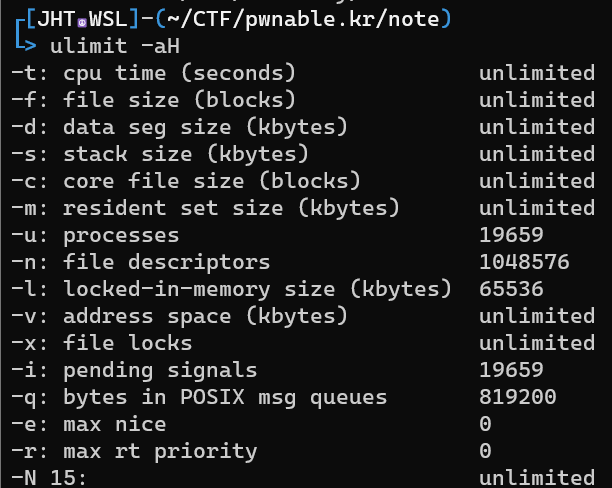

# Technique

| Name | Note |
| :---: | :--- |
| [Ret2dlresolve (64 bit)](Ret2dlresolve-64bit) | Just input, no output and no output function |
| [Heap Exploit](Heap-Exploitation) | Just notes. For a full technique, please visit [this page](https://github.com/shellphish/how2heap) |

# Note

<details>
<summary><h3>genscr</h3></summary>
<p>

```python
#!/usr/bin/python3

import sys, os, subprocess

program = sys.argv[1]
if len(sys.argv) > 2: libc = sys.argv[2]

script = f'''#!/usr/bin/python3

from pwn import *

exe = ELF('{program if len(sys.argv) != 1 else ""}', checksec=False)
{("libc = ELF('" + libc + "', checksec=False)") if len(sys.argv) != 2 else ""}
context.binary = exe

info = lambda msg: log.info(msg)
sla = lambda msg, data: p.sendlineafter(msg, data)
sa = lambda msg, data: p.sendafter(msg, data)
sl = lambda data: p.sendline(data)
s = lambda data: p.send(data)
sln = lambda msg, num: sla(msg, str(num).encode())
sn = lambda msg, num: sa(msg, str(num).encode())

def GDB():
    if not args.REMOTE:
        gdb.attach(p, gdbscript=\'\'\'


        c
        \'\'\')
        input()


if args.REMOTE:
    p = remote('')
else:
    p = process(exe.path)
GDB()


p.interactive()
'''

with open('exploit.py', 'wt') as f:
    f.write(script)

os.system('chmod +x ' + program)
os.chmod('exploit.py', 0o755)
os.system('subl exploit.py')
```

Copy this script and write it into `/usr/local/bin/genscr`, then `chmod +x /usr/local/bin/genscr` and you can use it!

</p>

</details>

<details>
<summary><h3>Execute @plt on stack (BOF)</h3></summary>
<p>

- 32 bit:
```
payload = b'A'*<x>        # Padding
payload += p32(<@plt> / libc.sym['<function name>'])
payload += p32(<return address>)
payload += p32(<arg1>)
payload += p32(<arg2>)
...
```

- 64 bit:
```
payload = b'A'*<x>             # Padding
payload += p64(pop_rdi)
payload += p64(<arg1>)
payload += p64(pop_rsi_r15)
payload += p64(<arg2>)
payload += p64(<any byte>)     # Padding
payload += p64(@plt / libc.sym['<function name>'])
payload += p32(<return address>)
```

</p>
</details>

<details>
<summary><h3>Docker installation</h3></summary>
<p>

Install [docker](https://stackoverflow.com/questions/57025264/installing-docker-on-parrot-os) on parrot:

```
sudo apt install docker.io
```

Install [docker-compose](https://docs.docker.com/compose/install/linux/) for convinient command. If you get errot `Unable to locate package docker-compose-plugin`, please read [this blog](https://dothanhlong.org/cai-docker-compose-tren-ubuntu-linux/) to install another way

</p>
</details>

<details>
<summary><h3>GDB Attach</h3></summary>
<p>

Using [x-terminal-emulator](https://www.systutorials.com/docs/linux/man/1-x-terminal-emulator/) to create popup shell and pass command in a file.

### Intel debug

```python
def GDB():     # *NIX machine
    command = '''
    '''
    with open('/tmp/command.gdb', 'wt') as f:
        f.write(command)
    subprocess.Popen(['/usr/bin/x-terminal-emulator', '--geometry', '960x1080+960+0', '-e', 'gdb', '-p', str(p.pid), '-x', '/tmp/command.gdb'])
    input()
```

```python
def GDB():     # Wsl2
    import os
    script = '''
    #!/bin/sh

    cd <Path_to_folder_contain_running_binary>
    '''
    script += f'gdb -p {p.pid} -x /tmp/command.gdb'
    with open('/tmp/script.sh', 'w') as f: f.write(script)
    os.system("chmod +x /tmp/script.sh")

    command = '''
    '''
    with open('/tmp/command.gdb', 'w') as f: f.write(command)
    q = process(f'cmd.exe /c start C:\\Windows\\system32\\wsl.exe /tmp/script.sh'.split())
    input()
```

### Arm debug

```python
def GDB(filename, port):
    q = process(f"/usr/bin/x-terminal-emulator --geometry 960x1080+960+0 -x gdb-multiarch -q --nh -ex 'source ~/.gef-283690ae9bfcecbb3deb80cd275d327c46b276b5.py' -ex 'set architecture arm64' -ex 'file {filename}' -ex 'target remote localhost:{port}'", shell=True)


port = 1234
filename = ''
p = process(f'qemu-aarch64 -L /usr/aarch64-linux-gnu -g {port} {filename}'.split())
GDB(filename, port)
```

### Kernel debug (add before qemu command, add `-s` to qemu, using wsl2 ubuntu 20.04)

```bash
command="-nx"
command="${command} -ex 'set disassembly-flavor intel'"
command="${command} -ex 'set pagination off'"
command="${command} -ex 'set confirm off'"
command="${command} -ex 'target remote localhost:1234'"
command="${command} -ex 'display/x \$rax'"
command="${command} -ex 'display/x \$rbx'"
command="${command} -ex 'display/x \$rcx'"
command="${command} -ex 'display/x \$rdx'"
command="${command} -ex 'display/x \$rdi'"
command="${command} -ex 'display/x \$rsi'"
command="${command} -ex 'display/x \$rbp'"
command="${command} -ex 'display/x \$rsp'"
command="${command} -ex 'display/x \$r8'"
command="${command} -ex 'display/x \$r9'"
command="${command} -ex 'display/x \$r10'"
command="${command} -ex 'display/x \$r11'"
command="${command} -ex 'display/x \$r12'"
command="${command} -ex 'display/x \$r13'"
command="${command} -ex 'display/x \$r14'"
command="${command} -ex 'display/x \$r15'"
command="${command} -ex 'display/10i \$rip'"
command="${command} -ex '<addcommandhere>'"
cmd.exe /c "start <wsl2filename> run gdb $command" &
```

### Debug docker process

To debug a process from docker, add this YAML code to docker-compose.yml, the same wilth `expose` ([source](https://stackoverflow.com/questions/42029834/gdb-in-docker-container-returns-ptrace-operation-not-permitted)):

```
cap_add:
- SYS_PTRACE
```

Because my computer doesn't show pid when running container so I use the following way to debug:

```python
import subprocess
from pwn import *

def GDB():
    proc = subprocess.Popen(['ps', 'aux'], stdout=subprocess.PIPE)
    ps = proc.stdout.read().split(b'\n')
    pid = ''
    for i in ps:
        # Change the recognization here
        if b'/home/bacteria/bacteria' in i and b'timeout' not in i:
            pid = i.split()[1].decode()

    # Change command here
    command = '''
    '''
    with open('/tmp/command.gdb', 'wt') as f:
        f.write(command)

    # Need sudo permission
    subprocess.Popen(['sudo', '/usr/bin/x-terminal-emulator', '--geometry', '960x1080+960+0', '-e', 'gdb', '-p', pid, '-x', '/tmp/command.gdb'])
    input()     # input() to make program wait with gdb
```

</p>
</details>

<details>
<summary><h3>GDB tips</h3></summary>
<p>

### Show data when stop

You can read [this blog](https://www.cse.unsw.edu.au/~learn/debugging/modules/gdb_watch_display/) for example.

- watch

```gdb
(gdb) watch <variable_name>
(gdb) info breakpoints    # Viewing both breakpoint and watchpoint
(gdb) disable <watchpoint_number>
```

- display

```gdb
# display <expression/variable_name>
(gdb) display $rax

# display/fmt <expression/variable_name>
(gdb) display/x $rax    # display as hex format

# info display
# delete display <display_number>
(gdb) delete display 1
```

### Disable "Type return to continue..."

I got it from https://stackoverflow.com/questions/28815621/how-to-disable-type-return-to-continue-or-q-return-to-quit-in-gdb

```
(gdb) set pagination off
```

### Disable "Quit anyway?..."

I got it from https://stackoverflow.com/questions/4355978/get-rid-of-quit-anyway-prompt-using-gdb-just-kill-the-process-and-quit

```
(gdb) set confirm off
```

### Reload libc symbol

I found [this blog](http://www.qnx.com/developers/docs/qnxcar2/index.jsp?topic=%2Fcom.qnx.doc.neutrino.prog%2Ftopic%2Fusing_gdb_SharedLibraries.html) with a few commands but the one we will use to reload symbol of libc is:

```gdb
set solib-search-path <path>
```

When run that command with the `<path>` is where the libc (which has symbol) is stored. For example, if the libc is in `/home/user/test` but the gdb path is `/mnt/d/wsl2` and libc doesn't show any symbols, we can run:

```gdb
set solib-search-path /home/user/test
```

The symbol will be loaded!

### Custom GDB function

```python
# https://sourceware.org/gdb/current/onlinedocs/gdb.html/CLI-Commands-In-Python.html#CLI-Commands-In-Python

import gdb
import struct

class HelloWorld (gdb.Command):
  def __init__(self):
    super(HelloWorld, self).__init__ ("ftoi", gdb.COMMAND_USER)

  def invoke(self, argv, from_tty):
    print(hex(struct.unpack('<Q', struct.pack('<d', float(argv)))[0]))

class Another (gdb.Command):
  def __init__(self):
    super(Another, self).__init__ ("itof", gdb.COMMAND_USER)

  def invoke(self, argv, from_tty):
    print(struct.unpack('<d', struct.pack('<Q', int(argv, 16)))[0])

HelloWorld ()
Another()
```

### Other tips

- `r < <()` can input null byte, `r <<<$()` cannot.

- `flag +/-ZERO` to set or remove flag.

</p>
</details>

<details>
<summary><h3>Load libc in python</h3></summary>
<p>

```python
from ctypes import*

# Load glibc chạy chung với chương trình
glibc = cdll.LoadLibrary('./libc6_2.27-3ubuntu1.4_amd64.so')

# Tạo seed rand với seed bằng time(null)
glibc.srand(glibc.time(None))

# Lấy giá trị random
val = glibc.rand()

print(hex(val))
```

</p>
</details>

<details>
<summary><h3>Core dump</h3></summary>
<p>

To check if core dump is enable or not, run `ulimit -a` and check the line `-c: core file size`



String `unlimited` is what we want. If it's not that string, you will want to change back to unlimited with this command:

```bash
ulimit -c unlimited
```

But that is just ulimit soft, which means ulimit just affect current session, current terminal, not the next time. If you want to set it hard, you would like to edit the file `/etc/security/limits.conf` by adding the following line with chosen user:

```
<user>      hard    core        ulimited
```

Now the core dump will be generated when a program get segfault. If you want to know where the core file is saved, run this command to show the default core place:

```bash
cat /proc/sys/kernel/core_pattern
```

Want to debug with that core file? Run these commands:

```bash
gdb <executable file>
...
(gdb) core <core-file>
```

Most useful commands are:

- `bt` (backtrace)
- `info locals` (show values of local variables)
- `info registers` (show values of local variables)
- `frame X` (show values of local variables)
- `up` and `down` (navigate in the stack frame (call chain))

If you want to analyze core file with pwntools, see the session [pwntools](https://github.com/nhtri2003gmail/CTFNote#pwntools) below.

**Reference:**

- https://stackoverflow.com/a/54943610
- https://linuxhint.com/increase-open-file-limit-ubuntu/

</p>
</details>

<details>
<summary><h3>pwntools</h3></summary>
<p>

- Get child pid (way 1): 
```
import os
from pwn import *

p = process(<Some Program>)
child_pid = pwnlib.util.proc.children(os.getpid())[0]
print(child_pid)
```

- Get child pid (way 2):
```
from pwn import *

p = process(<Some Program>)
print(pidof(p))
```

- Get child pid (way 3):
```
from pwn import *

p = process(<Some Program>)
print(p.pid)
```

- ARGS:

```
from pwn import *

# print(args.<ANY NAME IN CAPITAL>)
print(args.MYNAME)
print(args.MYAGE)
```
--> `python run.py MYNAME=Johnathan MYAGE=20`

- [Core](https://docs.pwntools.com/en/stable/elf/corefile.html) file:

```
from pwn import *

p = process('<File>')

p.sendline(b'A'*500)
p.wait()     # Wait until it crash. Core file will be made after crash.
             # If it doesn't crash, check manually to make sure it crash

core = Coredump('./core')

# Read number of data from the specified address
print(core.read(<some address>, <number of byte read>))     # Return byte

# Read until null byte
print(core.string(<some address>))
```

</p>
</details>

<details>
<summary><h3>Ascii shellcode</h3></summary>
<p>

https://blackcloud.me/Linux-shellcode-alphanumeric/

https://nets.ec/Ascii_shellcode

https://github.com/VincentDary/PolyAsciiShellGen

Some special assembly code:

```as
34 30                   xor    al,0x30                : ✓
80 f3 30                xor    bl,0x30                : ✘
80 f1 30                xor    cl,0x30                : ✘
80 f2 30                xor    dl,0x30                : ✘

66 35 30 30             xor    ax,0x3030              : ✓
66 81 f3 30 30          xor    bx,0x3030              : ✘
66 81 f1 30 30          xor    cx,0x3030              : ✘
66 81 f2 30 30          xor    dx,0x3030              : ✘

31 58 20                xor    [eax+0x20],ebx         : ✓
66 31 58 20             xor    [eax+0x20],bx          : ✓
30 78 20                xor    [eax+0x20],bh          : ✓
30 58 20                xor    [eax+0x20],bl          : ✓

You can change between eax, ebx, ecx or edx for both 2 operands for 4 instruction above.

31 44 24 40             xor    [esp+0x40],eax         : ✓ / ✘ (depends)
66 31 44 24 40          xor    [esp+0x40],ax          : ✓ / ✘ (depends)
30 64 24 40             xor    [esp+0x40],ah          : ✓ / ✘ (depends)
30 44 24 40             xor    [esp+0x40],al          : ✓ / ✘ (depends)

6a 30                   push   0x30                   : ✓
68 31 30 00 00          push   0x3031                 : ✓
68 32 31 30 00          push   0x303132               : ✓
68 33 32 31 30          push   0x30313233             : ✓
```

</p>
</details>

<details>
<summary><h3>Odd shellcode</h3></summary>
<p>

https://ctftime.org/writeup/34832

https://marcosvalle.github.io/re/exploit/2018/09/02/odd-even-encoder.html

Some special assembly code:

```as
01 c3                   add    ebx,eax
01 db                   add    ebx,ebx
01 cb                   add    ebx,ecx
01 d3                   add    ebx,edx
01 fb                   add    ebx,edi
01 f3                   add    ebx,esi
01 eb                   add    ebx,ebp
01 e3                   add    ebx,esp
01 c1                   add    ecx,eax
01 d9                   add    ecx,ebx
01 c9                   add    ecx,ecx
01 d1                   add    ecx,edx
01 f9                   add    ecx,edi
01 f1                   add    ecx,esi
01 e9                   add    ecx,ebp
01 e1                   add    ecx,esp
01 c7                   add    edi,eax
01 df                   add    edi,ebx
01 cf                   add    edi,ecx
01 d7                   add    edi,edx
01 ff                   add    edi,edi
01 f7                   add    edi,esi
01 ef                   add    edi,ebp
01 e7                   add    edi,esp
01 c5                   add    ebp,eax
01 dd                   add    ebp,ebx
01 cd                   add    ebp,ecx
01 d5                   add    ebp,edx
01 fd                   add    ebp,edi
01 f5                   add    ebp,esi
01 ed                   add    ebp,ebp
01 e5                   add    ebp,esp
49 01 c1                add    r9,rax
49 01 d9                add    r9,rbx
49 01 c9                add    r9,rcx
49 01 d1                add    r9,rdx
49 01 f9                add    r9,rdi
49 01 f1                add    r9,rsi
49 01 e9                add    r9,rbp
49 01 e1                add    r9,rsp
4d 01 c1                add    r9,r8
4d 01 c9                add    r9,r9
4d 01 d1                add    r9,r10
4d 01 d9                add    r9,r11
4d 01 e1                add    r9,r12
4d 01 e9                add    r9,r13
4d 01 f1                add    r9,r14
4d 01 f9                add    r9,r15
49 01 c3                add    r11,rax
49 01 db                add    r11,rbx
49 01 cb                add    r11,rcx
49 01 d3                add    r11,rdx
49 01 fb                add    r11,rdi
49 01 f3                add    r11,rsi
49 01 eb                add    r11,rbp
49 01 e3                add    r11,rsp
4d 01 c3                add    r11,r8
4d 01 cb                add    r11,r9
4d 01 d3                add    r11,r10
4d 01 db                add    r11,r11
4d 01 e3                add    r11,r12
4d 01 eb                add    r11,r13
4d 01 f3                add    r11,r14
4d 01 fb                add    r11,r15
49 01 c5                add    r13,rax
49 01 dd                add    r13,rbx
49 01 cd                add    r13,rcx
49 01 d5                add    r13,rdx
49 01 fd                add    r13,rdi
49 01 f5                add    r13,rsi
49 01 ed                add    r13,rbp
49 01 e5                add    r13,rsp
4d 01 c5                add    r13,r8
4d 01 cd                add    r13,r9
4d 01 d5                add    r13,r10
4d 01 dd                add    r13,r11
4d 01 e5                add    r13,r12
4d 01 ed                add    r13,r13
4d 01 f5                add    r13,r14
4d 01 fd                add    r13,r15
49 01 c7                add    r15,rax
49 01 df                add    r15,rbx
49 01 cf                add    r15,rcx
49 01 d7                add    r15,rdx
49 01 ff                add    r15,rdi
49 01 f7                add    r15,rsi
49 01 ef                add    r15,rbp
49 01 e7                add    r15,rsp
4d 01 c7                add    r15,r8
4d 01 cf                add    r15,r9
4d 01 d7                add    r15,r10
4d 01 df                add    r15,r11
4d 01 e7                add    r15,r12
4d 01 ef                add    r15,r13
4d 01 f7                add    r15,r14
4d 01 ff                add    r15,r15

29 c3                   sub    ebx,eax
29 db                   sub    ebx,ebx
29 cb                   sub    ebx,ecx
29 d3                   sub    ebx,edx
29 fb                   sub    ebx,edi
29 f3                   sub    ebx,esi
29 eb                   sub    ebx,ebp
29 e3                   sub    ebx,esp
29 c1                   sub    ecx,eax
29 d9                   sub    ecx,ebx
29 c9                   sub    ecx,ecx
29 d1                   sub    ecx,edx
29 f9                   sub    ecx,edi
29 f1                   sub    ecx,esi
29 e9                   sub    ecx,ebp
29 e1                   sub    ecx,esp
29 c7                   sub    edi,eax
29 df                   sub    edi,ebx
29 cf                   sub    edi,ecx
29 d7                   sub    edi,edx
29 ff                   sub    edi,edi
29 f7                   sub    edi,esi
29 ef                   sub    edi,ebp
29 e7                   sub    edi,esp
29 c5                   sub    ebp,eax
29 dd                   sub    ebp,ebx
29 cd                   sub    ebp,ecx
29 d5                   sub    ebp,edx
29 fd                   sub    ebp,edi
29 f5                   sub    ebp,esi
29 ed                   sub    ebp,ebp
29 e5                   sub    ebp,esp
49 29 c1                sub    r9,rax
49 29 d9                sub    r9,rbx
49 29 c9                sub    r9,rcx
49 29 d1                sub    r9,rdx
49 29 f9                sub    r9,rdi
49 29 f1                sub    r9,rsi
49 29 e9                sub    r9,rbp
49 29 e1                sub    r9,rsp
4d 29 c1                sub    r9,r8
4d 29 c9                sub    r9,r9
4d 29 d1                sub    r9,r10
4d 29 d9                sub    r9,r11
4d 29 e1                sub    r9,r12
4d 29 e9                sub    r9,r13
4d 29 f1                sub    r9,r14
4d 29 f9                sub    r9,r15
49 29 c3                sub    r11,rax
49 29 db                sub    r11,rbx
49 29 cb                sub    r11,rcx
49 29 d3                sub    r11,rdx
49 29 fb                sub    r11,rdi
49 29 f3                sub    r11,rsi
49 29 eb                sub    r11,rbp
49 29 e3                sub    r11,rsp
4d 29 c3                sub    r11,r8
4d 29 cb                sub    r11,r9
4d 29 d3                sub    r11,r10
4d 29 db                sub    r11,r11
4d 29 e3                sub    r11,r12
4d 29 eb                sub    r11,r13
4d 29 f3                sub    r11,r14
4d 29 fb                sub    r11,r15
49 29 c5                sub    r13,rax
49 29 dd                sub    r13,rbx
49 29 cd                sub    r13,rcx
49 29 d5                sub    r13,rdx
49 29 fd                sub    r13,rdi
49 29 f5                sub    r13,rsi
49 29 ed                sub    r13,rbp
49 29 e5                sub    r13,rsp
4d 29 c5                sub    r13,r8
4d 29 cd                sub    r13,r9
4d 29 d5                sub    r13,r10
4d 29 dd                sub    r13,r11
4d 29 e5                sub    r13,r12
4d 29 ed                sub    r13,r13
4d 29 f5                sub    r13,r14
4d 29 fd                sub    r13,r15
49 29 c7                sub    r15,rax
49 29 df                sub    r15,rbx
49 29 cf                sub    r15,rcx
49 29 d7                sub    r15,rdx
49 29 ff                sub    r15,rdi
49 29 f7                sub    r15,rsi
49 29 ef                sub    r15,rbp
49 29 e7                sub    r15,rsp
4d 29 c7                sub    r15,r8
4d 29 cf                sub    r15,r9
4d 29 d7                sub    r15,r10
4d 29 df                sub    r15,r11
4d 29 e7                sub    r15,r12
4d 29 ef                sub    r15,r13
4d 29 f7                sub    r15,r14
4d 29 ff                sub    r15,r15

ff cb                   dec    ebx
ff c9                   dec    ecx
ff cf                   dec    edi
ff cd                   dec    ebp
49 ff c9                dec    r9
49 ff cb                dec    r11
49 ff cd                dec    r13
49 ff cf                dec    r13

ff c3                   inc    ebx
ff c1                   inc    ecx
ff c7                   inc    edi
ff c5                   inc    ebp
49 ff c1                inc    r9
49 ff c3                inc    r11
49 ff c5                inc    r13
49 ff c7                inc    r13

49 8d 01                lea    rax,[r9]
49 8d 03                lea    rax,[r11]
49 8d 07                lea    rax,[r15]
49 8d 19                lea    rbx,[r9]
49 8d 1b                lea    rbx,[r11]
49 8d 1f                lea    rbx,[r15]
49 8d 09                lea    rcx,[r9]
49 8d 0b                lea    rcx,[r11]
49 8d 0f                lea    rcx,[r15]
49 8d 11                lea    rdx,[r9]
49 8d 13                lea    rdx,[r11]
49 8d 17                lea    rdx,[r15]
49 8d 39                lea    rdi,[r9]
49 8d 3b                lea    rdi,[r11]
49 8d 3f                lea    rdi,[r15]
49 8d 31                lea    rsi,[r9]
49 8d 33                lea    rsi,[r11]
49 8d 37                lea    rsi,[r15]

89 c3                   mov    ebx,eax
89 cb                   mov    ebx,ecx
89 d3                   mov    ebx,edx
89 fb                   mov    ebx,edi
89 c1                   mov    ecx,eax
89 d9                   mov    ecx,ebx
89 d1                   mov    ecx,edx
89 f9                   mov    ecx,edi
bb 33 33 33 33          mov    ebx,0x33333333
b3 37                   mov    bl,0x37
b7 39                   mov    bh,0x39
b9 33 33 33 33          mov    ecx,0x33333333
b1 37                   mov    cl,0x37
b5 39                   mov    ch,0x39
49 8b 01                mov    rax,QWORD PTR [r9]
49 8b 03                mov    rax,QWORD PTR [r11]
49 8b 45 ff             mov    rax,QWORD PTR [r13-0x1]
49 8b 07                mov    rax,QWORD PTR [r15]
49 8b 19                mov    rbx,QWORD PTR [r9]
49 8b 1b                mov    rbx,QWORD PTR [r11]
49 8b 5d ff             mov    rbx,QWORD PTR [r13-0x1]
49 8b 1f                mov    rbx,QWORD PTR [r15]
49 8b 09                mov    rcx,QWORD PTR [r9]
49 8b 0b                mov    rcx,QWORD PTR [r11]
49 8b 4d ff             mov    rcx,QWORD PTR [r13-0x1]
49 8b 0f                mov    rcx,QWORD PTR [r15]
49 8b 11                mov    rdx,QWORD PTR [r9]
49 8b 13                mov    rdx,QWORD PTR [r11]
49 8b 55 ff             mov    rdx,QWORD PTR [r13-0x1]
49 8b 17                mov    rdx,QWORD PTR [r15]
49 8b 39                mov    rdi,QWORD PTR [r9]
49 8b 3b                mov    rdi,QWORD PTR [r11]
49 8b 7d ff             mov    rdi,QWORD PTR [r13-0x1]
49 8b 3f                mov    rdi,QWORD PTR [r15]
49 8b 31                mov    rsi,QWORD PTR [r9]
49 8b 33                mov    rsi,QWORD PTR [r11]
49 8b 75 ff             mov    rsi,QWORD PTR [r13-0x1]
49 8b 37                mov    rsi,QWORD PTR [r15]
49 8b 21                mov    rsp,QWORD PTR [r9]
49 8b 23                mov    rsp,QWORD PTR [r11]
49 8b 65 ff             mov    rsp,QWORD PTR [r13-0x1]
49 8b 27                mov    rsp,QWORD PTR [r15]
49 8b 29                mov    rbp,QWORD PTR [r9]
49 8b 2b                mov    rbp,QWORD PTR [r11]
49 8b 6d ff             mov    rbp,QWORD PTR [r13-0x1]
49 8b 2f                mov    rbp,QWORD PTR [r15]
4d 8b 01                mov    r8,QWORD PTR [r9]
4d 8b 03                mov    r8,QWORD PTR [r11]
4d 8b 45 ff             mov    r8,QWORD PTR [r13-0x1]
4d 8b 07                mov    r8,QWORD PTR [r15]
4d 8b 09                mov    r9,QWORD PTR [r9]
4d 8b 0b                mov    r9,QWORD PTR [r11]
4d 8b 4d ff             mov    r9,QWORD PTR [r13-0x1]
4d 8b 0f                mov    r9,QWORD PTR [r15]

53                      push   rbx
51                      push   rcx
57                      push   rdi
55                      push   rbp
41 51                   push   r9
41 53                   push   r11
41 55                   push   r13
41 57                   push   r15
5b                      pop    rbx
59                      pop    rcx
5f                      pop    rdi
5d                      pop    rbp
41 59                   pop    r9
41 5b                   pop    r11
41 5d                   pop    r13
41 5f                   pop    r15

c1 e3 03                shl    ebx,0x3
c1 e1 03                shl    ecx,0x3
c1 e7 03                shl    edi,0x3
c1 e5 03                shl    ebp,0x3
d3 e3                   shl    ebx,cl
d3 e1                   shl    ecx,cl
d3 e7                   shl    edi,cl
d3 e5                   shl    ebp,cl
d3 eb                   shr    ebx,cl
d3 e9                   shr    ecx,cl
d3 ef                   shr    edi,cl

35 31 31 31 31          xor    eax,0x31313131
81 f3 31 31 31 31       xor    ebx,0x31313131
81 f1 31 31 31 31       xor    ecx,0x31313131
81 f7 31 31 31 31       xor    edi,0x31313131
81 f5 31 31 31 31       xor    ebp,0x31313131
49 81 f1 31 31 31 31    xor    r9, 0x31313131
49 81 f3 31 31 31 31    xor    r11,0x31313131
49 81 f5 31 31 31 31    xor    r13,0x31313131
49 81 f7 31 31 31 31    xor    r15,0x31313131
35 ab ab ab ab          xor    eax,0xabababab
81 f3 ab ab ab ab       xor    ebx,0xabababab
81 f1 ab ab ab ab       xor    ecx,0xabababab
81 f7 ab ab ab ab       xor    edi,0xabababab
81 f5 ab ab ab ab       xor    ebp,0xabababab
83 f3 33                xor    ebx,0x33
83 f1 33                xor    ecx,0x33
83 f7 31                xor    edi,0x31
83 f5 31                xor    ebp,0x31
49 83 f1 31             xor    r9, 0x31
49 83 f3 31             xor    r11,0x31
49 83 f5 31             xor    r13,0x31
49 83 f7 31             xor    r15,0x31

67 31 43 31             xor    DWORD PTR [ebx+0x31],eax
67 31 4b 31             xor    DWORD PTR [ebx+0x31],ecx
67 31 53 31             xor    DWORD PTR [ebx+0x31],edx
67 31 41 31             xor    DWORD PTR [ecx+0x31],eax
67 31 59 31             xor    DWORD PTR [ecx+0x31],ebx
67 31 51 31             xor    DWORD PTR [ecx+0x31],edx

31 c3                   xor    ebx,eax
31 db                   xor    ebx,ebx
31 cb                   xor    ebx,ecx
31 d3                   xor    ebx,edx
31 fb                   xor    ebx,edi
31 c1                   xor    ecx,eax
31 d9                   xor    ecx,ebx
31 c9                   xor    ecx,ecx
31 d1                   xor    ecx,edx
31 f9                   xor    ecx,edi
31 c7                   xor    edi,eax
31 df                   xor    edi,ebx
31 cf                   xor    edi,ecx
31 d7                   xor    edi,edx
31 ff                   xor    edi,edi
49 31 e1                xor    r9,rsp
49 31 e3                xor    r11,rsp
49 31 e5                xor    r13,rsp
49 31 e7                xor    r15,rsp

93                      xchg   ebx,eax
87 cb                   xchg   ebx,ecx
87 db                   xchg   ebx,ebx
87 d3                   xchg   ebx,edx
87 fb                   xchg   ebx,edi
87 f3                   xchg   ebx,esi
87 eb                   xchg   ebx,ebp
87 e3                   xchg   ebx,esp
91                      xchg   ecx,eax
87 d9                   xchg   ecx,ebx
87 c9                   xchg   ecx,ecx
87 d1                   xchg   ecx,edx
87 f9                   xchg   ecx,edi
87 f1                   xchg   ecx,esi
97                      xchg   edi,eax
87 df                   xchg   edi,ebx
87 cf                   xchg   edi,ecx
87 d7                   xchg   edi,edx

49 91                   xchg   rax,r9
49 93                   xchg   rax,r11
49 95                   xchg   rax,r13
49 97                   xchg   rax,r15
49 87 d9                xchg   r9,rbx
49 87 c9                xchg   r9,rcx
49 87 d1                xchg   r9,rdx
49 87 f1                xchg   r9,rsi
49 87 f9                xchg   r9,rdi
49 87 e9                xchg   r9,rbp
49 87 e1                xchg   r9,rsp
4d 87 c1                xchg   r9,r8
4d 87 c9                xchg   r9,r9
4d 87 d1                xchg   r9,r10
4d 87 d9                xchg   r9,r11
4d 87 e1                xchg   r9,r12
4d 87 e9                xchg   r9,r13
4d 87 f1                xchg   r9,r14
4d 87 f9                xchg   r9,r15

c3                      ret
c9                      leave

0f 05                   syscall
```

</p>
</details>

<details>
<summary><h3>Get <a href="https://www.commandlinefu.com/commands/view/6051/get-all-shellcode-on-binary-file-from-objdump">opcode</a> from binary</h3></summary>
<p>

```
objdump -d <Name of program>|grep '[0-9a-f]:'|grep -v 'file'|cut -f2 -d:|cut -f1-6 -d' '|tr -s ' '|tr '\t' ' '|sed 's/\ $//g'|sed 's/\ /\\x/g'|paste -d '' -s |sed 's/^/"/'|sed 's/$/"/g'
```

</p>
</details>

<details>
<summary><h3>movaps xmm0,... </h3></summary>
<p>

- rsp (esp) address must end with byte 0x00, 0x10, 0x20, 0x30... or it will cause error.</br>
Ex: if rsp address end with 0xe8 --> segfault.

</p>
</details>

<details>
<summary><h3>format string </h3></summary>
<p>

**Basic**
- `%p%p%p%n` will write and access easily.
- `%4$n` will write but cannot access.
- Payload should have `%c` instead `%x` to make sure it write a byte, **not** a random byte on stack.
- Enter `.` to `scanf()` with number format (`%d`, `%u`, `%ld`...) won't enter new value to var.

**Advance**
- `%*c`: print padding that %c is pointing to (full form)
- `%*<k>$c`: print padding that %c is pointing to (short form)
- `%<k>$<padding>c`: print value that %c is pointing to with padding
- Format string can be use to modify and read data at the same time just in case you don't use the short format (`%<k>$c`), use the plain format instead (`%p`, `%n`, `%s`, `%c`).
    - Example: `%c%c%c%c%1234c%hn%6$s` to change address and read from that changed address
- From man page: `printf("%*d", width, num);` == `printf("%2$*1$d", width, num);`

</p>
</details>

<details>
    <summary><h3>Kernel stuff</h3></summary>

<p>

Compress image:

```
#!/bin/bash

strip_option=1

while getopts "c:f:nl:L:sd" opt; do
  case $opt in
    c) c="$OPTARG";;
    f) f="${OPTARG%/}";;
    n) no_gzip=1;;
    l) 
        if [ -z "$lflags" ]; then
            lflags="-l$OPTARG"
        else
            lflags+=" -l$OPTARG"
        fi
        ;;
    L)
        if [ -z "$lflags" ]; then
            lflags="/usr/lib/x86_64-linux-gnu/lib$OPTARG.a"
        else
            lflags+=" /usr/lib/x86_64-linux-gnu/lib$OPTARG.a"
        fi
        ;;
    s) static=1;;
    d) strip_option=;;
  esac
done

if [ -n "$f" ]; then
    if [ -n "$c" ]; then
        read -ra files <<< "$c"
        file_name=$(basename "${files[0]}")
        if [ -n "$lflags" ]; then
            if [ -n "$static" ]; then
                gcc_options="-static $c $lflags"
            else
                gcc_options="$c $lflags"
            fi
        else
            if [ -n "$static" ]; then
                gcc_options="-static $c"
            else
                gcc_options="$c"
            fi
        fi
    fi

    if [ -n "$gcc_options" ]; then
        if [ -n "$strip_option" ]; then
            gcc_options+=" -s"
        fi
        gcc -o "$f/${file_name%.c}" $gcc_options
    fi

    cd $f
    if [ "$no_gzip" ]; then
        find . | cpio -o -H newc -R root:root > "../$f.cpio"
    else
        find . | cpio -o -H newc -R root:root | gzip -9 > "../$f.cpio.gz"
    fi
    cd ..
fi
```


</p>
</details>

<details>
    <summary><h3>Creating challenge</h3></summary>

<p>

Canary mode:
- `-fno-stack-protector`: No canary
- `-fstack-protector`: Turn on canary of a function when local buffer is < 8 bytes
- `--param ssp-buffer-size=<k>`: Used with `-fstack-protector` to specify if local buffer larger than `<k>` bytes, then add canary to that function
- `-fstack-full-protector` (default): Turn on canary for all functions

No RelRO: `-z norelro`

No NX: `-z execstack`

No pie: `-no-pie`

Static built: `-static`

Write seccomp rule: https://blog.yadutaf.fr/2014/05/29/introduction-to-seccomp-bpf-linux-syscall-filter/


</p>
</details>
