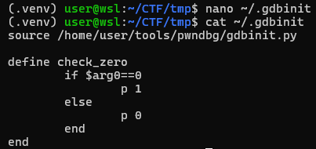
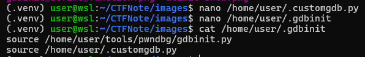
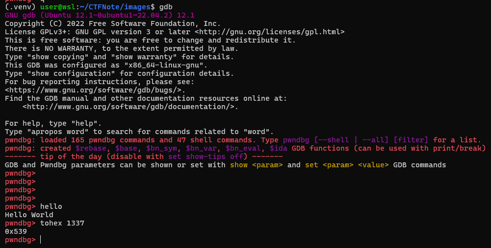

# Technique

| Name | Note |
| :---: | :--- |
| [Ret2dlresolve (64 bit)](Ret2dlresolve-64bit) | Just input, no output and no output function |
| [Heap Exploit](Heap-Exploitation) | Just notes. For a full technique, please visit [this page](https://github.com/shellphish/how2heap) |

# Note

<details>
<summary><h2>genscr</h2></summary>
<p>

```python
#!/usr/bin/python3

import sys, os

script = f'''#!/usr/bin/env python3

from pwn import *

# exe = ELF('', checksec=False)
# libc = ELF('', checksec=False)
context.binary = exe

info = lambda msg: log.info(msg)
s = lambda data, proc=None: proc.send(data) if proc else p.send(data)
sa = lambda msg, data, proc=None: proc.sendafter(msg, data) if proc else p.sendafter(msg, data)
sl = lambda data, proc=None: proc.sendline(data) if proc else p.sendline(data)
sla = lambda msg, data, proc=None: proc.sendlineafter(msg, data) if proc else p.sendlineafter(msg, data)
sn = lambda num, proc=None: proc.send(str(num).encode()) if proc else p.send(str(num).encode())
sna = lambda msg, num, proc=None: proc.sendafter(msg, str(num).encode()) if proc else p.sendafter(msg, str(num).encode())
sln = lambda num, proc=None: proc.sendline(str(num).encode()) if proc else p.sendline(str(num).encode())
slna = lambda msg, num, proc=None: proc.sendlineafter(msg, str(num).encode()) if proc else p.sendlineafter(msg, str(num).encode())
def GDB():
    if not args.REMOTE:
        gdb.attach(p, gdbscript=\'\'\'


        c
        \'\'\')
        input()


if args.REMOTE:
    p = remote('')
else:
    {('p = process([exe.path])') if len(sys.argv) >= 2 else ("p = process([''])")}
GDB()


p.interactive()
'''

if os.path.exists('exp.py'):
    script = open('exp.py', 'r').read()

if len(sys.argv) <= 1:
    print(f"Usage: {sys.argv[0]} BIN [LIBC]")
    print(f"Example:")
    print(f"    {sys.argv[0]} ./chall")
    print(f"    {sys.argv[0]} ./chall ./libc.so.6")
    exit(0)
if len(sys.argv) > 1:
    os.system('chmod +x ' + sys.argv[1])
    script = script.replace("# exe = ELF('', checksec=False)", f"exe = ELF('{sys.argv[1]}', checksec=False)")
if len(sys.argv) > 2:
    os.system('chmod +x ' + sys.argv[2])
    script = script.replace("# libc = ELF('', checksec=False)", f"libc = ELF('{sys.argv[2]}', checksec=False)")

with open('exp.py', 'wt') as f:
    f.write(script)

os.chmod('exp.py', 0o755)
os.system('subl exp.py &')
```

Copy this script and write it into `/usr/local/bin/genscr`, then `chmod +x /usr/local/bin/genscr` and you can use it!

</p>

</details>

<details>
<summary><h2>Execute @plt on stack (BOF)</h2></summary>
<p>

- 32 bit:
```
payload = b'A'*<x>        # Padding
payload += p32(<@plt> / libc.sym['<function name>'])
payload += p32(<return address>)
payload += p32(<arg1>)
payload += p32(<arg2>)
...
```

- 64 bit:
```
payload = b'A'*<x>             # Padding
payload += p64(pop_rdi)
payload += p64(<arg1>)
payload += p64(pop_rsi_r15)
payload += p64(<arg2>)
payload += p64(<any byte>)     # Padding
payload += p64(@plt / libc.sym['<function name>'])
payload += p32(<return address>)
```

</p>
</details>

<details>
<summary><h2>Docker installation</h2></summary>
<p>

**Official Method**

https://docs.docker.com/engine/install/ubuntu/

**Another Method (old)**

Install [docker](https://stackoverflow.com/questions/57025264/installing-docker-on-parrot-os) on parrot:

```
sudo apt install docker.io
```

Install [docker-compose](https://docs.docker.com/compose/install/linux/) for convinient command. If you get errot `Unable to locate package docker-compose-plugin`, please read [this blog](https://dothanhlong.org/cai-docker-compose-tren-ubuntu-linux/) to install another way

</p>
</details>

<details>
<summary><h2>GDB Attach</h2></summary>
<p>

Using [x-terminal-emulator](https://www.systutorials.com/docs/linux/man/1-x-terminal-emulator/) to create popup shell and pass command in a file.

### Intel debug

- *NIX
```python
def GDB():
    # import clipboard
    # clipboard.copy()
    if not args.REMOTE:
        command = '''
        '''
        with open('/tmp/command.gdb', 'wt') as f:
            f.write(command)
        subprocess.Popen(['/usr/bin/x-terminal-emulator', '--geometry', '960x1080+960+0', '-e', 'gdb', '-p', str(p.pid), '-x', '/tmp/command.gdb'])
        input()
```

- WSL2
```python
def GDB():
    # import clipboard
    # clipboard.copy()
    if not args.REMOTE:
        import os
        gdb_script = '''

        c
        '''
        open('/tmp/command.gdb', 'w').write(gdb_script)

        bash_script = '#!/bin/sh\n'
        bash_script += '\n'
        bash_script += f'cd {Path_to_folder_contain_running_binary}\n'
        bash_script += f'gdb -p {p.pid} -x /tmp/command.gdb\n'
        open('/tmp/script.sh', 'w').write(bash_script)

        os.system("chmod +x /tmp/script.sh")
        os.system(r'cmd.exe /c start wsl.exe -d Ubuntu-22.04 bash -c /tmp/script.sh')
        input()
```

### Arm debug

```python
def GDB(filename, port):
    q = process(f"/usr/bin/x-terminal-emulator --geometry 960x1080+960+0 -x gdb-multiarch -q --nh -ex 'source ~/.gef-283690ae9bfcecbb3deb80cd275d327c46b276b5.py' -ex 'set architecture arm64' -ex 'file {filename}' -ex 'target remote localhost:{port}'", shell=True)


port = 1234
filename = ''
p = process(f'qemu-aarch64 -L /usr/aarch64-linux-gnu -g {port} {filename}'.split())
GDB(filename, port)
```

### Kernel debug (add before qemu command, add `-s` to qemu, using wsl2 ubuntu 20.04)

```bash
command="-nx"
command="${command} -ex 'set disassembly-flavor intel'"
command="${command} -ex 'set pagination off'"
command="${command} -ex 'set confirm off'"
command="${command} -ex 'target remote localhost:1234'"
command="${command} -ex 'display/x \$rax'"
command="${command} -ex 'display/x \$rbx'"
command="${command} -ex 'display/x \$rcx'"
command="${command} -ex 'display/x \$rdx'"
command="${command} -ex 'display/x \$rdi'"
command="${command} -ex 'display/x \$rsi'"
command="${command} -ex 'display/x \$rbp'"
command="${command} -ex 'display/x \$rsp'"
command="${command} -ex 'display/x \$r8'"
command="${command} -ex 'display/x \$r9'"
command="${command} -ex 'display/x \$r10'"
command="${command} -ex 'display/x \$r11'"
command="${command} -ex 'display/x \$r12'"
command="${command} -ex 'display/x \$r13'"
command="${command} -ex 'display/x \$r14'"
command="${command} -ex 'display/x \$r15'"
command="${command} -ex 'display/10i \$rip'"
command="${command} -ex '<addcommandhere>'"
cmd.exe /c "start <wsl2filename> run gdb $command" &
```

### Debug docker process

To debug a process from docker, add this YAML code to docker-compose.yml, the same wilth `expose` ([source](https://stackoverflow.com/questions/42029834/gdb-in-docker-container-returns-ptrace-operation-not-permitted)):

```
cap_add:
- SYS_PTRACE
```

Because my computer doesn't show pid when running container so I use the following way to debug:

```python
import subprocess
from pwn import *

def GDB():
    proc = subprocess.Popen(['ps', 'aux'], stdout=subprocess.PIPE)
    ps = proc.stdout.read().split(b'\n')
    pid = ''
    for i in ps:
        # Change the recognization here
        if b'/home/bacteria/bacteria' in i and b'timeout' not in i:
            pid = i.split()[1].decode()

    # Change command here
    command = '''
    '''
    with open('/tmp/command.gdb', 'wt') as f:
        f.write(command)

    # Need sudo permission
    subprocess.Popen(['sudo', '/usr/bin/x-terminal-emulator', '--geometry', '960x1080+960+0', '-e', 'gdb', '-p', pid, '-x', '/tmp/command.gdb'])
    input()     # input() to make program wait with gdb
```

</p>
</details>

<details>
<summary><h2>GDB Tips</h2></summary>
<p>

**1. Show data when stop**

You can read [this blog](https://www.cse.unsw.edu.au/~learn/debugging/modules/gdb_watch_display/) for example.

- watch

```gdb
(gdb) watch <variable_name>
(gdb) info breakpoints    # Viewing both breakpoint and watchpoint
(gdb) disable <watchpoint_number>
```

- display

```gdb
# display <expression/variable_name>
(gdb) display $rax

# display/fmt <expression/variable_name>
(gdb) display/x $rax    # display as hex format

# info display
# delete display <display_number>
(gdb) delete display 1
```

**2. Disable "Type return to continue..."**
```
(gdb) set pagination off
```

References:
- https://stackoverflow.com/questions/28815621/how-to-disable-type-return-to-continue-or-q-return-to-quit-in-gdb

**3. Disable "Quit anyway?..."**

```
(gdb) set confirm off
```
References
- https://stackoverflow.com/questions/4355978/get-rid-of-quit-anyway-prompt-using-gdb-just-kill-the-process-and-quit

**4. Reload libc symbol**

```gdb
set solib-search-path <path>
```

When run that command with the `<path>` is where the libc (which has symbol) is stored. For example, if the libc is in `/home/user/test` but the gdb path is `/mnt/d/wsl2` and libc doesn't show any symbols, we can run:

```gdb
set solib-search-path /home/user/test
```

The symbol will be loaded!

References
- http://www.qnx.com/developers/docs/qnxcar2/index.jsp?topic=%2Fcom.qnx.doc.neutrino.prog%2Ftopic%2Fusing_gdb_SharedLibraries.html

**5. Custom GDB command**

You can create custom function in GDB with command `define`. For example:

```python
pwndbg> define custom_print
Type commands for definition of "custom_print".
End with a line saying just "end".
>p 1
>end
pwndbg>
pwndbg> custom_print
$8 = 1
```

So we can do several stuff with function in GDB like checking if register is equal to 0:

```python
pwndbg> define check_zero
Type commands for definition of "check_zero".
End with a line saying just "end".
>if $arg0==0
 >p 1
 >else
 >p 0
 >end
>end
pwndbg>
pwndbg> check_zero $rax
$13 = 0
pwndbg> check_zero 0
$14 = 1
pwndbg> set $rax=0
pwndbg> check_zero $rax
$15 = 1
```

You can also define function in `~/.gdbinit` so that you won't need to define when exit and launch GDB again:

```bash
define check_zero
        if $arg0==0
                p 1
        else
                p 0
        end
end
```


If you want to have advanced function, you can write python script and include your script in `~/.gdbinit`. Below is a python script and I will save it at `/home/user/.customgdb.py`:

```python
# https://sourceware.org/gdb/current/onlinedocs/gdb.html/CLI-Commands-In-Python.html#CLI-Commands-In-Python

import gdb
import struct

class Greeting(gdb.Command):
        def __init__(self):
                super(Greeting, self).__init__ ("hello", gdb.COMMAND_USER)

        def invoke(self, argv, from_tty):
                print("Hello World")

class DecToHex(gdb.Command):
        def __init__(self):
                super(DecToHex, self).__init__ ("tohex", gdb.COMMAND_USER)

        def invoke(self, argv, from_tty):
                print(hex(int(argv)))

Greeting()
DecToHex()
```

Now I just need to import it to `~/.gdbinit`:



Then just load GDB and we can run our custom functions:



References:
- https://sourceware.org/gdb/current/onlinedocs/gdb.html/Define.html

**6. GDB expressions**

If else expression with custom variable:

```python
pwndbg> set $i=1
pwndbg> if $i==1
 >p 1
 >else
 >p 0
 >end
$1 = 1
pwndbg>
```

If expression with register:

```python
pwndbg> if ((unsigned short)$rsp)==0xd9f0
 >p 1
 >end
$4 = 1
pwndbg>
```

While expression changes value of pointer on register and change register:

```python
pwndbg> while($i<10)
 >set *(int*)$rax=($i*2)
 >set $rax=$rax+4
 >set $i=$i+1
 >end
pwndbg>
```

While expression changes value at specific address:

```python
pwndbg> while($i<20)
 >set *(int*)(0x7fffffffd820+$i*4)=$i*2
 >set $i=$i+1
 >end
pwndbg>
```

References
- https://stackoverflow.com/questions/70657261/gdb-defining-a-function-with-multiple-arguments-using-if-else
- https://www.reddit.com/r/learnprogramming/comments/z5edfu/is_there_loops_and_condition_in_gdb/

**7. Other tips**

- `r < <()` can input null byte, `r <<<$()` cannot.

- `flag +/-ZERO` to set or remove flag.

</p>
</details>

<details>
<summary><h2>Load libc in python</h2></summary>
<p>

```python
from ctypes import*

# Load glibc chạy chung với chương trình
glibc = cdll.LoadLibrary('./libc6_2.27-3ubuntu1.4_amd64.so')

# Tạo seed rand với seed bằng time(null)
glibc.srand(glibc.time(None))

# Lấy giá trị random
val = glibc.rand()

print(hex(val))
```

</p>
</details>

<details>
<summary><h2>Core dump</h2></summary>
<p>

To check if core dump is enable or not, run `ulimit -a` and check the line `-c: core file size`


String `unlimited` is what we want. If it's not that string, you will want to change back to unlimited with this command:

```bash
ulimit -c unlimited
```

But that is just ulimit soft, which means ulimit just affect current session, current terminal, not the next time. If you want to set it hard, you would like to edit the file `/etc/security/limits.conf` by adding the following line with chosen user:

```
<user>      hard    core        ulimited
```

Now the core dump will be generated when a program get segfault. If you want to know where the core file is saved, run this command to show the default core place:

```bash
cat /proc/sys/kernel/core_pattern
```

If you want to update the coredump path, run:

```bash
sudo sysctl -w kernel.core_pattern=/tmp/core.%e.%p
```

Want to debug with that core file? Run these commands:

```bash
gdb <executable file>
...
(gdb) core <core-file>
```

Most useful commands are:

- `bt` (backtrace)
- `info locals` (show values of local variables)
- `info registers` (show values of local variables)
- `frame X` (show values of local variables)
- `up` and `down` (navigate in the stack frame (call chain))

If you want to analyze core file with pwntools, see the session [pwntools](https://github.com/nhtri2003gmail/CTFNote#pwntools) below.

**References**
- https://stackoverflow.com/a/54943610
- https://linuxhint.com/increase-open-file-limit-ubuntu/

</p>
</details>

<details>
<summary><h2>pwntools</h2></summary>
<p>

**Get child pid (method 1)**
```
import os
from pwn import *

p = process(<Some Program>)
child_pid = pwnlib.util.proc.children(os.getpid())[0]
print(child_pid)
```

**Get child pid (method 2)**
```
from pwn import *

p = process(<Some Program>)
print(pidof(p))
```

**Get child pid (method 3)**
```
from pwn import *

p = process(<Some Program>)
print(p.pid)
```

**ARGS**

```
from pwn import *

# print(args.<ANY NAME IN CAPITAL>)
print(args.MYNAME)
print(args.MYAGE)
```
--> `python run.py MYNAME=Johnathan MYAGE=20`

**[Core](https://docs.pwntools.com/en/stable/elf/corefile.html) file**

```
from pwn import *

p = process('<File>')

p.sendline(b'A'*500)
p.wait()     # Wait until it crash. Core file will be made after crash.
             # If it doesn't crash, check manually to make sure it crash

core = Coredump('./core')

# Read number of data from the specified address
print(core.read(<some address>, <number of byte read>))     # Return byte

# Read until null byte
print(core.string(<some address>))
```

</p>
</details>

<details>
<summary><h2>Get opcode from binary</h2></summary>
<p>

```
objdump -d <Name of program>|grep '[0-9a-f]:'|grep -v 'file'|cut -f2 -d:|cut -f1-6 -d' '|tr -s ' '|tr '\t' ' '|sed 's/\ $//g'|sed 's/\ /\\x/g'|paste -d '' -s |sed 's/^/"/'|sed 's/$/"/g'
```

**References**
- https://www.commandlinefu.com/commands/view/6051/get-all-shellcode-on-binary-file-from-objdump
</p>
</details>

<details>
<summary><h2>movaps xmm0,... </h2></summary>
<p>

Register rsp (esp) address must end with byte 0x00, 0x10, 0x20, 0x30... or it will cause error.</br>
- Ex: if rsp address end with 0xe8 --> segfault.

</p>
</details>

<details>
<summary><h2>format string </h2></summary>
<p>

**Basic**
- `%p%p%p%n` will write and access easily.
- `%4$n` will write but cannot access.
- Payload should have `%c` instead `%x` to make sure it write a byte, **not** a random byte on stack.
- Enter `.` to `scanf()` with number format (`%d`, `%u`, `%ld`...) won't enter new value to var.

**Advance**
- `%*c`: print padding that %c is pointing to (full form)
- `%*<k>$c`: print padding that %c is pointing to (short form)
- `%<k>$<padding>c`: print value that %c is pointing to with padding
- Format string can be use to modify and read data at the same time just in case you don't use the short format (`%<k>$c`), use the plain format instead (`%p`, `%n`, `%s`, `%c`).
    - Example: `%c%c%c%c%1234c%hn%6$s` to change address and read from that changed address
- From man page: `printf("%*d", width, num);` == `printf("%2$*1$d", width, num);`

</p>
</details>

<details>
    <summary><h2>Kernel stuff</h2></summary>

<p>

Compress image:

```
#!/bin/bash

strip_option=1

while getopts "c:f:nl:L:sd" opt; do
  case $opt in
    c) c="$OPTARG";;
    f) f="${OPTARG%/}";;
    n) no_gzip=1;;
    l) 
        if [ -z "$lflags" ]; then
            lflags="-l$OPTARG"
        else
            lflags+=" -l$OPTARG"
        fi
        ;;
    L)
        if [ -z "$lflags" ]; then
            lflags="/usr/lib/x86_64-linux-gnu/lib$OPTARG.a"
        else
            lflags+=" /usr/lib/x86_64-linux-gnu/lib$OPTARG.a"
        fi
        ;;
    s) static=1;;
    d) strip_option=;;
  esac
done

if [ -n "$f" ]; then
    if [ -n "$c" ]; then
        read -ra files <<< "$c"
        file_name=$(basename "${files[0]}")
        if [ -n "$lflags" ]; then
            if [ -n "$static" ]; then
                gcc_options="-static $c $lflags"
            else
                gcc_options="$c $lflags"
            fi
        else
            if [ -n "$static" ]; then
                gcc_options="-static $c"
            else
                gcc_options="$c"
            fi
        fi
    fi

    if [ -n "$gcc_options" ]; then
        if [ -n "$strip_option" ]; then
            gcc_options+=" -s"
        fi
        gcc -o "$f/${file_name%.c}" $gcc_options
    fi

    cd $f
    if [ "$no_gzip" ]; then
        find . | cpio -o -H newc -R root:root > "../$f.cpio"
    else
        find . | cpio -o -H newc -R root:root | gzip -9 > "../$f.cpio.gz"
    fi
    cd ..
fi
```


</p>
</details>

<details>
    <summary><h2>Creating challenge</h2></summary>

<p>

Canary mode:
- `-fno-stack-protector`: No canary
- `-fstack-protector`: Turn on canary of a function when local buffer is < 8 bytes
- `--param ssp-buffer-size=<k>`: Used with `-fstack-protector` to specify if local buffer larger than `<k>` bytes, then add canary to that function
- `-fstack-full-protector` (default): Turn on canary for all functions

No RelRO: `-z norelro`

No NX: `-z execstack`

No pie: `-no-pie`

Static built: `-static`

Write seccomp rule: https://blog.yadutaf.fr/2014/05/29/introduction-to-seccomp-bpf-linux-syscall-filter/


</p>
</details>

<details>
    <summary><h2>Sublime Text</h2></summary>

<p>

To compile using shortcut `Ctrl + B`, select `Tools` -> `Build System` -> `New Build System...` and paste following code:

```
{
    "cmd": ["wsl", "-d", "Ubuntu-22.04", "--cd", "${file_path}", "make"],
}
```

You can change the DistroName `-d` and command `make` as you wish!

</p>
</details>
