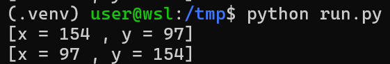

# Z3

## Installation

To install this framework, run:

```bash
python3 -m pip install z3-solver
```

## Usage

### Case 1 - System of 2 linear equations using `z3.solve`

Let's say we have a system of two linear equations:

$$
\begin{cases}
2x + y = 3 \\
x - y = 6
\end{cases}
$$

We can see that there are 2 variables `x` and `y` so we will first declare those vars as float number:

```python
import z3

x = z3.Real('x')
y = z3.Real('y')
```

Now we want to solve that system, we just need to add conditions separated by comma into `solve` function:

```python
z3.solve(
    2*x + y == 3,
    x - y == 6
)
```

Run the script and it will print the result for us:


<details>
	<summary>Full script</summary>

```python
import z3

x = z3.Real('x')
y = z3.Real('y')

z3.solve(
    2*x + y == 3,
    x - y == 6
)
```

</details>

### Case 2 - System of 3 linear equations using `z3.Solver`

Let's say we have a system of three linear equations:

$$
\begin{cases}
\frac{1}{x} + \frac{1}{y} + \frac{1}{z} = 10 \\
\frac{2}{x} - \frac{1}{y} + \frac{3}{z} = 16 \\
\frac{1}{x} - \frac{2}{y} - \frac{1}{z} = -9
\end{cases}
$$

As we have done in [case 1](#case-1---system-of-2-linear-equations-using-z3solve), let's define 3 variables:

```python
from z3 import *

x = Real('x')
y = Real('y')
z = Real('z')
```

Now instead of using `solve` function, we will use `Solver` class and use `Solver.add()` to add condition:

```python
s = Solver()
s.add(1/x + 1/y + 1/z == 10)
s.add(2/x - 1/y + 3/z == 16)
s.add(1/x - 2/y - 1/z == -9)
s.add(x!=0, y!=0, z!=0)
```

To solve this system, we first need to check if condition is satisfiable or not using `Solver.check()`, if it is, we can get the result using `Solver.model()`:

```python
if s.check() == sat:
	res = s.model()
    x_val = res[x].as_fraction()
    y_val = res[y].as_fraction()
    z_val = res[z].as_fraction()
    print(f'x = {str(x_val)} = {float(x_val)}')
    print(f'y = {str(y_val)} = {float(y_val)}')
    print(f'z = {str(z_val)} = {float(z_val)}')
```

Run the script and we get the result:


<details>
	<summary>Full script</summary>

```python
from z3 import *

x = Real('x')
y = Real('y')
z = Real('z')

s = Solver()
s.add(1/x + 1/y + 1/z == 10)
s.add(2/x - 1/y + 3/z == 16)
s.add(1/x - 2/y - 1/z == -9)
s.add(x!=0, y!=0, z!=0)

if s.check() == sat:
    res = s.model()
    x_val = res[x].as_fraction()
    y_val = res[y].as_fraction()
    z_val = res[z].as_fraction()
    print(f'x = {str(x_val)} = {float(x_val)}')
    print(f'y = {str(y_val)} = {float(y_val)}')
    print(f'z = {str(z_val)} = {float(z_val)}')
```
</details>

### Case 3 - Multiple result

Let's say we will want to find all possible x and in in this system of three equations with 8-bit x and 8-bit y:

$$
\begin{cases}
x | y = 251 \\
x ^ y = 251 \\
x * y = 14938 \\
\end{cases}
$$

First, let's define 2 variables:

```python
from z3 import *

x = Int('x')
y = Int('y')
```

Buttttttttttt... As described, we will need to use bitwise OR and XOR. However, we cannot use them with `Int` (has type `ArithRef` from z3) and it will cause error when adding condition with bitwise operator:


To use bitwise operator, we will need to use `BitVec` and specify how many bits for that var:

```python
from z3 import *

x = BitVec('x', 8)
y = BitVec('y', 8)
```

So x and y are now defined as 8-bit vars, let's add our conditions to find x and y:

```python
s = Solver()
s.add( x|y == 251 )
s.add( x^y == 251 )
s.add( x*y == 14938 )
```

Now if we want to solve, just do check and if it is satisfiable, we can get its model:

```python
if s.check() == sat:
    res = s.model()
    print(f'[x = {res[x]} , y = {res[y]}]')
```

But if we want to find all available result, we can replace that if with a while loop, and with each result, we will exclude one of them until it is unsatisfiable:

```python
while s.check() == sat:
    res = s.model()
    print(f'[x = {res[x]} , y = {res[y]}]')
    s.add( Or(x != res[x], y != res[y]) )
```

Run the script will print that (x, y) can be (154, 97) and vice versa:



<details>
	<summary>Full script</summary>

```python
from z3 import *

x = BitVec('x', 8)
y = BitVec('y', 8)

s = Solver()
s.add( x|y == 251 )
s.add( x^y == 251 )
s.add( x*y == 14938 )

while s.check() == sat:
    res = s.model()
    print(f'[x = {res[x]} , y = {res[y]}]')
    s.add( Or(x != res[x], y != res[y]) )
```
</details>

### Case 4 - Bitwise operators

With the problem given as below:

```
Given a = 150, b = 36 and c = 92, find x with these equations:

((a >> 0) & 1) XOR  ((b >> 0) & 1) NOR  ((x >> 0) & 1) == ((c >> 0) & 1)
((a >> 1) & 1) OR   ((b >> 1) & 1) XNOR ((x >> 1) & 1) == ((c >> 1) & 1)
((a >> 2) & 1) NAND ((b >> 2) & 1) NOR  ((x >> 2) & 1) == ((c >> 2) & 1)
((a >> 3) & 1) NAND ((b >> 3) & 1) XNOR ((x >> 3) & 1) == ((c >> 3) & 1)
((a >> 4) & 1) OR   ((b >> 4) & 1) AND  ((x >> 4) & 1) == ((c >> 4) & 1)
((a >> 5) & 1) XNOR ((b >> 5) & 1) OR   ((x >> 5) & 1) == ((c >> 5) & 1)
((a >> 6) & 1) NAND ((b >> 6) & 1) XNOR ((x >> 6) & 1) == ((c >> 6) & 1)
((a >> 7) & 1) NOR  ((b >> 7) & 1) XOR  ((x >> 7) & 1) == ((c >> 7) & 1)
```

We know that we will need to work with bit for this case so let's define 4 variables using BitVec (explaned in [case 3](#case-3)):

```python
from z3 import *

a = BitVecVal(150, 8)
b = BitVecVal(36, 8)
x = BitVec('x', 8)
c = BitVecVal(92, 8)
```

For convenience when doing with `Not` (NOR, XNOR and NAND), I will define several lambda functions:

```python
XOR = lambda x, y: Xor(x, y)
XNOR = lambda x, y: Not(Xor(x, y))
AND = lambda x, y: And(x, y)
NAND = lambda x, y: Not(And(x, y))
OR = lambda x, y: Or(x, y)
NOR = lambda x, y: Not(Or(x, y))

def bit(n, var):
    return Extract(n, n, var) != 0
```

The function `bit` will be used to extract the bit of `var` at position `n`. Now let's add 8 conditions and solve `x`:

```python
s = Solver()
s.add( NOR(XOR(bit(0, a), bit(0, b)), bit(0, x)) == bit(0, c) )
s.add( XNOR(OR(bit(1, a), bit(1, b)), bit(1, x)) == bit(1, c) )
s.add( NOR(NAND(bit(2, a), bit(2, b)), bit(2, x)) == bit(2, c) )
s.add( XNOR(NAND(bit(3, a), bit(3, b)), bit(3, x)) == bit(3, c) )
s.add( AND(OR(bit(4, a), bit(4, b)), bit(4, x)) == bit(4, c) )
s.add( OR(XNOR(bit(5, a), bit(5, b)), bit(5, x)) == bit(5, c) )
s.add( XNOR(NAND(bit(6, a), bit(6, b)), bit(6, x)) == bit(6, c) )
s.add( XOR(NOR(bit(7, a), bit(7, b)), bit(7, x)) == bit(7, c) )

if s.check() == sat:
    res = s.model()
    print(f'[x = {res[x]} = {chr(res[x].as_long())}]')
```

When our var is defined with BitVec, we can use `as_long()` to get int value. Running the script will show us the result:


```python
from z3 import *

a = BitVecVal(150, 8)
b = BitVecVal(36, 8)
x = BitVec('x', 8)
c = BitVecVal(92, 8)

XOR = lambda a, b: Xor(a, b)
XNOR = lambda a, b: Not(Xor(a, b))
AND = lambda a, b: And(a, b)
NAND = lambda a, b: Not(And(a, b))
OR = lambda a, b: Or(a, b)
NOR = lambda a, b: Not(Or(a, b))

def bit(n, var):
    return Extract(n, n, var) != 0

a = BitVecVal(150, 8)
b = BitVecVal(36, 8)
x = BitVec('x', 8)
c = BitVecVal(92, 8)

s = Solver()
s.add( NOR(XOR(bit(0, a), bit(0, b)), bit(0, x)) == bit(0, c) )
s.add( XNOR(OR(bit(1, a), bit(1, b)), bit(1, x)) == bit(1, c) )
s.add( NOR(NAND(bit(2, a), bit(2, b)), bit(2, x)) == bit(2, c) )
s.add( XNOR(NAND(bit(3, a), bit(3, b)), bit(3, x)) == bit(3, c) )
s.add( AND(OR(bit(4, a), bit(4, b)), bit(4, x)) == bit(4, c) )
s.add( OR(XNOR(bit(5, a), bit(5, b)), bit(5, x)) == bit(5, c) )
s.add( XNOR(NAND(bit(6, a), bit(6, b)), bit(6, x)) == bit(6, c) )
s.add( XOR(NOR(bit(7, a), bit(7, b)), bit(7, x)) == bit(7, c) )

if s.check() == sat:
    res = s.model()
    print(f'[x = {res[x]} = "{chr(res[x].as_long())}"]')
```
