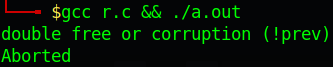
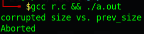
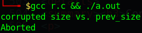
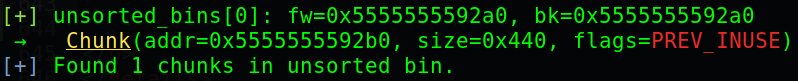
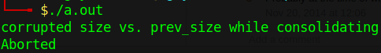
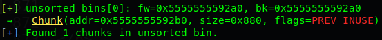

# [Technique] Heap exploitation

If you're not familiar with heap exploitation and all types of chunks, read this blog for a better approach: https://guyinatuxedo.github.io/25-heap/index.html

This post is just about all small stuffs and things I want to note. For a full technique, please refer this page: https://github.com/shellphish/how2heap

---

#### Table of content:
- [Tcache](https://github.com/nhtri2003gmail/CTFNote/tree/master/technique/Heap-Exploitation#tcache)
    - [Double free](#double-free-table-of-content)
    - [Forward pointer](#forward-pointer-table-of-content)
    - [Malloc and free custom chunk](#malloc-and-free-custom-chunk-table-of-content)
- [Unsorted Bin](https://github.com/nhtri2003gmail/CTFNote/tree/master/technique/Heap-Exploitation#unsorted-bin)
    - [Malloc and free custom chunk](#malloc-and-free-custom-chunk-table-of-content-1)
    - [Consolidation](#consolidation-table-of-content)
- [Comparision](https://github.com/nhtri2003gmail/CTFNote/tree/master/technique/Heap-Exploitation#comparision)
# Tcache

<details>
<summary><h3>Double free (<a href="#table-of-content">Table of content</a>)</h3></summary>
<p>

- For libc <= 2.28, we just simply free() a chunk twice.
- For libc > 2.28, there will be a key inserted to freed chunk when this chunk goes to tcache. To do a double free, we first free() a chunk, then change the key (Bk pointer) to another value and free() again:

```gdb
               malloc(0x20)
                    ↓
-----------------------------------------
| 0x0000000000000000 0x0000000000000031 |    <-- prev_size / size
| 0x0000000000000000 0x0000000000000000 |
| 0x0000000000000000 0x0000000000000000 |
-----------------------------------------
                    ↓
                  free()
                    ↓
-----------------------------------------
| 0x0000000000000000 0x0000000000000031 |    <-- prev_size  / size
| 0x0000000000000000 0x000055555555b010 |    <-- Fd pointer / Bk pointer (key)
| 0x0000000000000000 0x0000000000000000 |
-----------------------------------------
                    ↓
          Change key (Bk pointer)
                    ↓
-----------------------------------------
| 0x0000000000000000 0x0000000000000031 |    <-- prev_size  / size
| 0x0000000000000000 0x0000000000000001 |    <-- Fd pointer / Bk pointer (key)
| 0x0000000000000000 0x0000000000000000 |
-----------------------------------------
                    ↓
               free() again
                    ↓
-----------------------------------------
| 0x0000000000000000 0x0000000000000031 |    <-- prev_size  / size
| 0x000055555555b260 0x000055555555b010 |    <-- Fd pointer / Bk pointer (key)
| 0x0000000000000000 0x0000000000000000 |
-----------------------------------------
```

</p>
</details>

<details>
<summary><h3>Forward pointer (<a href="#table-of-content">Table of content</a>)</h3></summary>
<p>

- For libc <= 2.31, when we free a chunk and it goes to tcache, the forward pointer of this chunk will be changed into the address of the next chunk if this next chunk exist and will be null if there is no next chunk:

```gdb
------------------------- Chunk 1 ------------------------
| 0x555555559290: 0x0000000000000000  0x0000000000000031 |    <-- prev_size  / size
| 0x5555555592a0: 0x0000000000000000  0x0000555555559010 |    <-- Fd pointer / Bk pointer (key)
| 0x5555555592b0: 0x0000000000000000  0x0000000000000000 |
------------------------- Chunk 2 ------------------------
| 0x5555555592c0: 0x0000000000000000  0x0000000000000031 |    <-- prev_size  / size
| 0x5555555592d0: 0x00005555555592a0  0x0000555555559010 |    <-- Fd pointer / Bk pointer (key)
| 0x5555555592e0: 0x0000000000000000  0x0000000000000000 |
----------------------------------------------------------
```

We can see that after free Chunk 1, it will go to tcache. But because there are no freed chunk with the same size as `0x30` in tcache so the `Fd pointer` of Chunk 1 is null.

For the Chunk 2, because we've freed the Chunk 1 and this Chunk 2 has the same size as `0x30` with Chunk 1, so when we free Chunk 2, it will go to tcache and make the `Fd pointer` point to Chunk 1.

- For libc > 2.31, there is a xor mechanism added to change the behaviour of `Fd pointer` ([source](https://elixir.bootlin.com/glibc/glibc-2.32/source/malloc/malloc.c#L339)):

```c
#define PROTECT_PTR(pos, ptr) \
  ((__typeof (ptr)) ((((size_t) pos) >> 12) ^ ((size_t) ptr)))
```

`pos` is the address of current chunk is being freed and `ptr` is the address of previous freed chunk has the same size with chunk at `pos`. For a better view, here is an example:

```gdb
------------------------- Chunk 1 ------------------------
| 0x55555555a290: 0x0000000000000000  0x0000000000000031 |    <-- prev_size  / size
| 0x55555555a2a0: 0x0000000000000000  0x0000000000000000 |
| 0x55555555a2b0: 0x0000000000000000  0x0000000000000000 |
------------------------- Chunk 2 ------------------------
| 0x55555555a2c0: 0x0000000000000000  0x0000000000000031 |    <-- prev_size  / size
| 0x55555555a2d0: 0x0000000000000000  0x0000000000000000 |
| 0x55555555a2e0: 0x0000000000000000  0x0000000000000000 |
----------------------------------------------------------
                            ↓
                      free(Chunk 1)
                            ↓
------------------------- Chunk 1 ------------------------
| 0x55555555a290: 0x0000000000000000  0x0000000000000031 |    <-- prev_size  / size
| 0x55555555a2a0: 0x000000055555555a  0x000055555555a010 |    <-- Fd pointer / Bk pointer (key)
| 0x55555555a2b0: 0x0000000000000000  0x0000000000000000 |
------------------------- Chunk 2 ------------------------
| 0x55555555a2c0: 0x0000000000000000  0x0000000000000031 |    <-- prev_size  / size
| 0x55555555a2d0: 0x0000000000000000  0x0000000000000000 |    <-- Fd pointer / Bk pointer (key)
| 0x55555555a2e0: 0x0000000000000000  0x0000000000000000 |
----------------------------------------------------------
```

Can you see the `Fd pointer` of Chunk 1 changed? The value `0x000000055555555a` is the result from the xor mechanism:

```python
>>> # Fd pointer =  (<Address of chunk freeing> >> 12) ^ <Address of previous freed chunk>
>>> (0x55555555a2a0 >> 12) ^ 0
0x000000055555555a
```

Because there were no freed chunk before Chunk 1 so `<Address of previous freed chunk>` will be null.

Continue freeing the Chunk 2 and we can see this:

```gdb
------------------------- Chunk 1 ------------------------
| 0x55555555a290: 0x0000000000000000  0x0000000000000031 |    <-- prev_size  / size
| 0x55555555a2a0: 0x000000055555555a  0x000055555555a010 |    <-- Fd pointer / Bk pointer (key)
| 0x55555555a2b0: 0x0000000000000000  0x0000000000000000 |
------------------------- Chunk 2 ------------------------
| 0x55555555a2c0: 0x0000000000000000  0x0000000000000031 |    <-- prev_size  / size
| 0x55555555a2d0: 0x000055500000f7fa  0x000055555555a010 |    <-- Fd pointer / Bk pointer (key)
| 0x55555555a2e0: 0x0000000000000000  0x0000000000000000 |
----------------------------------------------------------
```

So the `Fd pointer` for Chunk 2 can be calculate as:

```python
>>> # Fd pointer =  (<Address of chunk freeing> >> 12) ^ <Address of previous freed chunk>
>>> (0x55555555a2d0 >> 12) ^ 0x55555555a2a0
0x55500000f7fa
```

Chunk 1 was the previous freed chunk which has the same size as Chunk 2 so after we freed Chunk 1, we freed Chunk 2 next and the forward pointer will be `0x55500000f7fa` due to the xor mechanism.

Remember that the address of Chunk 1 is `0x55555555a2a0` and Chunk 2 is `0x55555555a2d0`, not include the metadata of each chunk.

</p>
</details>

<details>
<summary><h3>Malloc and free custom chunk (<a href="#table-of-content">Table of content</a>)</h3></summary>
<p>

We can create a fake chunk on stack or inside a large chunk and then free it easily. This script is an example:

```c
#include <stdlib.h>

int main()
{
    // Init heap
    malloc(1);

    // Create fake chunk on stack
    long int p1[10];
    p1[0] = 0;       // prev_size
    p1[1] = 0x21;    // size
    p1[2] = 0;       // Fd pointer
    p1[3] = 0;       // bk pointer
    free(&p1[2]);

    // Create fake chunk inside a large chunk
    long int *p2 = malloc(0x50);
    p2[0] = 0;       // prev_size
    p2[1] = 0x21;    // size
    p2[2] = 0;       // Fd pointer
    p2[3] = 0;       // bk pointer
    free(&p2[2]);
}
```

The fake chunk on stack will look like this:
```gdb
----------------------------------------------------------
| 0x7fffffffde00: 0x0000000000000000  0x0000000000000021 |    <-- prev_size  / size
| 0x7fffffffde10: 0x0000000000000000  0x0000000000000000 |    <-- Fd pointer / bk pointer
----------------------------------------------------------
                            ↓
                      free(&p1[2]);
                            ↓
----------------------------------------------------------
| 0x7fffffffde00: 0x0000000000000000  0x0000000000000021 |    <-- prev_size  / size
| 0x7fffffffde10: 0x0000000000000000  0x0000555555559010 |    <-- Fd pointer / bk pointer
----------------------------------------------------------
```

And the tcache will contain this freed chunk:

```gdb
Tcachebins[idx=0, size=0x20] count=1  ←  Chunk(addr=0x7fffffffde20, size=0x20, flags=PREV_INUSE)
```

That means we've freed a fake chunk on stack successfully. Let's keep going with the fake chunk inside a larger chunk:

```gdb
----------------------------------------------------------
| 0x5555555592c0: 0x0000000000000000  0x0000000000000021 |    <-- prev_size  / size
| 0x5555555592d0: 0x0000000000000000  0x0000000000000000 |    <-- Fd pointer / bk pointer
----------------------------------------------------------
                            ↓
                      free(&p2[2]);
                            ↓
----------------------------------------------------------
| 0x5555555592c0: 0x0000000000000000  0x0000000000000021 |    <-- prev_size  / size
| 0x5555555592d0: 0x00007fffffffde10  0x0000555555559010 |    <-- Fd pointer / bk pointer
----------------------------------------------------------
```

And the tcache list will contain 2 freed chunk whose size is `0x20`:

```gdb
Tcachebins[idx=0, size=0x20] count=2  ←  Chunk(addr=0x5555555592d0, size=0x20, flags=PREV_INUSE)  
                                      ←  Chunk(addr=0x7fffffffde10, size=0x20, flags=PREV_INUSE)
```

</p>
</details>

# Unsorted Bin

<details>
<summary><h3>Malloc and free custom chunk (<a href="#table-of-content">Table of content</a>)</h3></summary>
<p>

To make a chunk goes into unsorted bin, there will be several checks. First, we need to make a chunk which has the size larger or equal to 0x420 so that when we free, it will go to unsorted bin.

Because there will be several checks when freeing a chunk to make it go into unsorted bin so we will both write c script and analize the source code to know what should we do (testing with libc-2.31.so).

So just start as we did in [Tcache - Malloc and free custom chunk](https://github.com/nhtri2003gmail/CTFNote/tree/master/technique/heap#malloc-and-free-custom-chunk):

```c
// Code 1
#include <stdlib.h>

int main()
{
    long int *p = malloc(0x1000);
    p[0] = 0;
    p[1] = 0x421;
    p[2] = 0;
    p[3] = 0;
    free(&p[2]);
}
```

Compile and run, we get the first error `double free or corruption (!prev)`:



Let find the string from the function `_int_free` in source to know where we get this error from [this source](https://elixir.bootlin.com/glibc/glibc-2.31/source/malloc/malloc.c#L4317):

```c
static void _int_free(mstate av, mchunkptr p, int have_lock) {
    ...
    else if (!chunk_is_mmapped(p)) {
        ...
        nextchunk = chunk_at_offset(p, size);
        ...
        if (__glibc_unlikely(!prev_inuse(nextchunk)))
            malloc_printerr("double free or corruption (!prev)");
        ...
    }
```

So this will check if the next chunk has the bit PREV_INUSE is set or not. To pass this check, we will add another fake chunk after the first 0x420-byte chunk with the bit PREV_INUSE set:

```c
// Code 2
#include <stdlib.h>

int main()
{
    long int *p = malloc(0x1000);
    p[0] = 0;
    p[1] = 0x421;
    p[2] = 0;
    p[3] = 0;
    p[(0x420/8) + 1] = 0x21;
    free(&p[2]);
}
```

Index from `0x420/8` will be the position of prev_size of next chunk, so we add 1 to make it point to size of next chunk and add `0x21` which has the bit PREV_INUSE set. Compile and run script again, we get pass the first error but get the second error `corrupted size vs. prev_size`:



For this error, we can find this string in function `unlink_chunk()` in source [here](https://elixir.bootlin.com/glibc/glibc-2.31/source/malloc/malloc.c#L1454):

```c
static void unlink_chunk (mstate av, mchunkptr p)
{
    if (chunksize (p) != prev_size (next_chunk (p)))
        malloc_printerr ("corrupted size vs. prev_size");
    ...
```

But when debug with gdb, we can see that it execute `_int_free` and do something, then jump to `unlink_chunk`. We will try to solve the problem when it's still in `_int_free` so that it will not jump to `unlink_chunk`. Having the source of `_int_free`, we can see that it call `unlink_chunk` twice. The first one is for consolidation:

```c
if (!prev_inuse(p)) {
    prevsize = prev_size(p);
    size += prevsize;
    p = chunk_at_offset(p, -((long) prevsize));
    if (__glibc_unlikely(chunksize(p) != prevsize))
        malloc_printerr("corrupted size vs. prev_size while consolidating");
    unlink_chunk(av, p);
}
```

And the second one is for checking if the next chunk (from our fake chunk being freed) is the correct next chunk as the program created:

```c
if (nextchunk != av -> top) {
    /* get and clear inuse bit */
    nextinuse = inuse_bit_at_offset(nextchunk, nextsize);

    /* consolidate forward */
    if (!nextinuse) {
        unlink_chunk(av, nextchunk);
        size += nextsize;
    } else
        clear_inuse_bit_at_offset(nextchunk, 0);
    ...
```

For a better view, let's debug in gdb, set breakpoint at the check `if (nextchunk != av -> top)`:

```gdb
gef➤  disas _int_free
   ...
   0x00007ffff7e71b1d <+509>: cmp    QWORD PTR [rbp+0x60],r13
   0x00007ffff7e71b21 <+513>: je     0x7ffff7e71f00 <_int_free+1504>
   0x00007ffff7e71b27 <+519>: test   BYTE PTR [r13+r14*1+0x8],0x1
   0x00007ffff7e71b2d <+525>: je     0x7ffff7e71f70 <_int_free+1616>
   ...
   0x00007ffff7e71f70 <+1616>:  mov    rdi,r13
   0x00007ffff7e71f73 <+1619>:  add    rbx,r14
   0x00007ffff7e71f76 <+1622>:  call   0x7ffff7e716f0 <unlink_chunk>
   ...
gef➤  b*0x00007ffff7e71b1d  
Breakpoint 1 at 0x7ffff7e71b27: file malloc.c, line 4341.
```

If you ask me how to find this check, I will tell you that I use grep to find `1616` and I got the address where it jump to. And before the jump if equal will be the check so let's set breakpoint at `0x00007ffff7e71b1d`. Make it continue running and when it hit the breakpoint, let's check the address between `nextchunk` and `av -> top`:

```gdb
gef➤  x/i $rip
=> 0x7ffff7e71b1d <_int_free+509>:  cmp    QWORD PTR [rbp+0x60],r13

gef➤  x/xg $rbp+0x60
0x7ffff7fa9be0 <main_arena+96>: 0x000055555555a2a0

gef➤  p/x $r13
$1 = 0x5555555596c0

gef➤  heap chunks
Chunk(addr=0x555555559010, size=0x290, flags=PREV_INUSE)
    [0x0000555555559010     00 00 00 00 00 00 00 00 00 00 00 00 00 00 00 00    ................]
Chunk(addr=0x5555555592a0, size=0x1010, flags=PREV_INUSE)
    [0x00005555555592a0     00 00 00 00 00 00 00 00 21 04 00 00 00 00 00 00    ........!.......]
Chunk(addr=0x55555555a2b0, size=0x1fd60, flags=PREV_INUSE)
    [0x000055555555a2b0     00 00 00 00 00 00 00 00 00 00 00 00 00 00 00 00    ................]
Chunk(addr=0x55555555a2b0, size=0x1fd60, flags=PREV_INUSE)  ←  top chunk

gef➤  x/4xg 0x5555555596c0
0x5555555596c0: 0x0000000000000000  0x0000000000000021
0x5555555596d0: 0x0000000000000000  0x0000000000000000

gef➤  x/4xg 0x000055555555a2a0
0x55555555a2a0: 0x0000000000000000  0x000000000001fd61
0x55555555a2b0: 0x0000000000000000  0x0000000000000000
```

So we know that the chunk at `0x5555555596c0` is the next chunk of current fake chunk being freed, while chunk at `0x000055555555a2a0` is the chunk from system and in this case, it's the top chunk. These 2 address are not the same so the code inside `if (nextchunk != av -> top)` will be executed. 

To solve this problem, there are 3 ways for us. One is to change the size of the fake chunk to make `<address of current fake chunk> + <size> = <address of next chunk of system>`. So that we will need to malloc a small chunk before freeing our fake chunk in order not to make our fake chunk consolidate with top chunk (This technique was used in `House of Einherjar`):

```c
// Code 3.1
#include <stdlib.h>

int main()
{
    long int *p = malloc(0x1000);
    malloc(0x10);
    p[0] = 0;
    p[1] = 0x1001;
    p[2] = 0;
    p[3] = 0;
    free(&p[2]);
}
```

The second way is to continue with the code inside if (continue with the code 2, not the solve code from way 1). Still with the breakpoint at `0x00007ffff7e71b1d`, we continue debuging and stop at the command `nextinuse = inuse_bit_at_offset(nextchunk, nextsize);`. The function `inuse_bit_at_offset` is just a macro so in gdb, it look like this (as disassemble code above):

```gdb
gef➤  disas _int_free
   ...
   0x7ffff7e71b27 <_int_free+519>:  test   BYTE PTR [r13+r14*1+0x8],0x1
   0x7ffff7e71b2d <_int_free+525>:  je     0x7ffff7e71f70 <_int_free+1616>
   ...
```

This code will check if the bit PREV_INUSE of the next next chunk from our fake chunk is set or not, which means:

```
| Fake chunk being freed |
--------------------------
|      Fake chunk 1      |
--------------------------
|      Fake chunk 2      |
```

It will check if the bit PREV_INUSE in size of Fake chunk 2 is set or not. If that bit is not set, it will go to `unlink_chunk` and everything might be harder to solve. So we just simply add the Fake chunk 2 with the bit PREV_INUSE set and the problem is solved:

```c
// Code 3.2.1
#include <stdlib.h>

int main()
{
    long int *p = malloc(0x1000);
    p[0] = 0;
    p[1] = 0x421;
    p[2] = 0;
    p[3] = 0;
    p[(0x420/8) + 1] = 0x21;
    p[(0x420/8) + (0x20/8) + 1] = 0x31;
    free(&p[2]);
}
```

So all of our fake chunks will look like this:

```gdb
------------------------ Real chunk ----------------------
| 0x555555559290: 0x0000000000000000  0x0000000000001011 |
|----------------------- Fake chunk ---------------------|
| 0x5555555592a0: 0x0000000000000000  0x0000000000000421 |
| 0x5555555592b0: 0x00007ffff7fa9be0  0x00007ffff7fa9be0 |
| 0x5555555592c0: 0x0000000000000000  0x0000000000000000 |
|                           ....                         |
|---------------------- Fake chunk 1 --------------------|
| 0x5555555596c0: 0x0000000000000000  0x0000000000000021 |
| 0x5555555596d0: 0x0000000000000000  0x0000000000000000 |
|---------------------- Fake chunk 2 --------------------|
| 0x5555555596e0: 0x0000000000000000  0x0000000000000031 |
| 0x5555555596f0: 0x0000000000000000  0x0000000000000000 |
| 0x555555559700: 0x0000000000000000  0x0000000000000000 |
------------------------ Real chunk ----------------------
| 0x555555559710: 0x0000000000000000  0x0000000000000000 |
| 0x555555559720: 0x0000000000000000  0x0000000000000000 |
|                           ....                         |
----------------------------------------------------------
                            ↓
                       free(&p[2]);
                            ↓
------------------------ Real chunk ----------------------
| 0x555555559290: 0x0000000000000000  0x0000000000001011 |
|----------------------- Fake chunk ---------------------|
| 0x5555555592a0: 0x0000000000000000  0x0000000000000421 |
| 0x5555555592b0: 0x00007ffff7fa9be0  0x00007ffff7fa9be0 |
| 0x5555555592c0: 0x0000000000000000  0x0000000000000000 |
|                           ....                         |
|---------------------- Fake chunk 1 --------------------|
| 0x5555555596c0: 0x0000000000000000  0x0000000000000021 |
| 0x5555555596d0: 0x0000000000000000  0x0000000000000000 |
|---------------------- Fake chunk 2 --------------------|
| 0x5555555596e0: 0x0000000000000000  0x0000000000000031 |
| 0x5555555596f0: 0x0000000000000000  0x0000000000000000 |
| 0x555555559700: 0x0000000000000000  0x0000000000000000 |
------------------------ Real chunk ----------------------
| 0x555555559710: 0x0000000000000000  0x0000000000000000 |
| 0x555555559720: 0x0000000000000000  0x0000000000000000 |
|                           ....                         |
----------------------------------------------------------
```

If you don't want to create Fake chunk 2 and you already have another chunk (created by system) after the currect fake chunk, just make the size of Fake chunk 1 large enough so that the next chunk from Fake chunk 1 is the chunk created by system:

```c
// Code 3.2.2
#include <stdlib.h>

int main()
{
    long int *p = malloc(0x1000);
    long int *p0 = malloc(0x20);
    p[0] = 0;
    p[1] = 0x421;
    p[2] = 0;
    p[3] = 0;
    p[(0x420/8) + 1] = 0xbe1;
    free(&p[2]);
}
```

```gdb
---------------------- Real chunk 1 ----------------------
| 0x555555559290: 0x0000000000000000  0x0000000000001011 |
|---------------------- Fake chunk ----------------------|
| 0x5555555592a0: 0x0000000000000000  0x0000000000000421 |
| 0x5555555592b0: 0x0000000000000000  0x0000000000000000 |
|                           ....                         |
| 0x5555555596b0: 0x0000000000000000  0x0000000000000000 |
|--------------------- Fake chunk 1 ---------------------|
| 0x5555555596c0: 0x0000000000000000  0x0000000000000be1 |
| 0x5555555596d0: 0x0000000000000000  0x0000000000000000 |
|                           ....                         |
| 0x55555555a290: 0x0000000000000000  0x0000000000000000 |
---------------------- Real chunk 2 ----------------------
| 0x55555555a2a0: 0x0000000000000000  0x0000000000000031 |
| 0x55555555a2b0: 0x0000000000000000  0x0000000000000000 |
| 0x55555555a2c0: 0x0000000000000000  0x0000000000000000 |
----------------------- Top chunk ------------------------
| 0x55555555a2d0: 0x0000000000000000  0x000000000001fd31 |
----------------------------------------------------------
```

That's how we bypass all the checks in `_int_free` to create and free a custom chunk to make it go into unsorted bin.

</p>
</details>

<details>
<summary><h3>Consolidation (<a href="#table-of-content">Table of content</a>)</h3></summary>
<p>

Sometimes freeing a chunk to make it go to unsorted bin, that chunk will be consolidate with next chunk or previous chunk if the PREV_INUSE bit of next and previous chunk is unset. That process will be done with the function `unlink_chunk` which you can find source code [here](https://elixir.bootlin.com/glibc/glibc-2.31/source/malloc/malloc.c#L1451)

- Consolidation with next chunk

First, we will create 2 fake chunks inside a large chunk and free the first fake chunk:

```c
#include <stdlib.h>

int main()
{
    long int *p = malloc(0x1000);
    p[0] = 0;
    p[1] = 0x421;
    p[2] = 0;
    p[3] = 0;
    p[(0x420/8) + 1] = 0x21;
    free(&p[2]);
}
```

Compile and run it, we get this error `corrupted size vs. prev_size`:



Checking the source code of `unlink_chunk` and we found this string:

```c
static void unlink_chunk(mstate av, mchunkptr p) {
    if (chunksize(p) != prev_size(next_chunk(p)))
        malloc_printerr("corrupted size vs. prev_size");
    ...
```

So here is what we've created:

```
| Fake chunk being freed |
--------------------------
|      Fake chunk 1      |
```

The first thing `unlink_chunk` does is to check if the size of Fake chunk 1 is equal to the prev_size of the next chunk from Fake chunk 1, which means prev_size of Fake chunk 2:

```
| Fake chunk being freed |
--------------------------
|      Fake chunk 1      |
--------------------------
|      Fake chunk 2      |
```

So our c code will add the size of Fake chunk 1 to the prev_size of the Fake chunk 2 to bypass this check:

```c
#include <stdlib.h>

int main()
{
    long int *p = malloc(0x1000);
    p[0] = 0;
    p[1] = 0x421;
    p[2] = 0;
    p[3] = 0;
    p[(0x420/8) + 1] = 0x21;
    p[(0x420/8) + (0x20/8)] = 0x20;
    free(&p[2]);
}
```

Compile and debug with gdb, the chunk will look like this:

```gdb
------------------------ Real chunk ----------------------
| 0x555555559290: 0x0000000000000000  0x0000000000001011 |
------------------------ Fake chunk ----------------------
| 0x5555555592a0: 0x0000000000000000  0x0000000000000421 |
|                           ....                         |
| 0x5555555596b0: 0x0000000000000000  0x0000000000000000 |
----------------------- Fake chunk 1 ---------------------
| 0x5555555596c0: 0x0000000000000000  0x0000000000000021 |    <-- prev_size  / size
| 0x5555555596d0: 0x0000000000000000  0x0000000000000000 |    <-- Fd pointer / Bk pointer
| 0x5555555596e0: 0x0000000000000020  0x0000000000000000 |    <-- prev_size  / size
------------------------ Fake chunk ----------------------
| 0x5555555596f0: 0x0000000000000000  0x0000000000000000 |
| 0x555555559700: 0x0000000000000000  0x0000000000000000 |
| 0x555555559710: 0x0000000000000000  0x0000000000000000 |
|                           ....                         |
------------------------ Real chunk ----------------------
```

Let's set breakpoint at the check `if (chunksize(p) != prev_size(next_chunk(p)))` to see if we pass or not:

```gdb
gef➤  disas unlink_chunk
   ...
   0x00007ffff7e716fb <+11>:  and    rax,0xfffffffffffffff8
   0x00007ffff7e716ff <+15>:  cmp    rax,QWORD PTR [rdi+rax*1]
   0x00007ffff7e71703 <+19>:  jne    0x7ffff7e7179a <unlink_chunk+170>
   ...

gef➤  b*0x00007ffff7e716ff
Breakpoint 1 at 0x7ffff7e716ff: file malloc.c, line 1453.

gef➤  c
...

gef➤  x/xg $rdi+$rax
0x5555555596e0: 0x0000000000000020

gef➤  p/x $rax
$1 = 0x20
```

So we know it pass this check. Type `ni` to continue executing one by one and we got segfault at the other comparation, which in source is:

```c
static void unlink_chunk(mstate av, mchunkptr p) {
    if (chunksize(p) != prev_size(next_chunk(p)))
        malloc_printerr("corrupted size vs. prev_size");

    mchunkptr fd = p -> fd;
    mchunkptr bk = p -> bk;

    if (__builtin_expect(fd -> bk != p || bk -> fd != p, 0))
        malloc_printerr("corrupted double-linked list");
    ...
```

Because we did't fake `p -> fd` and `p -> bk` for Fake chunk 1 so when it assign `p -> fd` into `fd`, `fd` will contain null byte address and it will make segfault at the comparation. The best thing we can do here is simply put the address of Fake chunk 1 (include metadata of Fake chunk 1) and we can bypass this check easily:

```c
#include <stdlib.h>

int main()
{
    long int *p = malloc(0x1000);
    p[0] = 0;
    p[1] = 0x421;
    p[2] = 0;
    p[3] = 0;
    p[(0x420/8) + 1] = 0x21;
    p[(0x420/8) + 2] = (long int)&p[(0x420/8)];
    p[(0x420/8) + 3] = (long int)&p[(0x420/8)];
    p[(0x420/8) + (0x20/8)] = 0x20;
    free(&p[2]);
}
```

And the chunk will look like this:

```gdb
------------------------ Real chunk ----------------------
| 0x555555559290: 0x0000000000000000  0x0000000000001011 |
| ---------------------- Fake chunk -------------------- |
| 0x5555555592a0: 0x0000000000000000  0x0000000000000421 |
|                           ....                         |
| 0x5555555596b0: 0x0000000000000000  0x0000000000000000 |
| --------------------- Fake chunk 1 ------------------- |
| 0x5555555596c0: 0x0000000000000000  0x0000000000000021 |    <-- prev_size  / size
| 0x5555555596d0: 0x00005555555596c0  0x00005555555596c0 |    <-- Fd pointer / Bk pointer
| --------------------- Fake metadata ------------------ |
| 0x5555555596e0: 0x0000000000000020  0x0000000000000000 |    <-- prev_size  / size
------------------------ Real chunk ----------------------
| 0x5555555596f0: 0x0000000000000000  0x0000000000000000 |
| 0x555555559700: 0x0000000000000000  0x0000000000000000 |
| 0x555555559710: 0x0000000000000000  0x0000000000000000 |
|                           ....                         |
----------------------------------------------------------
```

So we add the address of Fake chunk 1 into `p -> fd` and `p -> bk`. Compile the source and run, we can free this chunk and make it consolidate with Fake chunk 1:



- Consolidation with previous chunk

To make a fake chunk just consolidate with a previous chunk, not next chunk, our fake chunk need to pass the check in `_int_free` in order not to consolidate with next chunk. So the base code we have is:

```c
// Code 1
#include <stdlib.h>

int main()
{
    long int *p0 = malloc(0x420);
    long int *p1 = malloc(0x20);
    long int *p2 = malloc(0x420);
    malloc(0x10);

    free(p1);
}
```

We will try to free `p2` and make it consolidate with a fake chunk in `p0` and it will overlap `p1`. We want `_int_free` to call `unlink_chunk` to make heap consolidation and we get this code:

```c
_int_free(mstate av, mchunkptr p, int have_lock) {
    ...
    else if (!chunk_is_mmapped(p)) {
        ...
        /* consolidate backward */
        if (!prev_inuse(p)) {
            prevsize = prev_size(p);
            size += prevsize;
            p = chunk_at_offset(p, -((long) prevsize));
            if (__glibc_unlikely(chunksize(p) != prevsize))
                malloc_printerr("corrupted size vs. prev_size while consolidating");
            unlink_chunk(av, p);
        ...
    }
    ...
```

So first, it will check if the current chunk being freed has the bit PREV_INUSE on or off. If the PREV_INUSE bit is not set, it will consolidate with the previous chunk by executing `unlink_chunk`. So let's unset the bit PREV_INUSE of `p2` with the updated code:

```c
// Code 2
#include <stdlib.h>

int main()
{
    long int *p0 = malloc(0x420);
    long int *p1 = malloc(0x20);
    long int *p2 = malloc(0x420);
    malloc(0x10);

    p2[-1] = 0x430;

    free(p2);
}
```

As expected, we get the error `corrupted size vs. prev_size while consolidating`:



Let's disassembly to see where is the check:

```gdb
gef➤  disas _int_free
   ...
=> 0x00007ffff7e71af1 <+465>: test   BYTE PTR [r12+0x8],0x1
   0x00007ffff7e71af7 <+471>: jne    0x7ffff7e71b1d <_int_free+509>
   0x00007ffff7e71af9 <+473>: mov    rax,QWORD PTR [r12]
   0x00007ffff7e71afd <+477>: sub    r12,rax
   0x00007ffff7e71b00 <+480>: add    rbx,rax
   0x00007ffff7e71b03 <+483>: mov    rdx,QWORD PTR [r12+0x8]
   0x00007ffff7e71b08 <+488>: and    rdx,0xfffffffffffffff8
   0x00007ffff7e71b0c <+492>: cmp    rdx,rax
   0x00007ffff7e71b0f <+495>: jne    0x7ffff7e72122 <_int_free+2050>
   ...
   0x00007ffff7e72122 <+2050>:  lea    rdi,[rip+0x108157]        # 0x7ffff7f7a280
   0x00007ffff7e72129 <+2057>:  call   0x7ffff7e70a40 <malloc_printerr>
   ...

gef➤  b*0x00007ffff7e71af1
Breakpoint 1 at 0x7ffff7e71af1: file malloc.c, line 4327.
```

So let's type `ni` to check what will it check. We know that if prev_size is different from null, it will subtract the current chunk to move to the previous chunk and compare the size of previous chunk with the prev_size of current chunk.

We want to make a chunk overlap `p1` so we will create a fake chunk inside `p0` and set the prev_size of `p2` to pass the check:

```c
#include <stdlib.h>

int main()
{
    long int *p0 = malloc(0x420);
    long int *p1 = malloc(0x20);
    long int *p2 = malloc(0x420);
    malloc(0x10);

    p0[0] = 0;
    p0[1] = 0x450;
    p0[2] = 0;
    p0[3] = 0;

    p2[-2] = 0x450;
    p2[-1] = 0x430;

    free(p2);
}
```

Our fake chunk insize `p0` will have size of 0x450 because size of `p0` is `0x430` but the fake chunk start from `p0[0]`, the content of chunk, not the metadata so the actual size is `0x420`, and the size of `p1` is `0x30` so `0x420 + 0x30 = 0x450`.

So the size of fake chunk is `0x450`, we will also write this size into prev_size of `p2` to bypass the check. Compile and run again, we get a segfault. Again, as we've done with the consolidation with next chunk in [unlink_chunk](https://elixir.bootlin.com/glibc/glibc-2.31/source/malloc/malloc.c#L1451), the code make it segfault is:

```c
static void unlink_chunk(mstate av, mchunkptr p) {
    if (chunksize(p) != prev_size(next_chunk(p)))
        malloc_printerr("corrupted size vs. prev_size");

    mchunkptr fd = p -> fd;
    mchunkptr bk = p -> bk;

    if (__builtin_expect(fd -> bk != p || bk -> fd != p, 0))
        malloc_printerr("corrupted double-linked list");
    ...
```

We didn't set `p -> fd` and `p -> bk`, hence both `fd` and `bk` is null. Getting `fd -> bk` will make invalid address so we get segfault. To solve this, just simply add the address of the fake chunk to `p -> fd` and `p -> bk` and the problem is solved:

```c
#include <stdlib.h>

int main()
{
    long int *p0 = malloc(0x420);
    long int *p1 = malloc(0x20);
    long int *p2 = malloc(0x420);
    malloc(0x10);

    p0[0] = 0;
    p0[1] = 0x450;
    p0[2] = &p0[0];
    p0[3] = &p0[0];

    p2[-2] = 0x450;
    p2[-1] = 0x430;

    free(p2);
}
```

Compile and run script, after `p2` is freed, `p2` will be consolidated with fake chunk and go into unsorted bin, which overlap `p1`:



> Fact: You can find this technique in `House of Einherjar`

</p>
</details>

# Comparision

Just a few:

|  | Tcache | Fastbin | Unsorted Bin |
| :---: | :---: | :---: | :---: | 
| Delete data when malloc | Yes | No | No | 
