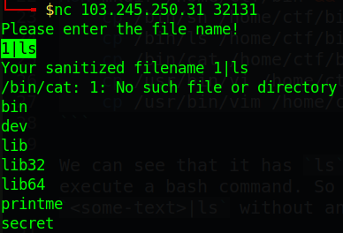
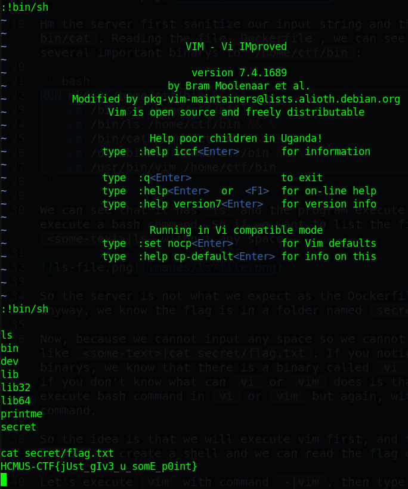

# HCMUS CTF 2022 - PrintMe

You can download the zip file in my repo: [PrintMe.zip](PrintMe.zip)

There will be 3 files in zip:

- ctf.xinetd
- Dockerfile
- start.sh

And no binary is provided so let's start!

# 1. Exploit

The nc is `nc 103.245.250.31 32131` so let's connect and type somethings to see what it does:


Hm the server first sanitize our input string and then pass to `/bin/cat`. Reading the file `Dockerfile`, we can see that it copy several important binarys to `/home/ctf/bin`:

```bash
RUN mkdir /home/ctf/bin && \
    cp /bin/sh /home/ctf/bin && \
    cp /bin/ls /home/ctf/bin && \
    cp /bin/cat /home/ctf/bin && \
    cp /usr/bin/vi /home/ctf/bin && \
    cp /usr/bin/vim /home/ctf/bin
```

We can see that it has `ls` and the program execute our input as a bash command. So if we want to list the file, just input `<some-text>|ls` without any space:



So the server is not what we expect as the Dockerfile did, but anyway, we know the flag is in a folder named `secret`.

Now, because we cannot input any space so we cannot do somethings like `<some-text>|cat secret/flag.txt`. If you notice all the binarys, we know that there is a binary called `vi` or `vim`. And if you don't know what can `vi` or `vim` does is that we can execute bash command in `vi` or `vim` but again, with no space in command.

So the idea is that we will execute vim first, and then execute `bin/sh` to create a shell and we can read the flag easily.

Let's execute `vim` with command `-|vim`, then type `:!bin/sh` and we get the shell (If you have typed somethings, just simply type `ESC` and type the command again and we can get the shell):



Flag is `HCMUS-CTF{jUst_gIv3_u_somE_p0int}`