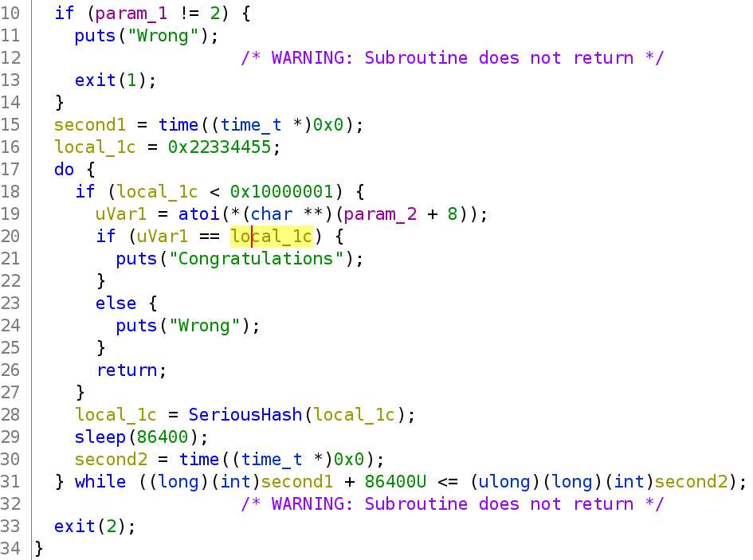
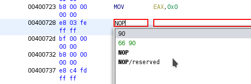
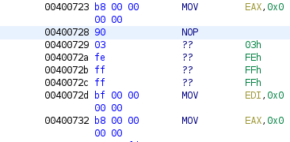
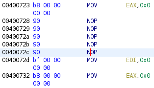
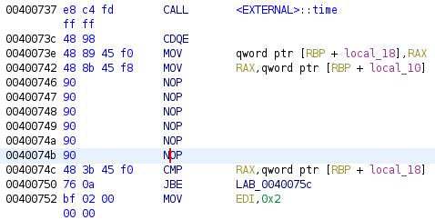
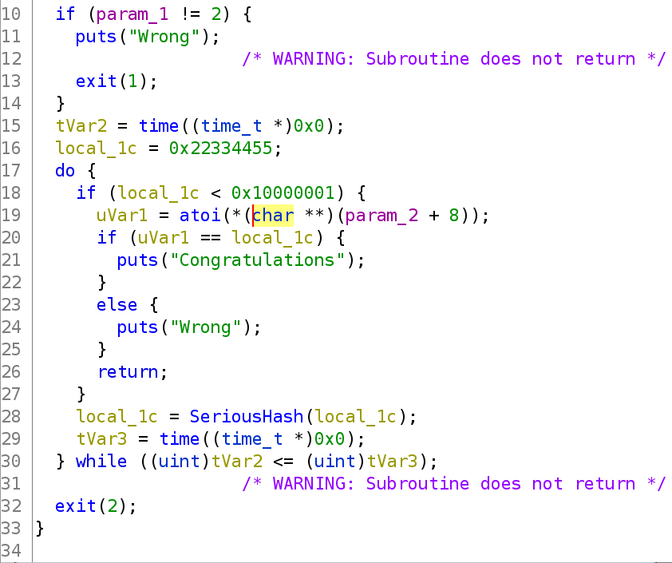
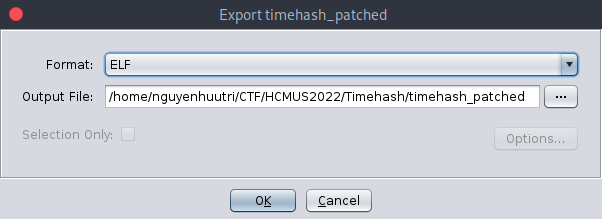
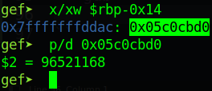

# HCMUS CTF 2022 - Timehash

You can download the zip in my repo: [Timehash.zip](Timehash.zip)

There will be 1 file in zip:

- timehash

# 1. Analyze

This is a forensic challenge so we don't need to use `checksec`, just decompile the file with ghidra to get the flow. First, we will look at `main`:



It will check if `argc` is equal to `2` or not and will exit if not. Nothing to notice.

Next, the program will jump into a loop and it will check if `local_1c` is lower than `0x10000001`. If it's false, `local_1c` then will be change via `SeriousHash` and keep changing until the check is true. So that's our aim.

But after `local_1c` change, it will `sleep(86400)`, that's a very long time and we maynot get the PIN. The idea is to patch the file to remove that sleep, and also the check of while loop to nop so that `local_1c` can change until it's lower than `0x10000001` in a short time.

# 2. Exploit

First, we will debug the binary with gdb to get the address which the sleep function is execute and the check of while is execute:

```gdb
gef➤  disas main
Dump of assembler code for function main:
   ...
=> 0x0000000000400728 <+109>:	call   0x400530 <sleep@plt>
   0x000000000040072d <+114>:	mov    edi,0x0
   ...
   0x000000000040073e <+131>:	mov    QWORD PTR [rbp-0x10],rax
   0x0000000000400742 <+135>:	mov    rax,QWORD PTR [rbp-0x8]
=> 0x0000000000400746 <+139>:	add    rax,0x15180
   0x000000000040074c <+145>:	cmp    rax,QWORD PTR [rbp-0x10]
   0x0000000000400750 <+149>:	jbe    0x40075c <main+161>
   ...
End of assembler dump.
```

So we will want to change 2 addresses, which I added the arrow, to nop and save the patched file. Let's open the binary in ghidra and then locate the address `0x0000000000400728`. Then click on that address and press `Ctrl + Shift + G` or click right mouse and click at `Patch Instruction`. The program will give you a warning but just ignore it.

After you click on the address `0x400728` and press `Ctrl + Shift + G`, it will change like this:


Now we just need to type the instruction we want to change. We want to change to nop so just type `NOP` (remember to uppercase the instruction or ghidra will not recognize that and choose `90`, not `66 90`):



And after we changed that first address, the next address will be like this:



So just keep changing as the same for those 4 bytes. After we've done that, the instruction will look like this:



Next, we will change as what we did above with address at `0x0000000000400746`:



And we've change all the instruction needed. The decompiler changed too:



No sleep and no add in while. Let's export the file by typing `o` or press `File` on the toolbar and select `Export Program...`. In the popup, we will use format is `ELF` and the path to save, then press `OK` to export the patched binary:



Now, let's debug the patched binary with gdb and set a breakpoint at the comparision of `local_1c` and our argument:

```gdb
gef➤  start 123
...

gef➤  disas main
Dump of assembler code for function main:
   ...
   0x0000000000400773 <+184>: call   0x400510 <atoi@plt>
   0x0000000000400778 <+189>: cmp    eax,DWORD PTR [rbp-0x14]
   0x000000000040077b <+192>: jne    0x400789 <main+206>
   ...
End of assembler dump.

gef➤  b*0x0000000000400778
Breakpoint 1 at 0x400778

gef➤  c
...
```

And the program stop at that comparision. The register eax now containing our input via argument and `rbp-0x14` will be `local_1c`. Let's get that address and we will have the PIN:



Because `DWORD` so we just need to take 4 bytes and that's the PIN we need to find.

# 3. Get flag

Flag is `HCMUS-CTF{96521168}`