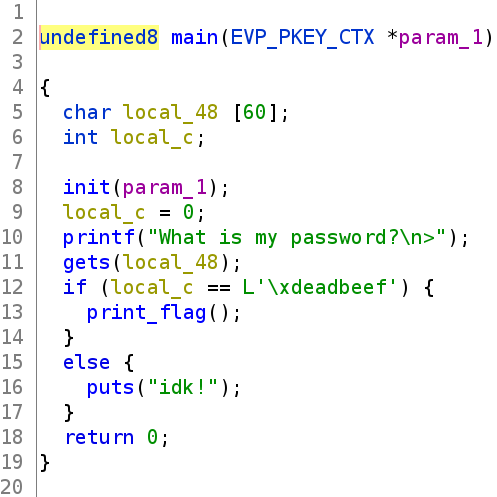
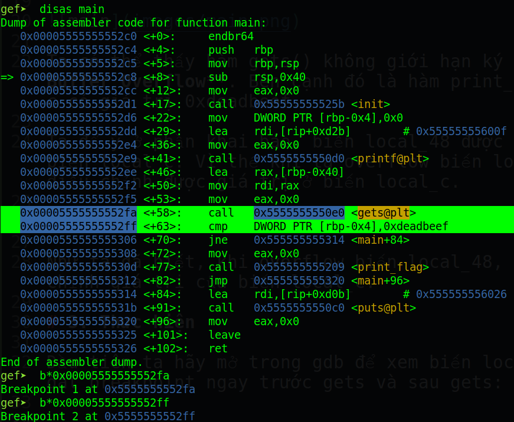
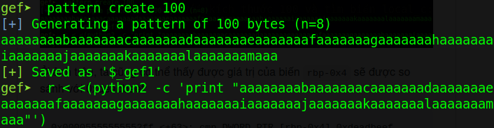
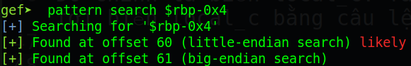

# kcscctf.site - bof1

Link challenge (Sẽ đóng vào 31/1/2022): http://kcscctf.site/challenges

Bạn cũng có thể tại challenge tại đây: [bof1.zip](bof1.zip)

File zip sẽ bao gồm 1 file:
- bof1

Và chúng ta bắt đầu nào!

# 1. Tìm lỗi

Đầu tiên ta sẽ dùng lệnh `file` để xem thông tin:
```
bof1: ELF 64-bit LSB pie executable, x86-64, version 1 (SYSV), dynamically linked, interpreter /lib64/ld-linux-x86-64.so.2, BuildID[sha1]=6de2b9d717bec69f87fb8a5ffb9344259206c58e, for GNU/Linux 3.2.0, not stripped
```
Đây là file 64-bit và không bị mã hóa code. Kế đến, ta sẽ xem file trong ghidra:



Ta có thể thấy hàm gets() không giới hạn ký tự nhập --> **Buffer Overflow**. Bên cạnh đó là hàm print_flag khi biến local_c có giá trị 0xdeadbeef.

Ta để ý ở phần khai báo, biến local_48 được khai báo ngay trước biến local_c. Vì thế khi ta overflow biến local_48 sẽ có thể điều chỉnh được giá trị ở biến local_c.

# 2. Ý tưởng

Như ta đã biết, khi overflow biến local_48, ta sẽ có thể điều chỉnh giá trị của biến local_c.

# 3. Thực hiện

Đầu tiên ta hãy mở trong gdb để xem biến local_c ở đâu. Ta sẽ đặt breakpoint ngay trước gets và sau gets:



Ta sẽ tạo payload với kích thước 100 và tìm biến local_c:



Ở ảnh trên, ta cũng có thể thấy được giá trị của biến `rbp-0x4` sẽ được so sánh với 0xdeadbeef:

```
0x00005555555552ff <+63>: cmp DWORD PTR [rbp-0x4],0xdeadbeef
```

Đó chính là biến local_c. Ta sẽ tìm offset từ chuỗi local_48 tới biến local_c bằng câu lệnh sau:



Vậy offset sẽ là 60. Payload sẽ là:

payload: `'A'*60 + p64(0xdeadbeef)`

Full script: [solve.py](solve.py)

# 4. Lấy cờ


Flag là `KCSC{373afe10-91c6-4be7-a061-0f54125fb703}`


