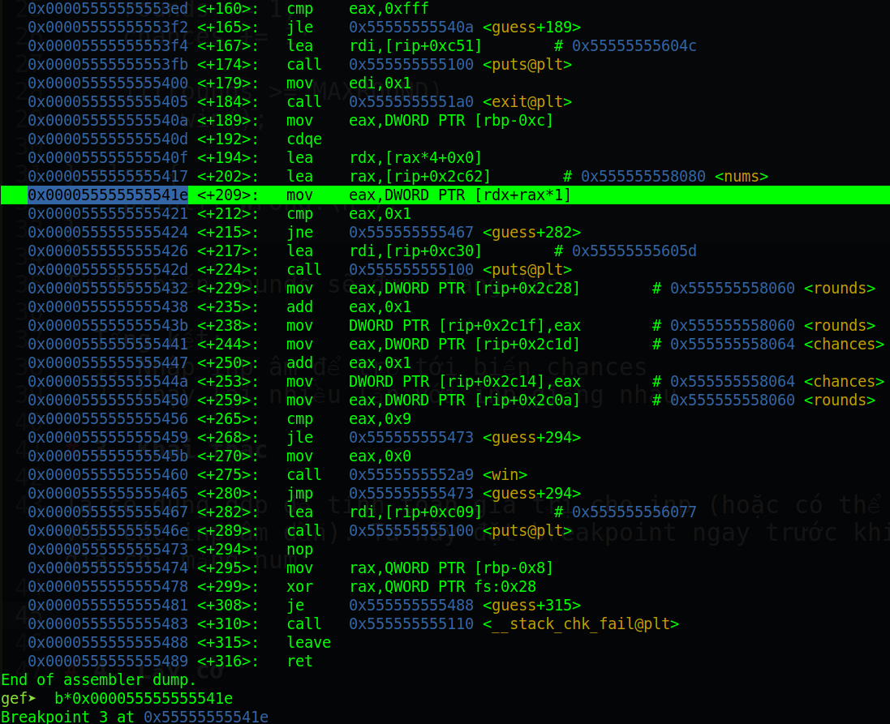
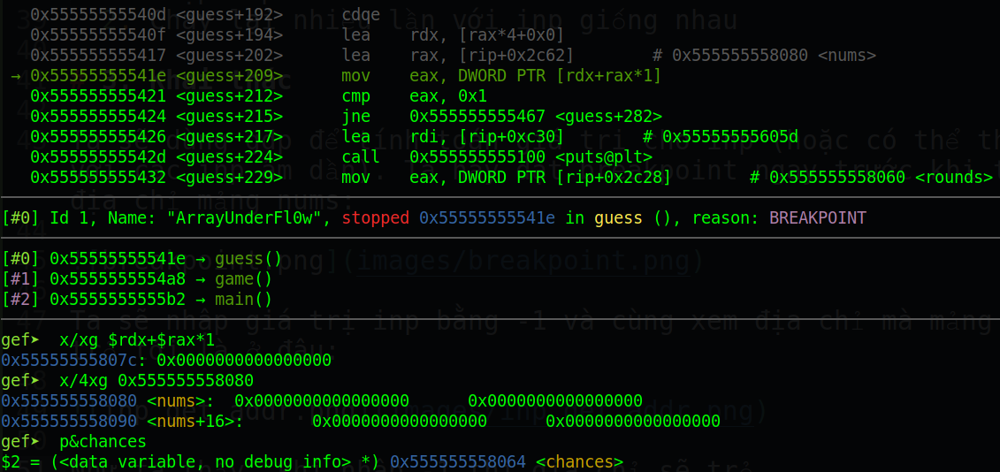
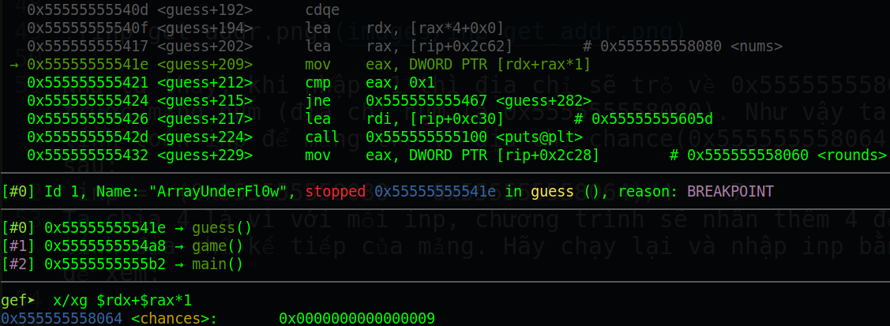
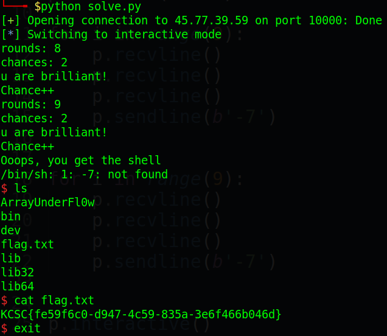

# kcscctf.site - ArrayUnderFl0w

Link challenge (Sẽ đóng vào 31/1/2022): http://kcscctf.site/challenges

Bạn cũng có thể tại challenge tại đây: [ArrayUnderFl0w.zip](ArrayUnderFl0w.zip)

File zip sẽ bao gồm 2 file:
- ArrayUnderFl0w
- src.c

Và chúng ta bắt đầu nào!

# 1. Tìm lỗi

Đầu tiên ta mở file src.c ra để tìm hiểu. Ở đây, ta thấy hàm init() sẽ lấy giá trị random từ `/dev/urandom`, tuy nhiên ta không thể nào khai thác giá trị random này được. Vì thế ta sẽ kiếm lỗi khác.

Kế đến, ta thấy biến inp được dùng để chỉ định index của mảng. Tuy nhiên ta thấy rằng sau khi nhập inp, chương trình không kiểm tra liệu rằng inp có âm hay không. Đồng thời ta cũng có `scanf("%d", &inp);` cho phép nhập giá trị âm.

Cuối cùng, ta kiểm tra security của file để có thể tìm hướng giải phù hợp:
```
Arch:     amd64-64-little
RELRO:    Full RELRO
Stack:    Canary found
NX:       NX enabled
PIE:      PIE enabled
```
Có vẻ như ta không thể trông vậy gì vào các security này được rồi. Mặc kệ, ta hãy sang mục tiếp theo nào.

# 2. Ý tưởng

Với inp nhận giá trị âm, mảng trả về sẽ là dữ liệu có trên stack như là rbp, canary... (nếu mảng trên stack) hoặc các giá trị đặc biệt khác. Ta sẽ dùng lỗi này để trỏ tới giá trị của biến chances, biến sẽ bị trừ từ 10 về 1. Và khi biến chance bằng 1, nó lại thỏa điều kiện:
```
if(nums[inp] == 1) {
	printf("u are brilliant!\nChance++\n");
	rounds += 1;
	chances += 1;

	if(rounds >= MAXROUND)
		win();

} else {
	printf("Wrong!\n");
}
```
Từ đó biến rounds sẽ được tăng lên.

- Tổng kết: 
  1. Nhập inp âm để trỏ tới biến chances 
  2. Chạy lại nhiều lần với inp giống nhau

# 3. Khai thác

Ta sẽ dùng gdp để tính toán giá trị cho inp (hoặc có thể thử với các inp âm dần). Ta hãy đặt breakpoint ngay trước khi tính địa chỉ mảng nums:



Ta sẽ nhập giá trị inp bằng -1 và cùng xem địa chỉ mà mảng sẽ trỏ tới là ở đâu:



Như ta thấy, khi nhập -1 thì địa chỉ sẽ trỏ về 0x55555555807c, trước mảng num (địa chỉ num là 0x555555558080). Như vậy ta sẽ tính toán inp để mảng trỏ về địa chỉ chance(0x555555558064) như sau:
```
inp = -(0x555555558080 - 0x555555558064)/4 = -7
```
Ta chia 4 là vì với mỗi inp, chương trình sẽ nhân thêm 4 để tính địa chỉ kế tiếp của mảng. Ta hãy chạy lại và nhập inp bằng -7 để xem chuyện gì sẽ xảy ra:



Tèn ten! Vậy là xong. Như ý tưởng bên trên, lúc đầu biến chance sẽ khác 1 nhưng khi chạy một lúc với cùng biến inp bằng -7 thì biến chance sẽ bằng 1 (vì mỗi lần sai thì biến chances sẽ trừ đi 1). Và khi chance bằng 1 thì thỏa điều kiện `nums[inp] == 1` và rounds sẽ tăng. Từ đó ta tạo được shell.

Full code: [solve.py](solve.py)

# 4. Lấy cờ



Vậy flag là `KCSC{fe59f6c0-d947-4c59-835a-3e6f466b046d}`