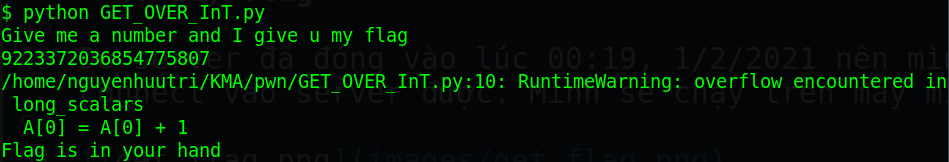

# kcscctf.site - GET_OVER_InT

Link challenge (Sẽ đóng vào 1/2/2022): http://kcscctf.site/challenges

Bạn cũng có thể tại challenge tại đây: [GET_OVER_InT.zip](GET_OVER_InT.zip)

File zip sẽ bao gồm 1 file:
- GET_OVER_InT.py

Và chúng ta bắt đầu nào!

# 1. Tìm lỗi

Do đây là file .py nên ta chỉ việc xem code thôi. Ta thấy biến `A` được khởi tạo với giá trị bằng 0 và kiểu dữ liệu là int64 (dtype=int sẽ tự động hiểu là int64)

```
A = numpy.array([0], dtype=int)
```
Và đoạn code kế kiểm tra để chắc chắn giá trị nhập vào là dương:
```
if(flag < 0):
	print("Nope")
	exit(1)
```
Đoạn code kế tiếp sẽ gán giá trị nhập vào biến `A` và cộng giá trị của biến `A` lên 1:
```
A[0] = flag
A[0] = A[0] + 1
```
Cuối cùng là kiểm tra nếu giá trị của biến `A` có âm hay không:
```
if(A[0] < 0):
	print("Flag is in your hand")
```
Để có thể từ một số dương, tăng số dương đó lên 1 thành số âm --> **Integer Overflow**

# 2. Ý tưởng

Ta sẽ nhập vào giới hạn của số dương lớn nhất tương ứng với type int64 của numpy. Khi số đó được cộng lên 1 thì tức là sẽ bị chuyển về giá trị âm ngay lập tức.

# 3. Khai thác

Các bạn tham khảo [link này](https://numpy.org/doc/stable/reference/arrays.scalars.html#numpy.intc) để lấy giới hạn của type int64. Giới hạn số dương lớn nhất là `9223372036854775807`

Vậy ta chỉ việc nhập `9223372036854775807` là sẽ lấy được flag.

# 4. Lấy flag

Do server đã đóng vào lúc 00:19, 1/2/2021 nên mình không thể connect vào server được. Mình sẽ chạy trên máy mình làm demo:

