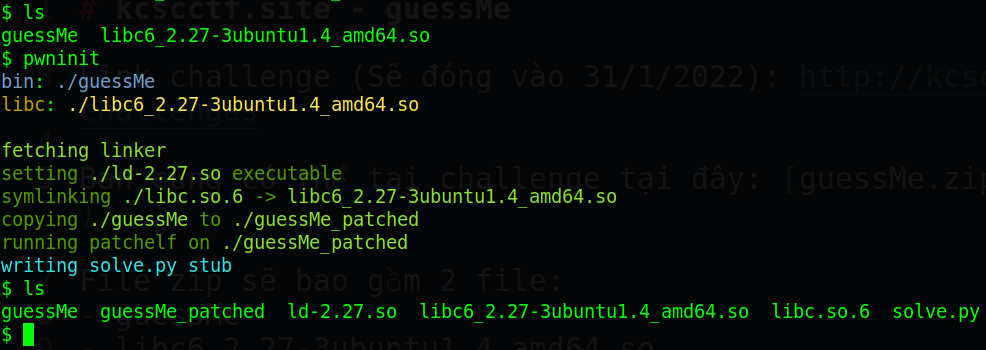
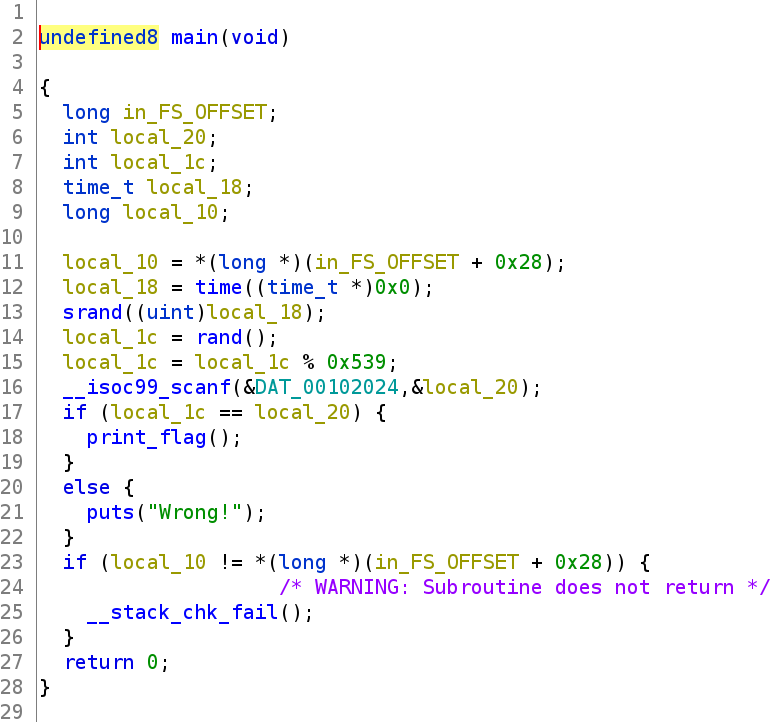
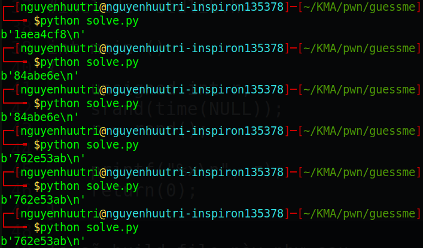
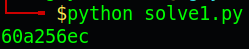
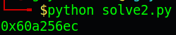
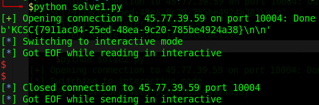
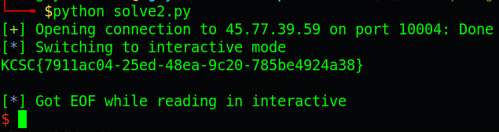

# kcscctf.site - guessMe

Link challenge (Sẽ đóng vào 1/2/2022): http://kcscctf.site/challenges

Bạn cũng có thể tại challenge tại đây: [guessMe.zip](guessMe.zip)

File zip sẽ bao gồm 2 file:
- guessMe
- libc6_2.27-3ubuntu1.4_amd64.so

Các bạn tải file về rồi dùng [pwninit](https://github.com/io12/pwninit)(Khuyến khích dùng) hoặc [patchelf](https://github.com/NixOS/patchelf) để patch file .so vào file guessMe nhé. Mình sẽ hướng dẫn sử dụng pwninit như ảnh bên dưới:



File guessMe_patched là file đã patch xong và ta sẽ sử dụng file này để khai thác. Còn bây giờ chúng ta bắt đầu nào!

# 1. Tìm lỗi

Đầu tiên ta sẽ dùng lệnh `file` để xem thông tin file:
```
guessMe: ELF 64-bit LSB pie executable, x86-64, version 1 (SYSV), dynamically linked, interpreter /lib64/ld-linux-x86-64.so.2, BuildID[sha1]=92a08317128ee6c9c9dc840b5385f31aecb60dc1, for GNU/Linux 3.2.0, not stripped
```
Đây là file 64-bit và không có ẩn code. Kế đến, ta kiểm tra security của file bằng `checksec`:
```
Arch:     amd64-64-little
RELRO:    Full RELRO
Stack:    Canary found
NX:       NX enabled
PIE:      PIE enabled
```
Ta thấy tất cả các mức bảo vệ đều được bật. Nghe có vẻ căng thẳng lắm nên ta sẽ tìm hiểu thêm liệu có căng thẳng thực sự hay không. Tiếp theo, ta mở file trong ghidra để xem cách chương trình hoạt động:



Hàm main sẽ gọi tới hàm print_flag nếu ta đoán đúng số. Ở đây, hàm random đã được seed (srand()) trước khi gọi tới rand(). Tuy nhiên, random mà không random bởi vì với seed được lấy từ time(0), là số giây kể từ 00:00:00 giờ 1/1/1970 giờ quốc tế. 

Như vậy với mỗi seed giống nhau sẽ cho ra thứ tự rand() giống nhau, và với mỗi giây, ta có thể lấy được cùng 1 seed --> cùng 1 thứ tự rand() và cùng số khi rand().

# 2. Ý tưởng

Khi đã lấy được cùng giá trị rand(), ta chỉ việc lấy phần dư với 0x539 (`local_1c = local_1c % 0x539` hình bên trên) và submit để lấy flag

# 3. Khai thác

### Cách 1

Vì hàm srand() và rand() chỉ có trong c nên ta không thể dùng python để lấy trực tiếp được (theo mình biết là vậy). Cho nên ta sẽ tạo thêm 1 file `get_rand.c` để lấy giá trị random ra:
```
#include <stdio.h>
#include <time.h>
#include <stdlib.h>

int main ()
{
    unsigned int r;
    srand(time(NULL));
    r = rand();

    printf("%x\n", r);
    return(0);
}
```
Ta sẽ build file này như sau:
```
gcc get_rand.c -o get_rand
```
Và ở python, ta sẽ dùng subprocess để chạy file .c và lấy giá trị được in ra.
```
import subprocess
proc = subprocess.Popen(['./get_rand'],stdout=subprocess.PIPE)
line = proc.stdout.readline()
print(line)
```
Chạy thử sẽ như thế này:


Khi chạy cách nhau 1 giây, giá trị sẽ khác. Còn khi chạy liên tục chưa tới 1 giây thì giá trị vẫn sẽ y nguyên vì seed chưa thay đổi (seed là số giây)

Khi đã lấy được giá trị random rồi, ta chỉ việc xử lí chuỗi về int, chia lấy dư cho `0x539` và gửi cho server thôi.

Full code: [solve1.py](solve1.py)

### Cách 2

Cách 2 ta sẽ không build file get_rand.c giống cách 1 mà ta sẽ import glibc vào trong file python và lấy giá trị random bằng cách sau:
```
from ctypes import*

# Load glibc chạy chung với chương trình
glibc = cdll.LoadLibrary('./libc6_2.27-3ubuntu1.4_amd64.so')

# Tạo seed rand với seed bằng time(null)
glibc.srand(glibc.time(None))

# Lấy giá trị random
val = glibc.rand()

print(hex(val))
```
Khi chạy thử giữa 2 file solve1.py và solve2.py sẽ như thế này:





Mở 2 tab khác nhau và chạy 2 file khác nhau cùng lúc, ta sẽ được giá trị random là giống nhau. Khi đã lấy được giá trị random rồi, ta chỉ việc lấy số nhận được chia lấy dư cho `0x539` và gửi cho server thôi.

Full code: [solve2.py](solve2.py)

Source: Pwn admin KCSC

# 4. Lấy cờ





Vậy flag là `KCSC{7911ac04-25ed-48ea-9c20-785be4924a38}`