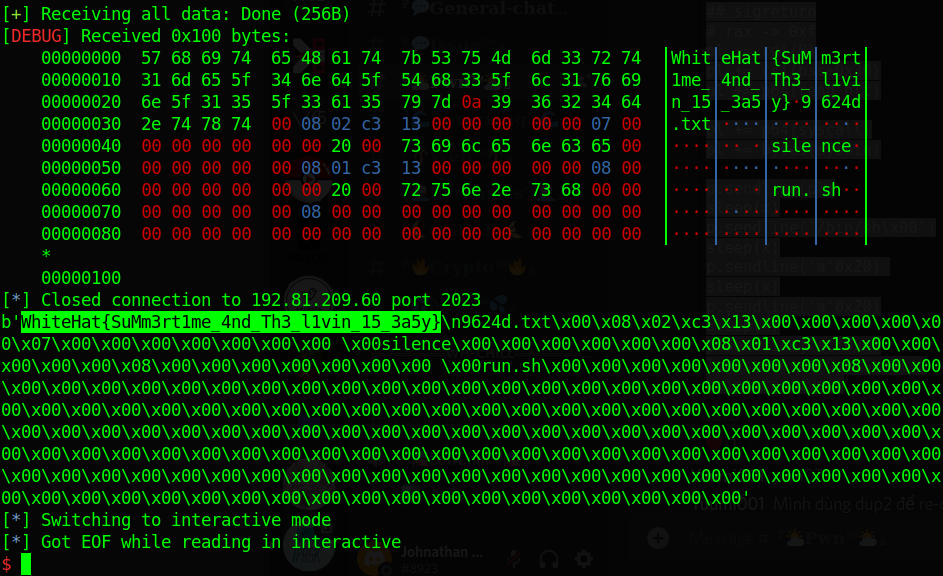
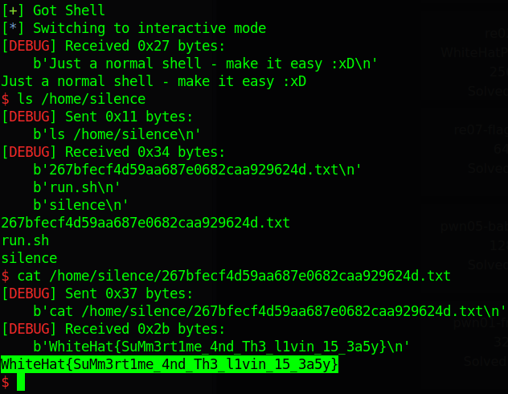

# WhiteHat Play 11 - pwn07-Silence

Original challenge link: https://wargame.whitehat.vn/thuc-hanh

You can also download challenge files in my repo: [pwn07-Silence.zip](pwn07-Silence.zip)

There will be 1 files in zip:
- silence

Due to laziness, I won't explain anything here but just the idea. There are 2 ways to exploit:

### Way 1

We can first input shellcode and sigreturn frame in 1 send, then we will execute that sigreturn frame to set rwx for the address range which contains our shellcode. Finally jump to shellcode to get the flag.

For the shellcode, to list files, we will do as this c code does or you can see [here](https://github.com/fbaligant/shellcodes/blob/master/x86/linux/getdents/getdents.asm):

```c
char p[0x1337];

int fd = open(".", 0);
getdents(fd, p, 0x1337)
```
Using syscall `getdents` will give us all filenames in folder `.` and we will have the filename of flag.

Finally, due to the close of stdout and stderr, we will send data through stdin because socket cannot recognize what is stdin, what is stdout or what is stderr, it just return everything from every std to us. This idea can be shown in c code as follows:

```c
write(0, flag, 0x100);
```

Full script: [solve_w1.py](solve_w1.py)

### Way 2

We will use dup2 to redirect/reopen stdout and stderr. An example for this can be seen [here](https://secgroup.github.io/2016/09/24/csaw2016-writeup-tutorial/) or the solve script below.

After redirecting, we can act as stdout and stderr didn't closed, and we just get shell as normal to get the flag.

Full script: [solve_w2.py](solve_w2.py)

> This script is from @Yuumi001#8183

### Way 3

We will get the shell with execve although stdout was closed. But with the shell in hand, just type `exec 1>&0` and everything from stdout will be directed to stdin. Hence, we get the shell as normal.

# Get flag





Flag is `WhiteHat{SuMm3rt1me_4nd_Th3_l1vin_15_3a5y}`
